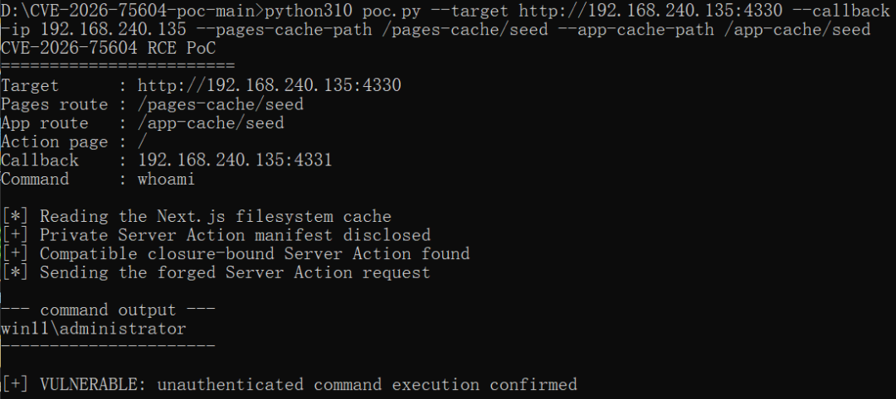

## 核对与使用边界

本文已按保存的全文审阅记录进行文字校订；本轮仅静态核对，未运行 PoC、请求目标或逐图验证。

适用条件与版本记录（来源主张，未列为明确更正的部分仍待权威资料核对）：13.4.0–15.5.23、16.0–16.3.2；Windows、混用两Router且关闭Cache Components条件较明确

代码与实验材料：已复现只由单截图支撑，无请求/源码或样本摘要

来源证据范围：有官方GHSA和rafabd1PoC地址，未读取；两个URL粘连

- **事实待核（1）**：修复版本列表逻辑可误导；依据：Next.js&gt;=15.5.24若按全局比较包含文中有漏洞的16.0–16.3.2，应写分支约束。该项尚不能从转载本身确定外部事实；下文相应编号、版本或修复说法只作为来源记录，不能据此判定部署受影响或已修复。明确更正另列于本节。

- **证据待核（2）**：已复现不可由文本核对；依据：路径遍历→密钥→伪造Server Action→RCE缺逐步证据，复现仅图片。保留原引用、截图位置和实验叙述；本项所缺材料未被补造，截图存在或作者宣称成功都不等于已核验其内容。

- **事实待核（3）**：引用不可直接点击且评级不一致；依据：两个https地址连在一个单元；CVSS9.0同时写高危，需标明评级标准。该项尚不能从转载本身确定外部事实；下文相应编号、版本或修复说法只作为来源记录，不能据此判定部署受影响或已修复。明确更正另列于本节。

历史原文标识：下文原技术材料按来源保留；仅本节明确确认的更正替代相应旧说法，标为待核的观察仍不是事实确认。

#  【已复现】漏洞通告 | Next.js 远程代码执行漏洞(CVE-2026-75604)  
安全实验室
                    安全实验室  中成信息   2026-08-27 01:34  
  
  
  
**1**  
  
  
**漏洞描述**  
  
Next.js 远程代码执行漏洞(CVE-2026-75604)是Next.js框架在Windows环境下的高危漏洞，CVSS评分为9.0，属于路径遍历漏洞。该漏洞影响Next.js 13.4至15.5.23版本和16.0至16.3.2版本，当应用同时使用Pages Router与App Router且未启用Cache Components时，攻击者可通过伪造Server Action请求实现未认证远程代码执行。  
  
  
  
2  
  
  
**影响范围**  
  
13.4.0 <= Next.js < 15.5.24   
  
16.0 <= Next.js < 16.3.3  
  
  
  
3  
  
  
**漏洞详情**  
<table><tbody><tr><td colspan="4" data-colwidth="143,144,143,143"><section style="text-align: center;" data-nest-level="6">漏洞详情</section></td></tr><tr><td data-colwidth="143"><section style="text-align: center;" data-nest-level="6">漏洞编号</section></td><td colspan="3" data-colwidth="144,143,143"><section style="text-align: center;" data-nest-level="6">CVE-2026-75604</section></td></tr><tr><td data-colwidth="143"><section style="text-align: center;" data-nest-level="6">漏洞名称</section></td><td colspan="3" data-colwidth="144,143,143"><section style="text-align: center;" data-nest-level="6">Next.js 远程代码执行漏洞</section></td></tr><tr><td data-colwidth="143"><section style="text-align: center;" data-nest-level="6">评级</section></td><td data-colwidth="144"><section style="text-align: center;" data-nest-level="6">高危</section></td><td data-colwidth="143"><section style="text-align: center;" data-nest-level="6">CVSS 3.1分数</section></td><td data-colwidth="143"><section style="text-align: center;" data-nest-level="6">9.0</section></td></tr><tr><td data-colwidth="143"><section style="text-align: center;" data-nest-level="6">威胁类型</section></td><td data-colwidth="144"><section style="text-align: center;" data-nest-level="6">代码执行</section></td><td data-colwidth="143"><section style="text-align: center;" data-nest-level="6">利用情况</section></td><td data-colwidth="143"><section style="text-align: center;" data-nest-level="6">更可能被利用</section></td></tr><tr><td data-colwidth="143"><section style="text-align: center;" data-nest-level="6">公开状态</section></td><td data-colwidth="144"><section style="text-align: center;" data-nest-level="6">POC、EXP已公开</section></td><td data-colwidth="143"><section style="text-align: center;" data-nest-level="6">在野利用</section></td><td data-colwidth="143"><section style="text-align: center;" data-nest-level="6">未发现</section></td></tr><tr><td colspan="4" data-colwidth="143,144,143,143"><section data-nest-level="6">危害描述：攻击者可利用该漏洞在Windows环境下绕过身份验证，通过路径遍历获取Server Action加密密钥，进而伪造请求实现远程代码执行，完全控制受影响服务器。</section></td></tr><tr><td colspan="4" data-colwidth="143,144,143,143"><section>参考链接: </section><section>https://github.com/vercel/next.js/security/advisories/GHSA-p293-qw3h-jr36</section><section>https://github.com/rafabd1/CVE-2026-75604-poc</section></td></tr></tbody></table>  
  
4  
  
  
**漏洞复现**  
  
中成信息安全实验  
室已复现Next.js 远程代码执行漏洞  
，验证如下。  
  
  
  
  
5  
  
  
**修复建议**  
  
立即升级至最新版本  
- Next.js >= 15.5.24   
  
- Next.js >= 16.3.3  
  
下载地址：https://github.com/vercel/next.js/releases  
  
  
  
  
  
  
  
关于我们  
  
  
漳州中成信息科技有限公司是一家专注于网络安全实战防护的创新型服务提供商。我们深刻理解网络安全的核心在于攻防对抗的持续较量，并以此独特视角为基石，致力于为客户构建动态、主动、智能化的纵深防御体系。区别于传统的被动防御，我们坚信“未知攻，焉知防”。公司汇聚了顶尖的渗透测试专家（红队）、应急处置精英（蓝队）及经验丰富的安全服务工程师，形成了一支具备完整攻防对抗能力的专业团队。我们的渗透测试团队模拟真实攻击者的思维与手段，深入挖掘系统、应用及网络中的深层次漏洞与风险点；应急处置团队则能在安全事件发生时快速响应、精准定位、有效遏制损失并溯源根因；安服工程师团队则致力于将攻防对抗中获得的宝贵经验转化为常态化的安全策略、加固措施与运营流程。  
  
  
  
  
  
  
**点击名片**  
  
  
  
**关注我们**  
  
  
  
**扫描官网二维码**  
  
  
**了解更多**  
  
  
  
  
  
  
  
  
  
  
  

---

> 来源：gelusus/wxvl（微信公众号漏洞文章自动归档，原文见文首链接）
