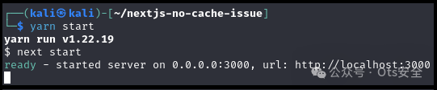
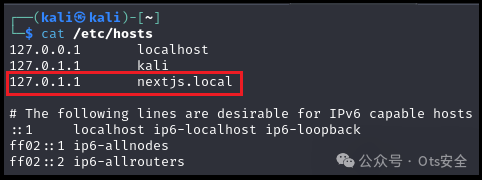
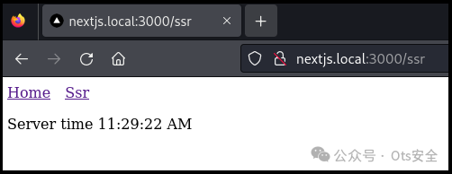
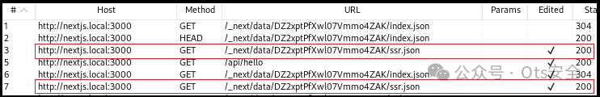
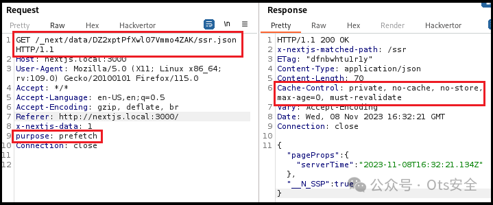
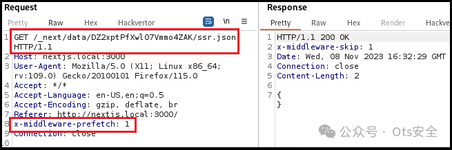
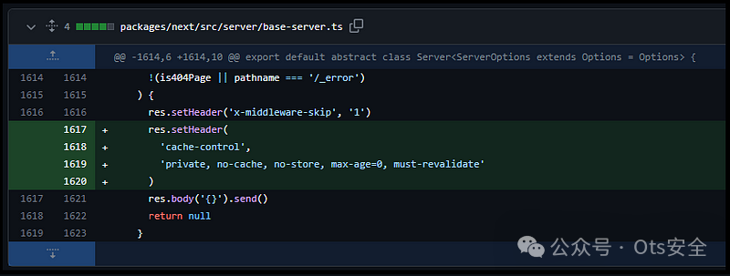

## 核对与使用边界

本文已按保存的全文审阅记录进行文字校订；本轮仅静态核对，未运行 PoC、请求目标或逐图验证。

适用条件与版本记录（来源主张，未列为明确更正的部分仍待权威资料核对）：声称&lt;13.4.20-canary.13全版本，需补稳定分支修复及SSR、中间件、CDN缓存键条件

代码与实验材料：本地项目和x-middleware-prefetch:1方法可追溯，未展示实际CDN受害者命中全过程，结果截图为主

来源证据范围：muntamala实验项目、缓存投毒文章，但原作者和官方提交未给直链

- **适用与权限边界（1）**：CDN默认缓存行为过度普遍化；依据：称无头就会由CDN设置cache-control并缓存，实际需缓存策略、最小TTL及键配置。按此限制解释本文结论，版本相同不足以证明所需角色、入口、配置、依赖或可控参数均已满足；原操作和失败记录一并保留。

- **适用与权限边界（2）**：修复建议需区别no-cache与不存储；依据：仅建议no-cache且未验证框架预取路径是否保留自定义头；canary版本不宜无条件作为生产升级终点。按此限制解释本文结论，版本相同不足以证明所需角色、入口、配置、依赖或可控参数均已满足；原操作和失败记录一并保留。

- **证据待核（3）**：外链重复和请求证据缺文本；依据：两条参考各重复一次，补丁和HTTP报文只在截图。保留原引用、截图位置和实验叙述；本项所缺材料未被补造，截图存在或作者宣称成功都不等于已核验其内容。

历史原文标识：下文原技术材料按来源保留；仅本节明确确认的更正替代相应旧说法，标为待核的观察仍不是事实确认。

#  深入研究 CVE-2023–46298: Next.js 中的拒绝服务漏洞   
 Ots安全   2024-04-01 18:58  
  
  
  
谈谈我对 CVE-2023-46298 的研究。Snyk 将该漏洞归类为拒绝服务漏洞，影响 13.4.20-canary.13 之前的所有 Next.js 版本。  
  
原因是这是一个非常新的漏洞，而且有很多网站都在使用 Next.js。此外，我在一次渗透测试中遇到了一个易受攻击的 Next.js 版本，这让我不得不进行研究，以便找到概念验证 (PoC) 有效载荷。  
  
**第 1 部分：The BUG**  
  
13.4.20-canary.13 之前的 Next.js 缺乏 cache-control 标头，因此空的预取响应有时可能会被 CDN 缓存。攻击者可通过缓存空预取响应，对通过 CDN 请求相同 URL 的所有用户造成拒绝服务。例如，如果您使用 CloudFront 部署 Next.js，空的预取响应将被缓存，因为没有 "cache-control "头，扩展名为 .json。Cloudflare 认为这些请求是可缓存资产  
  
**第 2 部分：进一步分析**  
  
在没有使用 no-cache 指令的 cache-control 头信息的情况下，为返回空对象的 SSR 页面预取数据。这可能会导致 CDN 出现问题。例如，CloudFront 的默认 TTL 值大于 0（默认为 24 小时），这将导致 CDN 缓存空响应。当用户导航到 SSR 页面并尝试使用相同的 URL 获取服务器端道具时，CDN 将提供空缓存响应。  
  
这种行为的促成因素似乎是使用了中间件。如果存在中间件（middleware.ts），那么就会通过链接组件（prefetch true）对页面上存在路径的每个页面分别进行页面预取。  
  
**预期行为**  
  
Next.js 应明智地进行缓存控制，并为 getServerSideProps 设置无缓存指令，如 Next.js 文档所述，如果页面使用 getServerSideProps 或 getInitialProps，它将使用 next start 设置的默认 Cache-Control 头信息，以防止意外缓存无法缓存的响应。如果希望在使用 getServerSideProps 时使用不同的缓存行为，请在函数内使用 res.setHeader('Cache-Control','value_you_prefer')。  
  
**第 3 部分：攻击漏洞应用程序（含 PoC）**  
  
要了解易受攻击的 Next.js 版本如何运行，我们可以从 GitHub 下载并使用 muntamala 的项目：https://github.com/muntamala/nextjs-no-cache-issue/tree/main  
  
按照 README.md 文件中描述的步骤启动本地服务器。  
  
  
  
启动本地服务器  
  
由于 Burp Suite 存在一些问题（至少我遇到过），我编辑了 /etc/hosts 文件，并增加了对另一个回环地址的引用。  
  
  
  
编辑了 /etc/hosts 文件  
  
完成后，我启动 Burp Suite 并打开服务器  
  
  
  
易受攻击服务器的主页  
  
因此，我通过导航到 /ssr，开始请求 ssr.json 文件，它总是返回 200 OK 响应。  
  
  
  
未缓存 ssr.json  
  
默认情况下，即使将 "目的 "标头设置为 "预取"，也始终会从服务器返回设置了 cache-control 标头的 JSON 响应。这完全没有问题，应用程序就应该这么做。  
  
  
  
默认行为  
  
不过，这种行为似乎是在有中间件的情况下发生的，因为每个页面的预取都是单独进行的。因此，我们添加了 "x-middleware-prefetch "头，将其值设为 1（true），然后发送请求  
  
  
  
使用x-middleware预取的请求  
  
请注意，上面的 cache-control 标头已经消失，JSON 主体也是空的。  
  
在默认情况下，这不是一个问题，但如果应用程序使用 CDN（如 CloudFront），那么它将设置自己的 cache-control 标头并缓存响应。当用户导航到 SSR 页面并尝试使用相同的 URL（.../ssr.json）获取服务器端道具时，CDN 将提供空缓存响应。  
  
在我看来，这不是资源耗尽攻击，而是缓存中毒攻击，因为其目的是使 CDN 缓存空响应，然后将其提供给请求相同资源的其他用户。更确切地说，这个漏洞应该被称为通过缓存中毒拒绝服务（Denial Of Service via Cache Poisoning）。  
  
关于缓存中毒的工作原理以及如何测试应用程序是否存在漏洞，我就不详细介绍了，因为这本身就是一个很大的话题。不过，下面的文章应该会让你有一个很好的了解：  
- https://infosecwriteups.com/dos-via-cache-poisoning-38f3a87f997c  
  
- https://infosecwriteups.com/dos-via-cache-poisoning-38f3a87f997c  
  
- https://shahjerry33.medium.com/denial-of-service-via-cache-poisoning-its-toxic-d876931749ac  
  
- https://shahjerry33.medium.com/denial-of-service-via-cache-poisoning-its-toxic-d876931749ac  
  
**第 4 部分：补救和防御**  
  
要了解如何进行防御，让我们看看 Next.js 的创建者 Vercel 在 13.4.20-canary.13 版本中实施的修复措施  
  
  
  
Git diff  
  
从上面我们可以看到，又添加了一个响应头，它为空预取请求设置了缓存控制。  
  
**修复漏洞：**  
  
我们可以配置 next.config.js 为 SSR 路径返回 cache-control: no-cache 头信息。  
将 Next.js 更新至 13.4.20-canary.13 或更高版本。  
  
  
  
  
感谢您抽出  
  
  
  
.  
  
  
  
.  
  
  
  
来阅读本文  
  
  
  
**点它，分享点赞在看都在这里**  
  

---

> 来源：gelusus/wxvl（微信公众号漏洞文章自动归档，原文见文首链接）
