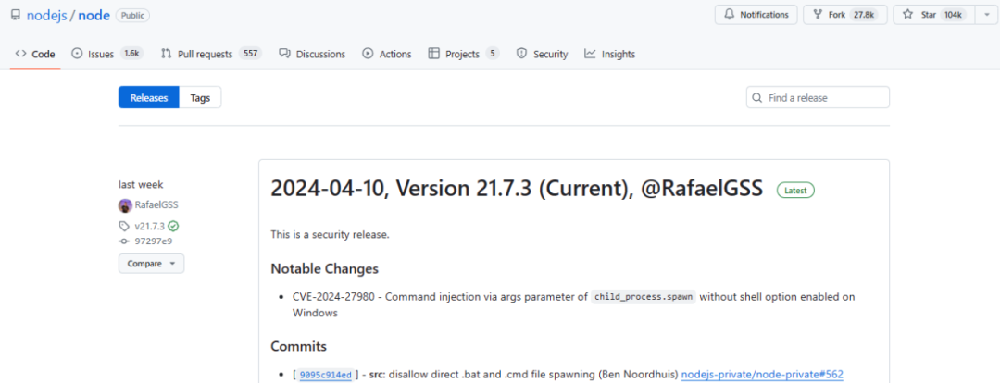

## 核对与使用边界

本文已按保存的全文审阅记录进行文字校订；本轮仅静态核对，未运行 PoC、请求目标或逐图验证。

适用条件与版本记录（来源主张，未列为明确更正的部分仍待权威资料核对）：笼统18.x/20.x/21.x，未列修复补丁号；Windows .bat及用户可控参数

代码与实验材料：无代码，只有机制介绍和截图

来源证据范围：称github与cybersecuritynews无具体URL

- **事实待核（1）**：影响面泛化并缺可操作修复范围；依据：所有Windows Node用户措辞忽略应用需调用批处理并接受可控参数；只说升级可用版本。该项尚不能从转载本身确定外部事实；下文相应编号、版本或修复说法只作为来源记录，不能据此判定部署受影响或已修复。明确更正另列于本节。

历史原文标识：下文原技术材料按来源保留；仅本节明确确认的更正替代相应旧说法，标为待核的观察仍不是事实确认。

#  可能允许攻击者在Windows设备上执行恶意代码，Node.js披露一个命令注入漏洞   
看雪学苑  看雪学苑   2024-04-17 17:59  
  
Node.js项目近日披露，其在Windows平台上的多个活跃版本存在一个高危漏洞。据悉，即使“shell”选项被禁用，此漏洞仍可能允许攻击者在受影响的设备上执行恶意代码，这给构建在Node.js上的应用和服务带来了严重风险。  
  
  
  
  
  
该漏洞（CVE-2024-27980）由安全研究员Ryotak发现并报告，源于Node.js通过‘child_process.spawn’或‘child_process.spawnSync’函数执行代码时处理.bat文件的方式。攻击者可以将恶意命令注入到特制的命令行参数中，绕过‘shell’选项被禁用时理应存在的安全机制。成功利用此漏洞可能允使攻击者在受影响系统上远程执行任意命令。  
  
  
  
  
  
该漏洞的影响广泛，波及所有在Windows上使用18.x、20.x、21.x版本的Node.js用户。Node.js项目对此迅速反应，已由Ben Noordhuis进行修复，并对受影响版本发布了相应的安全更新。Node.js项目表示此漏洞可被利用，攻击者可能获取对被攻击系统的重要控制（如安装恶意软件、窃取数据或干扰运营）。因此迅速采取行动至关重要，建议用户立即进行升级，以保护其应用和基础设施免受潜在利用的风险。  
  
  
应对措施：  
  
① 立即更新Windows系统上的Node.js到可用的修补版本。关注官方Node.js项目渠道以获取最新讯息。  
  
② 若使用‘child_process.spawn’或相关函数，请审查输入处理，确保命令行参数不会被篡改，考虑采取额外的验证和清理措施。  
  
  
  
编辑：左右里  
  
资讯来源：github、cybersecuritynews  
  
转载请注明出处和本文链接  
  
  
  
﹀  
  
﹀  
  
﹀  
  
  
  
  
  
  
**球分享**  
  
  
  
**球点赞**  
  
  
  
**球在看**  
  
****  
****  
  
  
  
戳  
“阅读原文  
”  
一起来充电吧！  
  

---

> 来源：gelusus/wxvl（微信公众号漏洞文章自动归档，原文见文首链接）
