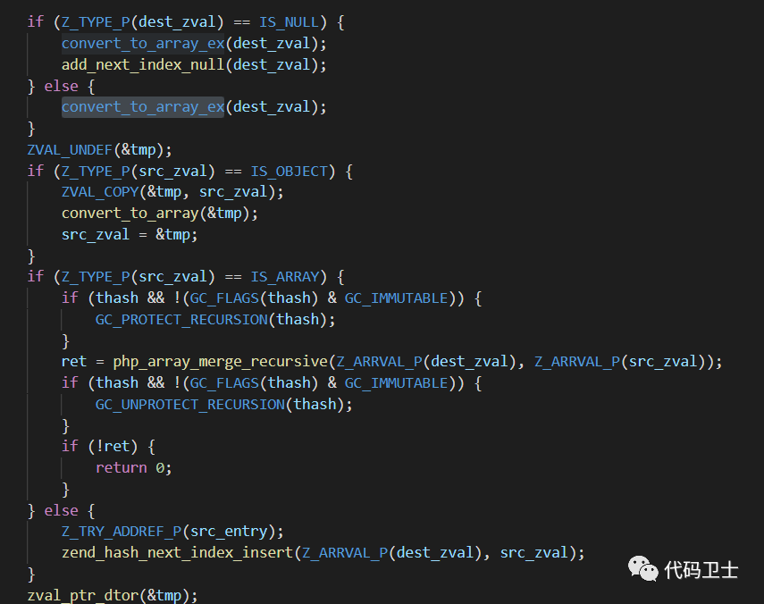
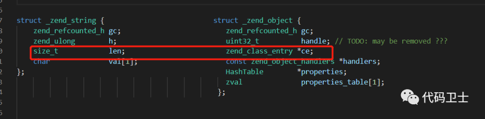
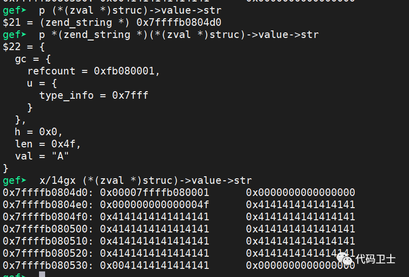
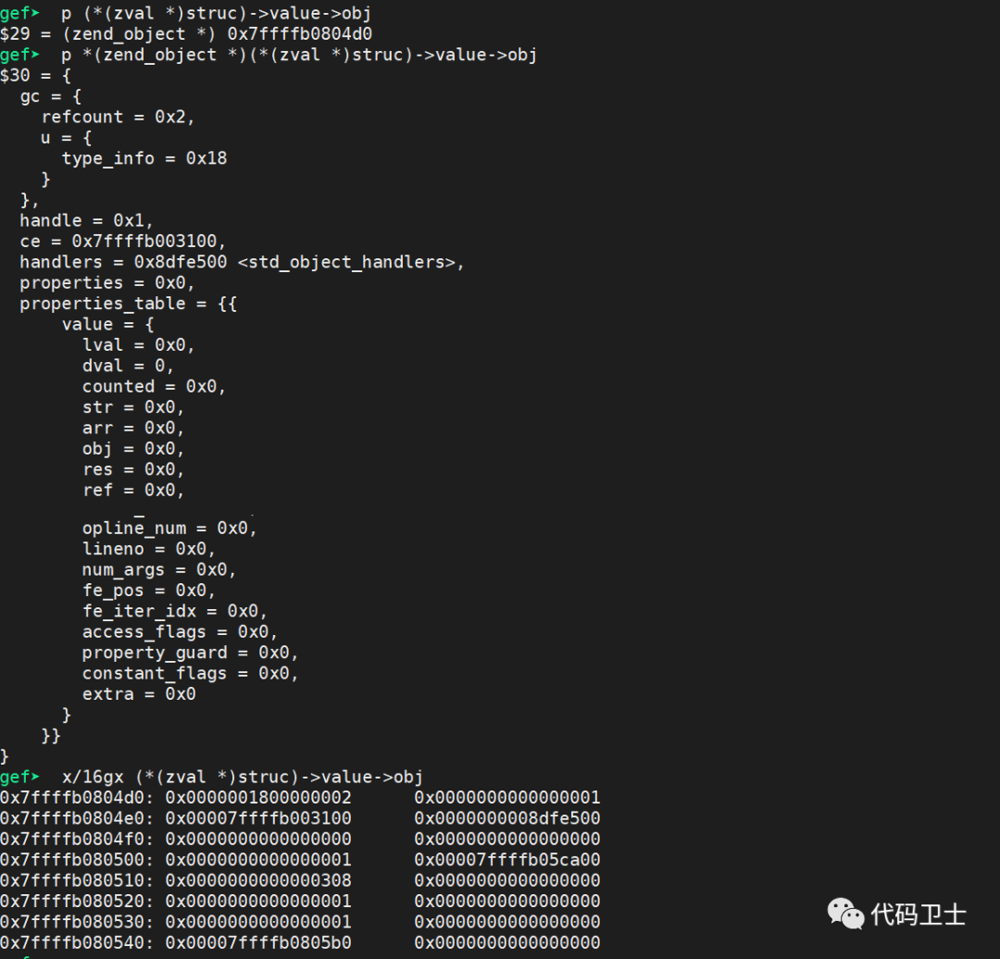
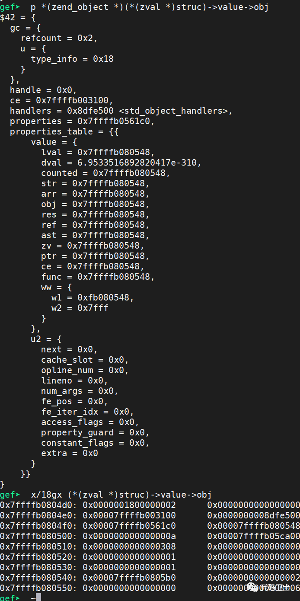
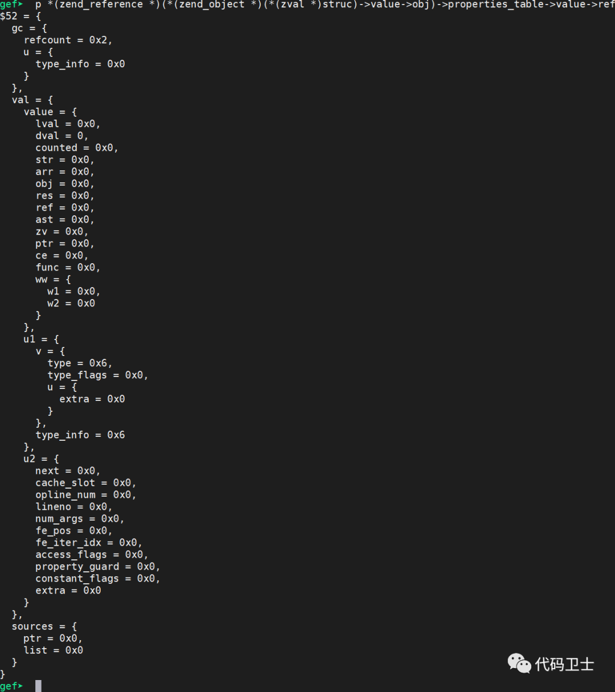
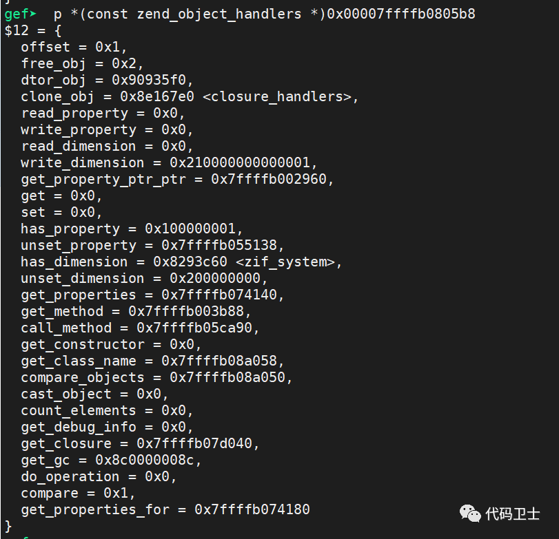
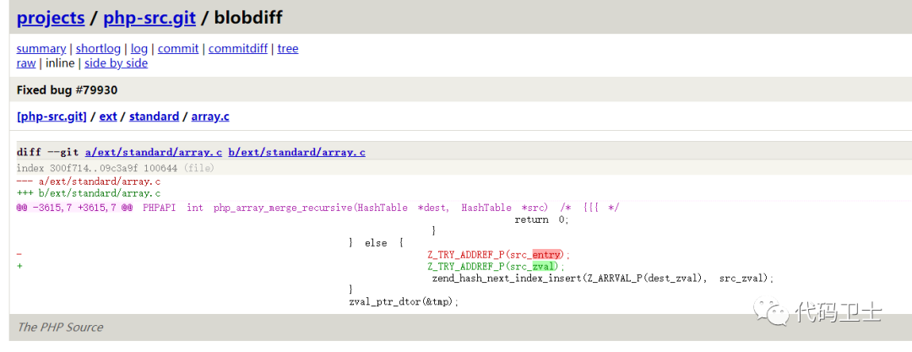

## 核对与使用边界

本文已按保存的全文审阅记录进行文字校订；本轮仅静态核对，未运行 PoC、请求目标或逐图验证。

适用条件与版本记录（来源主张，未列为明确更正的部分仍待权威资料核对）：声称7.2–7.4.9、7.4.10修复；旧分支patch范围未给；本地PHP执行权限前提

代码与实验材料：引用计数到伪造闭包链有独立分析，源码和调试大多截图；无完整脚本、架构和编译参数

来源证据范围：奇安信研究及PHP bug79930可追溯

- **结论使用边界（1）**：应明确已有PHP代码执行才能绕过disable_functions；依据：验证要求上传并执行利用脚本，不是远程请求自动获得初始代码执行。此项限制直接适用于下文对应结论；现有正文不足以作更宽泛推论，所列方法和原始证据均保留。

- **操作与副作用边界（2）**：版本与内存布局泛化；依据：CLI调试称与服务器差别不大，实际堆布局、编译和平台影响；只有7.4.10修复未覆盖7.2/7.3分支。保留原步骤及请求方法。执行条件包括隔离且获授权的可恢复环境、预先记录相关文件/账号/配置/业务记录状态；响应完成不能等同无副作用，恢复时须核对该操作涉及的实际对象。

历史原文标识：下文原技术材料按来源保留；仅本节明确确认的更正替代相应旧说法，标为待核的观察仍不是事实确认。

# PHP 绕过禁用函数漏洞的原理与利用分析

<meta name="referrer" content="no-referrer"/>

> 本文由 [简悦 SimpRead](http://ksria.com/simpread/) 转码， 原文地址 [mp.weixin.qq.com](https://mp.weixin.qq.com/s/_KCqGJnHaCBjCZ0VPo898Q)

 聚焦源代码安全，网罗国内外最新资讯！

  

漏洞简介

PHP 发布公告，旧版本的 php_array_merge_recursive 函数中存在 UAF 风险，被利用可能导致用来绕过禁用函数。

**受影响的版本**

PHP 7.2 - 7.4.9

安全专家建议用户尽快升级到安全版本，以解决风险。

  

漏洞原理

**一、array_merge_recursive 函数实现**

在 array_merge_recursive 函数的实现中，通过遍历源数组键值，如果键值不存在，则将对应的值直接插入目标数组；如果键值存在，则查询相应的目标数组。在目标数组不存在此键值时，将键值与相应的值插入目标数组；如果存在相同的键值，则会尝试将相应的值加入到目标数组中。具体处理如下图，在目标值为 NULL 时，将其转变为数组类型并在数组中加入 NULL，在源数组中的值为对象类型时将其转换为数组类型，尝试为 src_entry 添加引用后将 src_zval 添加到数组中；如果源数组中的值类型为数组则递归调用 php_array_merge_recursive 函数。

**二****、****原理分析**

在尝试为源数组中的值添加引用计数的时候错误地调用了 Z_TRY_ADDREF_P(src_entry)， src_entry 此时为对源数组中的值的引用，此时引用计数被添加到了引用而不是源数组中的值。

如果在 array_merge_recursive 函数中传入可变的字符串（通过直接赋值获得的字符串不可变，在尝试添加引用计数时会失败），此时 src_zval 即可变字符串的引用计数并没有增加，在数组被销毁时，因为可变字符串的引用计数提前变为 0 导致 UAF。

**三、利用分析**

 _注: 以下调试直接在 php 调试而不是在服务器加载 php 调试，但是差别不大。_

1、在字符串被释放后，创建一个新的对象占位，进行类型混淆，此时字符串的 len 被新创建对象的 ce 覆盖。ce 是一个地址，所以后续不会影响字符串的写入。

占位前后对比图如下：

字符串对象被释放后，创建对象前：

创建对象后：

2、读取新创建对象的 handlers 方便之后泄露内存信息，handers 的值即为上图的 0x0000000008dfe500，在后面可以达到任意内存读取后可以用来泄露 php 基地址。读取新创建对象中包含堆地址的区域，获取被释放的字符串地址，例如可以读取 0x7ffffb080540 中的堆地址，减去 0xc8 即为字符串对象中的字符串地址 hex(0x00007ffffb0805b0 - 0xc8) = 0x7ffffb0804e8 即为字符串对象的 val 属性的地址。

3、将新创建对象的一个属性的值指向的类型改写为引用，引用的地址为一个伪造的引用字符串对象。可以将新创建对象的第一个属性即 properties_table 数组中的第一个元素的类型改为引用，地址改为伪造的引用字符串对象的地址。地址 0x7ffffb0804f8 保存的即为新创建对象的第一个属性的地址，地址 0x7ffffb080500 中存储的 0xa 代表引用类型。

其指向的地址 0x00007ffffb080548 保存的为伪造引用对象的地址，伪造的对象的第三个八字节需置为 6 （引用对象的类型）。引用字符串对象的内存布局如下图。可以看到，引用中保存类型为 0x6 代表字符串类型，但是地址为 0x0，之后可以通过写入任意地址来达到内存读取。

4、通过修改伪造的字符串的起始地址来达到任意内存读取，利用之前泄露的 handlers 地址来获取 elf 基址，之后遍历内存获取 zif_system 函数的地址。

5、伪造一个闭包对象，从一个真实存在的闭包对象拷贝其存储的值，修改函数类型为内置函数类型，has_dimension 属性地址为 zif_system，修改后如下图。

6、修改对象的一个属性地址为伪造的闭包对象的地址，调用对象的属性函数即可完成禁用函数的绕过。

  

漏洞验证

**一、在 7.4.5 版本中进行攻击尝试**

在目标服务器上传利用脚本，执行命令。

**二、7.4.10 版本修复分析**

修改 Z_TRY_ADDREF_P(src_entry) 为 Z_TRY_ADDREF_P(src_zval)。

  

参考

*   https://bugs.php.net/bug.php?id=79930
    

  

  

**别走，代码安全实验室招人****了！**

  

**奇安信代码安全实验室**正在寻找漏洞挖掘安全研究员，针对常见操作系统、应用软件、网络设备、智能联网设备等进行安全研究、漏洞挖掘。

> 奇安信代码安全实验室是奇安信集团旗下，专注于软件源代码安全分析技术、二进制漏洞挖掘技术研究与开发的团队。实验室支撑国家级漏洞平台的技术工作，多次向国家信息安全漏洞库 （CNNVD）和国家信息安全漏洞共享平台 （CNVD）报送原创通用型漏洞信息；帮助微软、谷歌、苹果、Cisco、Juniper、Red Hat、Ubuntu、Oracle、Adobe、VMware、阿里云、飞塔、华为、施耐德、Mikrotik、Netgear、D-Link、Netis、以太坊公链等大型厂商或机构的产品发现了数百个安全漏洞。目前，实验室拥有国家信息安全漏洞库特聘专家一名，多名成员入选微软全球 TOP 安全研究者。在 Pwn2Own 2017 世界黑客大赛上，实验室成员获得 Master of Pwn 破解大师冠军称号。

如果你：

> *   对从事漏洞研究工作充满热情
>     
> *   熟悉操作系统原理，熟悉反汇编，逆向分析能力较强
>     
> *   了解常见编程语言，具有一定的代码阅读能力
>     
> *   熟悉 Fuzzing 技术及常见漏洞挖掘工具
>     
> *   挖掘过系统软件、网络设备等漏洞者（有 cve 编号）优先
>     
> *   具有漏洞挖掘工具开发经验者优先
>     

那么，你将得到：

> *     富有竞争力的薪酬，期望赏金猎人上线
>     
> *   补充医疗保险 + 定期体检 ---- 你的健康我来保障  
>     
> *   定期团建 ---- 快乐工作交给我
>     
> *   福利年假 + 带薪病假 ---- 满足各种休假需求
>     
> *   下午茶 ---- 满足你每天的味蕾
>     

**注：工作地点为北京、西安。**

心动不如行动！不要犹豫！赶紧给 **zhuqian@qianxin.com** 投简历吧！我们会在 3 个工作日内找到你~

**推荐阅读**

[Apache Solr 未授权上传（RCE）漏洞（CVE-2020-13957）的原理分析与验证](http://mp.weixin.qq.com/s?__biz=MzI2NTg4OTc5Nw==&mid=2247495566&idx=1&sn=37c395075b237c3ff6ea763635da2fdd&chksm=ea94dee4dde357f23b034136b8a2ac4cd24b2fb35f7cf3b6021cb117dfa45b99f88e48f3c712&scene=21#wechat_redirect)  

[Netlogon 特权提升漏洞 (CVE-2020-1472) 原理分析与验证](http://mp.weixin.qq.com/s?__biz=MzI2NTg4OTc5Nw==&mid=2247495053&idx=1&sn=0037b8fbf3cdedeca52a0f50ab901cea&chksm=ea94dce7dde355f1177dcf9691ee5d8c76df6b921f5626eafcdeebeec5af51d9ee4b173ff938&scene=21#wechat_redirect)  

[QEMU CVE-2020-14364 漏洞分析（含 PoC 演示）](http://mp.weixin.qq.com/s?__biz=MzI2NTg4OTc5Nw==&mid=2247494803&idx=1&sn=6785d0329c6cbfb615776e3980a7f4ec&chksm=ea94ddf9dde354ef0c3a45b8dcc79c7813684a7249065fb5eafc391e2e20c09a9394f989dea7&scene=21#wechat_redirect)  

题图：Pixabay License

**转载请注明 “转自奇安信代码卫士 https://codesafe.qianxin.com”。**

**奇安信代码卫士 (codesafe)**

国内首个专注于软件开发安全的

产品线。

    觉得不错，就点个 “在看” 吧~

---

> 来源：MrWQ/vulnerability-paper（https://github.com/MrWQ/vulnerability-paper）
