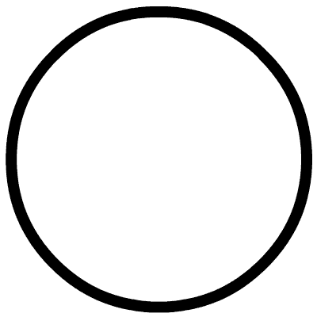

## 核对与使用边界

本文已按保存的全文审阅记录进行文字校订；本轮仅静态核对，未运行 PoC、请求目标或逐图验证。

适用条件与版本记录（来源主张，未列为明确更正的部分仍待权威资料核对）：文称&lt;=2.0.1、2.0.2修复；PHP&lt;8下PHAR元数据自动反序列化，需可用gadget

代码与实验材料：无PoC文本，混合大小写SVG image绕过的描述有价值

来源证据范围：SecurityOnline二手转载与维护者引文，无直接GHSA

- **操作与副作用边界（1）**：删除能力被推导为任意覆写；依据：称任意文件删除因此可覆写任意文件，缺额外写入机制；RCE仍依gadget及PHAR可达。保留原步骤及请求方法。执行条件包括隔离且获授权的可恢复环境、预先记录相关文件/账号/配置/业务记录状态；响应完成不能等同无副作用，恢复时须核对该操作涉及的实际对象。

- **事实待核（2）**：分类、评级和范围需精确；依据：Dompdf第三方库不是PHP运行时；CVSS10同时称高危，应注明标准并查官方范围。该项尚不能从转载本身确定外部事实；下文相应编号、版本或修复说法只作为来源记录，不能据此判定部署受影响或已修复。明确更正另列于本节。

历史原文标识：下文原技术材料按来源保留；仅本节明确确认的更正替代相应旧说法，标为待核的观察仍不是事实确认。

#  热门开源Dompdf PHP 库中存在严重漏洞   
DO SON  代码卫士   2023-02-03 18:13  
  
  
  
   
聚焦源代码安全，网罗国内外最新资讯！  
  
**编译：代码卫士**  
  
**开源的Dompdf PHP库中存在一个高危漏洞 (CVE-2023-23924)，如遭利用，可导致攻击者在目标服务器上远程执行代码。**  
  
  
  
开发人员 Bsweeney 在安全公告中指出，“攻击者如果能够向dompdf 提供SVG文件，则可能利用该漏洞调用具有任意协议的任意URL。在PHP 8.0.0之前版本中，该漏洞可导致任意反序列化，从而导致任意文件删除并可能导致远程代码执行后果，具体取决于可用的类。”  
  
该漏洞的CVSS评分为满分10分，影响 dompdf所有版本，包括2.0.1及以下版本，已在版本2.0.2中修复。  
  
DomPDF是一款HTML和PDF的转换器。Dompdf核心是CSS 2.1即用PHP编写的HTML层和渲染引擎。它是一款式样驱动的渲染器，将下载并读取外部的单个HTML元素的样式表、内联样式标记和样式属性。它还支持多数表示性HTML属性。在 PHP包仓库上，它的下载量已超过6500万次。  
  
Bsweeney 表示，“dompdf 2.0.1上的URI验证可通过传递含有大写字母的 `<image>` 标记，在SVG解析上被绕过，通过 phar URL 封装可能导致在PHP < 8版本上实现任意对象反序列化。”  
  
因此，在服务器上删除任意文件可破坏机密性和完整性保证，从而可能导致恶意人员覆写主机上的任意文件并执行任意恶意活动。  
  
而触发该漏洞的PoC 也十分简单。因此，建议dompdf用户尽快更新至2.0.2版本。****  
  
****  
代码卫士试用地址：  
https://codesafe.qianxin.com  
  
开源卫士试用地址：  
https://oss.qianxin.com  
  
  
  
  
  
  
  
  
  
  
  
  
**推荐阅读**  
  
  
[奇安信入选全球《软件成分分析全景图》代表厂商](http://mp.weixin.qq.com/s?__biz=MzI2NTg4OTc5Nw==&mid=2247515374&idx=1&sn=8b491039bc40f1e5d4e1b29d8c95f9e7&chksm=ea948d84dde30492f8a6c9953f69dbed1f483b6bc9b4480cab641fbc69459d46bab41cdc4859&scene=21#wechat_redirect)  
  
  
[热门开源库 JsonWebToken 存在RCE漏洞，可引发供应链攻击](http://mp.weixin.qq.com/s?__biz=MzI2NTg4OTc5Nw==&mid=2247515233&idx=1&sn=1e9a33dc52094b1fa20a75a16e81d1af&chksm=ea948d0bdde3041d97220eab3c1615d2e8e9d7bf783d606a1571bea4c078d16aed093074a0d6&scene=21#wechat_redirect)  
  
[热门开源软件ImageMagick中出现多个新漏洞](http://mp.weixin.qq.com/s?__biz=MzI2NTg4OTc5Nw==&mid=2247515439&idx=2&sn=a62cf619a2b6071dfc54a3f4ab7ec67f&chksm=ea948c45dde305532e71fbedd8889fd677909a2c6e678f27c39e540a00b61531b72f14069693&scene=21#wechat_redirect)  
  
  
[开源管理工具Cacti修复严重的IP欺骗漏洞](http://mp.weixin.qq.com/s?__biz=MzI2NTg4OTc5Nw==&mid=2247515059&idx=3&sn=118c9acd56100f1f6d77d390fee0cebf&chksm=ea948ad9dde303cf5f5d3a73019e4fefe3fb17ce33edce0982c949560bf0e2d3860ca4b93c80&scene=21#wechat_redirect)  
  
  
[CEO失联、资金链断裂，开源软件托管平台Fosshost将关闭](http://mp.weixin.qq.com/s?__biz=MzI2NTg4OTc5Nw==&mid=2247514929&idx=1&sn=fe1d2e520f21bdb36ea46f3092c5cb59&chksm=ea948a5bdde3034dfb1648799db4181766043f7a250e7445645d075af7991a0e0ccf193c7232&scene=21#wechat_redirect)  
  
  
  
  
**原文链接**  
  
  
https://securityonline.info/cve-2023-23924-critical-severity-rce-flaw-found-in-popular-dompdf-library/  
  
  
题图：  
Pixabay License  
  
‍  
  
  
  
**本文由奇安信编译，不代表奇安信观点。转载请注明“转自奇安信代码卫士 https://codesafe.qianxin.com”。**  
  
  
  
  
  
  
  
  
**奇安信代码卫士 (codesafe)**  
  
国内首个专注于软件开发安全的产品线。  
  
     
  
   
觉得不错，就点个 “  
在看  
” 或 "  
赞  
” 吧~  
  

---

> 来源：gelusus/wxvl（微信公众号漏洞文章自动归档，原文见文首链接）
