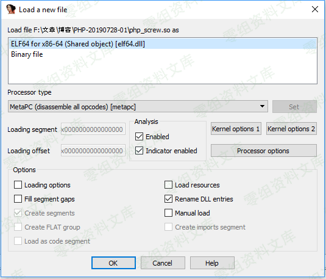

## 核对与使用边界

本文已按保存的全文审阅记录进行文字校订；本轮仅静态核对，未运行 PoC、请求目标或逐图验证。

适用条件与版本记录（来源主张，未列为明确更正的部分仍待权威资料核对）：无扩展版本、架构或二进制样本SHA

代码与实验材料：步骤几乎全依赖IDA截图且密钥打码，无可核文本；需已有php_screw.so

来源证据范围：StudyCat同源

- **操作与副作用边界（1）**：加密与解密函数语义混淆；依据：pm9screw_ext_fopen为加载解码钩子却称加密过程；需区分工具写文件和扩展读文件。保留原步骤及请求方法。执行条件包括隔离且获授权的可恢复环境、预先记录相关文件/账号/配置/业务记录状态；响应完成不能等同无副作用，恢复时须核对该操作涉及的实际对象。

- **证据待核（2）**：复现依赖图片和样本；依据：标黄就是key不能仅凭文章文字验证，资源后残串很多。保留原引用、截图位置和实验叙述；本项所缺材料未被补造，截图存在或作者宣称成功都不等于已核验其内容。

历史原文标识：下文原技术材料按来源保留；仅本节明确确认的更正替代相应旧说法，标为待核的观察仍不是事实确认。

# （三）通过IDA获取加密的key

通过导图查找
------------

首先找到php\_screw.so文件，然后通过IDA分析（幸好之前跟基友要了份IDA）。加密过程是在pm9screw\_ext\_fopen函数中实现的，所以只需要到这个函数中去找加密部分即可。通过IDA获取加密的key/media/rId22.png)

找到pm9screw\_ext\_fopen函数，双击，如下图所示：

通过IDA获取加密的key/media/rId23.png)

然后右边的窗口就会如下图所示：

通过IDA获取加密的key/media/rId24.png)

很明显，我标黄的就是加密密钥了，双击跳转至其指针保存处：

通过IDA获取加密的key/media/rId25.png)

再次双击，跟踪变量，见下图，打码处就是密钥了。

通过IDA获取加密的key/media/rId26.png)

如下图，右键，将十六进制的密钥转成十进制的，然后打开screwdecode.c，见下图9，将密钥替换掉，即可使用screw\_decode解密。

通过IDA获取加密的key/media/rId27.png)

通过IDA获取加密的key/media/rId28.png)

通过伪代码查找
--------------

再找到目标函数之后，使用F5，查看伪代码，双击黄标也可以跳转到之前找到的位置。

通过IDA获取加密的key/media/rId30.png)

参考链接
--------

> https://www.cnblogs.com/StudyCat/p/11268399.html
