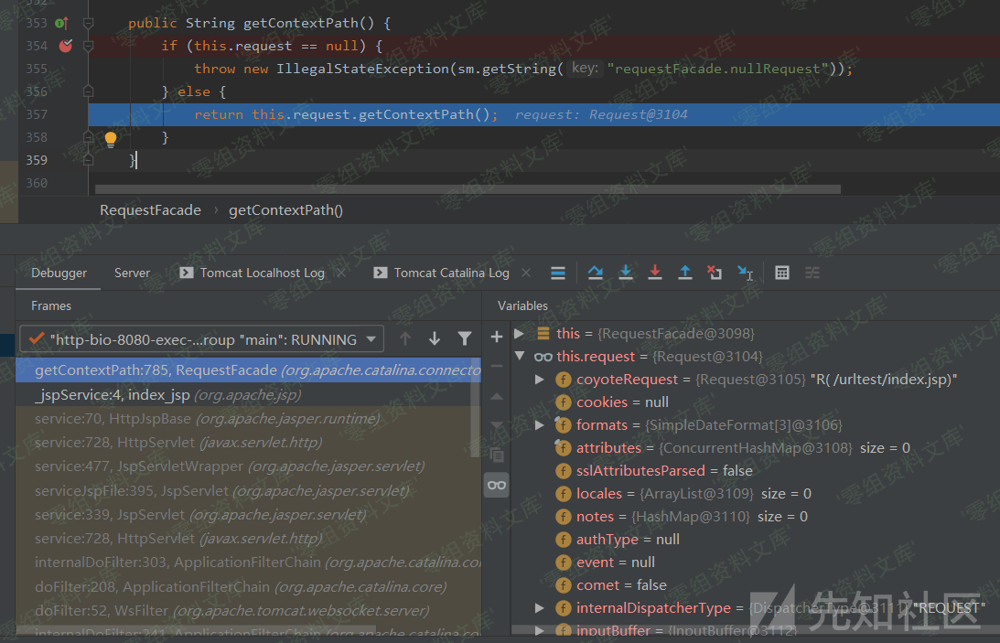
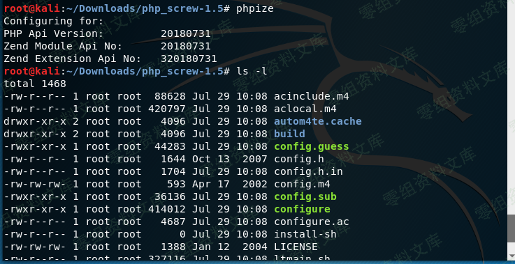
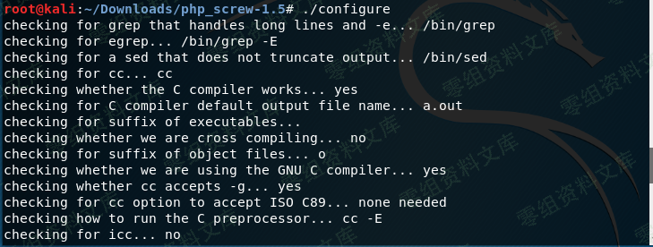
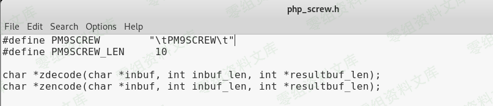
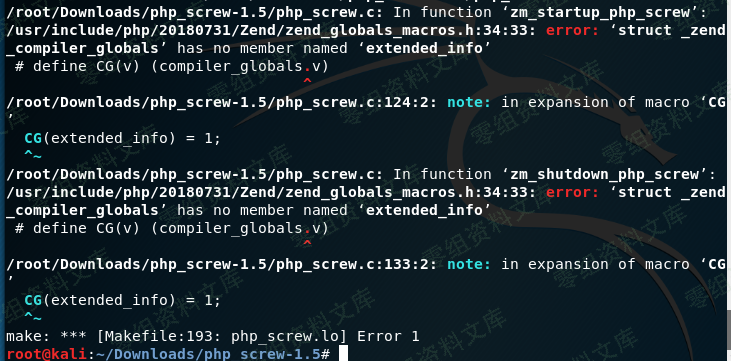

## 核对与使用边界

本文已按保存的全文审阅记录进行文字校订；本轮仅静态核对，未运行 PoC、请求目标或逐图验证。

适用条件与版本记录（来源主张，未列为明确更正的部分仍待权威资料核对）：php_screw1.5与PHP扩展ABI20151012历史路径，未标PHP兼容范围

代码与实验材料：命令大小写、弯引号和tar长破折号有错，缺完整make与测试文件内容

来源证据范围：镜像仓库及StudyCat原文

- **代码与转录边界（1）**：批量操作及构建指令有风险/语法错误；依据：find使用弯引号、//中文被作为参数、xargs不处理空格；原地加密没有备份提示。相应原代码作为存在此问题的历史样本保留，不能直接当作可运行、成功复现的 PoC；缺失内容需回原稿核对，不据此补造可执行攻击链。

- **结论使用边界（2）**：历史环境假设硬编码；依据：Phpize/Service大小写、/usr/lib/php/20151012固定ABI路径、sed只针对特定源码。此项限制直接适用于下文对应结论；现有正文不足以作更宽泛推论，所列方法和原始证据均保留。

- **证据待核（3）**：大量图片残串与缺代码；依据：我们写phpinfo内容是后无正文，图片尺寸属性残留。保留原引用、截图位置和实验叙述；本项所缺材料未被补造，截图存在或作者宣称成功都不等于已核验其内容。

历史原文标识：下文原技术材料按来源保留；仅本节明确确认的更正替代相应旧说法，标为待核的观察仍不是事实确认。

# （四）php-screw加密文件

> 项目地址

    https://github.com/ianxtianxt/php-screw

> 安装命令

    我是在kali-rolling上测试的，提示没有phpize这个命令。
    apt-get install php-dev

    然后解压
    tar –zxvf php_screw-1.5.tar.gz

php-screw加密文件/media/rId21.png)

> 编译PHP扩展的工具，主要是根据系统信息生成对应的configure文件

    Phpize
    ./configure

php-screw加密文件/media/rId22.png)php-screw加密文件/media/rId23.png)

> 编辑my\_screw.h修改pm9screw\_mycryptkey密钥的值

如下图，是默认值

php-screw加密文件/media/rId24.png)

> 此外我们可以编辑php\_screw.h修改PM9SCREW 和
> PM9SCREW\_LEN的值，注意PM9SCREW\_LEN的值要小于等于PM9SCREW的长度。如下图是其默认值。

php-screw加密文件/media/rId25.png)

> 进行编译

如下图编译时出错了，在php\_screw的目录下以下命令执行即可解决，最后编译成功。

    sed -i "s/CG(extended_info) = 1;/CG(compiler_options) |= ZEND_COMPILE_EXTENDED_INFO;/g" php_screw.c

php-screw加密文件/media/rId26.png)

> 将编译好的php\_screw.so拷贝到php扩展库目录。

通过phpinfo()页面查找extension-dir关键字

php-screw加密文件/media/rId27.png)

将编译好的php\_screw.so拷贝到php扩展目录。

    cp modules/php_screw.so /usr/lib/php/20151012/php_screw.so

> 编辑php.ini添加以下一行代码

    extension=php_screw.so

> 重启http服务器

    Service apache2 restart

> 编译加密工具

    cd tools
    make

> 编译完成后生成screw可执行文件。> php-screw加密文件/media/rId28.png){width="5.833333333333333in"
> height="2.4657994313210847in"}
>
> 尝试加密一个php文件

我们写一个phpinfo.php文件内容是

然后执行./screw phpinfo.php加密文件，见下图

php-screw加密文件/media/rId29.png)

> 将加密好的文件拷贝到web目录

    cp phpinfo.php /var/www/html/phpinfo.php

php-screw加密文件/media/rId30.png)

> 批量加密php文件

    find /data/php/source -name “*.php” -print|xargs -n1 screw //加密所有的.php文件

参考链接
--------

> https://www.cnblogs.com/StudyCat/p/11268399.html
