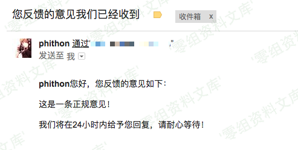
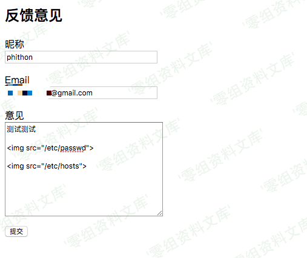
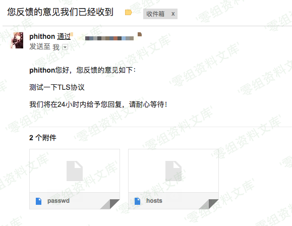

## 核对与使用边界

本文已按保存的全文审阅记录进行文字校订；本轮仅静态核对，未运行 PoC、请求目标或逐图验证。

适用条件与版本记录（来源主张，未列为明确更正的部分仍待权威资料核对）：&lt;=5.2.21，缺修复版本与msgHTML/basedir调用条件

代码与实验材料：所有恶意img标签在转录中消失，剩空反引号和截图，无法按文本复现

来源证据范围：无原出处/公告

- **证据待核（1）**：核心载荷被HTML解析吞掉；依据：图片标签只剩（`），插入恶意代码只剩空反引号。保留原引用、截图位置和实验叙述；本项所缺材料未被补造，截图存在或作者宣称成功都不等于已核验其内容。

- **结论使用边界（2）**：把特定邮件HTML处理说成所有发送邮件；依据：需可控HTML经过嵌入资源方法并将邮件发给攻击者可读收件人，不是纯文本邮件均可。此项限制直接适用于下文对应结论；现有正文不足以作更宽泛推论，所列方法和原始证据均保留。

历史原文标识：下文原技术材料按来源保留；仅本节明确确认的更正替代相应旧说法，标为待核的观察仍不是事实确认。

（CVE-2017-5223）PHPMailer \<= 5.2.21 任意文件读取漏洞
======================================================

一、漏洞简介
------------

PHPMailer在发送邮件的过程中，会在邮件内容中寻找图片标签（`），并将其src属性的值提取出来作为附件。所以，如果我们能控制部分邮件内容，可以利用`将文件`/etc/passwd`作为附件读取出来，造成任意文件读取漏洞。

二、漏洞影响
------------

PHPMailer \<= 5.2.21

三、复现过程
------------

"意见反馈"页面，正常用户填写昵称、邮箱、意见提交，这些信息将被后端储存，同时后端会发送一封邮件提示用户意见填写完成：

PHPMailer<=5.2.21任意文件读取漏洞/media/rId24.png)

> 该场景在实战中很常见，比如用户注册网站成功后，通常会收到一封包含自己昵称的通知邮件，那么，我们在昵称中插入恶意代码\`\`，目标服务器上的文件将以附件的形式被读取出来。

同样，我们填写恶意代码在"意见"的位置：

PHPMailer<=5.2.21任意文件读取漏洞/media/rId25.png)

收到邮件，其中包含附件`/etc/passwd`和`/etc/hosts`：

PHPMailer<=5.2.21任意文件读取漏洞/media/rId26.png)

下载读取即可。
