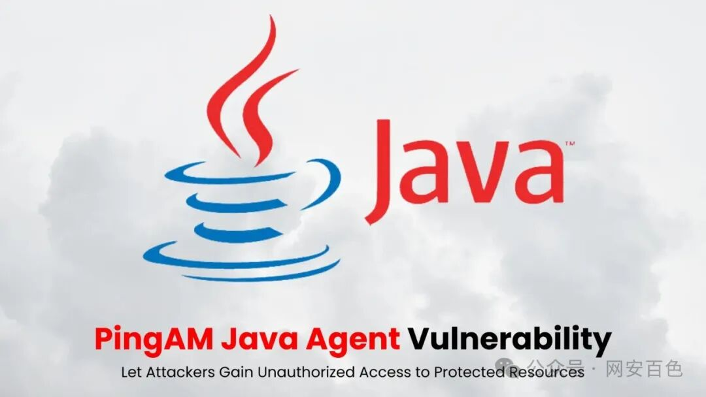

## 核对与使用边界

本文已按保存的全文审阅记录进行文字校订；本轮仅静态核对，未运行 PoC、请求目标或逐图验证。

适用条件与版本记录（来源主张，未列为明确更正的部分仍待权威资料核对）：文称2024.9/2023.11.1/5.10.3及以前，修复2024.11/2023.11.2/5.10.4；需按分支核

代码与实验材料：仅猜例protected-resource;bypass=1，关键缓解参数仅截图；没有基线和真实请求结果

来源证据范围：转载自称无法找真来源，没有PingIdentity公告

- **证据待核（1）**：精确遥测和泛化MFA绕过无来源；依据：侦查增加340%没有数据来源；策略路径绕过不代表任何MFA或应用内授权均失效。保留原引用、截图位置和实验叙述；本项所缺材料未被补造，截图存在或作者宣称成功都不等于已核验其内容。

- **证据待核（2）**：验证与缓解缺可执行证据；依据：OAuth scopes/acr_values测试建议未对应代理路径规范化；关键属性仅图。保留原引用、截图位置和实验叙述；本项所缺材料未被补造，截图存在或作者宣称成功都不等于已核验其内容。

历史原文标识：下文原技术材料按来源保留；仅本节明确确认的更正替代相应旧说法，标为待核的观察仍不是事实确认。

#  PingAM Java存在未经授权的访问权限漏洞CVE-2025-20059   
 网安百色   2025-03-02 11:31  
  
   
  
点击上方  
蓝字  
关注我们吧~  
  
  
  
  
Ping Identity 针对其 PingAM Java 代理发布了紧急安全公告，揭示了一个严重性为极高的漏洞 （CVE-2025-20059），该漏洞使攻击者能够绕过策略实施机制并未经授权访问受保护的资源。  
  
该漏洞被归类为相对路径遍历弱点 （CWE-23），CVSS v3.1 评分为 9.8（严重），CVE-2025-20059，对使用 PingAM 进行混合云  
身份验证  
的企业构成系统性风险。未修补的系统可能会面临数据泄露和合规性故障。  
  
该漏洞会影响身份验证中间件的所有受支持版本，包括运行 2024.9、2023.11.1、5.10.3 和更早版本迭代的部署。  
  
CVE-2025-20059 对使用 PingAM 进行混合云身份验证的企业构成系统性风险。未修补的系统可能会遇到数据泄露和合规性故障。  
## 路径遍历漏洞  
  
该漏洞源于对 HTTP 请求路径中特殊元素的不当中和，允许威胁行为者将分号分隔的序列注入 URL 结构中。  
  
与后端应用程序服务器相比，此技术利用了 Java 代理解析 URL 的方式的不一致，在这种情况下，GET /protected-resource;bypass=1 等请求可能会绕过在代理层实施的安全策略。  
  
利用此缺陷的攻击者可以规避旨在保护敏感数据的多重身份验证要求、  
访问控制  
和会话验证检查。  
  
在使用 Java 代理保护金融交易、医疗保健 API 或需要符合 FIPS 140-2 标准的政府系统的环境中，风险尤其严重。  
## 缓解措施  
  
使用自动化部署管道，在 24 小时内在开发环境中部署固定版本 （2024.11/2023.11.2/5.10.4）。  
  
对于无法立即升级的组织，Ping Identity 建议修改 AgentBootstrap.properties 文件以包含安全参数：  
  
  
  
  
这种基于正则表达式的缓解措施会强制代理拒绝 URL 路径中包含分号的任何 HTTP 请求，并返回 400 Bad Request 响应。  
  
但是，该解决方法存在作限制 — 出于合法目的需要在 URL 路径中使用分号的系统（例如符合 RFC 3986 准则的旧版 API）可能会遇到服务中断。  
  
永久解决方案需要  
升级到  
修补版本，其中 Java 代理的 URL 规范化过程与后端服务器的解释逻辑一致。升级后验证应包括：  
  
**策略实施测试：**使用 OAuth 2.0 范围参数和 OpenID Connect acr_values验证所有受保护终端节点的身份验证质询。  
  
**日志审核：**监控  
身份验证  
日志中是否存在指示残余遍历尝试的意外 CRITICAL 条目。  
  
截至撰写本文时，尚未确认此漏洞导致漏洞，但研究人员报告称，自公告发布以来，针对 Java 代理端点的侦查活动增加了 340%。  
  
**免责声明**  
：  
  
本公众号所载文章为本公众号原创或根据网络搜索下载编辑整理，文章版权归原作者所有，仅供读者学习、参考，禁止用于商业用途。因转载众多，无法找到真正来源，如标错来源，或对于文中所使用的图片、文字、链接中所包含的软件/资料等，如有侵权，请跟我们联系删除，谢谢！  
  
  
  
  

---

> 来源：gelusus/wxvl（微信公众号漏洞文章自动归档，原文见文首链接）
