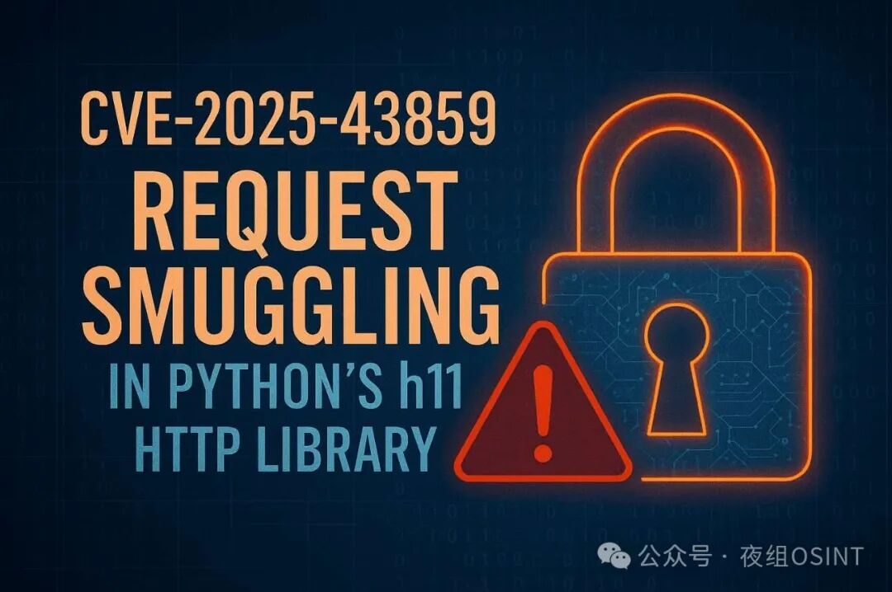

## 核对与使用边界

本文已按保存的全文审阅记录进行文字校订；本轮仅静态核对，未运行 PoC、请求目标或逐图验证。

适用条件与版本记录（来源主张，未列为明确更正的部分仍待权威资料核对）：正文称0.14.0之前错误，结尾0.15.0修复；两边界需核对不能仅凭新闻选一

代码与实验材料：两字节终止符与代理解析差异解释，但无字节流示例；后文两种不同请求划分叙述混合

来源证据范围：多次引公告无链接

- **事实待核（1）**：版本范围未自洽；依据：0.14.0是否受影响未交代，修复0.15.0需一手版本矩阵。该项尚不能从转载本身确定外部事实；下文相应编号、版本或修复说法只作为来源记录，不能据此判定部署受影响或已修复。明确更正另列于本节。

- **适用与权限边界（2）**：请求/连接方向解释混乱；依据：先称h11把一个请求分两，后称后端把两请求合一，需要分开两种构造和代理角色。按此限制解释本文结论，版本相同不足以证明所需角色、入口、配置、依赖或可控参数均已满足；原操作和失败记录一并保留。

历史原文标识：下文原技术材料按来源保留；仅本节明确确认的更正替代相应旧说法，标为待核的观察仍不是事实确认。

#  CVE-2025-43859：Python h11 HTTP 库中的请求走私漏洞   
NightTeam  夜组OSINT   2025-04-28 00:00  
  
  
  
## 漏洞描述  
  
h11 是一个极简的、与 I/O 无关的、用 Python 编写的 HTTP/1.1 协议库，该库中发现了一个严重漏洞，编号为 CVE-2025-43859。该漏洞的 CVSS 评级为 9.1，当 h11 与配置错误或存在缺陷的 HTTP 代理配合使用时，该漏洞可能导致应用程序中的请求走私攻击。  
  
  
## 正文  
  
h11 公告警告称：“ h11 对分块编码消息体中的行终止符的解析过于宽容，在某些情况下可能会导致请求走私漏洞。”  
  
在 HTTP/1.1 中，分块传输编码用于以可变大小的段发送请求或响应主体。每个块以 CRLF 序列 (\r\n) 结尾。然而，在 0.14.0 版本之前，h11 错误地接受了任意两个字节，而不是正确验证尾随字节是否恰好是 \r\n。  
  
这种宽容本身并不会立即造成危险。但是，当 h11 被用在错误解析分块编码的反向代理后面时，就会出现不一致的情况。例如，反向代理可能会使用一个幼稚的“读取到行尾”函数读取比它应该读取的字节数更多的字节，导致 h11 和代理对同一字节流的解析结果不同。  
  
h11 咨询报告指出：“只要两个 HTTP 处理器都接受相同的字节串，但对其进行不同的解释，就存在发生‘请求走私’攻击的条件。 ”  
  
公告中演示的示例展示了 h11 如何将格式错误的分块请求解释为两个单独的 HTTP 请求，而存在漏洞的代理却将它们视为一个合并的请求。如果第二个请求包含敏感标头（例如 Cookie: SESSION_KEY=abcdef…），服务器可能会将其视为第一个请求的一部分，从而有效地泄露凭据或绕过访问控制。  
  
在使用代理限制对受保护端点的访问的环境中，这尤其危险。  
  
其中一个较为严重的攻击案例涉及通过同一连接发送来自不同用户的两个 HTTP 请求。存在漏洞的代理可能会将这两个请求转发到后端服务器，而后端服务器则会将第二个用户的凭据解释为第一个请求主体的一部分。  
  
该公告警告称：“服务器将看到这两个连接的请求，并将它们解释为对 /one 的一个请求，该请求的主体包含 /two 的会话密钥，这可能允许一个用户窃取另一个用户的凭据。 ”  
## 安全建议  
  
该问题已在h11 0.15.0版本中修复。建议使用 h11 的开发者立即升级。  
  
  
  

---

> 来源：gelusus/wxvl（微信公众号漏洞文章自动归档，原文见文首链接）
