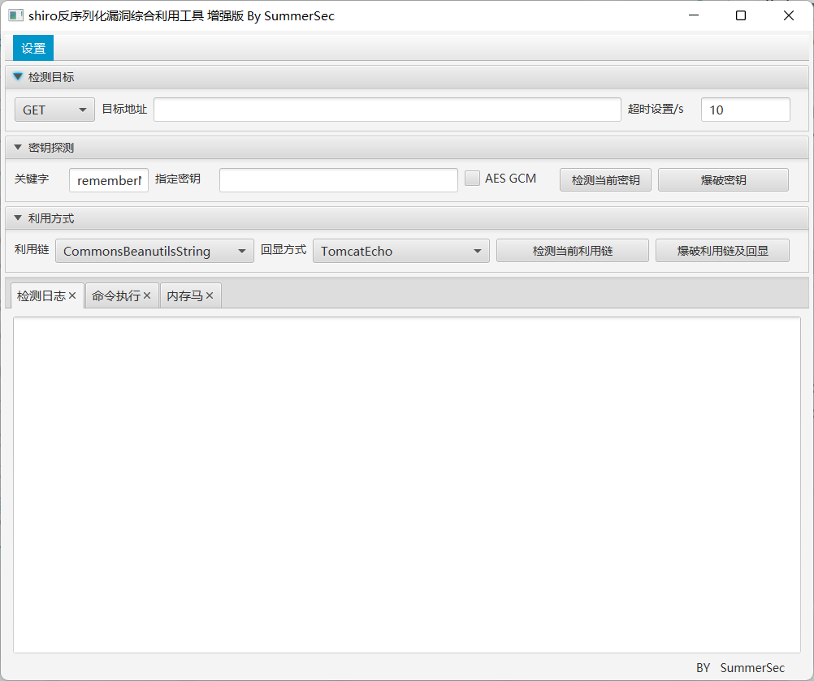
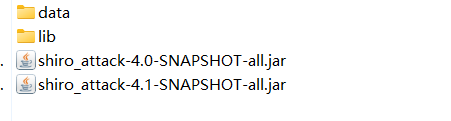

## 核对与使用边界

本文已按保存的全文审阅记录进行文字校订；本轮仅静态核对，未运行 PoC、请求目标或逐图验证。

适用条件与版本记录（来源主张，未列为明确更正的部分仍待权威资料核对）：只写第三版与占位jar版本，缺release/JDK/依赖适配矩阵

代码与实验材料：功能清单与截图，无代码，明确改key可能业务异常值得保留

来源证据范围：SummerSec署名及shiro.sumsec.me，下载被公众号回复替代，FAQ无链接

- **适用与权限边界（1）**：工具能力缺可追溯版本和条件；依据：处理无第三方依赖、CB多版本和AllECHO未列实际gadget/JDK/容器前提。按此限制解释本文结论，版本相同不足以证明所需角色、入口、配置、依赖或可控参数均已满足；原操作和失败记录一并保留。

- **凭据与会话边界（2）**：应区分检测与改变服务状态；依据：内存马注入及改shirokey不是无副作用自查，可能影响会话与稳定性。抓包中的会话不能视为未认证访问证明。需重新取得授权测试会话，不能复用文中值。

历史原文标识：下文原技术材料按来源保留；仅本节明确确认的更正替代相应旧说法，标为待核的观察仍不是事实确认。

#  shiro反序列化漏洞综合利用,包含（回显执行命令注入内存马）  
SummerSec
                    SummerSec  W小哥   2026-01-16 03:34  
  
# ShiroAttack2  
  
   
### 一款针对Shiro550漏洞进行快速漏洞利用  
  
   
  
  
  
   
  
  
   
  
  
   
  
  
   
  
  
   
  
  
   
  
  
## 前言  
  
   
  
关于该工具更新内容介绍后续会更新到博客下面  
https://shiro.sumsec.me/  
## 工具特点  
  
   
  
·  
  
javafx  
  
·  
  
处理没有第三方依赖的情况  
  
·  
  
支持多版本CommonsBeanutils的gadget  
  
·  
  
支持内存马  
  
·  
  
采用直接回显执行命令  
  
·  
  
添加了更多的CommonsBeanutils版本gadget  
  
·  
  
支持修改rememberMe关键词  
  
·  
  
支持直接爆破利用gadget和key  
  
·  
  
支持代理  
  
·  
  
添加修改shirokey功能（使用内存马的方式）**可能导致业务异常**  
  
·  
  
支持内存马小马  
  
·  
  
添加DFS算法回显（AllECHO）  
  
·  
  
支持自定义请求头，格式：abc:123&&&test:123  
## FAQ 常见问题见  
  
   
  
FAQ  
## 使用方法  
  
   
  
直接使用shiro_attack-{version}-SNAPSHOT-all.jar第三版  
  
  
  
  
在jar的当前目录下创建一个data文件夹，里面创建一个shiro_keys.txt文件，文件内容是shiro_key。lib目前是CommonsBeanutils依赖的版本。  
  
  
  
  
关注公众号回复“  
20260116  
”获取工具地址  
。  
  

---

> 来源：gelusus/wxvl（微信公众号漏洞文章自动归档，原文见文首链接）
