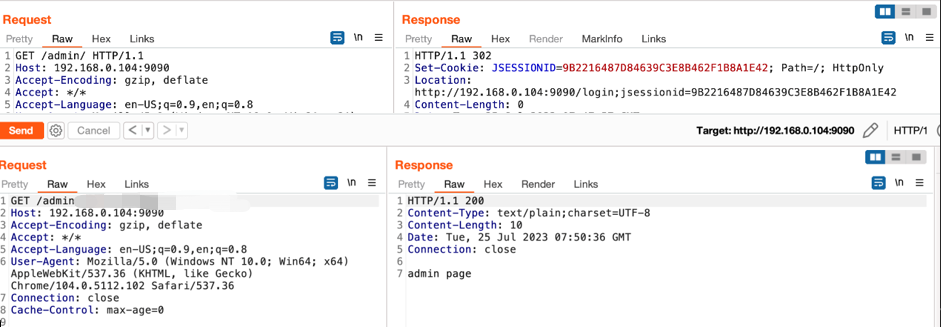

## 核对与使用边界

本文已按保存的全文审阅记录进行文字校订；本轮仅静态核对，未运行 PoC、请求目标或逐图验证。

适用条件与版本记录（来源主张，未列为明确更正的部分仍待权威资料核对）：&lt;1.12.0及2.0alpha&lt;3需分支限定；安全版本应分别表达

代码与实验材料：低利用难度判断无具体苛刻前提，复现仅图且表说PoC未公开

来源证据范围：微步原研判，链接仅Apache项目主页无公告/补丁

- **适用与权限边界（1）**：延迟修复建议缺适用依据；依据：别急着修、优先级低却未写需哪种代理/路径配置才可利用，无法用于用户具体部署。按此限制解释本文结论，版本相同不足以证明所需角色、入口、配置、依赖或可控参数均已满足；原操作和失败记录一并保留。

- **结论使用边界（2）**：风险评级与影响量不透明；依据：低危、万级及未捕获攻击均属厂商当时观测，不等于漏洞普遍低危/无利用。此项限制直接适用于下文对应结论；现有正文不足以作更宽泛推论，所列方法和原始证据均保留。

历史原文标识：下文原技术材料按来源保留；仅本节明确确认的更正替代相应旧说法，标为待核的观察仍不是事实确认。

#  别急着修！Apache Shiro 最新身份验证漏洞实际很难利用   
原创 微步情报局  微步在线研究响应中心   2023-07-26 14:08  
  
  
  
01 漏洞概况****  
  
  
  
Apache Shiro是一个强大且易用的Java安全框架，用于实现身份验证、授权、密码和会话管理等功能。近日，微步漏洞团队监测到Apache Shiro中修复了一处身份验证绕过漏洞(CVE-2023-34478)，由于InvalidRequestFilter#isAccessAllowed 方法未对URL参数进行有效过滤，攻击者可能构造包含恶意字符的URL参数绕过身份验证。目前已有漏洞通告提示该漏洞为**严重**。但经过分析和研判，该漏洞在真实环境下能够利用的条件较为苛刻，  
**利用成功的难度较高，修复优先级较低。**  
****  
  
02 漏洞处置优先级（VPT）  
  
  
  
**综合处置优先级：**  
**低**  
****  
  
<table><tbody style="visibility: visible;"><tr style="height: 23.3pt;visibility: visible;"><td style="border-color: rgb(191, 191, 191);border-style: solid;border-width: 1pt;padding: 0cm 5.4pt;word-break: break-all;visibility: visible;" width="111" valign="top" height="23">
<strong style="visibility: visible;">漏洞编号</strong>
</td><td style="border-color: rgb(191, 191, 191) rgb(191, 191, 191) rgb(191, 191, 191) currentcolor;border-style: solid solid solid none;border-width: 1pt 1pt 1pt medium;padding: 0cm 5.4pt;word-break: break-all;visibility: visible;" width="76" valign="top" height="23">
微步编号
</td><td style="border-color: rgb(191, 191, 191) rgb(191, 191, 191) rgb(191, 191, 191) currentcolor;border-style: solid solid solid none;border-width: 1pt 1pt 1pt medium;padding: 0cm 5.4pt;word-break: break-all;visibility: visible;" width="227" valign="top" height="23">
XVE-2023-17765
</td></tr><tr style="height: 23.3pt;visibility: visible;"><td rowspan="6" style="border-color: currentcolor rgb(191, 191, 191) rgb(191, 191, 191);border-style: none solid solid;border-width: medium 1pt 1pt;padding: 0cm 5.4pt;visibility: visible;" width="131" valign="top" height="23">
<strong style="visibility: visible;">漏洞评估</strong>
</td><td style="border-color: currentcolor rgb(191, 191, 191) rgb(191, 191, 191) currentcolor;border-style: none solid solid none;border-width: medium 1pt 1pt medium;padding: 0cm 5.4pt;visibility: visible;" width="76" valign="top" height="23">
危害评级
</td><td style="border-color: currentcolor rgb(191, 191, 191) rgb(191, 191, 191) currentcolor;border-style: none solid solid none;border-width: medium 1pt 1pt medium;padding: 0cm 5.4pt;word-break: break-all;visibility: visible;" width="227" valign="top" height="23">
低
</td></tr><tr style="height: 23.3pt;visibility: visible;"><td style="border-color: currentcolor rgb(191, 191, 191) rgb(191, 191, 191) currentcolor;border-style: none solid solid none;border-width: medium 1pt 1pt medium;padding: 0cm 5.4pt;visibility: visible;" width="132" valign="top" height="23">
漏洞类型
</td><td style="border-color: currentcolor rgb(191, 191, 191) rgb(191, 191, 191) currentcolor;border-style: none solid solid none;border-width: medium 1pt 1pt medium;padding: 0cm 5.4pt;word-break: break-all;visibility: visible;" width="235" valign="top" height="23">
认证绕过
</td></tr><tr style="visibility: visible;"><td style="border-color: currentcolor rgb(191, 191, 191) rgb(191, 191, 191) currentcolor;border-style: none solid solid none;border-width: medium 1pt 1pt medium;padding: 0cm 5.4pt;visibility: visible;" width="132" valign="top">
公开程度
</td><td style="border-color: currentcolor rgb(191, 191, 191) rgb(191, 191, 191) currentcolor;border-style: none solid solid none;border-width: medium 1pt 1pt medium;padding: 0cm 5.4pt;word-break: break-all;" width="235" valign="top">
PoC未公开
</td></tr><tr style="mso-yfti-irow:4;"><td style="border-color: currentcolor rgb(191, 191, 191) rgb(191, 191, 191) currentcolor;border-style: none solid solid none;border-width: medium 1pt 1pt medium;padding: 0cm 5.4pt;" width="132" valign="top">
利用条件
</td><td style="border-color: currentcolor rgb(191, 191, 191) rgb(191, 191, 191) currentcolor;border-style: none solid solid none;border-width: medium 1pt 1pt medium;padding: 0cm 5.4pt;word-break: break-all;" width="235" valign="top">
无权限要求
</td></tr><tr style="mso-yfti-irow:5;"><td style="border-color: currentcolor rgb(191, 191, 191) rgb(191, 191, 191) currentcolor;border-style: none solid solid none;border-width: medium 1pt 1pt medium;padding: 0cm 5.4pt;" width="132" valign="top">
交互要求
</td><td style="border-color: currentcolor rgb(191, 191, 191) rgb(191, 191, 191) currentcolor;border-style: none solid solid none;border-width: medium 1pt 1pt medium;padding: 0cm 5.4pt;word-break: break-all;" width="235" valign="top">
0-click
</td></tr><tr style="mso-yfti-irow:6;"><td style="border-color: currentcolor rgb(191, 191, 191) rgb(191, 191, 191) currentcolor;border-style: none solid solid none;border-width: medium 1pt 1pt medium;padding: 0cm 5.4pt;" width="132" valign="top">
威胁类型
</td><td style="border-color: currentcolor rgb(191, 191, 191) rgb(191, 191, 191) currentcolor;border-style: none solid solid none;border-width: medium 1pt 1pt medium;padding: 0cm 5.4pt;word-break: break-all;" width="235" valign="top">
远程
</td></tr><tr style="mso-yfti-irow:7;"><td rowspan="1" style="border-color: currentcolor rgb(191, 191, 191) rgb(191, 191, 191);border-style: none solid solid;border-width: medium 1pt 1pt;padding: 0cm 5.4pt;" width="131" valign="top">
<strong>利用情报</strong>
</td><td style="border-color: currentcolor rgb(191, 191, 191) rgb(191, 191, 191) currentcolor;border-style: none solid solid none;border-width: medium 1pt 1pt medium;padding: 0cm 5.4pt;word-break: break-all;" width="76" valign="top">
微步已捕获攻击行为
</td><td style="border-color: currentcolor rgb(191, 191, 191) rgb(191, 191, 191) currentcolor;border-style: none solid solid none;border-width: medium 1pt 1pt medium;padding: 0cm 5.4pt;word-break: break-all;" width="227" valign="top"><section style="line-height: 1.6em;text-align: justify;margin: 0px;text-indent: 0em;">否</section></td></tr><tr style="mso-yfti-irow:9;"><td rowspan="4" style="border-color: currentcolor rgb(191, 191, 191) rgb(191, 191, 191);border-style: none solid solid;border-width: medium 1pt 1pt;padding: 0cm 5.4pt;" width="131" valign="top">
<strong>影响产品</strong>
</td><td style="border-color: currentcolor rgb(191, 191, 191) rgb(191, 191, 191) currentcolor;border-style: none solid solid none;border-width: medium 1pt 1pt medium;padding: 0cm 5.4pt;" width="76" valign="top">
产品名称
</td><td style="border-color: currentcolor rgb(191, 191, 191) rgb(191, 191, 191) currentcolor;border-style: none solid solid none;border-width: medium 1pt 1pt medium;padding: 0cm 5.4pt;word-break: break-all;" width="227" valign="top">
apache-shiro
</td></tr><tr style="mso-yfti-irow:10;"><td style="border-color: currentcolor rgb(191, 191, 191) rgb(191, 191, 191) currentcolor;border-style: none solid solid none;border-width: medium 1pt 1pt medium;padding: 0cm 5.4pt;word-break: break-all;" width="132" valign="top">
受影响版本
</td><td style="border-color: currentcolor rgb(191, 191, 191) rgb(191, 191, 191) currentcolor;border-style: none solid solid none;border-width: medium 1pt 1pt medium;padding: 0cm 5.4pt;word-break: break-all;" width="235" valign="top"><section style="line-height: 1.6em;text-align: justify;margin: 0px;text-indent: 0em;">version &lt; 1.12.0</section>version &lt; 2.0.0-alpha-3 <section style="line-height: 1.6em;text-align: justify;margin: 0px;text-indent: 0em;"></section><section style="line-height: 1.6em;text-align: justify;margin: 0px;text-indent: 0em;"></section><section style="line-height: 1.6em;text-align: justify;margin: 0px;text-indent: 0em;"></section></td></tr><tr style="mso-yfti-irow:11;"><td style="border-color: currentcolor rgb(191, 191, 191) rgb(191, 191, 191) currentcolor;border-style: none solid solid none;border-width: medium 1pt 1pt medium;padding: 0cm 5.4pt;" width="132" valign="top">
影响范围
</td><td style="border-color: currentcolor rgb(191, 191, 191) rgb(191, 191, 191) currentcolor;border-style: none solid solid none;border-width: medium 1pt 1pt medium;padding: 0cm 5.4pt;word-break: break-all;" width="235" valign="top">
万级
</td></tr><tr style="mso-yfti-irow:12;mso-yfti-lastrow:yes;height:26.7pt;"><td style="border-color: currentcolor rgb(191, 191, 191) rgb(191, 191, 191) currentcolor;border-style: none solid solid none;border-width: medium 1pt 1pt medium;padding: 0cm 5.4pt;" width="132" valign="top" height="26">
有无修复补丁
</td><td style="border-color: currentcolor rgb(191, 191, 191) rgb(191, 191, 191) currentcolor;border-style: none solid solid none;border-width: medium 1pt 1pt medium;padding: 0cm 5.4pt;word-break: break-all;" width="235" valign="top" height="26">
有
</td></tr></tbody></table>  
  
03 漏洞复现   
  
  
  
  
### 04 修复方案 官方修复方案：Apache官方已发布修复方案，安全版本为1.12.0及以上，2.0.0-alpha-3及以上。https://github.com/apache/shiro  
### 05 微步在线产品侧支持情况  微步在线威胁感知平台TDP通用规则默认支持检测。  
### 06 时间线 2023.07.24 微步获取该漏洞相关情报2023.07.26 微步发布报告  
  
****  
**---End---**  
  
  
**微步漏洞情报订阅服务**  
  
微步漏洞情报订阅服务是由微步漏洞团队面向企业推出的一项高级分析服务，致力于通过微步自有产品强大的高价值漏洞发现和收集能力以及微步核心的威胁情报能力，为企业提供0day漏洞预警、最新公开漏洞预警、漏洞分析及评估等漏洞相关情报，帮助企业应对最新0day/1day等漏洞威胁并确定漏洞修复优先级，快速收敛企业的攻击面，保障企业自身业务的正常运转。  
  

---

> 来源：gelusus/wxvl（微信公众号漏洞文章自动归档，原文见文首链接）
