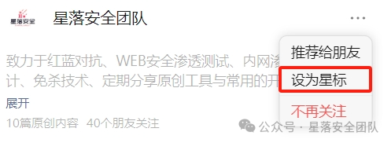
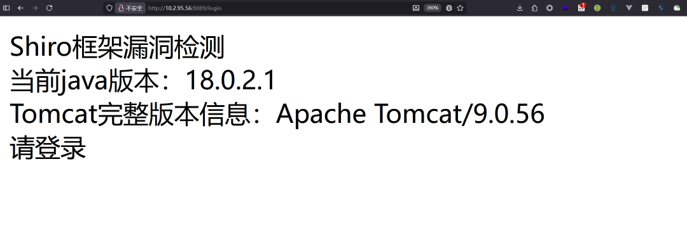
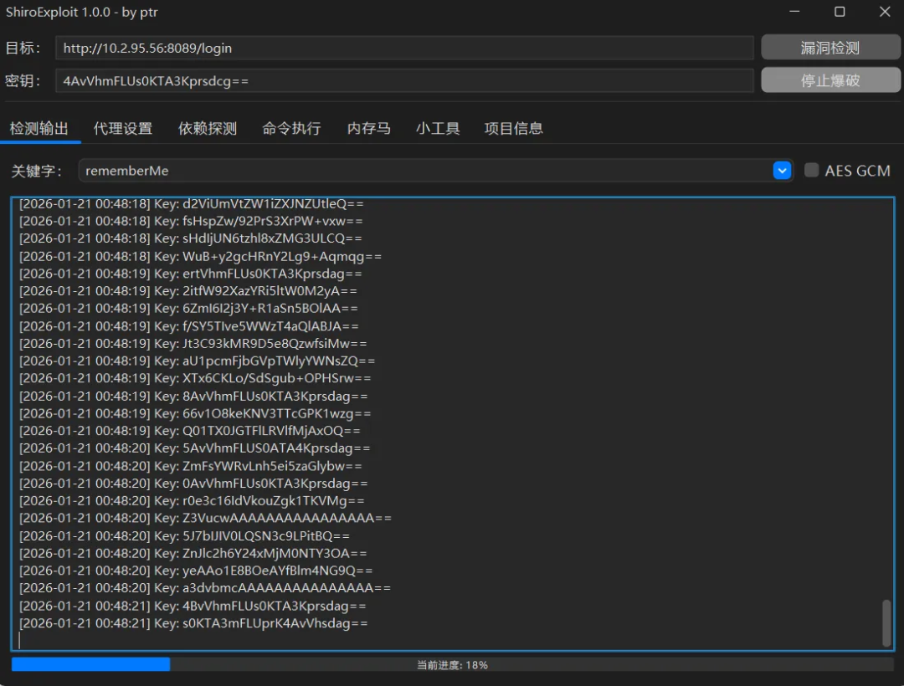
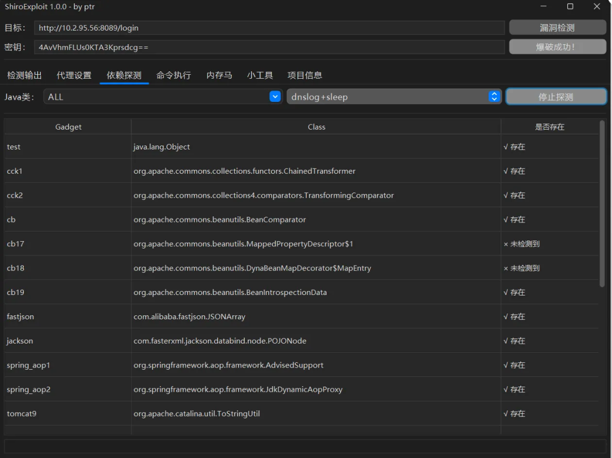
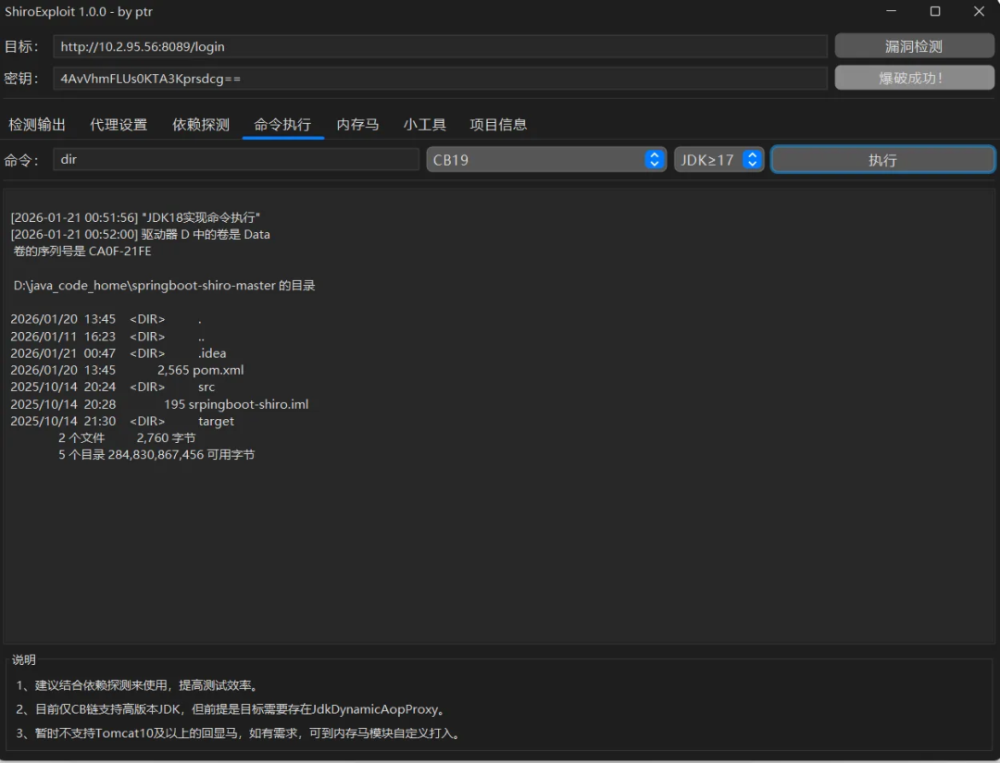
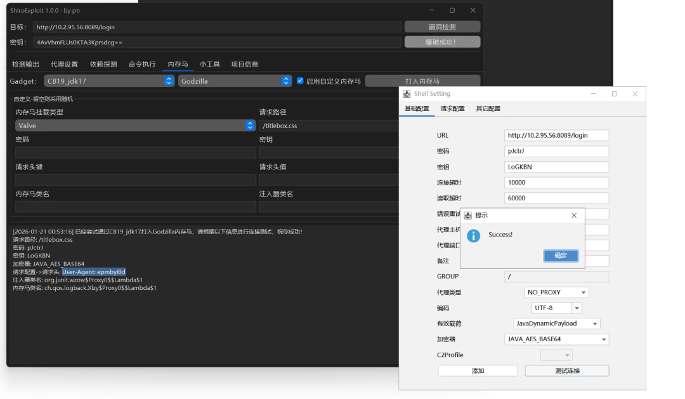
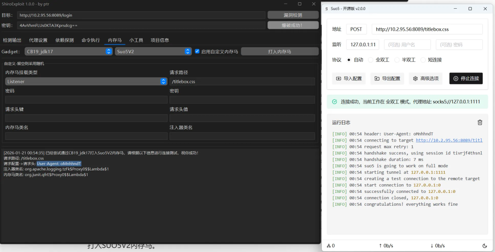
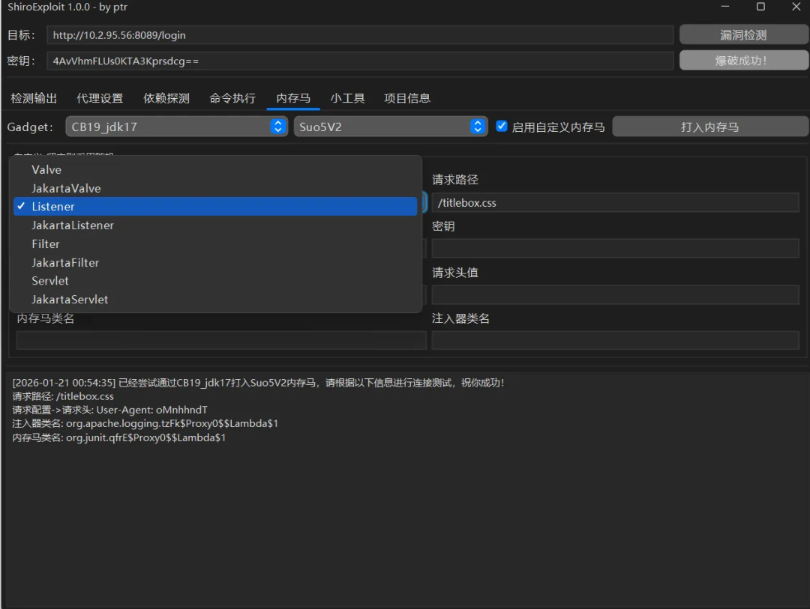

## 核对与使用边界

本文已按保存的全文审阅记录进行文字校订；本轮仅静态核对，未运行 PoC、请求目标或逐图验证。

适用条件与版本记录（来源主张，未列为明确更正的部分仍待权威资料核对）：JDK18演示但工具/依赖版本未给

代码与实验材料：九条能力及图，无源码；改key、改HeaderMaxSize、反序列化炸弹检测有状态/DoS风险

来源证据范围：FightingLzn9署名但下载经公众号，广告大量

- **操作与副作用边界（1）**：确保有key有gadget就RCE和无侵入性夸大；依据：还受JDK模块、过滤器、运行上下文等限制，内存注入和配置改变实际会修改服务。保留原步骤及请求方法。执行条件包括隔离且获授权的可恢复环境、预先记录相关文件/账号/配置/业务记录状态；响应完成不能等同无副作用，恢复时须核对该操作涉及的实际对象。

- **结论使用边界（2）**：检测手段具有破坏性却未标；依据：反序列化炸弹会消耗资源，改key可能失效已有rememberMe，功能清单无风险说明。此项限制直接适用于下文对应结论；现有正文不足以作更宽泛推论，所列方法和原始证据均保留。

历史原文标识：下文原技术材料按来源保留；仅本节明确确认的更正替代相应旧说法，标为待核的观察仍不是事实确认。

#  工具推荐 | 一款Shiro反序列化漏洞一站式综合利用工具  
FightingLzn9
                    FightingLzn9  星落安全团队   2026-01-25 16:00  
  
  
  
点击上方  
蓝字  
关注我们  
  
  
  
  
现在只对常读和星标的公众号才展示大图推送，建议大家能把  
**星落安全团队**  
“  
**设为星标**  
”，  
否则可能就看不到了啦  
！  
  
【  
声明  
】本文所涉及的技术、思路和工具仅用于安全测试和防御研究，切勿将其用于非法入侵或攻击他人系统以及盈利等目的，一切后果由操作者自行承担！！！  
  
  
  
**工具介绍**  
  
WinD  
ShiroExploit，是一款Shiro反序列化漏洞一站式综合利用工具。  
  
基本概述如下：  
- 区分ShiroAttack2，采用分块传输内存马，每块大小不超过4000。  
  
- 可打JDK高版本的shiro，确保有key、有gadget就能rce。  
  
- 依托JavaChains动态生成gadget，实现多条利用链，如CB、CC、Fastjson、Jackson。  
  
- 通过魔改MemshellParty的内存马模板，使其回显马通信加密，去除一些典型的特征。  
  
- 借助JMG的注入器，加以魔改，实现无侵入性，同一个容器可同时兼容多种类型的内存马。  
  
- 对内存马和注入器类名进行随机化和Lambda化处理，规避内存马主动扫描设备的检测。  
  
- 可以更改目标配置，如改Key、改TomcatHeaderMaxSize。  
  
- 采用URLDNS链和反序列化炸弹的方式来探测指定类实现利用链的探测。  
  
- 缺点是流量相对大一些。  
  
功能演示  
  
JDK18场景下实现命令执行和打入多种内存马。  
  
  
  
  
跑key。  
  
  
  
  
探测利用链。  
  
  
  
  
命令执行。  
  
  
  
  
打入Godzilla内存马（支持Behinder内存马）。  
  
  
  
  
打入SUO5V2内存马。  
  
  
  
  
支持Tomcat10及以上的内存马。  
  
  
  
  
**相关地址**  
  
**关注微信公众号后台回复“入群”，即可进入星落安全交流群！**  
  
关注微信公众号后台回复“  
20260126  
**”，即可获取项目下载地址！**  
  
****  
  
****  
**圈子介绍**  
  
博主介绍  
：  
  
  
目前工作在某安全公司攻防实验室，一线攻击队选手。自2022-2024年总计参加过30+次省/市级攻防演练，擅长工具开发、免杀、代码审计、信息收集、内网渗透等安全技术。  
  
  
目前已经更新的免杀内容：  
- 部分免杀项目源代码  
  
- 星落安全内部免杀工具箱1.0  
  
- CobaltStrike4.9.1星落专版1.9  
  
- 一键击溃windows defender  
  
- 一键击溃火绒进程  
  
-    
CobaltStrike免杀加载器  
  
- 数据库直连工具免杀版  
  
- aspx文件自动上线cobaltbrike  
  
- jsp文件  
自动上线cobaltbrike  
  
- 哥斯拉免杀工具   
XlByPassGodzilla  
  
- 冰蝎免杀工具 XlByPassBehinder  
  
- 冰蝎星落专版 xlbehinder  
  
- 正向代理工具 xleoreg  
  
- 反向代理工具xlfrc  
  
- 内网扫描工具 xlscan  
  
- Todesk/向日葵密码读取工具  
  
- 导出lsass内存工具 xlrls  
  
- 绕过WAF免杀工具 ByPassWAF  
  
- 等等...  
  
  
  
  
  
  
目前星球已满1000人，价格由208元  
调整为  
218元(  
交个朋友啦  
)，1100名以后涨价至268元。  
  
  
  
  
  
  
     
往期推荐  
     
  
  
1.[加量不加价 | 星落免杀第二期，助你打造专属免杀武器库](https://mp.weixin.qq.com/s?__biz=MzkwNjczOTQwOA==&mid=2247495969&idx=1&sn=d3379e8f69c2cefb6d0564299e13d579&scene=21#wechat_redirect)  
  
  
  
2.[【干货】你不得不学习的内网渗透手法](https://mp.weixin.qq.com/s?__biz=MzkwNjczOTQwOA==&mid=2247489483&idx=1&sn=0cbeb449e56db1ae48abfb924ffd0b43&scene=21#wechat_redirect)  
  
  
  
3.[【免杀】CobaltStrike4.9.1二开 | 自破解 免杀 修复BUG](https://mp.weixin.qq.com/s?__biz=MzkwNjczOTQwOA==&mid=2247488486&idx=1&sn=683083d38a58de4a95750673d9cb725d&scene=21#wechat_redirect)  
  
  
  
4.[【免杀】原来SQL注入也可以绕过杀软执行shellcode上线CoblatStrike](http://mp.weixin.qq.com/s?__biz=MzkwNjczOTQwOA==&mid=2247489950&idx=1&sn=a54e05e31a2970950ad47800606c80ff&chksm=c0e2b221f7953b37b5d7b1a8e259a440c1ee7127d535b2c24a5c6c2f2e773ac2a4df43a55696&scene=21&token=458856676&lang=zh_CN#wechat_redirect)  
  
  
  
  
  

---

> 来源：gelusus/wxvl（微信公众号漏洞文章自动归档，原文见文首链接）
