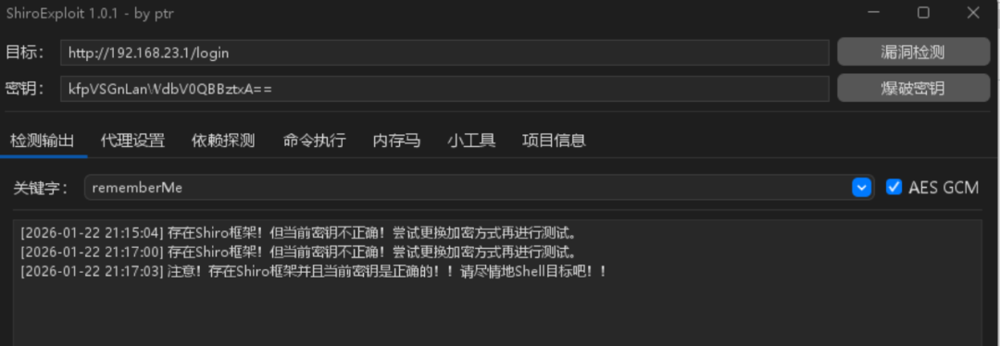
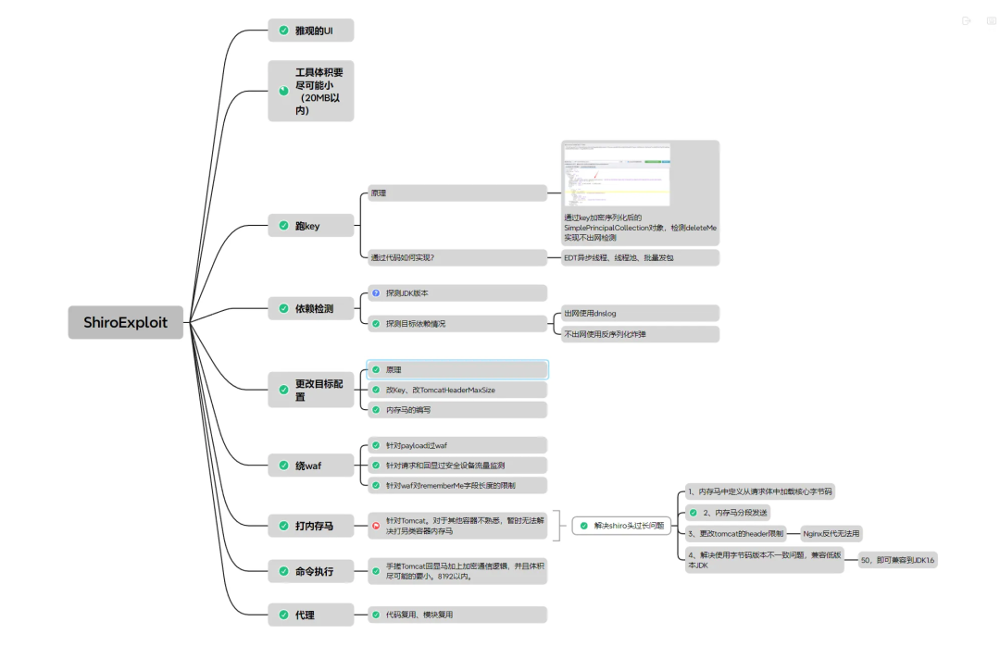
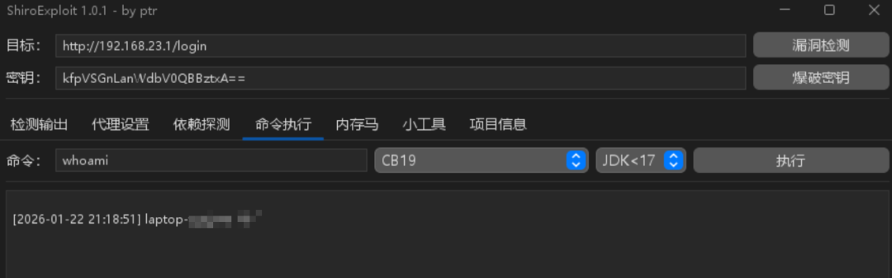
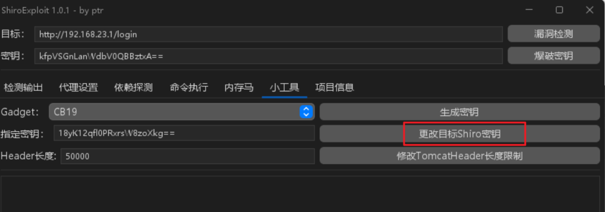
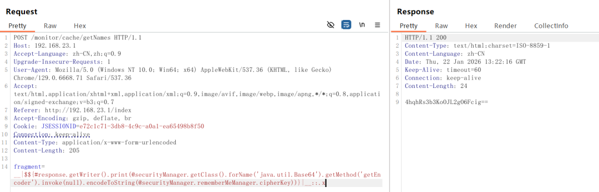
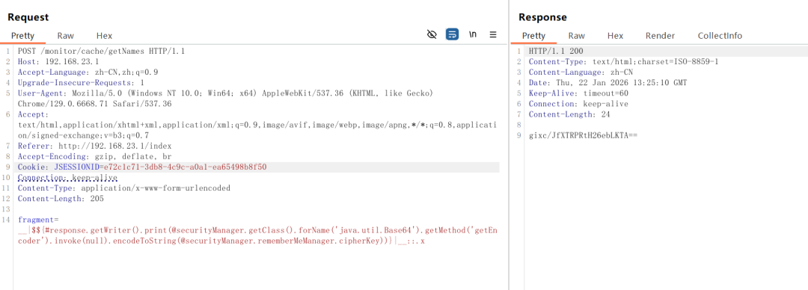
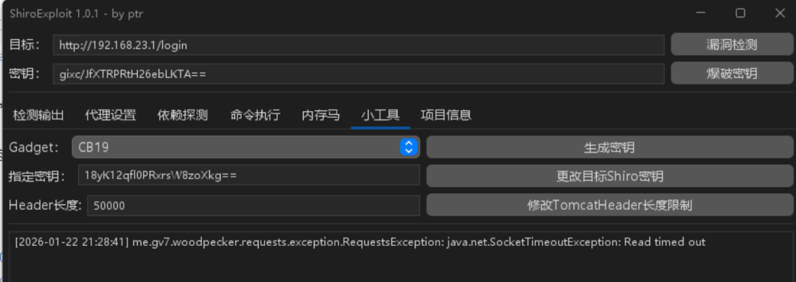
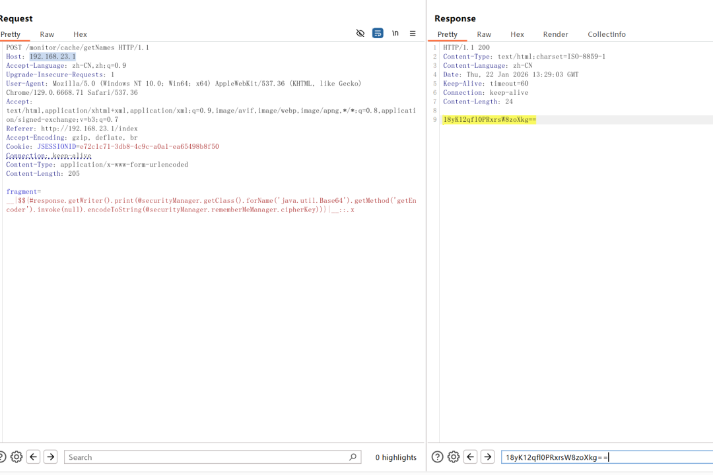
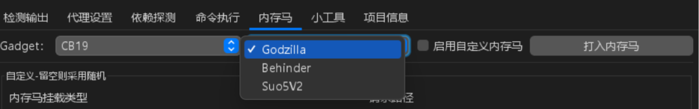

## 核对与使用边界

本文已按保存的全文审阅记录进行文字校订；本轮仅静态核对，未运行 PoC、请求目标或逐图验证。

适用条件与版本记录（来源主张，未列为明确更正的部分仍待权威资料核对）：高版本Shiro密钥重启必变忽略应用显式配置持久密钥；工具未锁版本

代码与实验材料：改key前后截图及超时后验证有独立观察，仍无源码和运行环境细节

来源证据范围：直接GitHub工具链接，作者使用笔记

- **操作与副作用边界（1）**：密钥行为和控制影响泛化；依据：高版本不一定每次重启随机，取决cipherKey配置；改key可破坏登录状态并非安全修复。保留原步骤及请求方法。执行条件包括隔离且获授权的可恢复环境、预先记录相关文件/账号/配置/业务记录状态；响应完成不能等同无副作用，恢复时须核对该操作涉及的实际对象。

- **证据待核（2）**：功能保障缺限制；依据：同有key/gadget即RCE、无侵入性和炸弹探测声明应降调；非必要不改key警告应保留。保留原引用、截图位置和实验叙述；本项所缺材料未被补造，截图存在或作者宣称成功都不等于已核验其内容。

历史原文标识：下文原技术材料按来源保留；仅本节明确确认的更正替代相应旧说法，标为待核的观察仍不是事实确认。

#  新鲜出炉，Shiro 反序列化漏洞一站式综合利用工具  
 进击的HACK   2026-01-22 23:51  
  
  
  
声明：  
文中所涉及的技术、思路和工具仅供以安全为目的的学习交流使用，任何人不得将其用于非法用途给予盈利等目的，否则后果自行承担！  
如有侵权烦请告知，我会立即删除并致歉。谢谢  
！  
  
文章有疑问的，可以公众号发消息问我，或者留言。我每天都会看的。  
  
  
  
  
  
   
  
> 字数 468，阅读大约需 3 分钟  
  
## 介绍  
  
项目地址：https://github.com/FightingLzn9/ShiroExploit  
  
shiro key 校验  
  
  
ba66c0ddf520b10a68e3bfee9bb3b0b8.png  
  
工具功能思维导图  
  
  
fc33f0cbe148d575c9eeb699734155c7.png  
## 命令执行  
  
  
  
2cff7a920f8a678fd95a711be8bc0717.png  
## 小工具  
  
更改目标 shiro 密钥  
  
  
7c1c676e937d0088c556b4ba6b516768.png  
  
**这个功能有什么用？**  
  
高版本的 shiro 密钥是每次服务启动时随机生成的，也就是每次启动都会改变。  
  
查看 shiro key  
  
  
35bc0f81165f4a4d01d9d7eb21817a67.png  
  
  
  
150a47635ae15abe016dde00c9201b57.png  
  
在攻防演练中，多个攻击队测试一家企业的资产，难免攻击路径会重合。有的攻击队就想到了个注意，把 shiro key 给修改成随机的，这样自己先拿下系统后，稍后发现 shiro key 的队伍就进不去了。  
> 前提是出现 shiro key 泄露的问题，而不是可以通过 rce/代码注入的形式，从内存里获取当前的 key  
  
  
虽然显示超时，我们重新看 key  
  
  
375a5360bce87b33b3639aca5c21b256.png  
  
内存里的 shiro key 修改成功  
  
  
3e62b70d853aa2052f143c8a0a459322.png  
  
当然，非必要还是建议大家不用改 key。  
## 内存马  
  
  
  
65ecad902c9caaaa022f7941a5225ad2.png  
## 总结  
  
项目地址：https://github.com/FightingLzn9/ShiroExploit  
  
基本概述如下：  
  
1、区分 ShiroAttack2，采用分块传输内存马，每块大小不超过 4000。  
  
2、可打 JDK 高版本的 shiro，确保有 key、有 gadget 就能 rce。  
  
3、依托 JavaChains 动态生成 gadget，实现多条利用链，如 CB、CC、Fastjson、Jackson。  
  
4、通过魔改 MemshellParty 的内存马模板，使其回显马通信加密，去除一些典型的特征。  
  
5、借助 JMG 的注入器，加以魔改，实现无侵入性，同一个容器可同时兼容多种类型的内存马。  
  
6、对内存马和注入器类名进行随机化和 Lambda 化处理，规避内存马主动扫描设备的检测。  
  
7、可以更改目标配置，如改 Key、改 TomcatHeaderMaxSize。  
  
8、采用 URLDNS 链和反序列化炸弹的方式来探测指定类实现利用链的探测。  
  
9、缺点是流量相对大一些。  
  
   
  
  
  
欢迎加入知识星球，星球内容主要有：  
  
1、公众号文章备份、工具分享。  
  
2、常见问题的答疑、解决方案汇总在知识星球，作为便于搜索的知识库。  
  
  
  
  
  

---

> 来源：gelusus/wxvl（微信公众号漏洞文章自动归档，原文见文首链接）
