## 核对与使用边界

本文已按保存的全文审阅记录进行文字校订；本轮仅静态核对，未运行 PoC、请求目标或逐图验证。

适用条件与版本记录（来源主张，未列为明确更正的部分仍待权威资料核对）：shiro-web1.0-incubating–&lt;1.13.0及2alpha1–&lt;alpha4，分析1.7.0，比较1.13.0

代码与实验材料：saveRequest/session到loginSuccess调用链、Java配置及前后补丁截图完整；关键HTTP报文仅图

来源证据范围：固定Apache修复commit与补天原文，较好

- **结论使用边界（1）**：重定向安全不能只校验协议；依据：文章开头只强调协议合法，后面已用//协议相对URL；应校验同源/允许目标及规范化结果。此项限制直接适用于下文对应结论；现有正文不足以作更宽泛推论，所列方法和原始证据均保留。

- **操作与副作用边界（2）**：补丁循环文字解释需校正；依据：称首字符为/且长度&gt;1就持续删除，会把正常单斜杠也描述为删除；需照官方代码准确写成去多余前导斜杠。保留原步骤及请求方法。执行条件包括隔离且获授权的可恢复环境、预先记录相关文件/账号/配置/业务记录状态；响应完成不能等同无副作用，恢复时须核对该操作涉及的实际对象。

- **来源与引用处置（3）**：演示代码安全及来源噪声；依据：硬编码admin/123456和无盐两轮MD5仅实验勿当生产；WebUtils包名拼错filte，大量推广应剥离。保留这部分来源材料并与技术结论分开；其引用或宣传内容不能补足本文漏洞的证据。

历史原文标识：下文原技术材料按来源保留；仅本节明确确认的更正替代相应旧说法，标为待核的观察仍不是事实确认。

#  浅谈Apache Shiro FORM URL Redirect漏洞(CVE-2023-46750)   
 渗透安全团队   2023-11-28 23:17  
  
0x00 前言  
  
URL Redirect漏洞是一种常见的安全漏洞。一般是因为服务端未对传入的跳转url变量进行检查和控制，导致可恶意构造任意一个恶意地址，诱导用户跳转到恶意网站。由于是从可信的站点跳转出去的，攻击者利用这一点可以进行各种攻击，例如钓鱼攻击、恶意软件分发等。  
  
在Java Web应用中，URL Redirect通常通过不同的方式实现。最常见就是使用HttpServletResponse。HttpServletResponse中的sendRedirect()方法的作用是重定向，向浏览器发送一个特殊的Header，然后由浏览器来做重定向，转到指定的页面：  
```
@GetMapping("/redirectUrl")
public void redirect(String url, HttpServletResponse response) throws IOException {
    response.sendRedirect(url);
}

```  
  
可以看到当传入对应的url参数内容时，会完成对应302跳转：  
  
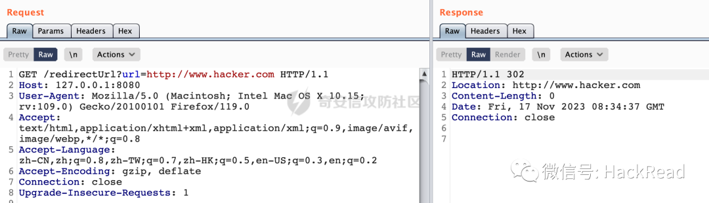  
  
这里类似http这类的协议部分实际上是可以去掉的，所以下面的请求也是可以完成302跳转的：  
  
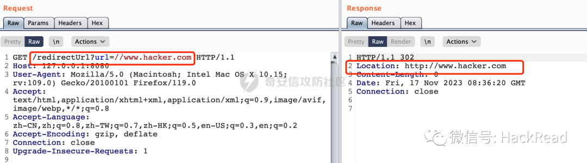  
  
所以在实际业务开发过程中，还需要考虑这类畸形请求的情况，对URL协议进行合法性检查，避免不必要的绕过。  
# 0x01 漏洞描述  
  
Apache Shiro 是一个开源的Java安全框架，用于简化应用程序的身份验证、授权、加密和会话管理等安全相关的操作。Apache官方近期披露了CVE-2023-46750，在受影响版本中，由于在FORM身份验证中没有对认证后重定向的页面做验证，攻击者可以构造恶意的URL，使得用户重定向到恶意的URL地址。  
  
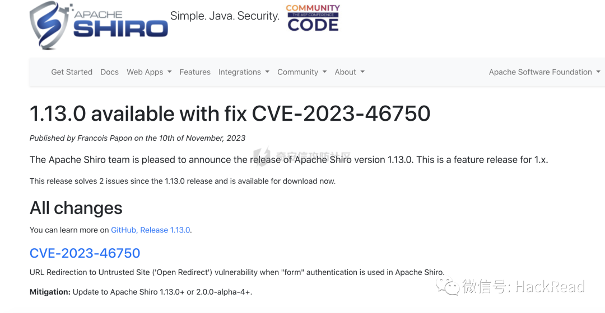  
  
影响版本  
- org.apache.shiro:shiro-web@[1.0.0-incubating, 1.13.0)  
  
- org.apache.shiro:shiro-web@[2.0.0-alpha-1, 2.0.0-alpha-4)  
  
# 0x02 漏洞分析  
  
以shiro-web-1.7.0为例进行分析。  
## 2.1 原理分析  
  
根据对应的漏洞描述，主要是因为在受影响版本中，由于在FORM身份验证中没有对认证后重定向的页面做验证导致了URL Redirect风险。那风险点应该是跟表单验证有关的，大概率跟Shiro中的org.apache.shiro.web.filter.authc.FormAuthenticationFilter过滤器有关。  
  
FormAuthenticationFiltershiro一般跟authc配置有关，提供了登录验证用的filter，如果用户未登录，会调用onAccessDenied方法做用户登录操作。若用户请求的不是登录地址，则跳转到登录地址，并且返回false直接终止filter链。若用户请求的是登录地址，若果是post请求则进行登录操作，由AuthenticatingFilter中提供的executeLogin方法执行。否则直接通过继续执行filter链，并最终跳转到登录页面。  
  
下面看看其具体的调用过程：  
  
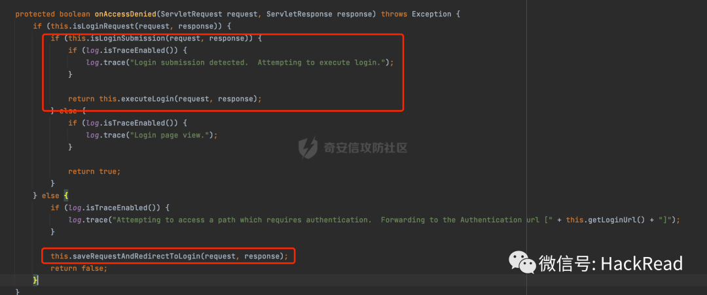  
  
首先看看saveRequestAndRedirectToLogin，若用户未登录且请求的不是登录地址会调用该方法：  
  
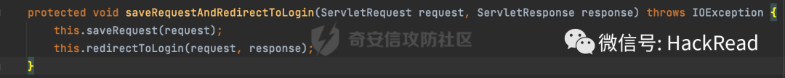  
  
首先调用org.apache.shiro.web.filte.WebUtils#saveRequest进行处理，这里主要是实例化了SavedRequest对象，然后将其保存在session的shiroSavedRequest属性里：  
  
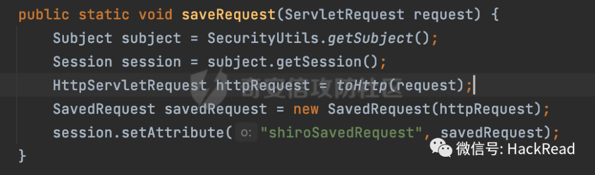  
  
SavedRequest对象中主要保存的是当前请求的方法，参数以及请求路径：  
  
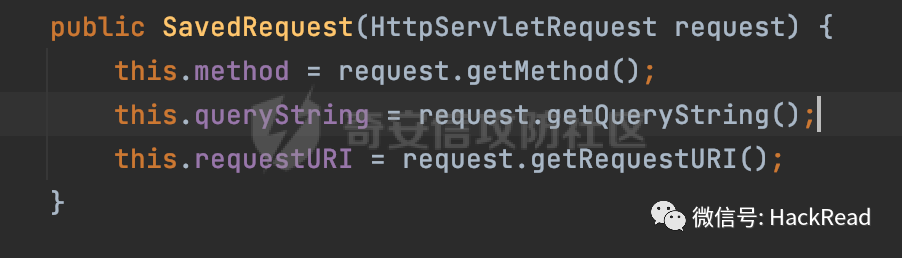  
  
保存完后会调用redirectToLogin重定向到LoginUrl：  
  
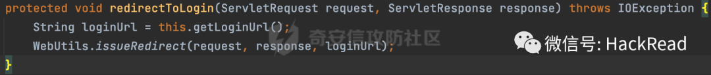  
  
这里最终调用的是org.apache.shiro.web.util.RedirectView#renderMergedOutputModel，对loginUrl进行对应的组装后，调用sendRedirect方法重定向：  
  
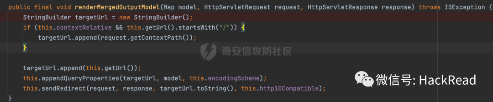  
  
实际调用的是javax.servlet.http.HttpServletResponse#sendRedirect方法：  
  
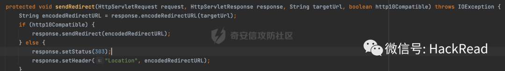  
  
也就是说，  
saveRequestAndRedirectToLogin主要功能是保存请求地址并重定向到登陆界面。  
  
然后是若用户请求的是登录地址，若果是post请求则进行登录操作这个逻辑，这里的核心方法是executeLogin：  
  
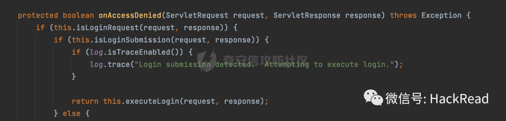  
  
在executeLogin方法中，主要是进行登陆验证操作，认证成功后会调用onLoginSuccess方法：  
  
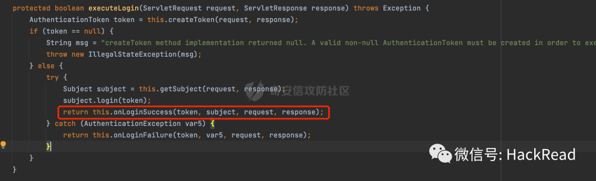  
  
这里会调用issueSuccessRedirect继续处理：  
  
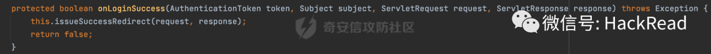  
  
实际调用的是WebUtils#redirectToSavedRequest方法：  
  
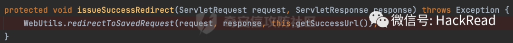  
  
首先通过 getAndClearSavedRequest(request) 方法获取之前保存的请求（Saved Request），如果之前保存的请求存在并且是一个 GET 请求，将其 URL 作为后续要跳转的 URL：  
  
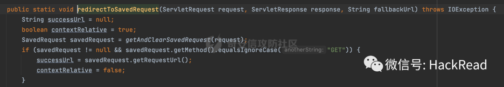  
  
这里会从session的shiroSavedRequest属性中获取saveRequest对象（如果用户未登录且用户请求的不是登录地址，会把该uri的信息保存在saveRequest对象里）：  
  
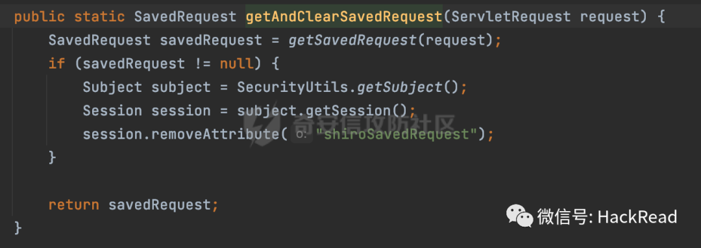  
  
如果有有效的 Saved Request，则将其 URL 作为成功的 URL，并将 contextRelative 设置为 false。否则使用指定的 fallbackUrl 作为成功的 URL，也就是配置里常见的SuccessUrl：  
  
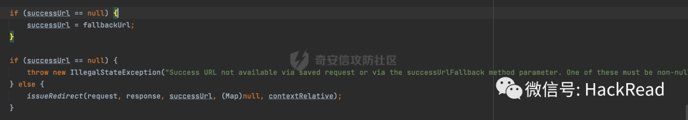  
  
最终跟saveRequestAndRedirectToLogin方法一样，调用org.apache.shiro.web.util.RedirectView#renderMergedOutputModel，通过javax.servlet.http.HttpServletResponse#sendRedirect对session中拿到的savedRequest进行重定向处理：  
  
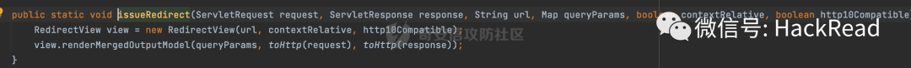  
  
也就是说，  
onLoginSuccess方法中去session中找出之前的保存的请求，如果没有的话就会跳转到配置的successUrl（默认是/）。  
  
因为onLoginSuccess方法中去session中找出之前的保存的请求，当登陆成功的时候会发起跳转。而跳转的这个URL是从saveRequest对象获取的。而saveRequest对象可以通过saveRequestAndRedirectToLogin方法进行设置（当用户未登录且用户请求的不是登录地址，会把该uri的信息保存在saveRequest对象里）。  
  
而saveRequest对象对应的URI是通过request.getRequestURI方法获取的，整个过程没有进行规范化的处理：  
  
  
  
虽然没办法指定请求的协议，但是最终的重定向是通过javax.servlet.http.HttpServletResponse#sendRedirect处理的。而前面提到过，sendRedirect对类似//www.hacker.com是可以完成302跳转的。到这里大概的利用思路就出来了，大致利用过程如下：  
- 在进行账号密码登陆验证前访问//www.hacker.com路径  
  
- 在同一个浏览器完成登陆验证即可跳转到www.hacker.com  
  
## 2.2 漏洞复现  
  
搭建对应的环境进行复现。下面是部分关键代码：  
  
定义登陆验证接口/doLogin,在这里会对用户输入的账号密码进行验证：  
```
@PostMapping("/doLogin")
public String doLogin(String username, String password) {
    Subject subject = SecurityUtils.getSubject();
    try {
        subject.login(new UsernamePasswordToken(username, password));
        return "success";
    } catch (AuthenticationException e) {
        e.printStackTrace();
        return "login failed";
    }
}

```  
  
继承AuthorizingRealm并重写认证的方法,这里使用硬编码的方式进行账号密码校验（admin/123456）：  
```
@Override
protected AuthenticationInfo doGetAuthenticationInfo(AuthenticationToken authenticationToken) throws AuthenticationException {
    UsernamePasswordToken token = (UsernamePasswordToken) authenticationToken;
    //获取页面中传递的用户账号
    String username = token.getUsername();

    //获取页面中的用户密码实际工作中基本不需要获取
    String password = new String(token.getPassword());

    /**     认证账号，这里应该从数据库中获取数据     * 如果进入if表示账号不存在，要抛出异常     */
    if(!"admin".equals(username)&&!"user".equals(username)){
        //抛出账号错误的异常
        throw new UnknownAccountException();
    }

    //设置让当前用户登陆的密码进行加密,前端页面传过来的密码加密操作
    HashedCredentialsMatcher credentialsMatcher = new HashedCredentialsMatcher();
    credentialsMatcher.setHashAlgorithmName("md5");
    credentialsMatcher.setHashIterations(2);
    this.setCredentialsMatcher(credentialsMatcher);

    //对数据库中的密码进行加密
    Object obj = new SimpleHash("md5","123456","",2);

    return new SimpleAuthenticationInfo(username,obj,this.getName());
}

```  
  
shiro相关配置,doLogin为登陆验证接口，通过authc配置默认情况下所有接口都是需要登陆验证后才能访问的：  
```
    @Bean
    ShiroFilterFactoryBean shiroFilterFactoryBean(){
        ShiroFilterFactoryBean bean = new ShiroFilterFactoryBean();
        bean.setSecurityManager(securityManager());
        bean.setLoginUrl("/doLogin");
        Map<String, String> map = new LinkedHashMap<>();
        map.put("/**", "authc");
        bean.setFilterChainDefinitionMap(map);
        return  bean;
    }

```  
  
首先在使用账号密码登陆前，尝试访问路径为//www.hacker.com的内容，因为没有完成登陆，FormAuthenticationFilter#onAccessDenied会重定向到doLogin接口：  
  
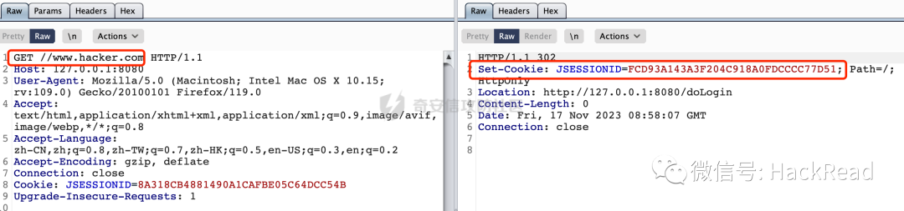  
  
结合前面的分析，登陆成功后的successUrl会从SavedRequest对象获取，而这个对象主要是从session中获取的：  
  
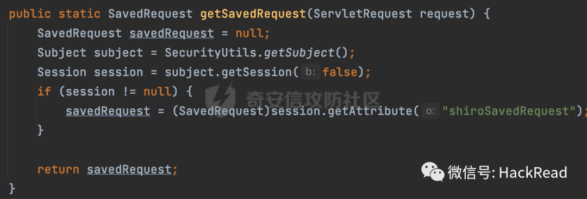  
  
所以此时使用刚刚返回的Set-Cookie内容，通过doLogin接口进行完成身份验证，此时可以发现成功跳转到之前设定好的域名，存在URL Redirect风险：  
  
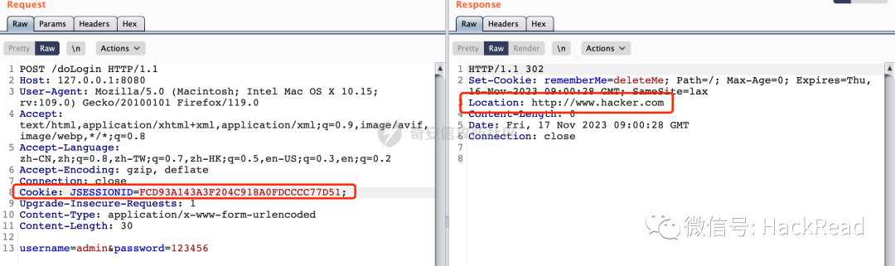  
## 2.3 修复方式  
  
官方提供的修复方式是将组件 org.apache.shiro:shiro-web 升级至 1.13.0 及以上版本或2.0.0-alpha-4 及以上版本。以shiro-web-1.13.0为例，查看具体的修复措施：  
  
关键的commit是https://github.com/apache/shiro/commit/d62387dc576a56a694f0353b3245a892f2f28835：  
  
这段代码的作用是删除URL中的重复斜杠（/）。它使用了一个while循环，不断检查URL字符串的第一个字符是否是斜杠，并且长度大于1。如果是的话，就删除第一个字符，直到URL字符串的第一个字符不再是斜杠或者URL字符串的长度不足2：  
  
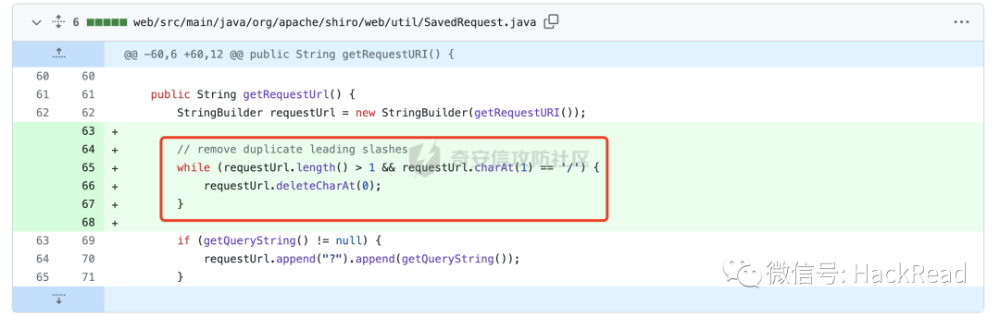  
  
这样当尝试在登陆前访问类似//www.hacker.com的路径后，得到的RequestUrl不再是以//开头了。  
  
看看具体的效果，同样是上面的例子。将shiro相关依赖升级到了1.13.0版本：  
  
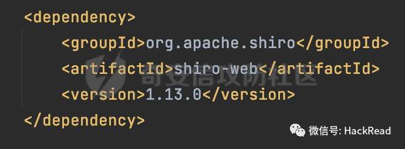  
  
同样的，在进行登陆验证前，先访问//``www.hacker.com路径：  
  
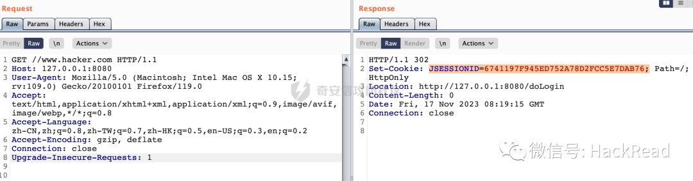  
  
然后再使用账号密码完成登陆验证，此时可以看到登陆成功后跳转的successUrl并不是www.hacker.com了，其只是作为请求路径的一部分：  
  
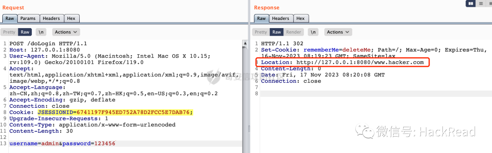  
  
从debug信息也可以看到，此时successUrl第一个字符不再是以//开头了。通过重定向后也无法跳转到www.hacker.com，在一定程度上避免了URL Redirect利用的风险:  
  
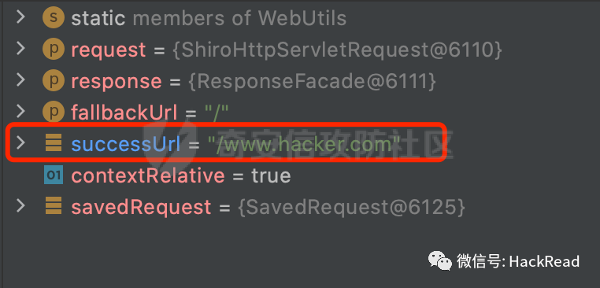  
# 0x03  
  
除了Apache Shiro以外，Java生态中另一款常见的鉴权框架SpringSecurity同样也提供了登陆成功后跳转到指定页面的功能：  
  
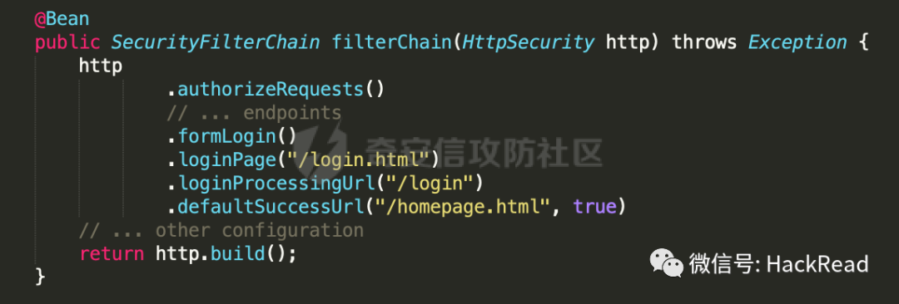  
  
但是实际上SpringSecurity是存在对应的防护措施的，一个是在跳转时会对对应的url进行安全检查：  
  
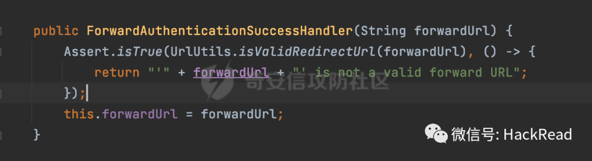  
  
其次，在Spring Security中提供了一个HttpFirewall接口，用于处理掉一些非法请求。其中默认情况下使用的是StrictHttpFirewall这个实现类，在这里对类似//的请求进行了拦截处理：  
  
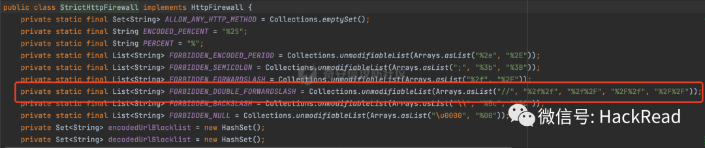  
  
也就是说一般情况下，即使SpringSecurity存在类似Apache Shiro从session从获取上一次访问url并在登陆验证成功后跳转的机制，也没办法通过类似//的方式达到URL Redirect利用的效果。  
```
来源:https://forum.butian.net/share/2586
```  
  
声明：⽂中所涉及的技术、思路和⼯具仅供以安全为⽬的的学习交流使⽤，任何⼈不得将其⽤于⾮法⽤途以及盈利等⽬的，否则后果⾃⾏承担。**所有渗透都需获取授权**  
  
  
**★**  
  
**付费圈子**  
  
  
**欢 迎 加 入 星 球 ！**  
  
**代码审计+免杀+渗透学习资源+各种资料文档+各种工具+付费会员**  
  
  
  
  
**进成员内部群**  
  
  
  
  
  
  
  
  
  
**星球的最近主题和星球内部工具一些展示******  
  
  
  
  
  
  
  
  
  
  
  
  
  
  
  
  
  
  
  
  
  
  
****  
  
  
  
  
**加入安全交流群**  
  
  

								[                ](http://mp.weixin.qq.com/s?__biz=MzkxNDAyNTY2NA==&mid=2247489372&idx=1&sn=5e14ba5fa59059fb1ee405e56ef90d40&chksm=c175eaf3f60263e5ef5415a8a9fc134f0890fdb9c25ab956116d17109baf98b3bd6bed572a2d&scene=21#wechat_redirect)  

			                  
  
  
**关 注 有 礼**  
  
  
  
关注下方公众号回复“  
666  
”可以领取一套领取黑客成长秘籍  
  
  
 还在等什么？赶紧点击下方名片关注学习吧！  
  
  
  
  
  
  
  
**推荐阅读**  
  
  
  
[干货｜史上最全一句话木马](http://mp.weixin.qq.com/s?__biz=MzkxNDAyNTY2NA==&mid=2247489259&idx=1&sn=b268701409ad4e8785cd5ebc23176fc8&chksm=c175eb44f60262527120100bd353b3316948928bd7f44cf9b6a49f89d5ffafad88c6f1522226&scene=21#wechat_redirect)  
  
  
  
[干货 | CS绕过vultr特征检测修改算法](http://mp.weixin.qq.com/s?__biz=MzkxNDAyNTY2NA==&mid=2247486980&idx=1&sn=6d65ae57f03bd32fddb37d7055e5ac8e&chksm=c175f3abf6027abdad06009b2fe964e79f2ca60701ae806b451c18845c656c12b9948670dcbc&scene=21#wechat_redirect)  
  
  
  
[实战 | 用中国人写的红队服务器搞一次内网穿透练习](http://mp.weixin.qq.com/s?__biz=MzkxNDAyNTY2NA==&mid=2247488628&idx=1&sn=ff2c617cccc00fe262ed9610c790fe0e&chksm=c175e9dbf60260cd0e67439304c822d28d510f1e332867e78a07d631ab27143309d14e27e53f&scene=21#wechat_redirect)  
  
  
  
[实战 | 渗透某培训平台经历](http://mp.weixin.qq.com/s?__biz=MzkxNDAyNTY2NA==&mid=2247488613&idx=1&sn=12884f3d196ac4f5c262a587590d516d&chksm=c175e9caf60260dcc0d5d81a560025d548c61fda975d02237d344fd79adc77ac592e7e562939&scene=21#wechat_redirect)  
  
  
  
[实战 | 一次曲折的钓鱼溯源反制](http://mp.weixin.qq.com/s?__biz=MzkxNDAyNTY2NA==&mid=2247489278&idx=1&sn=5347fdbf7bbeb3fd37865e191163763f&chksm=c175eb51f602624777fb84e7928bb4fa45c30f35e27f3d66fc563ed97fa3c16ff06d172b868c&scene=21#wechat_redirect)  
  
  
  
**免责声明**  
  
由于传播、利用本公众号渗透安全团队所提供的信息而造成的任何直接或者间接的后果及损失，均由使用者本人负责，公众号渗透安全团队及作者不为**此**  
承担任何责任，一旦造成后果请自行承担！如有侵权烦请告知，我们会立即删除并致歉。谢谢！  
  
好文分享收藏赞一下最美点在看哦  
  
  


---

> 来源：gelusus/wxvl（微信公众号漏洞文章自动归档，原文见文首链接）
