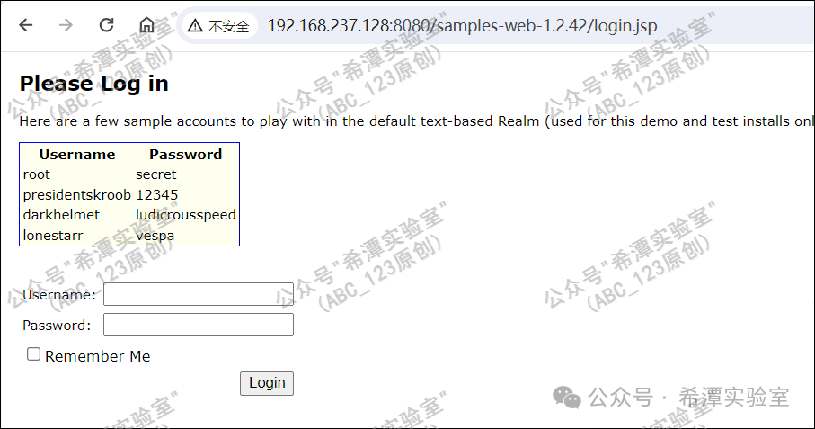
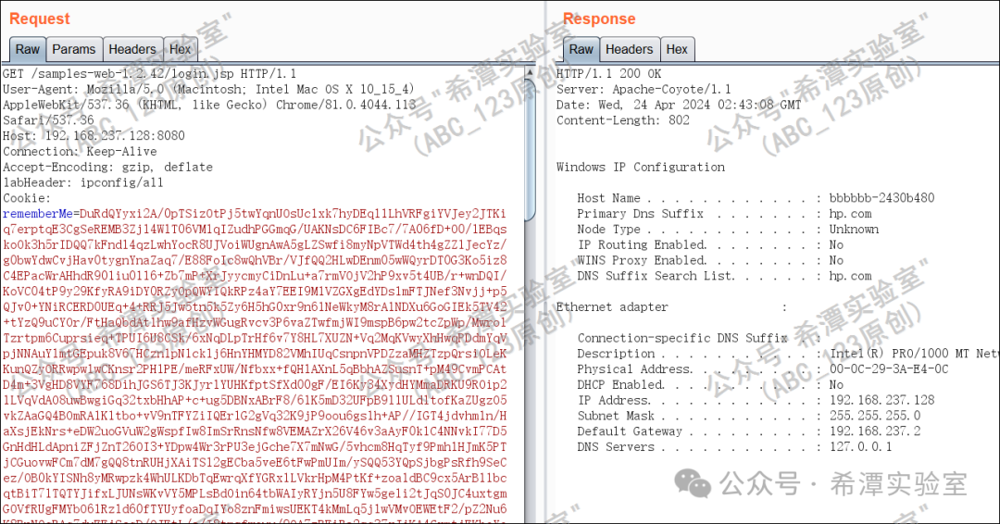
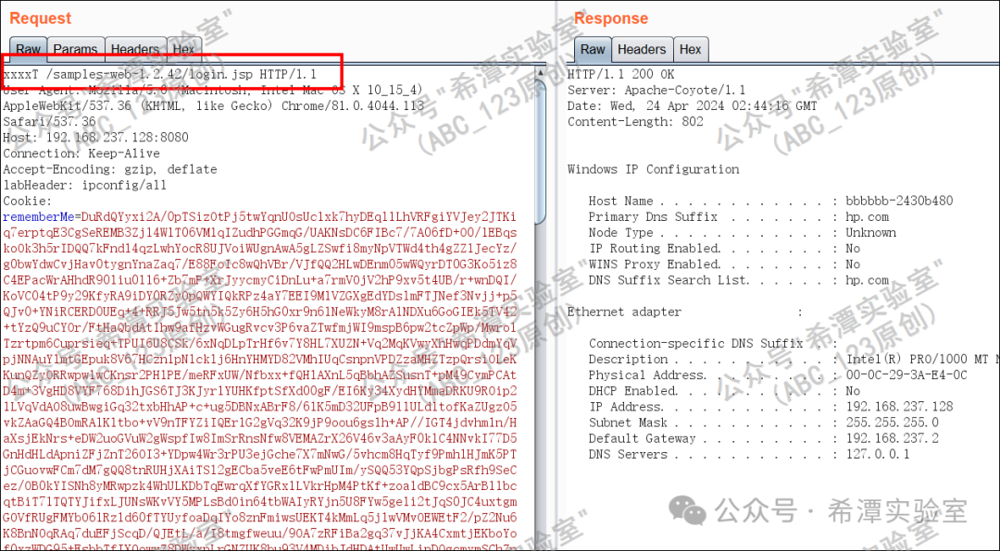
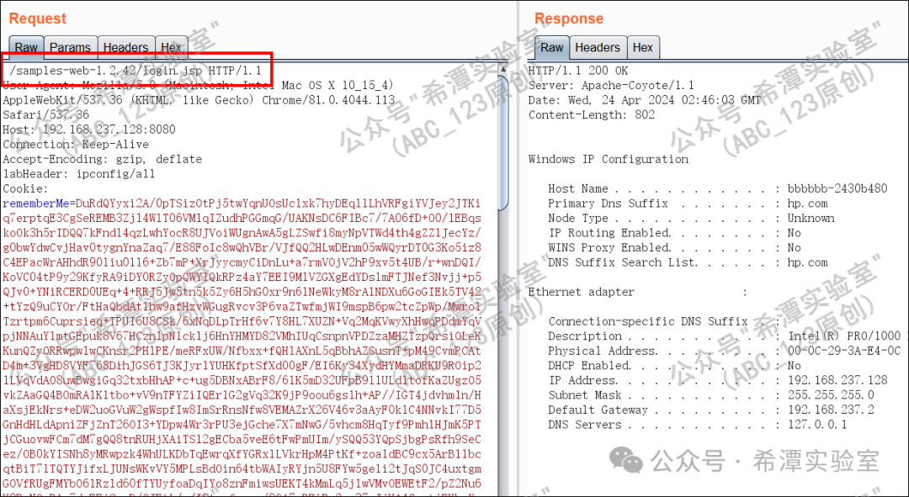
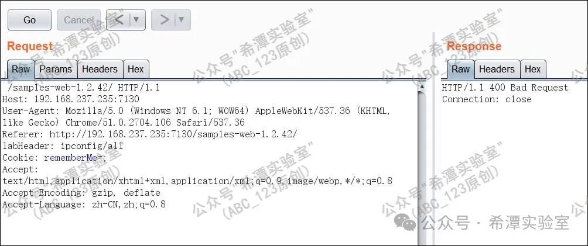
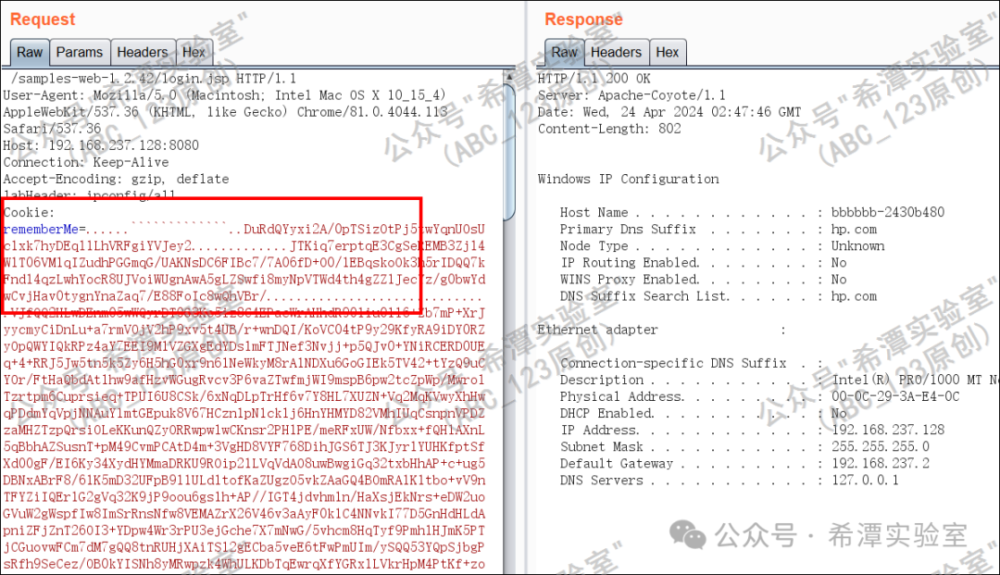
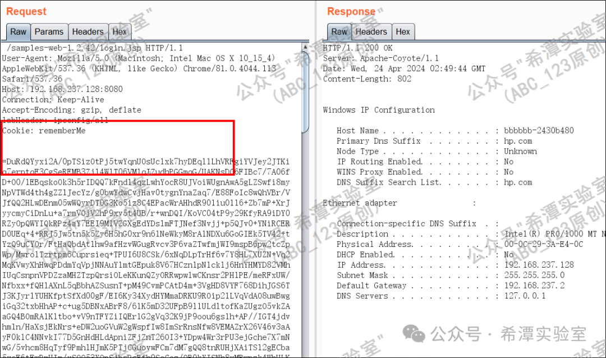
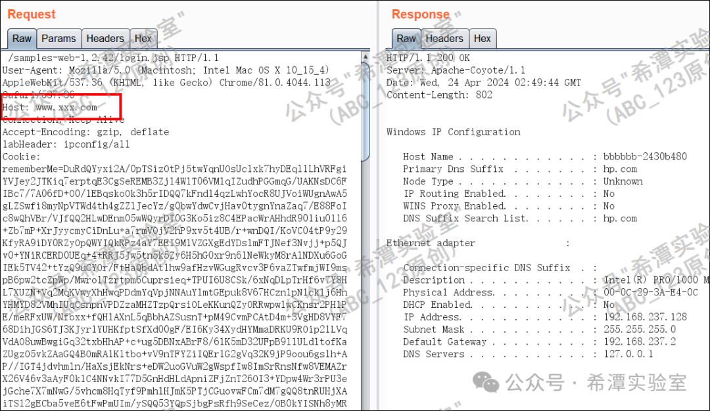
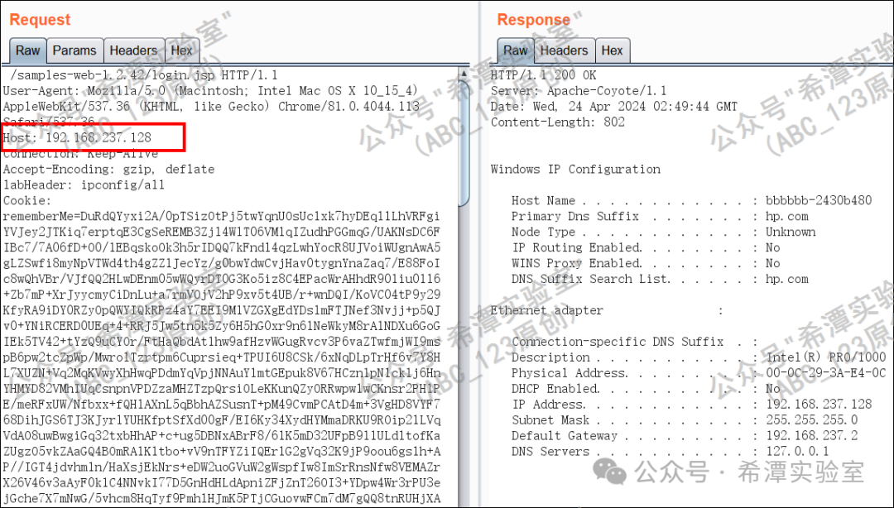

## 核对与使用边界

本文已按保存的全文审阅记录进行文字校订；本轮仅静态核对，未运行 PoC、请求目标或逐图验证。

适用条件与版本记录（来源主张，未列为明确更正的部分仍待权威资料核对）：仅Tomcat7.x本地，未给Shiro/容器patch、WAF型号版本或规则

代码与实验材料：方法、空白、Cookie字符、Host五类观察全部仅截图，作者明确未做源码追踪

来源证据范围：ABC123/希潭原创，无上游代码或WAF验证来源

- **证据待核（1）**：单后端接收不能证明WAF一定放行；依据：称畸形包WAF解析不了所以放行，实际设备可拒绝；缺成对WAF开关和规则证据。保留原引用、截图位置和实验叙述；本项所缺材料未被补造，截图存在或作者宣称成功都不等于已核验其内容。

- **凭据与会话边界（2）**：跨系统泛化需限定；依据：Tomcat空方法并非所有版本；Host改IP不一定离开云WAF；特殊字符忽略依Base64/Cookie解析实现。抓包中的会话不能视为未认证访问证明。需重新取得授权测试会话，不能复用文中值。

历史原文标识：下文原技术材料按来源保留；仅本节明确确认的更正替代相应旧说法，标为待核的观察仍不是事实确认。

#  第91篇：shiro反序列化漏洞绕waf防护的方法总结（上篇）   
原创 abc123info  希潭实验室   2024-04-24 12:03  
  
  
##  Part1 前言   
  
**大家好，我是ABC_123**  
。Shiro反序列化漏洞  
于2016年公布，漏洞编号为CVE-2016-4437，也被称为Shiro-550，虽然过去8年了，但是目前仍是红队人员重点关注和利用的漏洞。目前Shiro反序列化漏洞的数量大大减少，但是从ABC_123总结最近2年的攻防比赛的战果来看，**目前Shiro反序列化漏洞在一些大型公司的子域名的深层次目录、边缘子站、全资子公司仍然会被发现，在一些地级市攻防比赛中仍然会出现很多**  
。  
  
目前主流的安全厂商的waf设备都会对shiro反序列化的攻击行为进行拦截，给一些新手朋友造成了很大困难，今天ABC_123就分享一些shiro反序列化漏洞绕waf的方法。  
  
**建议大家把公众号“希潭实验室”设为星标，否则可能就看不到啦！**  
因为公众号现在只对常读和星标的公众号才能展示大图推送。操作方法：点击右上角的【...】，然后点击【设为星标】即可。  
  
  
  
##  Part2 技术研究过程   
  
这里ABC_123直接把绕过方法给大家贴出来，不做过多分析，因为让我再使用intellij idea把shiro源码跑起来分析一下，太费精力了。如下图所示，这是本地搭建的测试环境，放在Tomcat7.x中间件上。  
  
  
  
  
接下来使用burpsuite抓取一个通过Shiro反序列化漏洞这些“**ipconfig**”  
命令的数据包，返回包中返回了命令执行结果。  
  
  
  
- ### HTTP请求方法随机  
  
首先最被大家常用的绕waf方法就是HTTP请求头变为随机字符串，在本案例过程中，将“**GET**  
”请求方法变为“**xxxxT**  
”方法，发现是能正常执行成功的。  
这种方法与Web应用所处的中间件有关，在部分中间件下不适用。  
  
  
  
- ### HTTP请求方法置空  
  
一些朋友可能只关注了HTTP请求方法随机化的问题，但是对于tomcat，将HTTP请求方法置空也是可以正常发包并返回命令执行结果，这种畸形数据包在经过waf设备会被放行，因为waf设备解析不了。这种绕过方法与中间件有关，在Weblogic中间件下不适用。  
  
  
  
  
  
- ### Shiro数据包添加脏数据  
  
这种方法在网上很少被提起，“**rememberMe=**”  
后面的数据包添加一些特殊字符仍然是可以正常发包的，原因是shiro组件在处理点号、反引号等特殊字符，会替换为空。  
  
  
  
- ### Shiro字段添加空白字符  
  
前面我们提到了，“**rememberMe=**”  
后面可以掺杂特殊字符，那么“**rememberMe**”  
关键词附近可否动动手脚呢？经过ABC_123的fuzz测试，发现添加“**Tab**”  
等空白字符是可以正常执行命令的。  
  
  
  
- ### Host头域名变IP地址  
  
很多甲方公司购买了waf或者一些云waf，但是可能目标网站只对“***.xxx.com**”  
域名进行了waf防护，这时候将host头的域名替换为域名解析出来的ip，就可以绕过waf了。  
  
  
  
  
  
##  Part3 总结   
  
**1.**  
    
文中提到的添加点号等特殊字符绕过waf的思路，对于Struts2框架同样适用，这是之前ABC_123调试Struts2框架时偶然发现的，后面会写文章给大家分享。  
  
**2.**  
    
除了上述绕过waf方法之外，还有其它更复杂的方法，后续ABC_123会继续写文章分享，敬请期待。  
  
  
  
  
  
**公众号专注于网络安全技术分享，包括APT事件分析、红队攻防、蓝队分析、渗透测试、代码审计等，每周一篇，99%原创，敬请关注。**  
  
**Contact me: 0day123abc#gmail.com**  
  
**(replace # with @)**  
  
  

---

> 来源：gelusus/wxvl（微信公众号漏洞文章自动归档，原文见文首链接）
