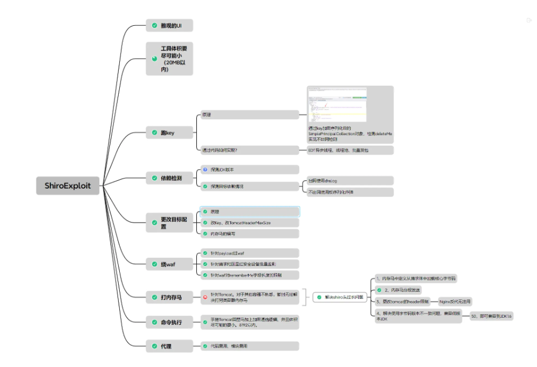
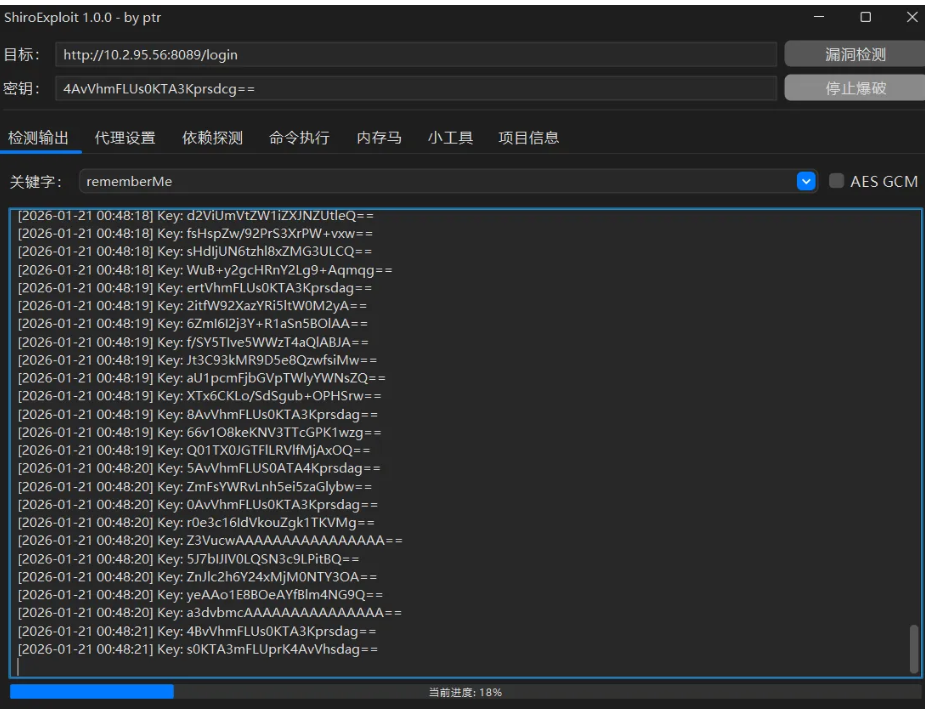

## 核对与使用边界

本文已按保存的全文审阅记录进行文字校订；本轮仅静态核对，未运行 PoC、请求目标或逐图验证。

适用条件与版本记录（来源主张，未列为明确更正的部分仍待权威资料核对）：未固定版本和运行时依赖

代码与实验材料：同九条功能，使用只一图，无独立技术证据

来源证据范围：GitHub直链，声称来自网络安全性自测并非已核验

- **结论使用边界（1）**：危险操作被无侵入性与RCE保证淡化；依据：列内存马、改key/限制、反序列化炸弹，不能当安全只读扫描。此项限制直接适用于下文对应结论；现有正文不足以作更宽泛推论，所列方法和原始证据均保留。

- **来源与引用处置（2）**：重复广告占主要篇幅；依据：九条清单后大量工具推荐及重复GIF，无额外复现。保留这部分来源材料并与技术结论分开；其引用或宣传内容不能补足本文漏洞的证据。

历史原文标识：下文原技术材料按来源保留；仅本节明确确认的更正替代相应旧说法，标为待核的观察仍不是事实确认。

#  【红队】Shiro反序列化漏洞一站式综合利用工具  
FightingLzn9
                    FightingLzn9  贝雷帽SEC   2026-01-22 02:05  
  
  
  
  
**免责声明**  
  
  
  
  
  
  
  
本公众号所提供的文字和信息仅供学习和研究使用，  
请读者自觉遵守法律法规，不得利用本公众号所提供的信息从事任何违法活动。本公众号不对读者的任何违法行为承担任何责任  
。  
工具来自网络，安全性自测，如有侵权请联系删除。  
  
  
  
  
  
**工具介绍**  
  
  
  
  
  
  
ShiroExploit，是一款Shiro反序列化漏洞一站式综合利用工具。  
  
基本概述如下：  
  
1、区分ShiroAttack2，采用分块传输内存马，每块大小不超过4000。  
  
2、可打JDK高版本的shiro，确保有key、有gadget就能rce。  
  
3、依托JavaChains动态生成gadget，实现多条利用链，如CB、CC、Fastjson、Jackson。  
  
4、通过魔改MemshellParty的内存马模板，使其回显马通信加密，去除一些典型的特征。  
  
5、借助JMG的注入器，加以魔改，实现无侵入性，同一个容器可同时兼容多种类型的内存马。  
  
6、对内存马和注入器类名进行随机化和Lambda化处理，规避内存马主动扫描设备的检测。  
  
7、可以更改目标配置，如改Key、改TomcatHeaderMaxSize。  
  
8、采用URLDNS链和反序列化炸弹的方式来探测指定类实现利用链的探测。  
  
9、缺点是流量相对大一些。  
  
                                              
  
  
  
  
  
  
  
  
  
**工具使用**  
  
  
  
  
  
  
  
  
  
**下载链接**  
  
  
  
  
  
```
https://github.com/FightingLzn9/ShiroExploit
```  
  
  
  
  
End  
  
  
“点赞、在看与分享都是莫大的支持”  
  
  
**工具精选**  
  
  
  
  
  
  
  
[【红队】一款安全测试工具集——Onyx](https://mp.weixin.qq.com/s?__biz=Mzk0MDQzNzY5NQ==&mid=2247494121&idx=1&sn=8675cf1677352620a57d68ff9f0b0686&scene=21#wechat_redirect)  
  
  
[【红队】一款 AI 原生安全测试平台](https://mp.weixin.qq.com/s?__biz=Mzk0MDQzNzY5NQ==&mid=2247494139&idx=1&sn=5d8a98e0d0cb700c124aeaecae595d4c&scene=21#wechat_redirect)  
  
  
[【红队】Webshell 管理与后渗透平台](https://mp.weixin.qq.com/s?__biz=Mzk0MDQzNzY5NQ==&mid=2247494098&idx=1&sn=cb7bc8f3cc7f59e6f80f4b56e7d4c1f9&scene=21#wechat_redirect)  
  
  
[【红队】BProxy - 多级 SOCKS5 代理工具](https://mp.weixin.qq.com/s?__biz=Mzk0MDQzNzY5NQ==&mid=2247494084&idx=1&sn=dbc658a17e6ddc0dcd7c7857c841478a&scene=21#wechat_redirect)  
  
  
[【红队】攻击面管理平台 (ASM)](https://mp.weixin.qq.com/s?__biz=Mzk0MDQzNzY5NQ==&mid=2247494076&idx=1&sn=e9c2ff60ccd065dc223c71042515268d&scene=21#wechat_redirect)  
  
  
[【红队】ParrotOS 7.0 正式发布 代号：Echo](https://mp.weixin.qq.com/s?__biz=Mzk0MDQzNzY5NQ==&mid=2247494038&idx=1&sn=243e1105a439eb986fdc34534e6a8d19&scene=21#wechat_redirect)  
  
  
[【红队】一款专为红队打造的主动资产指纹识别工具](https://mp.weixin.qq.com/s?__biz=Mzk0MDQzNzY5NQ==&mid=2247493898&idx=1&sn=3e395ade15061739c89f5d0a13645af4&scene=21#wechat_redirect)  
  
  
[【蓝队】SamWaf开源轻量级网站防火墙](https://mp.weixin.qq.com/s?__biz=Mzk0MDQzNzY5NQ==&mid=2247493939&idx=1&sn=e56702a24dcae461024668aaea6aced3&scene=21#wechat_redirect)  
  
  
[[蓝队] FastMonitor - 网络流量监控与威胁检测工具](https://mp.weixin.qq.com/s?__biz=Mzk0MDQzNzY5NQ==&mid=2247493925&idx=1&sn=a952c400c3ee63c8401ff57692745dd1&scene=21#wechat_redirect)  
  
  
[【蓝队】漏洞全生命周期管理平台](https://mp.weixin.qq.com/s?__biz=Mzk0MDQzNzY5NQ==&mid=2247493803&idx=1&sn=10daa12b5a3523bf4a1ecc665890f917&scene=21#wechat_redirect)  
  
  
[【蓝队】蓝队Ark神器 OpenArk v1.5.0](https://mp.weixin.qq.com/s?__biz=Mzk0MDQzNzY5NQ==&mid=2247493788&idx=1&sn=91a31e2d507cb9e0111c19dac98b315e&scene=21#wechat_redirect)  
  
  
[【红队】矛·盾 武器库 v3.2](https://mp.weixin.qq.com/s?__biz=Mzk0MDQzNzY5NQ==&mid=2247493701&idx=2&sn=9cf7e304fee21328bac6d9bd97b81183&scene=21#wechat_redirect)  
  
  
  
  
  
  
  
  
                                                   
  
      
  
  
  


---

> 来源：gelusus/wxvl（微信公众号漏洞文章自动归档，原文见文首链接）
